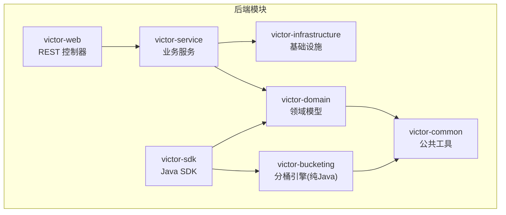
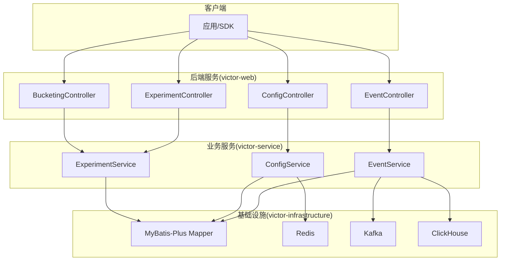
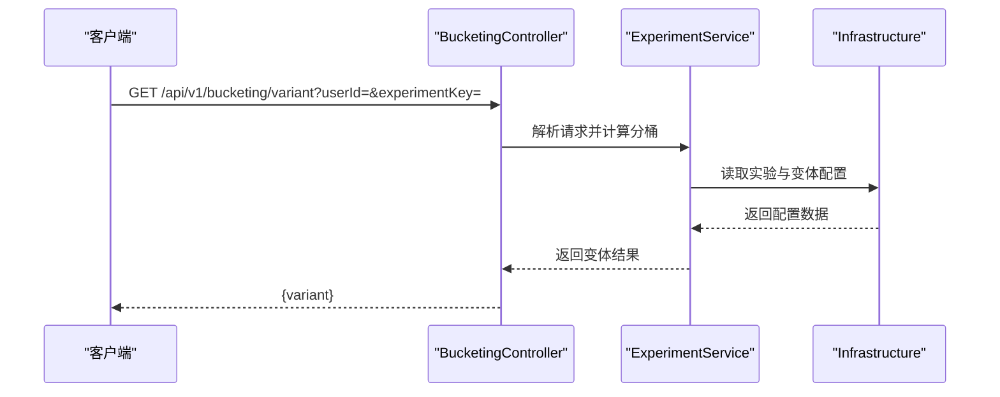
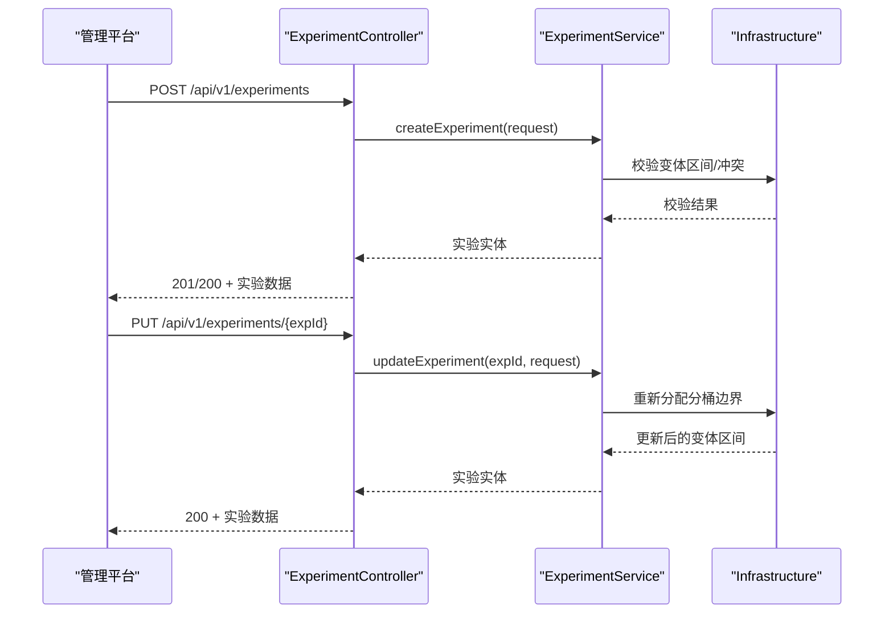
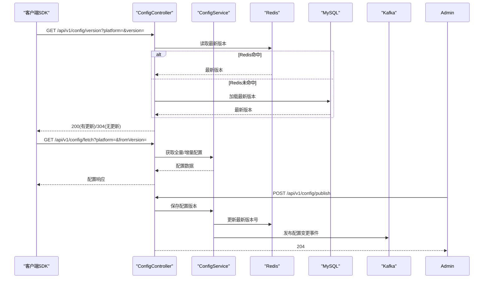
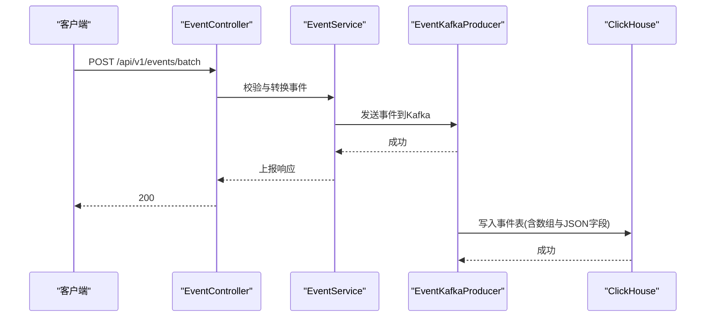
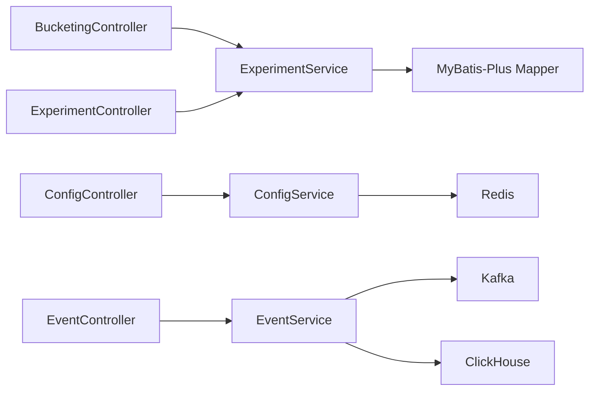

# API接口文档

<cite>
**本文引用的文件**
- [README.md](file://README.md)
- [CLAUDE.md](file://CLAUDE.md)
- [implementation_plan.md](file://docs/ab/implementation_plan.md)
- [E2E_TESTING_GUIDE.md](file://docs/knowledge/07-test-rule/E2E_TESTING_GUIDE.md)
</cite>

## 目录
1. [简介](#简介)
2. [项目结构](#项目结构)
3. [核心组件](#核心组件)
4. [架构总览](#架构总览)
5. [详细组件分析](#详细组件分析)
6. [依赖分析](#依赖分析)
7. [性能考虑](#性能考虑)
8. [故障排除指南](#故障排除指南)
9. [结论](#结论)
10. [附录](#附录)

## 简介
本文件为 GateFlow（维克托）A/B 实验平台的 RESTful API 接口规范文档，聚焦后端 victor-web 模块在 /api/v1/ 下提供的核心接口，包括：
- 分桶计算 API（/api/v1/bucketing）
- 实验管理 API（/api/v1/experiments）
- 配置下发 API（/api/v1/config）
- 事件上报 API（/api/v1/events）

文档同时涵盖认证与授权、错误处理、版本兼容与向后兼容、性能与可用性建议，以及端到端测试与集成指南，帮助开发者快速理解与集成。

## 项目结构
后端采用多模块 Maven 结构，victor-web 作为 Web 层负责对外暴露 REST API；核心模块包括：
- victor-common：工具类、常量、枚举、异常
- victor-domain：领域模型（实体、DTO、事件）
- victor-bucketing：纯 Java 分桶引擎（无 Spring 依赖）
- victor-infrastructure：数据访问、缓存、消息队列、Flyway 迁移
- victor-service：业务服务（实验、配置、事件、统计）
- victor-sdk：Java 客户端 SDK（供其他 Java 服务集成）
- victor-web：REST 控制器与启动入口

图表来源
- [implementation_plan.md:109-163](file://docs/ab/implementation_plan.md#L109-L163)

章节来源
- [implementation_plan.md:109-163](file://docs/ab/implementation_plan.md#L109-L163)
- [implementation_plan.md:165-176](file://docs/ab/implementation_plan.md#L165-L176)

## 核心组件
- 分桶计算 API：基于 MurmurHash3 的一致性哈希分桶，支持单实验分桶与批量分桶查询。
- 实验管理 API：提供实验 CRUD、状态变更（启动/暂停/停止/_promote）、版本控制与冲突检测。
- 配置下发 API：SDK 启动拉取全量配置，支持版本查询与增量更新，结合 Redis 缓存与 Kafka 变更通知。
- 事件上报 API：支持单事件与批量事件上报，写入 ClickHouse 以支撑实时分析。

章节来源
- [CLAUDE.md:137-146](file://CLAUDE.md#L137-L146)
- [implementation_plan.md:488-546](file://docs/ab/implementation_plan.md#L488-L546)
- [implementation_plan.md:548-780](file://docs/ab/implementation_plan.md#L548-L780)
- [implementation_plan.md:1137-1171](file://docs/ab/implementation_plan.md#L1137-L1171)

## 架构总览
后端服务通过 Spring Boot 提供 REST API，Swagger/OpenAPI 在线文档可通过 /swagger-ui.html 访问。核心交互如下：

图表来源
- [implementation_plan.md:476-486](file://docs/ab/implementation_plan.md#L476-L486)
- [implementation_plan.md:576-652](file://docs/ab/implementation_plan.md#L576-L652)
- [implementation_plan.md:1137-1150](file://docs/ab/implementation_plan.md#L1137-L1150)

## 详细组件分析

### 分桶计算 API（/api/v1/bucketing）
- 设计要点
  - 基于 MurmurHash3 对 userId#layerId#salt 做哈希，模 10000 生成 0-9999 的桶编号，按 [bucketStart, bucketEnd) 区间映射到变体。
  - 支持单实验分桶查询与批量查询，返回用户在各实验中的变体或空值（未命中）。
- 接口规范
  - GET /api/v1/bucketing/variant
    - 查询参数：userId（必填）、experimentKey（必填）
    - 响应：变体标识或空值
  - GET /api/v1/bucketing/all-variants
    - 查询参数：userId（必填）
    - 响应：Map<expKey, variant>
- 错误处理
  - 未找到实验或用户无分桶：返回空变体或相应错误（由控制器与服务层抛出异常统一处理）。
- 性能与一致性
  - 分桶引擎为纯 Java，无 Spring 依赖，便于嵌入 SDK 与服务端复用，保证跨端一致性。

图表来源
- [implementation_plan.md:490-516](file://docs/ab/implementation_plan.md#L490-L516)

章节来源
- [CLAUDE.md:123-126](file://CLAUDE.md#L123-L126)
- [implementation_plan.md:490-516](file://docs/ab/implementation_plan.md#L490-L516)

### 实验管理 API（/api/v1/experiments）
- 设计要点
  - 支持实验 CRUD、状态变更（启动/暂停/停止/promote）、版本控制与冲突检测。
  - 实验与变体为一对多关系，变体区间决定流量分配。
- 接口规范
  - GET /api/v1/experiments
    - 查询参数：status（可选）、search（可选）、分页（Pageable）
    - 响应：分页实验列表
  - GET /api/v1/experiments/{expId}
    - 路径参数：expId
    - 响应：实验详情（含变体列表）
  - POST /api/v1/experiments
    - 请求体：实验创建请求（含变体区间、流量比例、目标指标等）
    - 响应：创建后的实验
  - PUT /api/v1/experiments/{expId}
    - 请求体：实验更新请求（支持重新分配分桶边界）
    - 响应：更新后的实验
  - POST /api/v1/experiments/{expId}/start
    - 启动实验
  - POST /api/v1/experiments/{expId}/pause
    - 暂停实验
  - POST /api/v1/experiments/{expId}/stop
    - 停止实验
  - POST /api/v1/experiments/{expId}/promote
    - 选择胜出变体并结束实验
- 错误处理
  - 非法状态变更、变体区间冲突、实验不存在等情况将返回相应错误码与错误信息。

图表来源
- [implementation_plan.md:966-1004](file://docs/ab/implementation_plan.md#L966-L1004)

章节来源
- [implementation_plan.md:966-1004](file://docs/ab/implementation_plan.md#L966-L1004)

### 配置下发 API（/api/v1/config）
- 设计要点
  - SDK 启动时先查询版本，若版本变化则拉取增量或全量配置。
  - 服务端通过 Redis 缓存最新版本号，MySQL 存储配置版本历史，Kafka 发布变更事件。
- 接口规范
  - GET /api/v1/config/version
    - 查询参数：version（可选，用于比对）、platform（必填）
    - 响应：200 返回最新版本号与时间戳；304 表示无更新
  - GET /api/v1/config/fetch
    - 查询参数：fromVersion（可选，增量拉取）、platform（必填）
    - 响应：全量或增量配置（含实验配置、变更类型、删除实验ID列表）
  - POST /api/v1/config/publish
    - 请求体：配置发布请求（平台、配置内容）
    - 响应：无内容（204）
- SDK 同步策略
  - 定时轮询（默认 30 秒），先版本查询再增量拉取，本地缓存 7 天兜底。

图表来源
- [implementation_plan.md:576-652](file://docs/ab/implementation_plan.md#L576-L652)

章节来源
- [implementation_plan.md:548-780](file://docs/ab/implementation_plan.md#L548-L780)
- [implementation_plan.md:576-652](file://docs/ab/implementation_plan.md#L576-L652)

### 事件上报 API（/api/v1/events）
- 设计要点
  - 支持单事件与批量事件上报，写入 Kafka，最终落库至 ClickHouse，支撑实时分析。
  - 事件 Schema 包含事件 ID、名称、用户 ID、时间戳、平台、页面 ID、实验标签、属性等。
- 接口规范
  - POST /api/v1/events/batch
    - 请求体：事件数组
    - 响应：事件上报响应
  - POST /api/v1/events/single
    - 请求体：单个事件
    - 响应：事件上报响应
- 数据存储
  - 事件入库包含数组字段（实验ID、变体、层）与 JSON 字段（属性），并记录接收时间。

图表来源
- [implementation_plan.md:1152-1171](file://docs/ab/implementation_plan.md#L1152-L1171)
- [implementation_plan.md:491-566](file://docs/ab/implementation_plan.md#L491-L566)

章节来源
- [implementation_plan.md:1152-1171](file://docs/ab/implementation_plan.md#L1152-L1171)
- [implementation_plan.md:491-566](file://docs/ab/implementation_plan.md#L491-L566)

## 依赖分析
- 控制器到服务层：各控制器依赖对应服务层（实验、配置、事件、统计）。
- 服务层到基础设施：实验与配置服务依赖 MyBatis-Plus Mapper、Redis、Kafka；事件服务依赖 Kafka 与 ClickHouse。
- 分桶引擎：victor-bucketing 为纯 Java 模块，无 Spring 依赖，便于 SDK 与服务端复用。

图表来源
- [implementation_plan.md:476-486](file://docs/ab/implementation_plan.md#L476-L486)
- [implementation_plan.md:576-652](file://docs/ab/implementation_plan.md#L576-L652)

章节来源
- [implementation_plan.md:476-486](file://docs/ab/implementation_plan.md#L476-L486)
- [implementation_plan.md:576-652](file://docs/ab/implementation_plan.md#L576-L652)

## 性能考虑
- 分桶计算：纯 Java 引擎，避免网络调用，跨端一致性高；建议在 SDK 与服务端复用同一逻辑。
- 配置下发：版本查询轻量（仅版本号），增量拉取减少带宽；Redis 缓存最新版本号降低数据库压力。
- 事件处理：Kafka 异步写入，ClickHouse 列式存储，适合高吞吐实时分析。
- 缓存与降级：SDK 支持 7 天离线缓存兜底，网络失败时继续运行。

章节来源
- [implementation_plan.md:548-780](file://docs/ab/implementation_plan.md#L548-L780)
- [implementation_plan.md:1137-1171](file://docs/ab/implementation_plan.md#L1137-L1171)

## 故障排除指南
- CORS 配置
  - 开发环境允许本地多个前端端口跨域访问，生产环境应限定具体域名。
- 前端降级策略
  - API 失败时不应阻断用户操作，建议使用本地缓存兜底。
- 端到端测试
  - 使用 curl 验证后端接口功能，确保全链路（CRUD、状态变更、版本管理）正确。
- 常见问题
  - 端口冲突：修改相应配置文件中的端口设置。
  - 数据库/Redis 连接失败：检查容器状态与日志。

章节来源
- [E2E_TESTING_GUIDE.md:193-232](file://docs/knowledge/07-test-rule/E2E_TESTING_GUIDE.md#L193-L232)
- [README.md:474-510](file://README.md#L474-L510)

## 结论
GateFlow 的 API 设计遵循清晰的分层与模块化原则，分桶计算、实验管理、配置下发与事件上报四大核心能力相互配合，既满足 SDK 低耦合集成，又保证服务端高性能与可扩展性。建议在生产环境中启用严格的 CORS 与安全策略，并结合 SDK 的离线缓存与增量拉取机制，确保在弱网与故障场景下的稳定性。

## 附录

### API 端点一览与契约摘要
- 分桶计算
  - GET /api/v1/bucketing/variant
    - 查询参数：userId（必填）、experimentKey（必填）
    - 响应：变体标识或空值
  - GET /api/v1/bucketing/all-variants
    - 查询参数：userId（必填）
    - 响应：Map<expKey, variant>
- 实验管理
  - GET /api/v1/experiments
    - 查询参数：status（可选）、search（可选）、分页
    - 响应：分页实验列表
  - GET /api/v1/experiments/{expId}
    - 响应：实验详情（含变体列表）
  - POST /api/v1/experiments
    - 请求体：实验创建请求
    - 响应：创建后的实验
  - PUT /api/v1/experiments/{expId}
    - 请求体：实验更新请求
    - 响应：更新后的实验
  - POST /api/v1/experiments/{expId}/start
  - POST /api/v1/experiments/{expId}/pause
  - POST /api/v1/experiments/{expId}/stop
  - POST /api/v1/experiments/{expId}/promote
- 配置下发
  - GET /api/v1/config/version
    - 查询参数：version（可选）、platform（必填）
    - 响应：200 返回最新版本号与时间戳；304 无更新
  - GET /api/v1/config/fetch
    - 查询参数：fromVersion（可选）、platform（必填）
    - 响应：全量或增量配置
  - POST /api/v1/config/publish
    - 请求体：配置发布请求
    - 响应：204
- 事件上报
  - POST /api/v1/events/batch
    - 请求体：事件数组
    - 响应：事件上报响应
  - POST /api/v1/events/single
    - 请求体：单个事件
    - 响应：事件上报响应

章节来源
- [implementation_plan.md:490-516](file://docs/ab/implementation_plan.md#L490-L516)
- [implementation_plan.md:966-1004](file://docs/ab/implementation_plan.md#L966-L1004)
- [implementation_plan.md:576-652](file://docs/ab/implementation_plan.md#L576-L652)
- [implementation_plan.md:1152-1171](file://docs/ab/implementation_plan.md#L1152-L1171)

### 认证与授权、速率限制与安全
- API 密钥管理与权限控制
  - 项目中未发现内置的 API Key 与 RBAC/ABAC 实现细节，建议在网关或过滤器层引入 API Key 校验与最小权限原则。
- 速率限制
  - 未在现有代码中发现速率限制实现，建议在网关或控制器层增加基于 IP/Key 的限流策略。
- CORS
  - 开发环境允许多前端端口跨域访问，生产环境应限定具体域名并关闭通配符。

章节来源
- [E2E_TESTING_GUIDE.md:193-232](file://docs/knowledge/07-test-rule/E2E_TESTING_GUIDE.md#L193-L232)
- [README.md:296-331](file://README.md#L296-L331)

### 版本兼容与向后兼容
- 版本策略
  - 配置下发采用版本号与增量拉取，SDK 侧支持离线缓存兜底，保证在升级过程中的平滑过渡。
- 向后兼容
  - DTO 字段变更应保持默认值与可选性，避免破坏既有客户端行为。

章节来源
- [implementation_plan.md:548-780](file://docs/ab/implementation_plan.md#L548-L780)

### 使用示例与集成指南
- SDK 使用示例（Java）
  - 初始化 SDK、获取变体、获取实验参数、批量获取变体、获取实验标签、上报事件。
- 前端集成
  - 通过 Swagger UI（/swagger-ui.html）查看与调试接口，确保 CORS 配置正确。
- 端到端测试
  - 使用 curl 验证各端点，覆盖 CRUD、状态变更、版本管理与事件上报。

章节来源
- [README.md:398-434](file://README.md#L398-L434)
- [README.md:296-331](file://README.md#L296-L331)
- [E2E_TESTING_GUIDE.md:16-232](file://docs/knowledge/07-test-rule/E2E_TESTING_GUIDE.md#L16-L232)