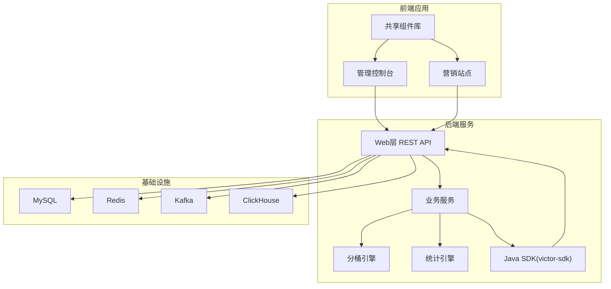
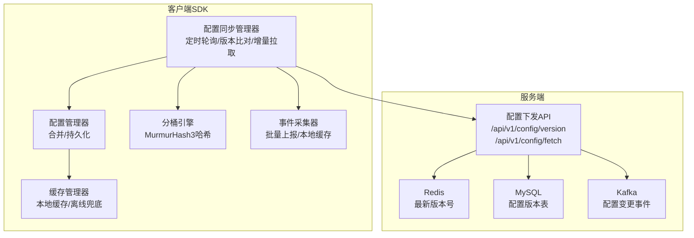
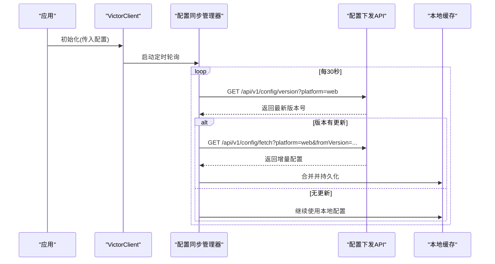
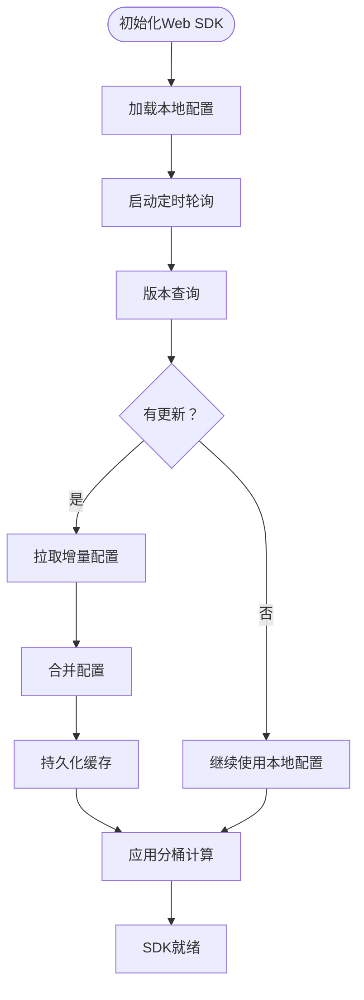
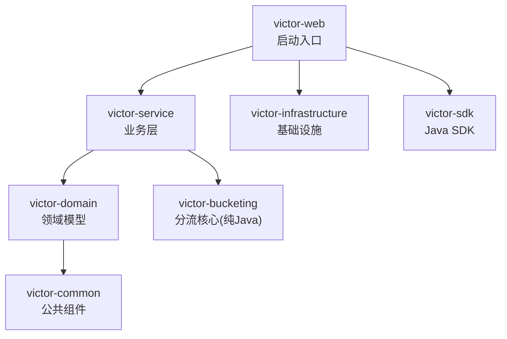

# SDK集成指南

<cite>
**本文档引用的文件**
- [README.md](file://README.md)
- [implementation_plan.md](file://docs/ab/implementation_plan.md)
- [ab_experiment_system_architecture.html](file://docs/ab/ab_experiment_system_architecture.html)
- [E2E_TESTING_GUIDE.md](file://docs/knowledge/07-test-rule/E2E_TESTING_GUIDE.md)
</cite>

## 目录
1. [简介](#简介)
2. [项目结构](#项目结构)
3. [核心组件](#核心组件)
4. [架构概览](#架构概览)
5. [详细组件分析](#详细组件分析)
6. [依赖分析](#依赖分析)
7. [性能考虑](#性能考虑)
8. [故障排除指南](#故障排除指南)
9. [结论](#结论)
10. [附录](#附录)

## 简介
本指南面向希望在企业级A/B测试实验平台GateFlow中集成客户端SDK的开发者。内容涵盖Java SDK（后端服务）、Web SDK（前端JavaScript库）、以及移动平台SDK（Android/iOS）的完整集成流程，并提供配置选项、最佳实践、示例代码路径和常见问题解决方案。

## 项目结构
GateFlow采用前后端分离架构，后端基于Spring Boot 3.4.0（Java 17），前端采用React 18 + TypeScript 5.6。SDK相关能力由后端victor-sdk模块提供，同时配套Web端SDK（TypeScript）和移动平台SDK（iOS/Android）的实现规划。

**图表来源**
- [README.md:70-136](file://README.md#L70-L136)

**章节来源**
- [README.md:137-188](file://README.md#L137-L188)

## 核心组件
- Java SDK（victor-sdk）：提供客户端初始化、配置拉取、分桶计算、事件上报等能力，支持定时轮询配置更新与本地缓存策略。
- Web SDK（TypeScript）：提供VictorClient主类、React Hook、分桶引擎、配置管理、缓存策略（localStorage/IndexedDB）等。
- 移动平台SDK：规划中，采用与Web SDK一致的定时拉取策略，确保跨平台一致性。

**章节来源**
- [README.md:398-434](file://README.md#L398-L434)
- [implementation_plan.md:1040-1127](file://docs/ab/implementation_plan.md#L1040-L1127)

## 架构概览
GateFlow的SDK架构强调“配置中心增量下发 + 本地纯计算”的设计，通过定时轮询实现配置同步，结合本地缓存与离线兜底策略，确保在弱网环境下仍能稳定运行。

**图表来源**
- [implementation_plan.md:548-779](file://docs/ab/implementation_plan.md#L548-L779)
- [implementation_plan.md:1040-1127](file://docs/ab/implementation_plan.md#L1040-L1127)

## 详细组件分析

### Java SDK集成指南
- Maven依赖配置
  - 依赖坐标：groupId=com.gateflow，artifactId=victor-sdk，version=1.0.0-SNAPSHOT
  - 依赖声明参考：[README.md:400-408](file://README.md#L400-L408)
- 客户端初始化
  - 使用VictorConfig.builder()配置baseUrl、apiKey等参数，然后通过VictorClient构造或init方法创建实例
  - 初始化示例参考：[README.md:412-433](file://README.md#L412-L433)
- API调用示例
  - 获取用户分桶：assignBucket(BucketingRequest)
  - 获取实验参数：getParam(userId, experimentKey, paramKey, defaultValue)
  - 批量获取变体：getAllVariants(userId)
  - 获取实验标签：getExperimentTags(userId)
  - 事件上报：trackEvent(userId, eventName, properties)
  - 示例参考：[README.md:412-433](file://README.md#L412-L433)
- 配置选项
  - serverUrl：后端服务地址
  - apiKey：鉴权密钥
  - pollingInterval：配置轮询间隔（秒）
  - cacheExpiry：本地缓存过期时间（秒）
  - 示例参考：[implementation_plan.md:339-373](file://docs/ab/implementation_plan.md#L339-L373)

**图表来源**
- [implementation_plan.md:667-760](file://docs/ab/implementation_plan.md#L667-L760)

**章节来源**
- [README.md:398-434](file://README.md#L398-L434)
- [implementation_plan.md:319-373](file://docs/ab/implementation_plan.md#L319-L373)

### Web SDK集成指南
- JavaScript库引入
  - 通过包管理器安装后，在应用入口处导入并初始化VictorClient
  - 初始化方法：initialize(options)
  - 核心接口参考：[implementation_plan.md:1067-1100](file://docs/ab/implementation_plan.md#L1067-L1100)
- React Hook使用
  - useExperiment(experimentKey)返回variant、isLoading、isReady状态
  - Hook实现参考：[implementation_plan.md:1103-1127](file://docs/ab/implementation_plan.md#L1103-L1127)
- 异步处理与跨域配置
  - Web SDK通过HTTP请求与后端交互，需确保跨域配置正确
  - CORS配置参考：[E2E_TESTING_GUIDE.md:193-227](file://docs/knowledge/07-test-rule/E2E_TESTING_GUIDE.md#L193-L227)
- 缓存策略
  - localStorage用于小规模配置缓存
  - IndexedDB用于大规模配置持久化
  - 事件缓存策略：本地队列+批量上报+IndexedDB持久化
  - 事件缓存实现参考：[implementation_plan.md:1334-1394](file://docs/ab/implementation_plan.md#L1334-L1394)

**图表来源**
- [implementation_plan.md:667-760](file://docs/ab/implementation_plan.md#L667-L760)

**章节来源**
- [implementation_plan.md:1040-1127](file://docs/ab/implementation_plan.md#L1040-L1127)
- [E2E_TESTING_GUIDE.md:193-227](file://docs/knowledge/07-test-rule/E2E_TESTING_GUIDE.md#L193-L227)

### Android SDK集成要点
- Gradle配置
  - 将victor-sdk作为依赖添加到项目的build.gradle中
  - 依赖坐标参考：[README.md:400-408](file://README.md#L400-L408)
- 异步回调
  - 使用回调或Future/CompletableFuture处理网络请求
  - 建议在主线程外发起网络请求，在主线程更新UI
- 内存管理
  - 合理使用单例模式管理VictorClient实例
  - 及时释放不再使用的资源，避免内存泄漏
- 生命周期处理
  - 在Application或Activity/Fragment的合适生命周期中初始化SDK
  - 在onDestroy或onStop中清理资源

**章节来源**
- [README.md:398-434](file://README.md#L398-L434)

### iOS SDK集成方案
- CocoaPods配置
  - 在Podfile中添加victor-sdk依赖
  - 依赖坐标参考：[README.md:400-408](file://README.md#L400-L408)
- Swift封装
  - 提供Swift友好的API封装，隐藏底层HTTP与缓存逻辑
  - 使用Completion Handler或Combine Publisher进行异步处理
- 异步处理与线程安全
  - 在后台队列执行网络请求与计算，主线程更新UI
  - 使用DispatchQueue.sync或@synchronized确保线程安全
- 缓存策略
  - 使用UserDefaults存储小规模配置，使用Core Data或SQLite存储大规模配置
  - 事件缓存采用本地队列+批量上报+持久化策略

**章节来源**
- [README.md:398-434](file://README.md#L398-L434)

## 依赖分析
- 后端模块依赖关系
  - victor-web作为启动入口，聚合其他模块
  - victor-sdk作为独立模块，被其他业务层依赖
  - victor-domain与victor-common提供领域模型与公共组件
  - victor-bucket负责分流核心逻辑，无Spring依赖，纯Java实现
- SDK对外部依赖
  - HTTP客户端：OkHttp 4.12.0（后端）
  - JSON处理：Jackson 2.17.0（后端）
  - 缓存：Caffeine（后端Java SDK）

**图表来源**
- [implementation_plan.md:109-142](file://docs/ab/implementation_plan.md#L109-L142)

**章节来源**
- [implementation_plan.md:109-142](file://docs/ab/implementation_plan.md#L109-L142)

## 性能考虑
- 配置同步策略
  - 轮询间隔：30秒，平衡实时性与服务器压力
  - 离线缓存有效期：7天，允许长时间离线运行
  - 增量拉取：仅传输变更的实验配置，减少带宽消耗
- 分桶计算
  - MurmurHash3高性能哈希算法，本地纯计算，延迟小于5ms
- 事件上报
  - 本地事件队列+批量上报，降低网络开销
  - IndexedDB持久化，避免网络失败丢失数据

**章节来源**
- [implementation_plan.md:763-779](file://docs/ab/implementation_plan.md#L763-L779)
- [implementation_plan.md:1334-1394](file://docs/ab/implementation_plan.md#L1334-L1394)

## 故障排除指南
- CORS跨域问题
  - 症状：前端访问后端API时报CORS错误
  - 排查：检查后端CORS配置是否包含当前前端端口，确认后端已重启
  - 解决：在WebConfig中添加允许的origin，重启后端服务
  - 参考：[E2E_TESTING_GUIDE.md:511-525](file://docs/knowledge/07-test-rule/E2E_TESTING_GUIDE.md#L511-L525)
- 端口冲突
  - 症状：后端服务启动失败，提示端口已被占用
  - 排查：使用netstat查找占用进程，停止对应PID
  - 解决：释放端口后重启服务
  - 参考：[E2E_TESTING_GUIDE.md:527-544](file://docs/knowledge/07-test-rule/E2E_TESTING_GUIDE.md#L527-L544)
- 前端显示mock数据
  - 症状：页面显示中文测试数据而非真实后端数据
  - 排查：检查Network标签中/api/v1/experiments请求状态，确认CORS配置与数据映射函数
  - 解决：修复CORS或数据映射问题后刷新页面
  - 参考：[E2E_TESTING_GUIDE.md:547-557](file://docs/knowledge/07-test-rule/E2E_TESTING_GUIDE.md#L547-L557)

**章节来源**
- [E2E_TESTING_GUIDE.md:511-557](file://docs/knowledge/07-test-rule/E2E_TESTING_GUIDE.md#L511-L557)

## 结论
GateFlow SDK提供了统一的配置同步与分桶计算能力，支持Java、Web与移动平台的无缝集成。通过定时轮询、本地缓存与离线兜底策略，SDK能够在弱网环境下保持稳定运行。建议开发者根据自身平台选择合适的集成方式，并遵循本文档提供的配置选项与最佳实践，以获得最佳的集成体验。

## 附录
- API参考
  - 实验管理：POST /api/experiments, GET /api/experiments, GET /api/experiments/{id}, PUT /api/experiments/{id}, DELETE /api/experiments/{id}, POST /api/experiments/{id}/start, POST /api/experiments/{id}/stop
  - 流量分配：POST /api/bucketing/assign, GET /api/bucketing/statistics
  - 统计分析：GET /api/experiments/{id}/statistics, GET /api/experiments/{id}/metrics, GET /api/experiments/{id}/aa-test
  - 配置下发：GET /api/v1/config/version, GET /api/v1/config/fetch, POST /api/v1/config/publish
  - 参考：[README.md:304-331](file://README.md#L304-L331), [implementation_plan.md:576-652](file://docs/ab/implementation_plan.md#L576-L652)