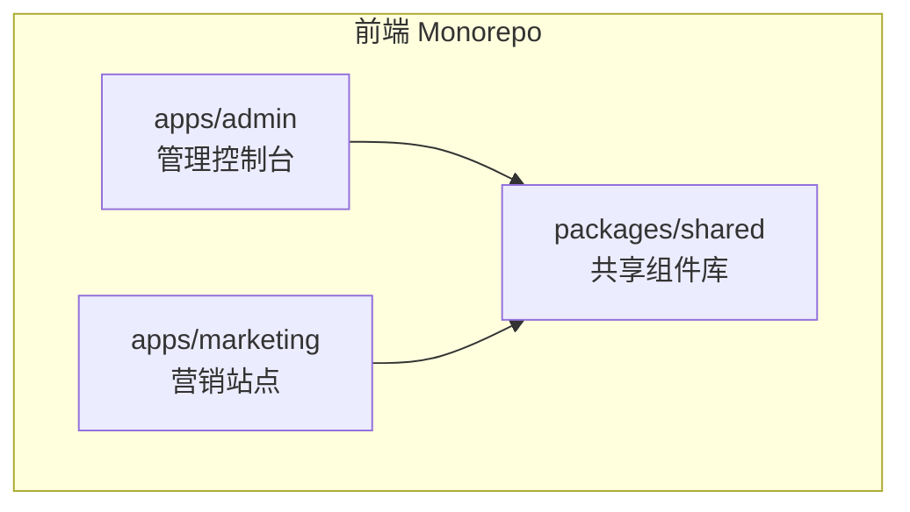
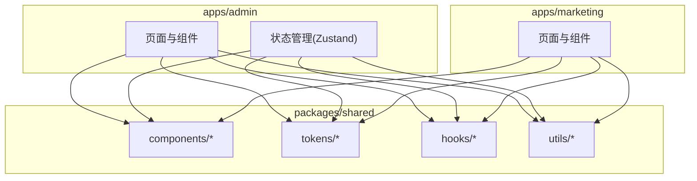
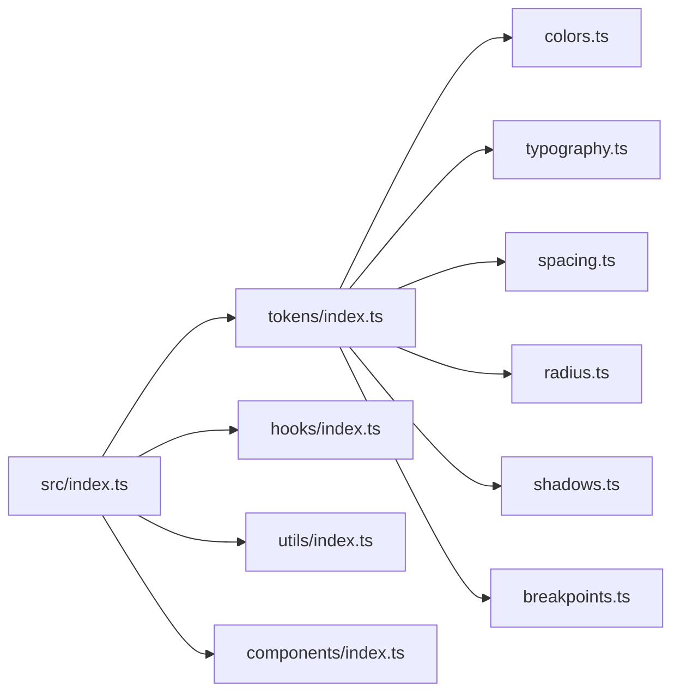
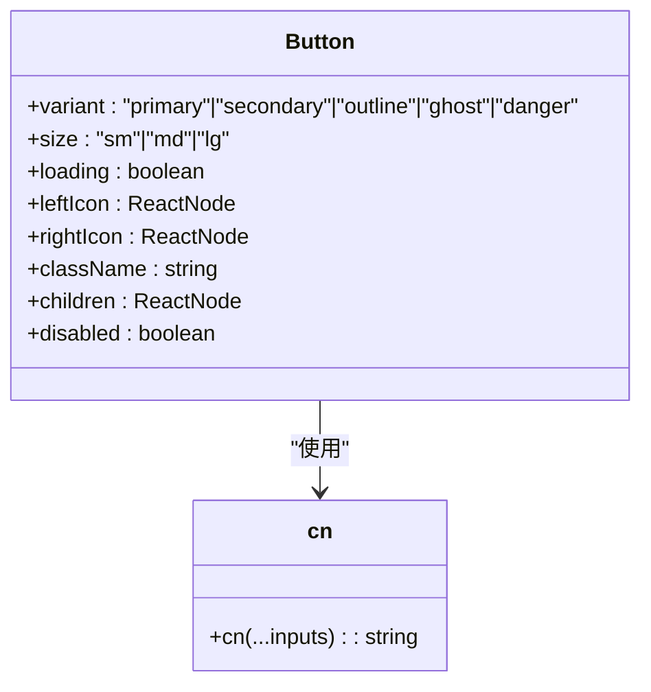
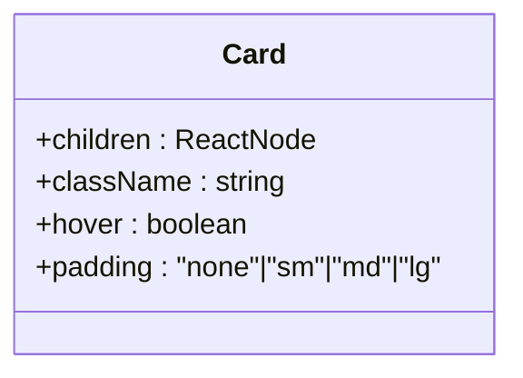
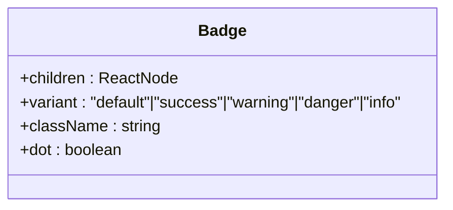
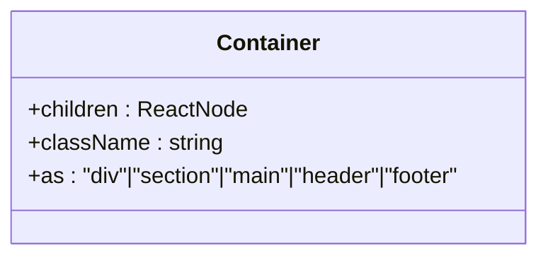
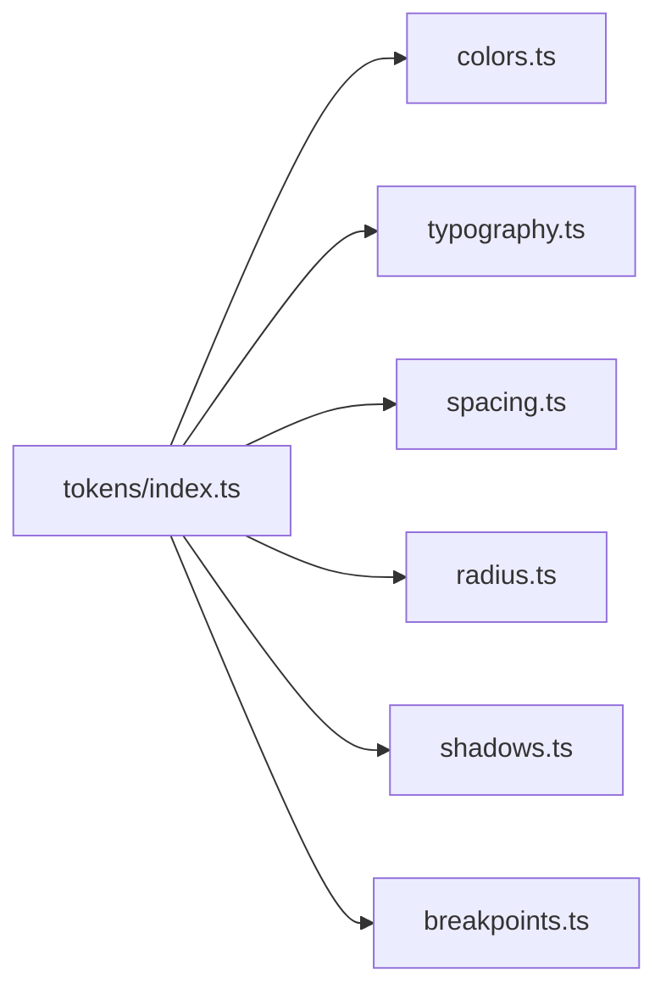
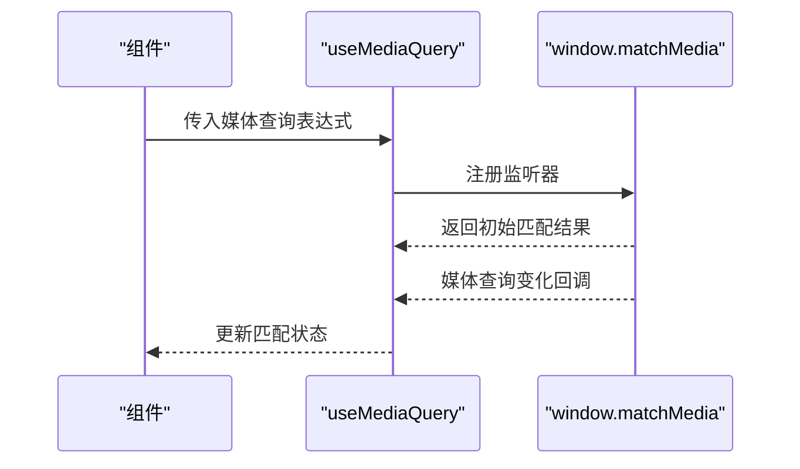
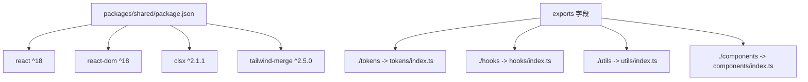

# 前端应用架构

<cite>
**本文引用的文件**
- [README.md](file://README.md)
- [package.json](file://package.json)
- [pnpm-workspace.yaml](file://pnpm-workspace.yaml)
- [packages/shared/package.json](file://packages/shared/package.json)
- [packages/shared/src/index.ts](file://packages/shared/src/index.ts)
- [packages/shared/src/components/Button.tsx](file://packages/shared/src/components/Button.tsx)
- [packages/shared/src/components/Card.tsx](file://packages/shared/src/components/Card.tsx)
- [packages/shared/src/components/Badge.tsx](file://packages/shared/src/components/Badge.tsx)
- [packages/shared/src/components/Container.tsx](file://packages/shared/src/components/Container.tsx)
- [packages/shared/src/tokens/index.ts](file://packages/shared/src/tokens/index.ts)
- [packages/shared/src/tokens/colors.ts](file://packages/shared/src/tokens/colors.ts)
- [packages/shared/src/tokens/typography.ts](file://packages/shared/src/tokens/typography.ts)
- [packages/shared/src/tokens/spacing.ts](file://packages/shared/src/tokens/spacing.ts)
- [packages/shared/src/hooks/useMediaQuery.ts](file://packages/shared/src/hooks/useMediaQuery.ts)
- [packages/shared/src/utils/cn.ts](file://packages/shared/src/utils/cn.ts)
</cite>

## 目录
1. [引言](#引言)
2. [项目结构](#项目结构)
3. [核心组件](#核心组件)
4. [架构总览](#架构总览)
5. [详细组件分析](#详细组件分析)
6. [依赖分析](#依赖分析)
7. [性能考虑](#性能考虑)
8. [故障排查指南](#故障排查指南)
9. [结论](#结论)
10. [附录](#附录)

## 引言
本文件为 GateFlow 前端应用架构的技术文档，聚焦 Monorepo 中的前端组织结构与共享组件库设计。重点涵盖：
- 应用定位与用户群体：admin 管理控制台服务于实验管理员与数据分析师；marketing 营销站点服务于访客与潜在用户。
- 共享组件库设计理念：统一基础 UI 组件（Button、Card、Badge、Container）与样式组合工具，确保跨应用一致性和可维护性。
- 设计令牌系统（tokens）：集中管理颜色、字体、间距、圆角、阴影与断点，保障设计系统一致性。
- 状态管理策略：Zustand 在 admin 应用的状态管理使用场景与最佳实践。
- 组件库使用指南：导入路径、属性配置、样式定制与无障碍访问实现要点。
- 响应式设计与无障碍访问：媒体查询 Hook、断点体系与语义化标签的协同。

## 项目结构
GateFlow 采用 pnpm workspaces 的 Monorepo 结构，前端由两个独立应用与一个共享组件库组成：
- apps/admin：管理控制台，负责实验管理、流量配置、数据分析与知识库等后台工作流。
- apps/marketing：营销站点，面向访客与潜在用户的展示与引导页面。
- packages/shared：共享组件库，提供基础 UI 组件、设计令牌、自定义 Hooks 与工具函数。

**图表来源**
- [pnpm-workspace.yaml:1-4](file://pnpm-workspace.yaml#L1-L4)
- [package.json:1-18](file://package.json#L1-L18)

**章节来源**
- [README.md:137-168](file://README.md#L137-L168)
- [pnpm-workspace.yaml:1-4](file://pnpm-workspace.yaml#L1-L4)
- [package.json:1-18](file://package.json#L1-L18)

## 核心组件
共享组件库提供以下核心能力：
- 基础 UI 组件：Button、Card、Badge、Container，统一风格与交互行为。
- 设计令牌：colors、typography、spacing、radius、shadows、breakpoints，集中管理设计系统。
- 自定义 Hooks：useMediaQuery，提供媒体查询能力，支撑响应式布局。
- 工具函数：cn，基于 clsx 与 tailwind-merge 的类名合并工具，避免冲突与冗余。

这些组件与工具在 admin 与 marketing 应用中复用，确保视觉与交互一致性，并降低重复开发成本。

**章节来源**
- [packages/shared/src/index.ts:1-5](file://packages/shared/src/index.ts#L1-L5)
- [packages/shared/src/components/Button.tsx:1-62](file://packages/shared/src/components/Button.tsx#L1-L62)
- [packages/shared/src/components/Card.tsx:1-32](file://packages/shared/src/components/Card.tsx#L1-L32)
- [packages/shared/src/components/Badge.tsx:1-35](file://packages/shared/src/components/Badge.tsx#L1-L35)
- [packages/shared/src/components/Container.tsx:1-17](file://packages/shared/src/components/Container.tsx#L1-L17)
- [packages/shared/src/tokens/index.ts:1-7](file://packages/shared/src/tokens/index.ts#L1-L7)
- [packages/shared/src/hooks/useMediaQuery.ts:1-21](file://packages/shared/src/hooks/useMediaQuery.ts#L1-L21)
- [packages/shared/src/utils/cn.ts:1-7](file://packages/shared/src/utils/cn.ts#L1-L7)

## 架构总览
下图展示了前端应用与共享组件库的关系，以及共享组件库内部模块划分。

**图表来源**
- [packages/shared/src/index.ts:1-5](file://packages/shared/src/index.ts#L1-L5)
- [packages/shared/src/components/Button.tsx:1-62](file://packages/shared/src/components/Button.tsx#L1-L62)
- [packages/shared/src/components/Card.tsx:1-32](file://packages/shared/src/components/Card.tsx#L1-L32)
- [packages/shared/src/components/Badge.tsx:1-35](file://packages/shared/src/components/Badge.tsx#L1-L35)
- [packages/shared/src/components/Container.tsx:1-17](file://packages/shared/src/components/Container.tsx#L1-L17)
- [packages/shared/src/tokens/index.ts:1-7](file://packages/shared/src/tokens/index.ts#L1-L7)
- [packages/shared/src/hooks/useMediaQuery.ts:1-21](file://packages/shared/src/hooks/useMediaQuery.ts#L1-L21)
- [packages/shared/src/utils/cn.ts:1-7](file://packages/shared/src/utils/cn.ts#L1-L7)

## 详细组件分析

### 共享组件库模块关系
共享组件库通过入口导出聚合模块，便于按需引入与 Tree-shaking。

**图表来源**
- [packages/shared/src/index.ts:1-5](file://packages/shared/src/index.ts#L1-L5)
- [packages/shared/src/tokens/index.ts:1-7](file://packages/shared/src/tokens/index.ts#L1-L7)
- [packages/shared/src/tokens/colors.ts:1-27](file://packages/shared/src/tokens/colors.ts#L1-L27)
- [packages/shared/src/tokens/typography.ts:1-28](file://packages/shared/src/tokens/typography.ts#L1-L28)
- [packages/shared/src/tokens/spacing.ts:1-12](file://packages/shared/src/tokens/spacing.ts#L1-L12)

**章节来源**
- [packages/shared/src/index.ts:1-5](file://packages/shared/src/index.ts#L1-L5)
- [packages/shared/src/tokens/index.ts:1-7](file://packages/shared/src/tokens/index.ts#L1-L7)

### Button 组件分析
Button 提供多种变体与尺寸，支持加载态与图标插槽，结合 cn 工具实现类名合并与样式覆盖。

**图表来源**
- [packages/shared/src/components/Button.tsx:1-62](file://packages/shared/src/components/Button.tsx#L1-L62)
- [packages/shared/src/utils/cn.ts:1-7](file://packages/shared/src/utils/cn.ts#L1-L7)

**章节来源**
- [packages/shared/src/components/Button.tsx:1-62](file://packages/shared/src/components/Button.tsx#L1-L62)
- [packages/shared/src/utils/cn.ts:1-7](file://packages/shared/src/utils/cn.ts#L1-L7)

### Card 组件分析
Card 提供内边距与悬停效果配置，适配深色背景与卡片容器风格。

**图表来源**
- [packages/shared/src/components/Card.tsx:1-32](file://packages/shared/src/components/Card.tsx#L1-L32)

**章节来源**
- [packages/shared/src/components/Card.tsx:1-32](file://packages/shared/src/components/Card.tsx#L1-L32)

### Badge 组件分析
Badge 提供语义化变体与“小红点”指示，适合状态标记与通知场景。

**图表来源**
- [packages/shared/src/components/Badge.tsx:1-35](file://packages/shared/src/components/Badge.tsx#L1-L35)

**章节来源**
- [packages/shared/src/components/Badge.tsx:1-35](file://packages/shared/src/components/Badge.tsx#L1-L35)

### Container 组件分析
Container 提供页面最大宽度与水平居中，支持语义化 HTML 标签包裹。

**图表来源**
- [packages/shared/src/components/Container.tsx:1-17](file://packages/shared/src/components/Container.tsx#L1-L17)

**章节来源**
- [packages/shared/src/components/Container.tsx:1-17](file://packages/shared/src/components/Container.tsx#L1-L17)

### 设计令牌系统
设计令牌集中管理品牌色、背景色、文本色、语义色、字体族、字号、字重、间距、圆角、阴影与断点，确保全局一致性。

**图表来源**
- [packages/shared/src/tokens/index.ts:1-7](file://packages/shared/src/tokens/index.ts#L1-L7)
- [packages/shared/src/tokens/colors.ts:1-27](file://packages/shared/src/tokens/colors.ts#L1-L27)
- [packages/shared/src/tokens/typography.ts:1-28](file://packages/shared/src/tokens/typography.ts#L1-L28)
- [packages/shared/src/tokens/spacing.ts:1-12](file://packages/shared/src/tokens/spacing.ts#L1-L12)

**章节来源**
- [packages/shared/src/tokens/index.ts:1-7](file://packages/shared/src/tokens/index.ts#L1-L7)
- [packages/shared/src/tokens/colors.ts:1-27](file://packages/shared/src/tokens/colors.ts#L1-L27)
- [packages/shared/src/tokens/typography.ts:1-28](file://packages/shared/src/tokens/typography.ts#L1-L28)
- [packages/shared/src/tokens/spacing.ts:1-12](file://packages/shared/src/tokens/spacing.ts#L1-L12)

### 响应式与无障碍访问
- 响应式：通过 useMediaQuery Hook 监听媒体查询变化，配合断点令牌实现响应式布局。
- 无障碍：组件遵循语义化标签与可访问性属性，Button 支持 disabled 状态，Container 支持语义化标签包裹。

**图表来源**
- [packages/shared/src/hooks/useMediaQuery.ts:1-21](file://packages/shared/src/hooks/useMediaQuery.ts#L1-L21)

**章节来源**
- [packages/shared/src/hooks/useMediaQuery.ts:1-21](file://packages/shared/src/hooks/useMediaQuery.ts#L1-L21)
- [packages/shared/src/tokens/typography.ts:1-28](file://packages/shared/src/tokens/typography.ts#L1-L28)
- [packages/shared/src/tokens/spacing.ts:1-12](file://packages/shared/src/tokens/spacing.ts#L1-L12)

## 依赖分析
共享组件库的导出与依赖关系如下：

**图表来源**
- [packages/shared/package.json:1-36](file://packages/shared/package.json#L1-L36)

**章节来源**
- [packages/shared/package.json:1-36](file://packages/shared/package.json#L1-L36)

## 性能考虑
- 组件样式合并：cn 工具通过 clsx 与 tailwind-merge 合并类名，减少冲突与冗余，提升渲染性能。
- 按需引入：通过入口聚合导出，结合打包器 Tree-shaking，避免未使用模块进入产物。
- 响应式优化：useMediaQuery 仅在媒体查询变化时触发更新，避免频繁重排。
- 设计令牌集中管理：统一颜色、字体、间距等，减少重复计算与不一致导致的额外开销。

## 故障排查指南
- 组件样式异常
  - 检查 cn 工具是否正确合并类名，确认 tailwind-merge 与 clsx 的优先级。
  - 确认组件 className 传入顺序与覆盖逻辑。
- 响应式失效
  - 确认 useMediaQuery 的查询表达式与断点令牌一致。
  - 检查浏览器对 window.matchMedia 的支持情况。
- 共享包导入问题
  - 确认 pnpm workspaces 配置与 exports 字段映射正确。
  - 检查 peerDependencies 与版本兼容性（react、react-dom）。

**章节来源**
- [packages/shared/src/utils/cn.ts:1-7](file://packages/shared/src/utils/cn.ts#L1-L7)
- [packages/shared/src/hooks/useMediaQuery.ts:1-21](file://packages/shared/src/hooks/useMediaQuery.ts#L1-L21)
- [packages/shared/package.json:1-36](file://packages/shared/package.json#L1-L36)
- [pnpm-workspace.yaml:1-4](file://pnpm-workspace.yaml#L1-L4)

## 结论
GateFlow 前端通过 Monorepo 与共享组件库实现了高内聚、低耦合的架构设计。admin 控制台与 marketing 站点在统一的设计令牌与基础组件之上，保持视觉与交互一致性，同时具备良好的扩展性与可维护性。Zustand 在 admin 应用中承担轻量状态管理职责，结合共享组件库与响应式 Hook，能够高效支撑复杂的实验管理与数据分析场景。

## 附录
- 状态管理策略（Zustand）
  - 使用场景：用户会话、实验筛选条件、表格分页与排序状态、模态框开关等。
  - 最佳实践：将状态切分为多个 Store，避免单个 Store 过大；使用 selector 选择性订阅；结合组件卸载清理副作用。
- 组件库使用指南
  - 导入路径：通过 @gate-flow/shared 的导出路径按需引入组件、tokens、hooks、utils。
  - 属性配置：优先使用组件提供的受控属性；通过 className 扩展样式，注意与 cn 工具的协作。
  - 样式定制：通过 tokens 覆盖品牌色、字体与间距；在组件外层容器使用 className 进行局部定制。
- 响应式设计与无障碍访问
  - 响应式：结合 useMediaQuery 与断点令牌，实现移动端优先的布局切换。
  - 无障碍：Button 使用 disabled 控制可用性；Container 支持语义化标签包裹；保持键盘可达与屏幕阅读器友好。

**章节来源**
- [README.md:106-120](file://README.md#L106-L120)
- [packages/shared/src/tokens/index.ts:1-7](file://packages/shared/src/tokens/index.ts#L1-L7)
- [packages/shared/src/hooks/useMediaQuery.ts:1-21](file://packages/shared/src/hooks/useMediaQuery.ts#L1-L21)
- [packages/shared/src/utils/cn.ts:1-7](file://packages/shared/src/utils/cn.ts#L1-L7)