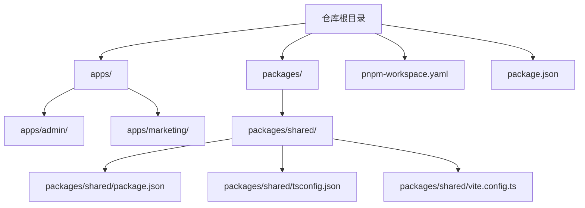
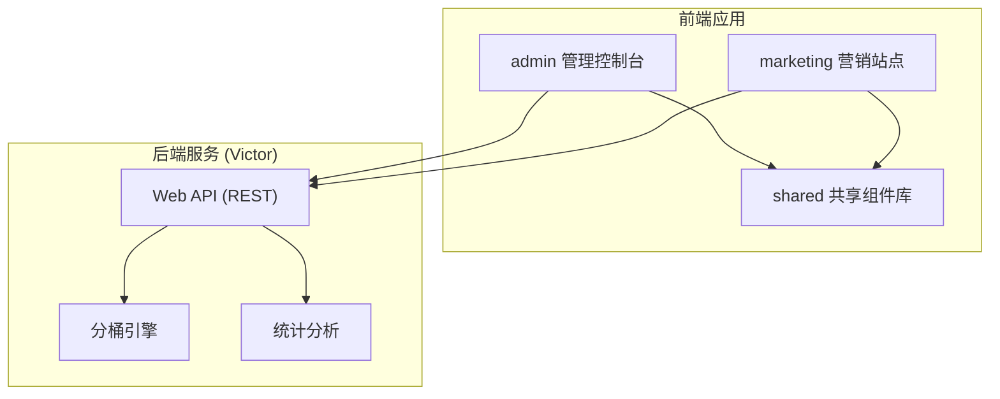
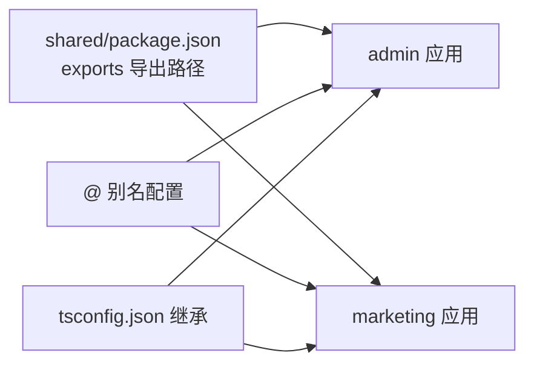
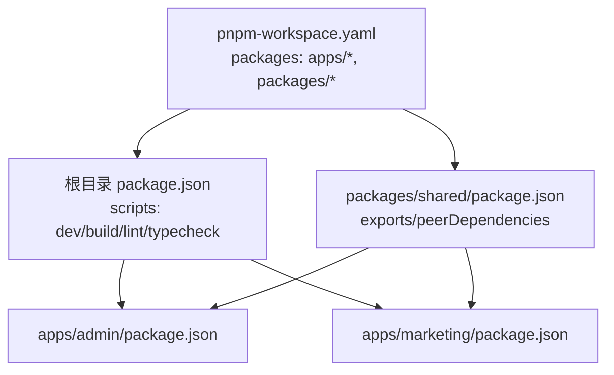

# 应用结构分析

<cite>
**本文引用的文件**
- [package.json](file://package.json)
- [pnpm-workspace.yaml](file://pnpm-workspace.yaml)
- [README.md](file://README.md)
- [packages/shared/package.json](file://packages/shared/package.json)
- [packages/shared/tsconfig.json](file://packages/shared/tsconfig.json)
- [packages/shared/vite.config.ts](file://packages/shared/vite.config.ts)
</cite>

## 目录
1. [引言](#引言)
2. [项目结构](#项目结构)
3. [核心组件](#核心组件)
4. [架构总览](#架构总览)
5. [详细组件分析](#详细组件分析)
6. [依赖分析](#依赖分析)
7. [性能考虑](#性能考虑)
8. [故障排查指南](#故障排查指南)
9. [结论](#结论)
10. [附录](#附录)

## 引言
本文件面向GateFlow项目的前端应用结构进行系统化技术分析，重点围绕Monorepo架构下admin管理控制台与marketing营销站点的应用职责、技术栈、用户定位、依赖关系与共享机制展开。结合pnp workspace多包管理模式，梳理两套前端应用的启动流程、路由配置与构建优化策略，并给出开发最佳实践与调试技巧，帮助开发者高效协作与持续演进。

## 项目结构
- 顶层通过pnpm工作区统一管理多包，支持并行开发与依赖去重。
- apps目录下包含两个独立前端应用：
  - admin：A/B实验管理控制台，面向运营与研发工程师，负责实验全生命周期管理、流量配置与数据分析入口。
  - marketing：营销展示站点，面向业务方与外部访客，提供产品介绍、案例与知识内容。
- packages/shared：共享组件库，提供通用UI组件、设计令牌、工具函数与自定义Hooks，供两个应用按需引入。

图表来源
- [pnpm-workspace.yaml:1-4](file://pnpm-workspace.yaml#L1-L4)
- [package.json:1-18](file://package.json#L1-L18)
- [packages/shared/package.json:1-36](file://packages/shared/package.json#L1-L36)
- [packages/shared/tsconfig.json:1-5](file://packages/shared/tsconfig.json#L1-L5)
- [packages/shared/vite.config.ts:1-11](file://packages/shared/vite.config.ts#L1-L11)

章节来源
- [README.md:137-168](file://README.md#L137-L168)
- [pnpm-workspace.yaml:1-4](file://pnpm-workspace.yaml#L1-L4)
- [package.json:1-18](file://package.json#L1-L18)

## 核心组件
- admin管理控制台
  - 职责：实验创建、审批、灰度、运行、分析、决策与归档；流量分桶配置；数据分析与护栏监控。
  - 技术栈：React 18、TypeScript 5.6、Vite 5.4、Zustand 4.5、React Router 6、TailwindCSS 4、Lucide React、Recharts、@dnd-kit。
  - 用户群体：运营人员、研发工程师、数据分析师。
- marketing营销站点
  - 职责：产品介绍、营销文案、案例展示、知识传播。
  - 技术栈：React 18、TypeScript 5.6、Vite 5.4、TailwindCSS 4、UI图标与可视化组件。
  - 用户群体：潜在客户、合作伙伴、外部访客。
- packages/shared共享库
  - 职责：提供通用UI组件、设计令牌（颜色、间距、断点等）、工具函数与自定义Hooks，统一风格与行为。
  - 导出路径：./components、./hooks、./tokens、./utils，供应用以模块化方式引入。

章节来源
- [README.md:106-136](file://README.md#L106-L136)
- [README.md:137-168](file://README.md#L137-L168)
- [packages/shared/package.json:1-36](file://packages/shared/package.json#L1-L36)

## 架构总览
GateFlow采用前后端分离架构，前端由admin与marketing两个应用组成，共享packages/shared组件库；后端为Victor微服务，提供Web API、业务服务、分桶引擎与统计分析能力。应用间通过REST API交互，admin侧重实验管理与分析，marketing侧重内容展示与品牌传播。

图表来源
- [README.md:70-104](file://README.md#L70-L104)
- [README.md:106-136](file://README.md#L106-L136)

## 详细组件分析

### admin管理控制台
- 应用职责
  - 实验生命周期管理：草稿→审批→灰度→运行→分析→决策→归档。
  - 流量分配：基于一致性哈希的分桶算法，支持多层实验隔离与正交性保证。
  - 数据分析：显著性检验、序贯检验、方差缩减、多重校正、A/A测试验证与时间序列分析。
  - 实时监控：事件流处理与实时数据统计。
- 技术栈与模块划分
  - 框架与类型：React 18、TypeScript 5.6。
  - 构建：Vite 5.4。
  - 状态管理：Zustand 4.5。
  - 路由：React Router 6。
  - UI与样式：Lucide React、Recharts、TailwindCSS 4。
  - 拖拽：@dnd-kit。
  - 包管理：pnpm workspace。
- 路由与页面组织
  - 页面按功能域划分，典型页面包括实验列表、实验详情、流量配置、数据分析、知识库等。
  - 路由采用React Router 6，支持嵌套路由与参数传递。
- 构建与优化
  - Vite提供快速冷启动与热重载；按需引入共享组件库，减少重复打包。
  - 通过共享库导出路径与别名配置，提升开发体验与构建效率。

章节来源
- [README.md:34-67](file://README.md#L34-L67)
- [README.md:106-136](file://README.md#L106-L136)
- [README.md:137-168](file://README.md#L137-L168)

### marketing营销站点
- 应用职责
  - 展示GateFlow的核心价值与能力，传播产品理念与成功案例。
  - 提供知识库入口，便于业务方了解实验方法论与最佳实践。
- 技术栈与模块划分
  - 框架与类型：React 18、TypeScript 5.6。
  - 构建：Vite 5.4。
  - 样式：TailwindCSS 4。
  - UI图标与可视化：Lucide React、Recharts。
- 路由与页面组织
  - 页面以内容为主，强调可读性与响应式布局；路由简洁明确，便于SEO与分享。
- 构建与优化
  - 与admin共享组件库，统一视觉与交互体验；通过别名与导出路径减少重复依赖。

章节来源
- [README.md:106-136](file://README.md#L106-L136)
- [README.md:137-168](file://README.md#L137-L168)

### packages/shared共享组件库
- 组件与工具
  - 组件：Badge、Button、Card、Container等基础UI组件。
  - Hooks：useLocalStorage、useMediaQuery等常用Hook。
  - 设计令牌：colors、spacing、typography、radius、shadows、breakpoints等。
  - 工具：cn等实用函数。
- 导出与使用
  - 通过package.json的exports字段提供模块化导出路径，应用可按需引入。
  - 在共享库内部通过vite.config.ts配置别名@指向src，简化导入路径。
- 类型与编译
  - tsconfig.json继承根级tsconfig.base.json，确保类型检查一致性。
  - 脚本中提供typecheck任务，保证共享库类型安全。

图表来源
- [packages/shared/package.json:8-14](file://packages/shared/package.json#L8-L14)
- [packages/shared/vite.config.ts:5-9](file://packages/shared/vite.config.ts#L5-L9)
- [packages/shared/tsconfig.json:1-5](file://packages/shared/tsconfig.json#L1-L5)

章节来源
- [packages/shared/package.json:1-36](file://packages/shared/package.json#L1-L36)
- [packages/shared/vite.config.ts:1-11](file://packages/shared/vite.config.ts#L1-L11)
- [packages/shared/tsconfig.json:1-5](file://packages/shared/tsconfig.json#L1-L5)

## 依赖分析
- pnpm workspace多包管理
  - 通过pnpm-workspace.yaml声明apps与packages为受管包，实现跨包依赖解析与去重。
  - 顶层package.json提供统一脚本，支持并行启动admin与marketing，或分别启动单个应用。
- 应用对共享库的依赖
  - admin与marketing均通过模块化导入共享组件库，避免重复实现，提升一致性与可维护性。
- peerDependencies与版本约束
  - shared声明react与react-dom为peerDependencies，确保宿主应用提供正确版本，避免打包重复。

图表来源
- [package.json:4-11](file://package.json#L4-L11)
- [pnpm-workspace.yaml:1-4](file://pnpm-workspace.yaml#L1-L4)
- [packages/shared/package.json:20-27](file://packages/shared/package.json#L20-L27)

章节来源
- [package.json:1-18](file://package.json#L1-L18)
- [pnpm-workspace.yaml:1-4](file://pnpm-workspace.yaml#L1-L4)
- [packages/shared/package.json:1-36](file://packages/shared/package.json#L1-L36)

## 性能考虑
- 构建与启动
  - Vite提供极快的冷启动与热重载，配合pnpm workspace实现并行安装与依赖去重，缩短整体开发等待时间。
- 代码分割与懒加载
  - 建议在admin与marketing中按路由进行代码分割，结合React.lazy与Suspense实现页面级懒加载，降低首屏体积。
- 资源优化
  - TailwindCSS按需引入与摇树优化，避免未使用样式的打包；共享组件库统一裁剪，减少重复样式。
- 状态管理
  - Zustand轻量且易于拆分模块，建议将大状态拆分为多个store，按需订阅，避免全局抖动。
- 网络与缓存
  - 对频繁调用的API进行请求合并与缓存策略设计；对静态资源启用长效缓存与CDN加速。
- 监控与诊断
  - 使用浏览器性能面板与Vite Devtools定位瓶颈；对慢查询与长任务进行标记与优化。

## 故障排查指南
- 常见问题
  - 依赖安装失败：清理pnpm store与node_modules后重试，确保Node与pnpm版本满足要求。
  - 端口冲突：调整应用或后端服务端口配置。
  - 数据库连接失败：确认MySQL与Redis容器状态，检查连接字符串与凭据。
  - Redis连接失败：确认Redis容器运行，使用CLI工具进行连通性测试。
- 调试技巧
  - 使用React DevTools与Redux DevTools（如使用）辅助定位状态与渲染问题。
  - 在Vite中开启严格模式与类型检查，利用TS提示快速定位类型错误。
  - 对网络请求进行拦截与Mock，隔离后端不稳定因素，聚焦前端逻辑验证。

章节来源
- [README.md:474-505](file://README.md#L474-L505)

## 结论
GateFlow的前端采用清晰的Monorepo分层：admin与marketing各司其职，共享组件库提供一致的UI与设计体验。通过pnpm workspace与Vite生态，实现了高效的多包管理与开发体验。建议在后续迭代中进一步完善路由懒加载、状态模块化与构建产物分析，持续提升性能与可维护性。

## 附录
- 开发环境配置要点
  - Node与pnpm版本要求：Node >= 18，pnpm >= 9。
  - 本地启动：根目录执行安装与并行启动脚本；也可分别启动admin与marketing。
  - 环境变量：各应用根目录提供.env.development文件，按需配置后端API地址等。
- 调试与测试
  - 类型检查与Lint：通过根目录脚本统一执行，确保代码质量。
  - 端到端测试：可参考知识库中的测试规范与指南，建立稳定的测试流程。

章节来源
- [README.md:194-248](file://README.md#L194-L248)
- [README.md:370-394](file://README.md#L370-L394)
- [README.md:334-367](file://README.md#L334-L367)