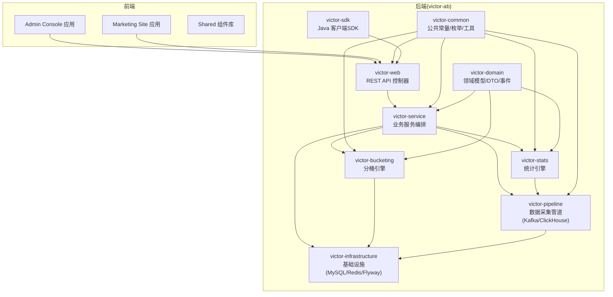
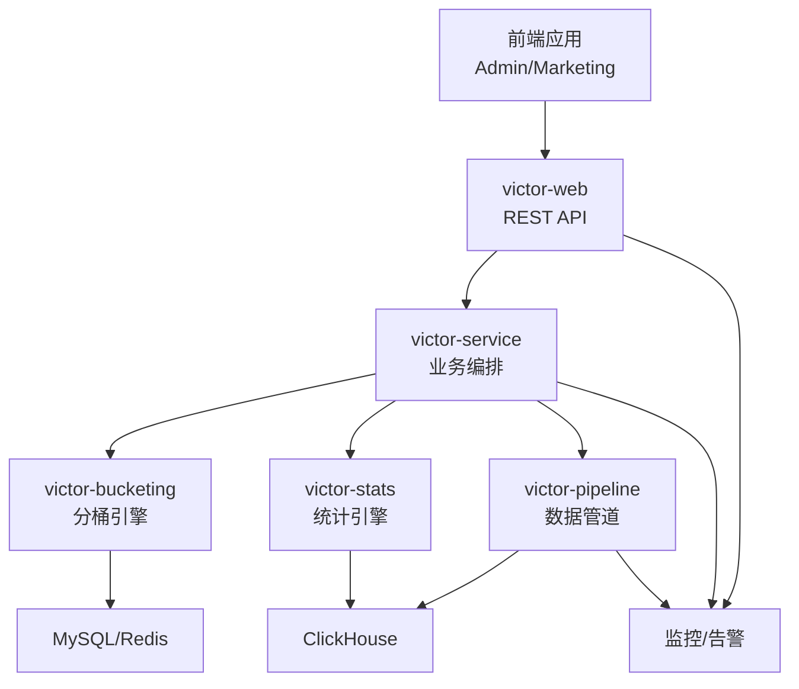
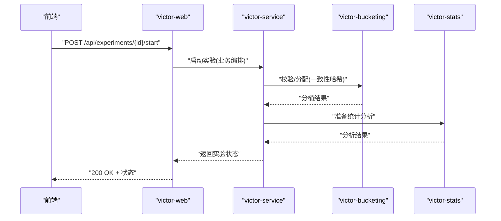
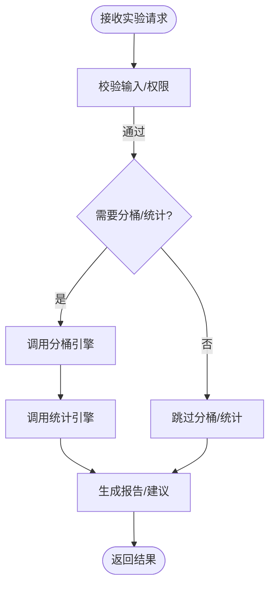
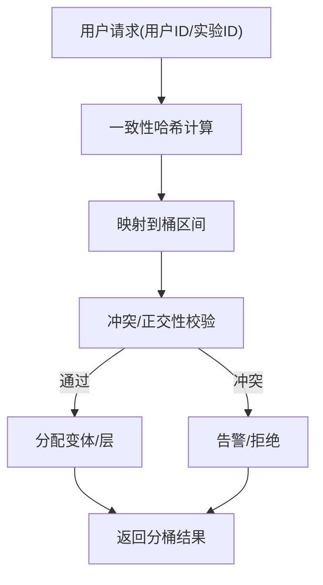
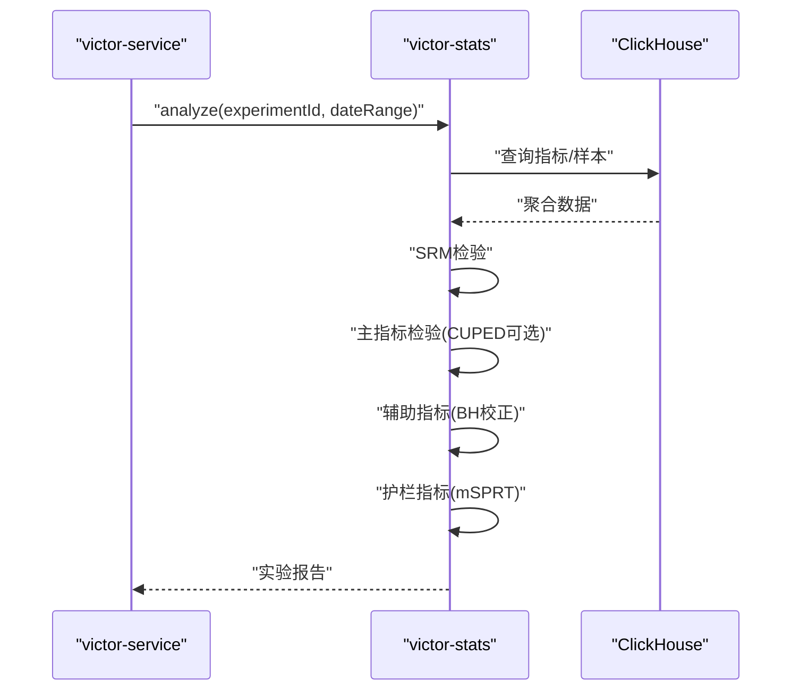
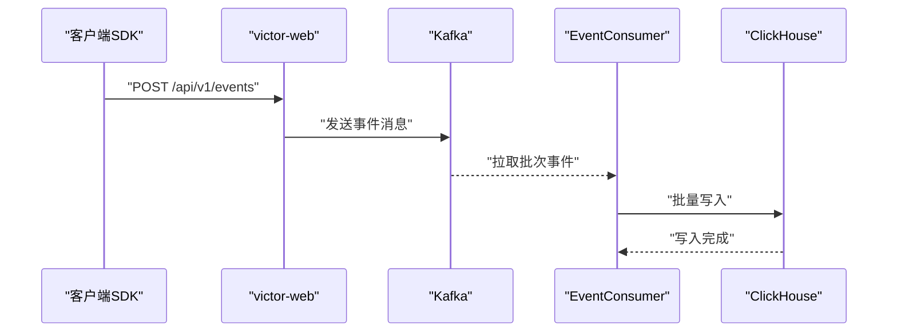
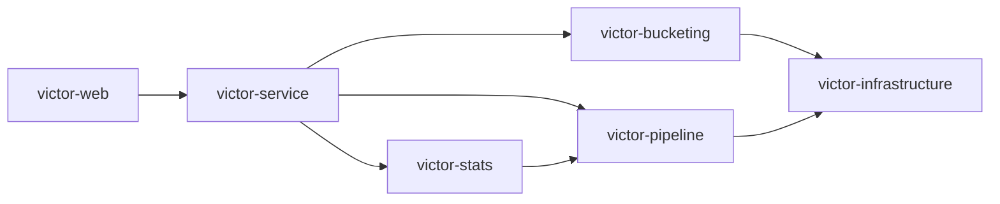

# 微服务设计

<cite>
**本文引用的文件**   
- [README.md](file://README.md)
- [package.json](file://package.json)
- [pnpm-workspace.yaml](file://pnpm-workspace.yaml)
- [docs/ab/ab_experiment_platform_design.md](file://docs/ab/ab_experiment_platform_design.md)
- [docs/superpowers/specs/2026-05-05-victor-stats-engine-design.md](file://docs/superpowers/specs/2026-05-05-victor-stats-engine-design.md)
- [docs/superpowers/plans/2026-05-05-victor-pipeline-stats-plan.md](file://docs/superpowers/plans/2026-05-05-victor-pipeline-stats-plan.md)
</cite>

## 目录
1. [引言](#引言)
2. [项目结构](#项目结构)
3. [核心组件](#核心组件)
4. [架构总览](#架构总览)
5. [详细组件分析](#详细组件分析)
6. [依赖关系分析](#依赖关系分析)
7. [性能考量](#性能考量)
8. [故障排查指南](#故障排查指南)
9. [结论](#结论)
10. [附录](#附录)

## 引言
本文件面向GateFlow微服务设计，聚焦后端“Victor”体系的四层微服务：victor-web（Web层）、victor-service（业务服务层）、victor-bucketing（分桶引擎）、victor-stats（统计引擎）。文档从设计理念、职责边界、接口能力、服务间通信、服务治理与监控、性能优化等方面进行系统化阐述，并提供架构图与数据流图，帮助读者快速理解并落地实施。

## 项目结构
- 前端采用Monorepo，包含admin与marketing两个应用，共享packages。
- 后端以“victor-ab”为核心，按领域与层次划分模块，形成微服务化的后端架构。

图表来源
- [README.md: 137-188:137-188](file://README.md#L137-L188)
- [pnpm-workspace.yaml: 1-4:1-4](file://pnpm-workspace.yaml#L1-L4)
- [package.json: 1-18:1-18](file://package.json#L1-L18)

章节来源
- [README.md: 137-188:137-188](file://README.md#L137-L188)
- [pnpm-workspace.yaml: 1-4:1-4](file://pnpm-workspace.yaml#L1-L4)
- [package.json: 1-18:1-18](file://package.json#L1-L18)

## 核心组件
- victor-web（Web层）
  - 职责：提供REST API，承载实验管理、流量分配、统计查询等对外接口；统一鉴权、参数校验、异常处理与响应封装。
  - 接口示例：实验管理、分桶分配、统计查询等，详见API文档与Swagger。
- victor-service（业务服务层）
  - 职责：编排业务流程，协调分桶引擎与统计引擎，处理实验生命周期、流量分配、统计分析请求。
  - 通信：同步调用分桶引擎与统计引擎，必要时异步触发数据管道。
- victor-bucketing（分桶引擎）
  - 职责：基于一致性哈希算法实现多层正交分桶，支持白名单/黑名单、冲突检测与可视化流量地图。
  - 能力：用户分桶分配、分桶统计、冲突检测、正交性校验。
- victor-stats（统计引擎）
  - 职责：提供SRM检验、主指标检验（Welch t/z）、CUPED方差缩减、BH多重校正、mSPRT序贯检验等。
  - 能力：实验报告生成、护栏指标早停、统计显著性判断、提升估计与置信区间。
- victor-pipeline（数据采集管道）
  - 职责：接收事件上报，写入Kafka，再由消费者批量写入ClickHouse，支撑实时分析。
  - 能力：事件收集、Kafka生产者、批量写入ClickHouse、DDL初始化。
- 基础设施层
  - 包括MySQL（持久化）、Redis（缓存）、ClickHouse（OLAP分析）、Kafka（事件总线）。

章节来源
- [README.md: 70-136:70-136](file://README.md#L70-L136)
- [README.md: 304-331:304-331](file://README.md#L304-L331)
- [docs/ab/ab_experiment_platform_design.md: 21-40:21-40](file://docs/ab/ab_experiment_platform_design.md#L21-L40)
- [docs/superpowers/specs/2026-05-05-victor-stats-engine-design.md: 26-67:26-67](file://docs/superpowers/specs/2026-05-05-victor-stats-engine-design.md#L26-L67)
- [docs/superpowers/plans/2026-05-05-victor-pipeline-stats-plan.md: 17-66:17-66](file://docs/superpowers/plans/2026-05-05-victor-pipeline-stats-plan.md#L17-L66)

## 架构总览
- 前后端分离：前端通过REST API与后端交互；SDK用于客户端集成。
- 事件驱动：通过Kafka实现异步解耦，数据经管道落库，供统计引擎分析。
- 分层清晰：Web层负责接口与编排，Service层负责业务编排，Engine层负责算法与分析，Pipeline负责数据采集与落库。

图表来源
- [README.md: 70-136:70-136](file://README.md#L70-L136)
- [docs/ab/ab_experiment_platform_design.md: 21-40:21-40](file://docs/ab/ab_experiment_platform_design.md#L21-L40)

## 详细组件分析

### Web层（victor-web）
- 职责边界
  - 对外接口：实验管理、流量分配、统计查询、AA测试、指标数据等。
  - 内部职责：参数校验、鉴权、异常处理、响应封装、调用业务服务。
- 接口能力
  - 实验管理：创建、查询、详情、更新、删除、启动/停止。
  - 流量分配：用户分桶分配、分桶统计。
  - 统计分析：实验统计数据、指标数据、A/A测试结果。
- 通信机制
  - 同步调用：victor-service的业务编排接口。
  - 异步触发：部分分析任务可异步触发，避免阻塞请求。
- 服务治理
  - 健康检查、限流、熔断、超时配置、统一异常处理。
- 监控告警
  - 指标埋点、日志聚合、告警规则（延迟、错误率、容量）。

图表来源
- [README.md: 304-331:304-331](file://README.md#L304-L331)
- [docs/ab/ab_experiment_platform_design.md: 48-60:48-60](file://docs/ab/ab_experiment_platform_design.md#L48-L60)

章节来源
- [README.md: 304-331:304-331](file://README.md#L304-L331)
- [README.md: 245-248:245-248](file://README.md#L245-L248)

### 业务服务层（victor-service）
- 职责边界
  - 实验生命周期编排：草稿→审批→灰度→运行→分析→决策→归档。
  - 流量分配编排：校验冲突、正交性、白名单/黑名单。
  - 统计分析编排：SRM检验、主指标检验、CUPED、BH校正、mSPRT。
- 通信机制
  - 同步调用：分桶引擎、统计引擎、数据管道。
  - 异步消息：事件驱动的分析任务与报表生成。
- 服务治理
  - 事务一致性、幂等设计、重试与死信队列、可观测性。

图表来源
- [docs/ab/ab_experiment_platform_design.md: 48-60:48-60](file://docs/ab/ab_experiment_platform_design.md#L48-L60)
- [docs/superpowers/specs/2026-05-05-victor-stats-engine-design.md: 720-790:720-790](file://docs/superpowers/specs/2026-05-05-victor-stats-engine-design.md#L720-L790)

章节来源
- [docs/ab/ab_experiment_platform_design.md: 48-60:48-60](file://docs/ab/ab_experiment_platform_design.md#L48-L60)

### 分桶引擎（victor-bucketing）
- 职责边界
  - 基于一致性哈希的多层正交分桶，支持流量冲突检测、可视化流量地图。
  - 白名单/黑名单、实验互斥、冲突告警。
- 算法与数据结构
  - MurmurHash3一致性哈希、桶号映射、正交盐值。
- 性能与可靠性
  - O(1)分桶查询、缓存命中、冲突检测提前返回。

图表来源
- [README.md: 42-47:42-47](file://README.md#L42-L47)
- [docs/ab/ab_experiment_platform_design.md: 306-314:306-314](file://docs/ab/ab_experiment_platform_design.md#L306-L314)

章节来源
- [README.md: 42-47:42-47](file://README.md#L42-L47)
- [docs/ab/ab_experiment_platform_design.md: 306-314:306-314](file://docs/ab/ab_experiment_platform_design.md#L306-L314)

### 统计引擎（victor-stats）
- 职责边界
  - SRM检验（分流比例校验）、主指标检验（Welch t/z）、CUPED方差缩减、BH多重校正、mSPRT序贯检验。
  - 输出实验报告、护栏指标早停、显著性判断、提升估计与置信区间。
- 算法实现概览
  - SRM卡方检验、Welch t检验、z检验、CUPED、BH校正、mSPRT。
- 数据流
  - 从ClickHouse聚合指标，按流程执行检验，输出报告与建议。

图表来源
- [docs/superpowers/specs/2026-05-05-victor-stats-engine-design.md: 14-23:14-23](file://docs/superpowers/specs/2026-05-05-victor-stats-engine-design.md#L14-L23)
- [docs/superpowers/specs/2026-05-05-victor-stats-engine-design.md: 720-790:720-790](file://docs/superpowers/specs/2026-05-05-victor-stats-engine-design.md#L720-L790)

章节来源
- [docs/superpowers/specs/2026-05-05-victor-stats-engine-design.md: 720-790:720-790](file://docs/superpowers/specs/2026-05-05-victor-stats-engine-design.md#L720-L790)

### 数据采集管道（victor-pipeline）
- 职责边界
  - 事件上报接口、Kafka生产者、批量写入ClickHouse、DDL初始化。
- 数据流
  - SDK/HTTP → Web层 → Kafka → Consumer → ClickHouse。
- 配置与部署
  - Docker Compose包含Zookeeper/Kafka/ClickHouse，初始化表结构。

图表来源
- [docs/superpowers/plans/2026-05-05-victor-pipeline-stats-plan.md: 17-66:17-66](file://docs/superpowers/plans/2026-05-05-victor-pipeline-stats-plan.md#L17-L66)
- [docs/superpowers/plans/2026-05-05-victor-pipeline-stats-plan.md: 675-761:675-761](file://docs/superpowers/plans/2026-05-05-victor-pipeline-stats-plan.md#L675-L761)

章节来源
- [docs/superpowers/plans/2026-05-05-victor-pipeline-stats-plan.md: 17-66:17-66](file://docs/superpowers/plans/2026-05-05-victor-pipeline-stats-plan.md#L17-L66)
- [docs/superpowers/plans/2026-05-05-victor-pipeline-stats-plan.md: 675-761:675-761](file://docs/superpowers/plans/2026-05-05-victor-pipeline-stats-plan.md#L675-L761)

## 依赖关系分析
- 模块依赖
  - Web层依赖Service层；Service层依赖Bucketing、Stats、Pipeline与Infrastructure。
  - Stats依赖Pipeline提供的指标数据；Bucketing依赖MySQL/Redis。
- 外部依赖
  - Kafka/ClickHouse/MySQL/Redis；Spring Boot生态（Web、Validation、Kafka、Actuator等）。
- 通信协议
  - 同步：REST/HTTP；异步：Kafka消息。

图表来源
- [README.md: 170-188:170-188](file://README.md#L170-L188)
- [docs/ab/ab_experiment_platform_design.md: 21-40:21-40](file://docs/ab/ab_experiment_platform_design.md#L21-L40)

章节来源
- [README.md: 170-188:170-188](file://README.md#L170-L188)

## 性能考量
- 分桶性能
  - 一致性哈希O(1)，结合本地缓存与热点数据驻留，降低数据库压力。
- 统计性能
  - ClickHouse列存与物化视图加速聚合；CUPED减少方差，缩短实验周期；mSPRT支持早停，减少无效采样。
- 管道性能
  - Kafka批量写入、背压控制、分区并行消费；ClickHouse批量插入与分区裁剪。
- 服务治理
  - 超时与重试、熔断与降级、限流与排队；健康检查与自愈。

## 故障排查指南
- 常见问题
  - 前端依赖安装失败：清理缓存后重装。
  - 数据库连接失败：检查MySQL容器状态与日志。
  - Redis连接失败：检查Redis容器状态与ping。
  - 端口冲突：修改配置文件端口。
- 后端调试
  - Swagger接口文档：/swagger-ui.html。
  - 健康检查：/actuator/health。
  - 日志：容器日志与服务日志聚合。

章节来源
- [README.md: 474-510:474-510](file://README.md#L474-L510)
- [README.md: 296-303:296-303](file://README.md#L296-L303)
- [README.md: 245-248:245-248](file://README.md#L245-L248)

## 结论
GateFlow的Victor微服务体系以清晰的职责边界与分层架构实现了从实验创建到统计分析的全链路闭环。Web层提供统一接口，Service层编排业务，Engine层专注算法，Pipeline负责事件采集与落库。通过一致性哈希分桶、SRM校验、CUPED与mSPRT等手段，平台在保证统计科学性的同时提升了实验效率与用户体验。配合事件驱动与可观测性，平台具备良好的扩展性与稳定性。

## 附录
- API接口参考
  - 实验管理、流量分配、统计分析等接口详见README中的API表格与Swagger文档。
- 部署与运维
  - Docker Compose一键启动Kafka/ClickHouse；Flyway迁移脚本管理数据库演进。

章节来源
- [README.md: 304-331:304-331](file://README.md#L304-L331)
- [README.md: 250-269:250-269](file://README.md#L250-L269)