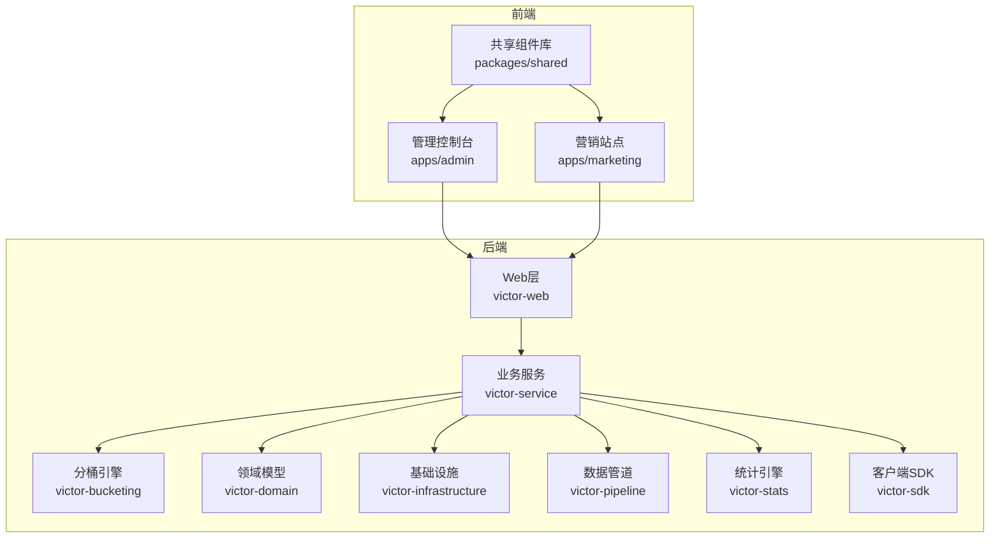
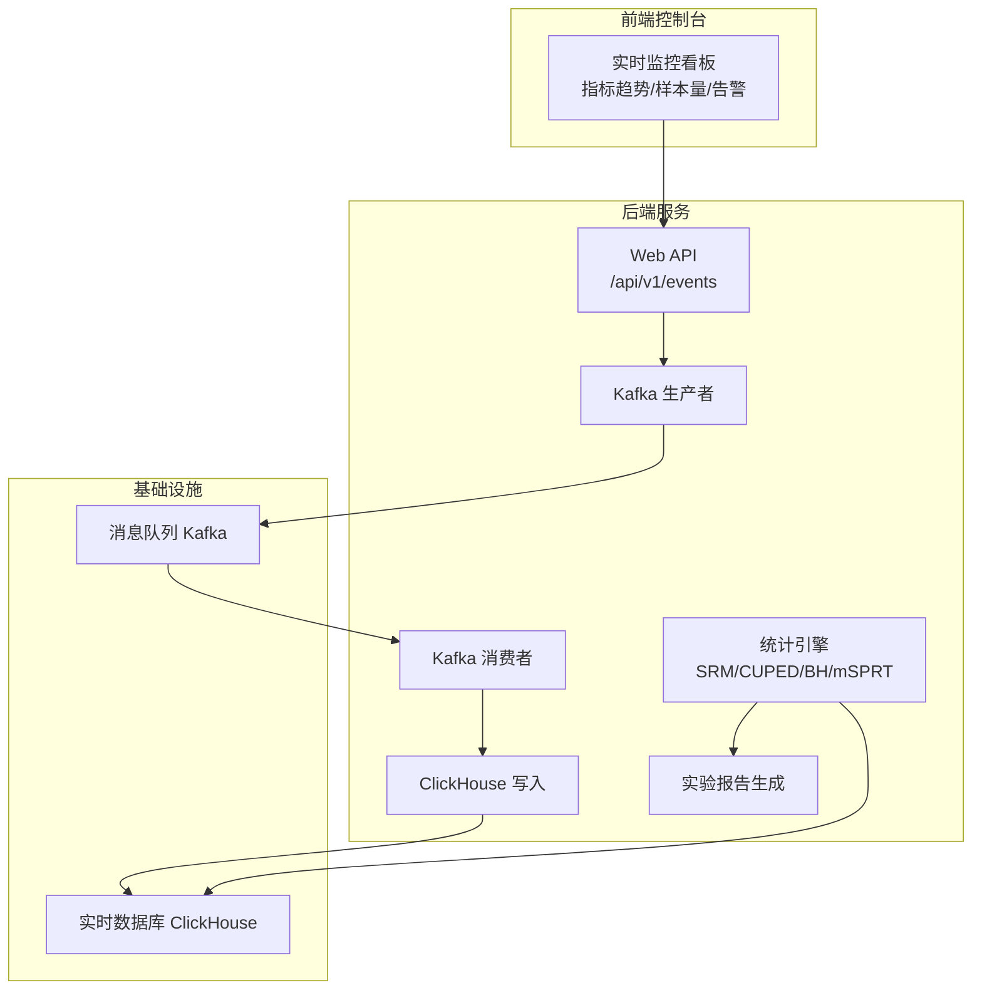
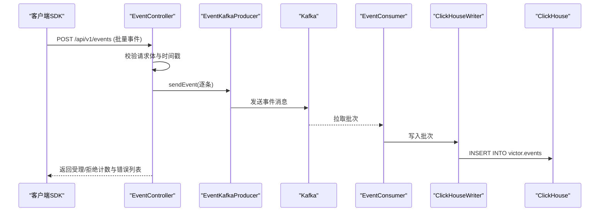
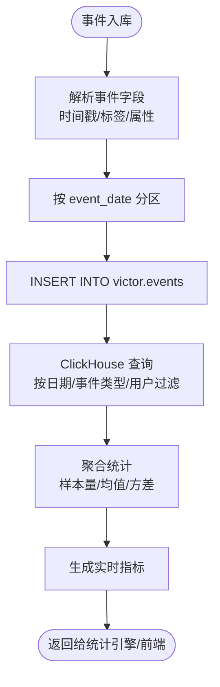
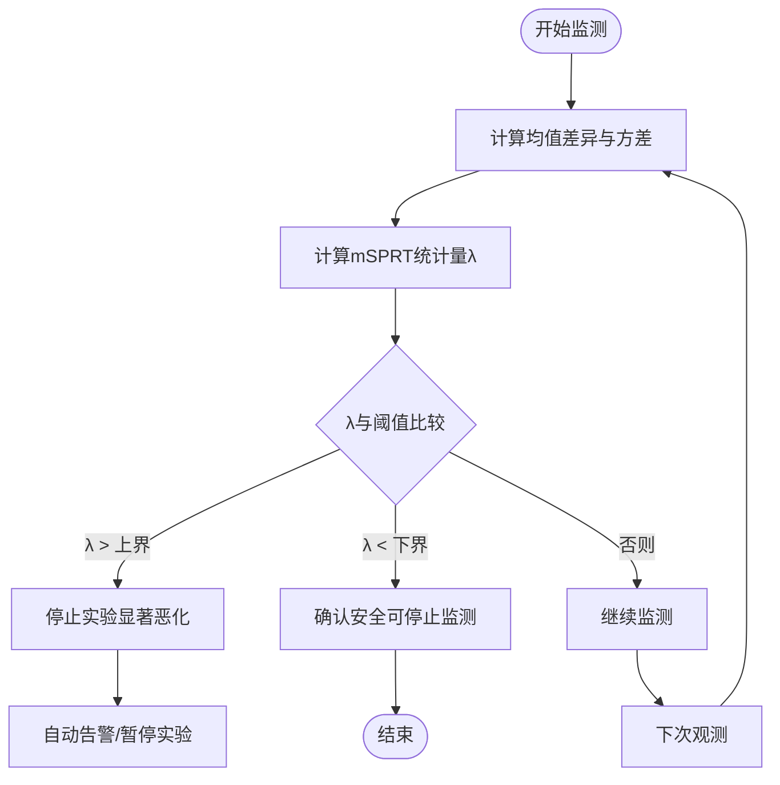
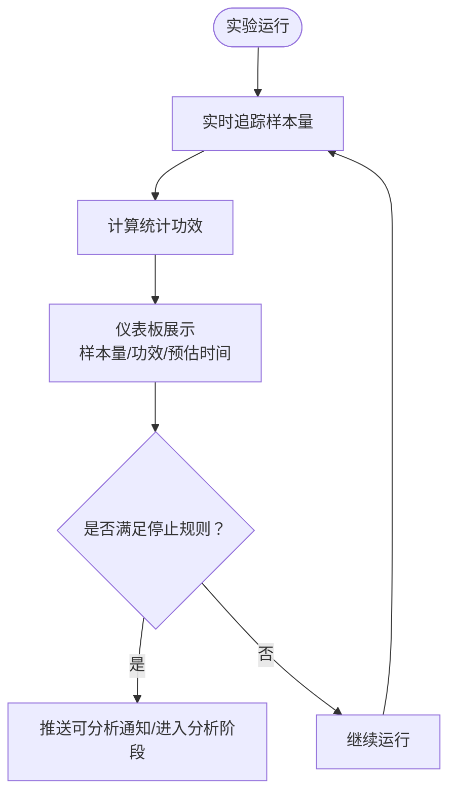
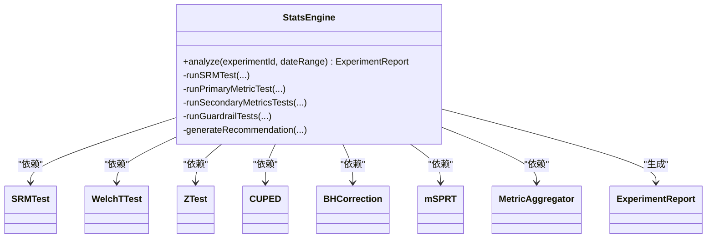
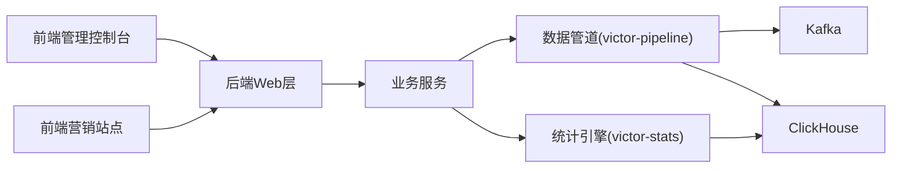

# 实时监控系统

<cite>
**本文引用的文件**
- [README.md](file://README.md)
- [package.json](file://package.json)
- [docs/ab/ab_experiment_platform_design.md](file://docs/ab/ab_experiment_platform_design.md)
- [docs/superpowers/specs/2026-05-05-victor-stats-engine-design.md](file://docs/superpowers/specs/2026-05-05-victor-stats-engine-design.md)
- [docs/superpowers/plans/2026-05-05-victor-pipeline-stats-plan.md](file://docs/superpowers/plans/2026-05-05-victor-pipeline-stats-plan.md)
- [docs/ab/ab_experiment_system_architecture.html](file://docs/ab/ab_experiment_system_architecture.html)
- [docs/knowledge/README.md](file://docs/knowledge/README.md)
</cite>

## 目录
1. [简介](#简介)
2. [项目结构](#项目结构)
3. [核心组件](#核心组件)
4. [架构总览](#架构总览)
5. [详细组件分析](#详细组件分析)
6. [依赖分析](#依赖分析)
7. [性能考虑](#性能考虑)
8. [故障排查指南](#故障排查指南)
9. [结论](#结论)
10. [附录](#附录)

## 简介
本文件为 GateFlow 实时监控系统的技术文档，围绕基于 Kafka 的事件流处理架构、ClickHouse 实时数据分析能力、护栏监控机制、样本量追踪与统计功效预估、事件上报 API 规范、监控仪表板实现方案以及故障排查与性能优化实践进行系统化说明。文档以仓库现有设计文档与实施计划为基础，结合前端与后端模块的组织方式，帮助读者快速理解并落地系统。

## 项目结构
- 前端采用 monorepo 结构，包含管理控制台与营销站点两个应用，共享组件库。
- 后端采用多模块微服务架构，核心模块包括分桶引擎、领域模型、基础设施、业务服务、数据管道、统计引擎、Web 层与 SDK。
- 实时监控能力由“数据管道 + 统计引擎 + ClickHouse”协同实现，支撑实验运行期的实时监控、自动告警与统计决策。

**章节来源**
- [README.md: 137-188:137-188](file://README.md#L137-L188)
- [package.json: 1-18:1-18](file://package.json#L1-L18)

## 核心组件
- 事件上报与流处理：通过 HTTP API 接收事件，写入 Kafka；Kafka 消费后写入 ClickHouse，支撑实时查询与分析。
- 实时数据分析：基于 ClickHouse 的高效 OLAP 能力，结合统计引擎的 SRM、主指标检验、辅助指标校正与护栏指标序贯检验，输出实验报告与决策建议。
- 护栏监控：通过护栏指标的 mSPRT 序贯检验，持续监测实验运行期的潜在风险，触发自动告警与早停。
- 样本量追踪与统计功效：在实验运行期持续追踪样本量与统计功效，提供可视化进度与停止规则判断依据。
- 监控仪表板：提供实时指标趋势、样本量追踪、告警通知等可视化界面，支持多维度分析与下钻。

**章节来源**
- [README.md: 56-61:56-61](file://README.md#L56-L61)
- [docs/ab/ab_experiment_platform_design.md: 140-156:140-156](file://docs/ab/ab_experiment_platform_design.md#L140-L156)

## 架构总览
系统采用“前端控制台 + 后端微服务 + 基础设施”的分层架构。数据流从 SDK/埋点上报到 HTTP API，进入 Kafka，再由消费者写入 ClickHouse，最终由统计引擎与前端控制台呈现。

**图表来源**
- [docs/ab/ab_experiment_system_architecture.html: 643-667:643-667](file://docs/ab/ab_experiment_system_architecture.html#L643-L667)
- [docs/superpowers/plans/2026-05-05-victor-pipeline-stats-plan.md: 7-11:7-11](file://docs/superpowers/plans/2026-05-05-victor-pipeline-stats-plan.md#L7-L11)

**章节来源**
- [docs/ab/ab_experiment_system_architecture.html: 643-667:643-667](file://docs/ab/ab_experiment_system_architecture.html#L643-L667)
- [docs/superpowers/plans/2026-05-05-victor-pipeline-stats-plan.md: 7-11:7-11](file://docs/superpowers/plans/2026-05-05-victor-pipeline-stats-plan.md#L7-L11)

## 详细组件分析

### 事件上报 API（HTTP + Kafka）
- 接口路径：/api/v1/events（POST）
- 请求体：批量事件数组，单次最多 100 条
- 字段：事件 ID、事件类型、用户 ID、时间戳、平台、设备 ID、会话 ID、实验标签数组、自定义属性
- 错误处理：对非法时间戳与发送异常进行记录与返回
- 传输协议：HTTP/1.1，JSON
- 重试机制：客户端 SDK 侧具备本地缓存与 IndexedDB 持久化、批量上报与指数退避重试策略

**图表来源**
- [docs/superpowers/plans/2026-05-05-victor-pipeline-stats-plan.md: 290-331:290-331](file://docs/superpowers/plans/2026-05-05-victor-pipeline-stats-plan.md#L290-L331)
- [docs/superpowers/plans/2026-05-05-victor-pipeline-stats-plan.md: 371-405:371-405](file://docs/superpowers/plans/2026-05-05-victor-pipeline-stats-plan.md#L371-L405)
- [docs/superpowers/plans/2026-05-05-victor-pipeline-stats-plan.md: 621-659:621-659](file://docs/superpowers/plans/2026-05-05-victor-pipeline-stats-plan.md#L621-L659)

**章节来源**
- [docs/superpowers/plans/2026-05-05-victor-pipeline-stats-plan.md: 151-266:151-266](file://docs/superpowers/plans/2026-05-05-victor-pipeline-stats-plan.md#L151-L266)
- [docs/superpowers/plans/2026-05-05-victor-pipeline-stats-plan.md: 269-344:269-344](file://docs/superpowers/plans/2026-05-05-victor-pipeline-stats-plan.md#L269-L344)
- [docs/superpowers/plans/2026-05-05-victor-pipeline-stats-plan.md: 347-418:347-418](file://docs/superpowers/plans/2026-05-05-victor-pipeline-stats-plan.md#L347-L418)
- [docs/superpowers/plans/2026-05-05-victor-pipeline-stats-plan.md: 421-579:421-579](file://docs/superpowers/plans/2026-05-05-victor-pipeline-stats-plan.md#L421-L579)
- [docs/superpowers/plans/2026-05-05-victor-pipeline-stats-plan.md: 582-672:582-672](file://docs/superpowers/plans/2026-05-05-victor-pipeline-stats-plan.md#L582-L672)

### ClickHouse 实时数据分析
- 表结构：按日期分区、按事件类型与用户排序，支持数组字段存储实验标签，JSON 字符串存储自定义属性
- 写入路径：Kafka 消费者批量写入 ClickHouse，使用 JDBC 批量插入
- 查询优化：按日期与事件类型过滤，利用 MergeTree 引擎与分区裁剪；对数组字段进行下标访问与聚合
- 索引策略：ORDER BY 包含事件日期、事件类型、用户 ID、时间戳，提高时间序列与用户维度的查询效率

**图表来源**
- [docs/superpowers/plans/2026-05-05-victor-pipeline-stats-plan.md: 429-487:429-487](file://docs/superpowers/plans/2026-05-05-victor-pipeline-stats-plan.md#L429-L487)
- [docs/superpowers/plans/2026-05-05-victor-pipeline-stats-plan.md: 489-566:489-566](file://docs/superpowers/plans/2026-05-05-victor-pipeline-stats-plan.md#L489-L566)

**章节来源**
- [docs/superpowers/plans/2026-05-05-victor-pipeline-stats-plan.md: 429-487:429-487](file://docs/superpowers/plans/2026-05-05-victor-pipeline-stats-plan.md#L429-L487)
- [docs/superpowers/plans/2026-05-05-victor-pipeline-stats-plan.md: 489-566:489-566](file://docs/superpowers/plans/2026-05-05-victor-pipeline-stats-plan.md#L489-L566)

### 护栏监控机制（mSPRT 序贯检验）
- 目标：对护栏指标进行持续监测，一旦出现显著恶化即触发停止实验的告警
- 方法：mSPRT 单侧检验，基于对照组与实验组均值差异与方差，计算统计量与边界阈值
- 触发规则：统计量超过上界阈值则停止实验，低于下界阈值则确认安全，否则继续监测
- 与灰度/运行期门禁结合：在灰度阶段与运行期自动门禁中，护栏指标作为关键触发条件之一

**图表来源**
- [docs/superpowers/specs/2026-05-05-victor-stats-engine-design.md: 611-716:611-716](file://docs/superpowers/specs/2026-05-05-victor-stats-engine-design.md#L611-L716)

**章节来源**
- [docs/superpowers/specs/2026-05-05-victor-stats-engine-design.md: 590-716:590-716](file://docs/superpowers/specs/2026-05-05-victor-stats-engine-design.md#L590-L716)
- [docs/ab/ab_experiment_platform_design.md: 121-138:121-138](file://docs/ab/ab_experiment_platform_design.md#L121-L138)

### 样本量追踪与统计功效预估
- 样本量追踪：在运行期持续统计各实验组样本量，结合历史方差与预期效应量，计算达到统计功效的时间预估
- 统计功效：通过样本量与效应量计算功效，指导实验是否提前终止或延长
- 可视化：在控制台展示样本量趋势、预计达到显著性的时间、当前功效水平
- 停止规则：当样本量达到预设阈值或功效达到目标值时，推送“可分析”通知，触发进一步分析

**图表来源**
- [docs/ab/ab_experiment_platform_design.md: 140-156:140-156](file://docs/ab/ab_experiment_platform_design.md#L140-L156)

**章节来源**
- [docs/ab/ab_experiment_platform_design.md: 140-156:140-156](file://docs/ab/ab_experiment_platform_design.md#L140-L156)

### 统计引擎服务层（StatsEngine）
- 流程：SRM 检验 → 主指标检验（含 CUPED 方差缩减）→ 辅助指标 BH 校正 → 护栏指标 mSPRT 序贯检验 → 生成实验报告与决策建议
- 算法模块：SRMTest、WelchTTest、ZTest、CUPED、BHCorrection、mSPRT
- 数据模型：SampleStatistics、TestResult、LiftEstimate、ConfidenceInterval、SequentialTestResult、ExperimentReport

**图表来源**
- [docs/superpowers/specs/2026-05-05-victor-stats-engine-design.md: 720-926:720-926](file://docs/superpowers/specs/2026-05-05-victor-stats-engine-design.md#L720-L926)

**章节来源**
- [docs/superpowers/specs/2026-05-05-victor-stats-engine-design.md: 720-926:720-926](file://docs/superpowers/specs/2026-05-05-victor-stats-engine-design.md#L720-L926)

### 监控仪表板实现方案
- 实时图表：基于折线图/柱状图/堆叠图展示主指标、辅助指标、护栏指标的趋势与分组对比
- 关键指标展示：实时样本量、累计观测数、SRM 检验状态、主指标显著性、护栏指标状态
- 告警通知：护栏指标恶化、SRM 异常、样本量不足等自动推送与可视化提醒
- 交互设计：支持按天/小时粒度切换、人群拆分、指标下钻、实验对比

**章节来源**
- [docs/ab/ab_experiment_platform_design.md: 315-350:315-350](file://docs/ab/ab_experiment_platform_design.md#L315-L350)

## 依赖分析
- 前端依赖：React 18、TypeScript 5.6、Vite 5.4、Zustand、React Router、TailwindCSS、Recharts 等
- 后端依赖：Spring Boot 3.4.0、Kafka、ClickHouse JDBC、Apache Commons Math3、OkHttp、Jackson、Flyway 等
- 模块耦合：victor-stats 与 victor-pipeline 分别承担统计分析与数据管道职责，通过 ClickHouse 与 Web API 协作

**图表来源**
- [README.md: 106-136:106-136](file://README.md#L106-L136)
- [docs/superpowers/plans/2026-05-05-victor-pipeline-stats-plan.md: 7-11:7-11](file://docs/superpowers/plans/2026-05-05-victor-pipeline-stats-plan.md#L7-L11)

**章节来源**
- [README.md: 106-136:106-136](file://README.md#L106-L136)
- [docs/superpowers/plans/2026-05-05-victor-pipeline-stats-plan.md: 7-11:7-11](file://docs/superpowers/plans/2026-05-05-victor-pipeline-stats-plan.md#L7-L11)

## 性能考虑
- Kafka 批量写入与分区：合理设置批次大小与分区数，避免单分区热点；消费者启用批量拉取与异步写入
- ClickHouse 写入：使用批量插入与合适的数据类型，避免字符串过度冗长；数组字段与 JSON 字段尽量精简
- 查询优化：利用分区键与排序键进行裁剪；对高频查询建立物化视图或预聚合表
- 统计计算：CUPED 降低方差，缩短实验周期；Welch t 检验与 z 检验按样本量与指标类型选择合适方法
- 前端渲染：图表按需加载与懒加载，避免一次性渲染大量数据

[本节为通用性能建议，不直接分析具体文件]

## 故障排查指南
- 前端依赖安装失败：清理 pnpm store、删除 node_modules 后重新安装
- 数据库连接失败：检查 MySQL 容器状态与日志
- Redis 连接失败：检查 Redis 容器状态并使用 ping 测试
- 端口冲突：修改相应配置文件中的端口设置
- 事件上报失败：检查时间戳有效性、网络连通性与 Kafka/ClickHouse 状态；客户端 SDK 侧具备本地缓存与重试策略

**章节来源**
- [README.md: 474-510:474-510](file://README.md#L474-L510)
- [docs/superpowers/plans/2026-05-05-victor-pipeline-stats-plan.md: 675-761:675-761](file://docs/superpowers/plans/2026-05-05-victor-pipeline-stats-plan.md#L675-L761)

## 结论
GateFlow 实时监控系统通过“事件上报 API + Kafka + ClickHouse + 统计引擎”的组合，实现了从事件采集、实时存储到统计分析与护栏监控的完整闭环。系统在灰度与运行期提供自动门禁与告警，结合样本量追踪与统计功效预估，为实验决策提供科学依据。前端仪表板以可视化方式呈现关键指标与告警，提升决策效率与透明度。

[本节为总结性内容，不直接分析具体文件]

## 附录
- 知识库设计原则：面向 Agent 的增量式知识库，按主题分目录组织，支持按需加载与原子化文档
- API 文档：启动后端服务后可通过 Swagger UI 查看接口契约与示例

**章节来源**
- [docs/knowledge/README.md: 1-94:1-94](file://docs/knowledge/README.md#L1-L94)
- [README.md: 296-331:296-331](file://README.md#L296-L331)