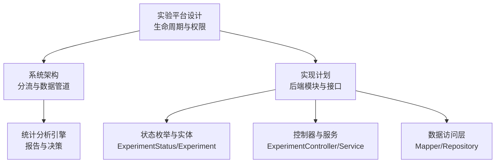
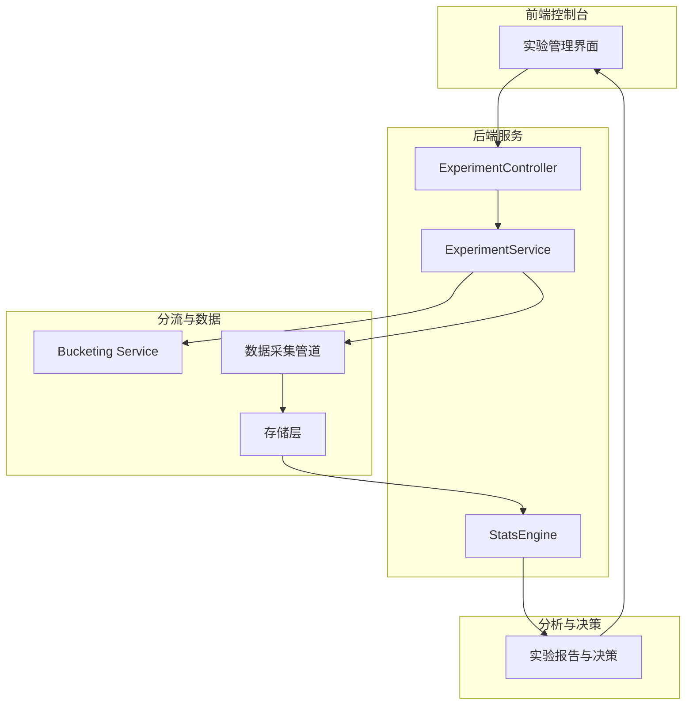
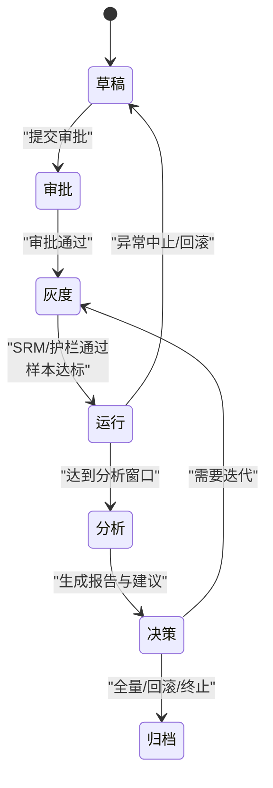
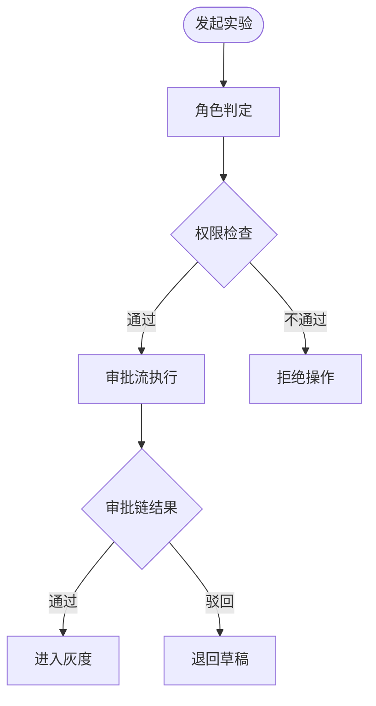
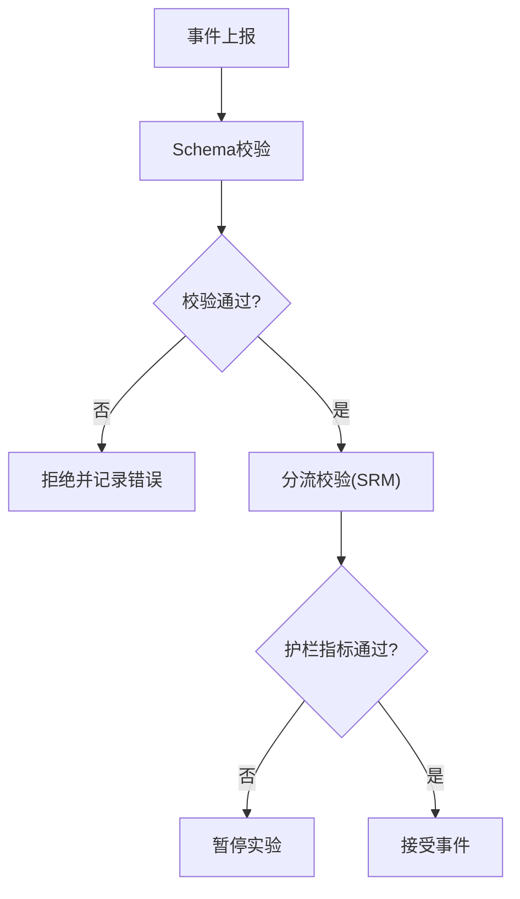
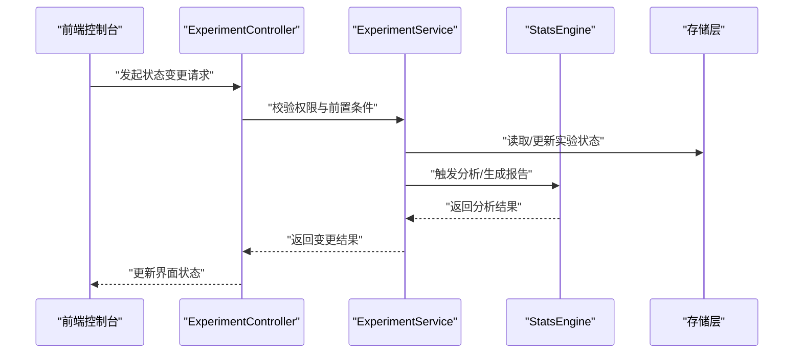
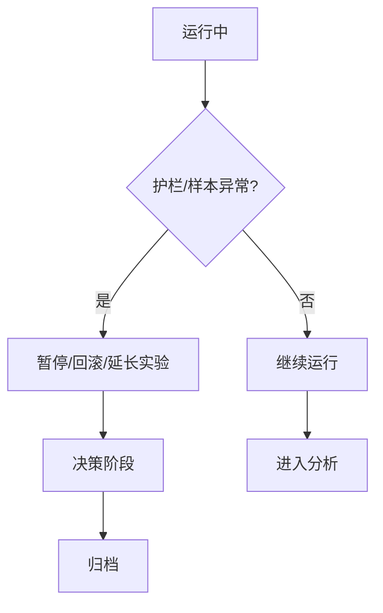
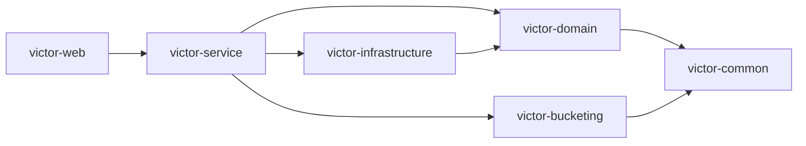

# 实验生命周期管理

<cite>
**本文引用的文件**
- [ab实验平台设计.html](file://docs/ab/ab_experiment_platform_design.html)
- [ab实验系统架构.html](file://docs/ab/ab_experiment_system_architecture.html)
- [实验实现计划.md](file://docs/ab/implementation_plan.md)
- [端到端测试指南.md](file://docs/knowledge/07-test-rule/E2E_TESTING_GUIDE.md)
- [维克托统计引擎设计.md](file://docs/superpowers/specs/2026-05-05-victor-stats-engine-design.md)
</cite>

## 目录
1. [简介](#简介)
2. [项目结构](#项目结构)
3. [核心组件](#核心组件)
4. [架构总览](#架构总览)
5. [详细组件分析](#详细组件分析)
6. [依赖分析](#依赖分析)
7. [性能考量](#性能考量)
8. [故障排查指南](#故障排查指南)
9. [结论](#结论)
10. [附录](#附录)

## 简介
本文件面向GateFlow实验生命周期管理功能，系统化阐述从草稿到归档的完整生命周期流程，覆盖七种核心状态（草稿、审批、灰度、运行、分析、决策、归档）的定义、转换条件与控制逻辑；明确权限控制、数据验证与业务约束；梳理触发条件（手动、定时、阈值）；给出状态机设计与转换矩阵；并说明异常状态处理、历史追踪、审计与通知等配套能力。

## 项目结构
- 文档驱动的生命周期与权限设计集中在“实验平台设计”与“系统架构”文档中，涵盖状态流程、审批链、权限矩阵与目标指标。
- 后端模块化设计文档提供了状态枚举、实体模型、API接口与数据访问层的实现蓝图，支撑生命周期状态的持久化与流转。
- 端到端测试指南明确了状态变更的验证场景与测试清单，确保生命周期行为可验证、可回归。

**章节来源**
- [ab实验平台设计.html:1-714](file://docs/ab/ab_experiment_platform_design.html#L1-L714)
- [ab实验系统架构.html:1-800](file://docs/ab/ab_experiment_system_architecture.html#L1-L800)
- [实验实现计划.md:1-800](file://docs/ab/implementation_plan.md#L1-L800)
- [端到端测试指南.md:428-508](file://docs/knowledge/07-test-rule/E2E_TESTING_GUIDE.md#L428-L508)

## 核心组件
- 生命周期状态机：草稿、审批、灰度、运行、分析、决策、归档。
- 权限模型：RBAC基础角色与ABAC动态权限，结合审批流配置。
- 数据与验证：实体模型、状态枚举、事件Schema校验、分流SRM校验。
- 触发机制：手动操作、定时任务、阈值触发（护栏指标、样本量）。
- 审计与通知：操作日志、权限变更审计、实验状态变更通知。

**章节来源**
- [ab实验平台设计.html:342-384](file://docs/ab/ab_experiment_platform_design.html#L342-L384)
- [ab实验平台设计.html:626-694](file://docs/ab/ab_experiment_platform_design.html#L626-L694)
- [实验实现计划.md:201-288](file://docs/ab/implementation_plan.md#L201-L288)
- [实验实现计划.md:1279-1332](file://docs/ab/implementation_plan.md#L1279-L1332)

## 架构总览
生命周期管理贯穿前端控制台、后端服务、分流与数据管道、统计分析引擎与存储层，形成“前端发起→后端状态机→分流SDK→数据采集→统计分析→决策归档”的闭环。

**图表来源**
- [ab实验系统架构.html:539-666](file://docs/ab/ab_experiment_system_architecture.html#L539-L666)
- [维克托统计引擎设计.md:1027-1069](file://docs/superpowers/specs/2026-05-05-victor-stats-engine-design.md#L1027-L1069)

**章节来源**
- [ab实验系统架构.html:531-666](file://docs/ab/ab_experiment_system_architecture.html#L531-L666)
- [维克托统计引擎设计.md:1027-1069](file://docs/superpowers/specs/2026-05-05-victor-stats-engine-design.md#L1027-L1069)

## 详细组件分析

### 生命周期状态与转换矩阵
- 状态序列：草稿 → 审批 → 灰度 → 运行 → 分析 → 决策 → 归档。
- 转换条件（基于文档描述）：
  - 草稿 → 审批：提交审批请求，审批链通过后进入灰度。
  - 审批 → 灰度：审批通过，进入1%-10%灰度阶段。
  - 灰度 → 运行：灰度通过SRM与护栏门禁，样本达标后进入运行。
  - 运行 → 分析：达到分析窗口或满足分析条件。
  - 分析 → 决策：生成统计报告与决策建议。
  - 决策 → 归档：全量上线、回滚或终止后归档。

**图表来源**
- [ab实验平台设计.html:342-384](file://docs/ab/ab_experiment_platform_design.html#L342-L384)
- [ab实验平台设计.html:384-451](file://docs/ab/ab_experiment_platform_design.html#L384-L451)

**章节来源**
- [ab实验平台设计.html:342-451](file://docs/ab/ab_experiment_platform_design.html#L342-L451)

### 权限控制与审批流
- RBAC角色与权限矩阵：覆盖创建、编辑、审批、全量/回滚、数据下载、指标审核、用户权限管理等关键功能。
- ABAC动态权限：业务线属性、数据敏感度、实验状态等属性控制访问范围。
- 审批流配置：常规/高风险/全站/紧急实验的审批链差异。

**图表来源**
- [ab实验平台设计.html:626-694](file://docs/ab/ab_experiment_platform_design.html#L626-L694)

**章节来源**
- [ab实验平台设计.html:626-694](file://docs/ab/ab_experiment_platform_design.html#L626-L694)

### 数据验证与业务约束
- 实验实体与状态：Experiment实体包含状态、流量区间、指标配置等字段；状态枚举覆盖草稿、运行、暂停等。
- 事件Schema校验：必填字段、时间戳校验、victor_tags格式校验，保障数据质量。
- 流量冲突与SRM校验：分流模型确保域-层正交，灰度阶段进行SRM与护栏门禁。

**图表来源**
- [实验实现计划.md:226-288](file://docs/ab/implementation_plan.md#L226-L288)
- [实验实现计划.md:1279-1332](file://docs/ab/implementation_plan.md#L1279-L1332)

**章节来源**
- [实验实现计划.md:226-288](file://docs/ab/implementation_plan.md#L226-L288)
- [实验实现计划.md:1279-1332](file://docs/ab/implementation_plan.md#L1279-L1332)

### 触发条件与控制逻辑
- 手动操作：前端发起状态变更（启动/停止/审批），后端服务校验权限与前置条件。
- 定时任务：灰度阶段的阶段性推进（1%→5%→10%）、分析窗口的自动触发。
- 阈值触发：护栏指标p<0.01触发暂停、样本量达标触发分析通知、统计显著性触发决策建议。

**图表来源**
- [端到端测试指南.md:428-508](file://docs/knowledge/07-test-rule/E2E_TESTING_GUIDE.md#L428-L508)
- [维克托统计引擎设计.md:1027-1069](file://docs/superpowers/specs/2026-05-05-victor-stats-engine-design.md#L1027-L1069)

**章节来源**
- [端到端测试指南.md:428-508](file://docs/knowledge/07-test-rule/E2E_TESTING_GUIDE.md#L428-L508)
- [维克托统计引擎设计.md:1027-1069](file://docs/superpowers/specs/2026-05-05-victor-stats-engine-design.md#L1027-L1069)

### 异常状态处理与回滚策略
- 异常中止：护栏恶化、SRM异常、样本不足等触发暂停或回滚。
- 强制转换：紧急实验事后补审批；全量/回滚需管理层审批。
- 历史追踪与审计：操作日志与权限变更审计，确保可追溯。

**图表来源**
- [ab实验平台设计.html:417-451](file://docs/ab/ab_experiment_platform_design.html#L417-L451)
- [ab实验平台设计.html:696-711](file://docs/ab/ab_experiment_platform_design.html#L696-L711)

**章节来源**
- [ab实验平台设计.html:417-451](file://docs/ab/ab_experiment_platform_design.html#L417-L451)
- [ab实验平台设计.html:696-711](file://docs/ab/ab_experiment_platform_design.html#L696-L711)

## 依赖分析
- 前端控制台依赖后端REST API与SDK配置拉取；后端依赖分流引擎、数据管道、存储与统计分析。
- 模块间依赖：web聚合模块依赖service与infrastructure；service依赖domain与bucketing；infrastructure依赖domain与外部中间件。

**图表来源**
- [实验实现计划.md:109-144](file://docs/ab/implementation_plan.md#L109-L144)

**章节来源**
- [实验实现计划.md:109-144](file://docs/ab/implementation_plan.md#L109-L144)

## 性能考量
- 分流延迟：<5ms；配置缓存与本地计算；SDK定时轮询与增量拉取。
- 数据管道：实时流（分钟级）与离线流（T+1）协同；ClickHouse OLAP分析。
- 统计引擎：SRM检验、Welch t检验、BH多重校正、CUPED方差缩减、mSPRT序贯检验。

**章节来源**
- [ab实验系统架构.html:516-527](file://docs/ab/ab_experiment_system_architecture.html#L516-L527)
- [实验实现计划.md:548-575](file://docs/ab/implementation_plan.md#L548-L575)

## 故障排查指南
- CORS错误：确认WebConfig中包含前端端口，重启后端；首次访问失败可刷新。
- 端口冲突：查找占用进程并终止，再重启服务。
- 前端显示mock数据：检查Network标签与数据映射函数。
- 暂停后无法恢复：后端状态机需允许从paused启动，修正后需重新编译与重启。

**章节来源**
- [端到端测试指南.md:511-590](file://docs/knowledge/07-test-rule/E2E_TESTING_GUIDE.md#L511-L590)

## 结论
GateFlow的实验生命周期管理以“状态机+权限+验证+触发”为核心，结合分流、采集、分析与决策的全链路架构，形成可审计、可追溯、可扩展的实验管理体系。通过严格的权限矩阵与审批流配置，确保合规与质量；通过SRM与护栏门禁保障实验稳健；通过报告与决策建议提升决策效率；通过归档沉淀知识资产。

## 附录
- 状态机与转换矩阵参见“生命周期状态与转换矩阵”。
- 权限矩阵与审批流参见“权限控制与审批流”。
- 数据验证与业务约束参见“数据验证与业务约束”。