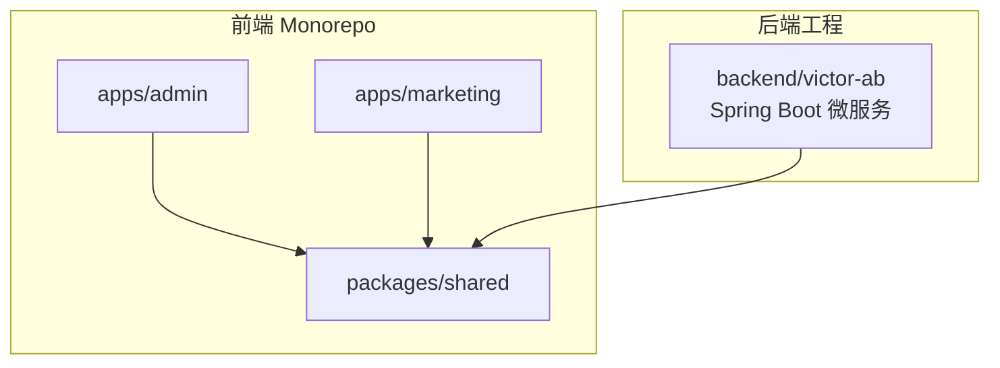
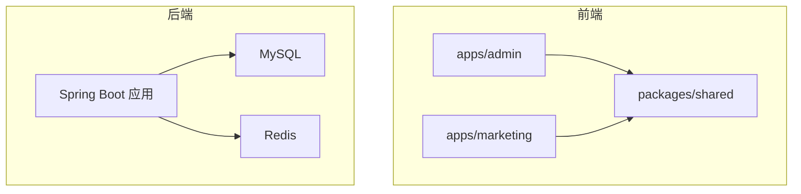
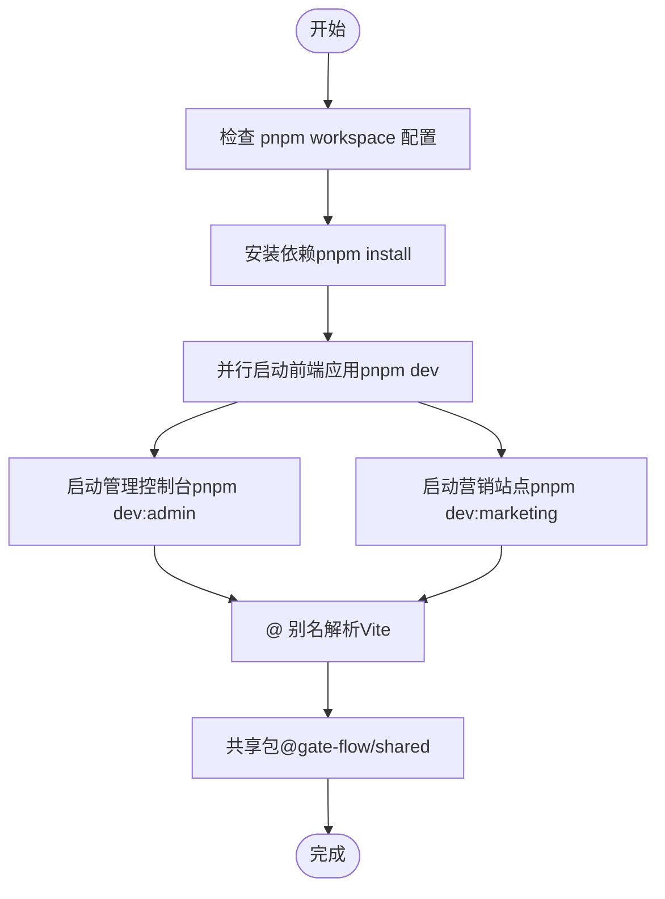
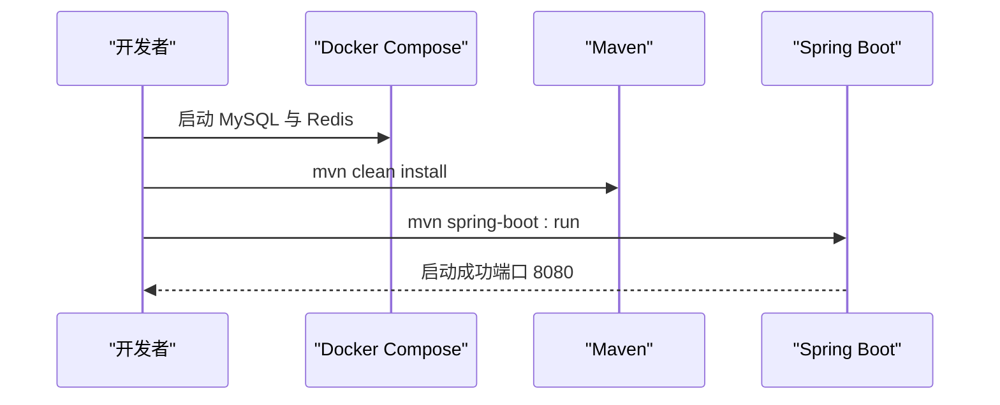
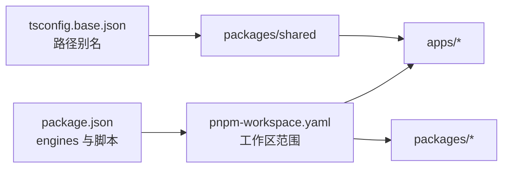

# 开发环境搭建

<cite>
**本文引用的文件**
- [package.json](file://package.json)
- [pnpm-workspace.yaml](file://pnpm-workspace.yaml)
- [README.md](file://README.md)
- [packages/shared/package.json](file://packages/shared/package.json)
- [packages/shared/vite.config.ts](file://packages/shared/vite.config.ts)
- [packages/shared/tsconfig.json](file://packages/shared/tsconfig.json)
- [tsconfig.base.json](file://tsconfig.base.json)
</cite>

## 目录
1. [引言](#引言)
2. [项目结构](#项目结构)
3. [核心组件](#核心组件)
4. [架构总览](#架构总览)
5. [详细组件分析](#详细组件分析)
6. [依赖分析](#依赖分析)
7. [性能考虑](#性能考虑)
8. [故障排查指南](#故障排查指南)
9. [结论](#结论)
10. [附录](#附录)

## 引言
本指南面向首次参与 GateFlow 项目的开发者，提供从零到一的完整开发环境搭建流程，涵盖前置软件要求、项目克隆与初始化、前端与后端的本地开发启动、Monorepo 工作区配置与并行开发、开发工具与质量保障（调试、测试）、以及常见问题排查。项目采用前后端分离架构，前端基于 React + TypeScript + Vite + pnpm Monorepo，后端基于 Spring Boot + Java 17 + Maven，并通过 Docker Compose 提供数据库与缓存等基础设施。

## 项目结构
GateFlow 采用 Monorepo 结构，使用 pnpm workspace 管理多个前端应用与共享包，同时保留独立的后端工程目录。关键目录与职责如下：
- apps/admin：管理控制台前端应用
- apps/marketing：营销站点前端应用
- packages/shared：共享组件库与工具集
- backend/victor-ab：后端微服务工程（Spring Boot）
- 顶层配置：工作区、包管理器、基础 TS 配置等

**图表来源**
- [pnpm-workspace.yaml:1-4](file://pnpm-workspace.yaml#L1-L4)
- [README.md:139-188](file://README.md#L139-L188)

**章节来源**
- [pnpm-workspace.yaml:1-4](file://pnpm-workspace.yaml#L1-L4)
- [README.md:139-188](file://README.md#L139-L188)

## 核心组件
- 包管理与引擎约束
  - Node.js 版本要求：>= 18
  - pnpm 版本要求：>= 9
  - 包管理器锁定：pnpm@10.24.0
- Monorepo 工作区
  - 工作区范围：packages/* 与 apps/*
  - 顶层脚本：统一并行开发、构建、类型检查与 Lint
- 基础 TypeScript 配置
  - 基础 tsconfig：严格模式、ESNext 模块解析、路径别名等
  - 共享包 tsconfig：继承基础配置并限定包含范围

**章节来源**
- [package.json:12-16](file://package.json#L12-L16)
- [package.json:4-11](file://package.json#L4-L11)
- [pnpm-workspace.yaml:1-4](file://pnpm-workspace.yaml#L1-L4)
- [tsconfig.base.json:1-23](file://tsconfig.base.json#L1-L23)
- [packages/shared/tsconfig.json:1-5](file://packages/shared/tsconfig.json#L1-L5)

## 架构总览
下图展示了 GateFlow 的整体架构与开发环境关系：前端应用通过 pnpm 并行启动，后端通过 Docker Compose 启动数据库与缓存，再由 Spring Boot 应用提供 API 服务；共享包在前端应用间复用。

**图表来源**
- [README.md:70-104](file://README.md#L70-L104)
- [README.md:192-249](file://README.md#L192-L249)

## 详细组件分析

### 前端应用与共享包
- 应用入口与开发脚本
  - apps/admin 与 apps/marketing 均通过 pnpm filter 精准启动
  - 顶层脚本支持并行启动所有前端应用
- 共享包
  - 导出多种子路径（tokens、hooks、utils、components），便于跨应用复用
  - 作为 peerDependencies 与 devDependencies 管理 React 生态依赖
- TypeScript 与 Vite 配置
  - 基础 tsconfig 提供严格编译选项与路径别名
  - 共享包 tsconfig 继承基础配置
  - Vite 配置提供 @ 别名解析

**图表来源**
- [package.json:4-11](file://package.json#L4-L11)
- [pnpm-workspace.yaml:1-4](file://pnpm-workspace.yaml#L1-L4)
- [packages/shared/package.json:15-19](file://packages/shared/package.json#L15-L19)
- [packages/shared/vite.config.ts:1-11](file://packages/shared/vite.config.ts#L1-L11)
- [packages/shared/tsconfig.json:1-5](file://packages/shared/tsconfig.json#L1-L5)
- [tsconfig.base.json:16-19](file://tsconfig.base.json#L16-L19)

**章节来源**
- [package.json:4-11](file://package.json#L4-L11)
- [pnpm-workspace.yaml:1-4](file://pnpm-workspace.yaml#L1-L4)
- [packages/shared/package.json:15-19](file://packages/shared/package.json#L15-L19)
- [packages/shared/vite.config.ts:1-11](file://packages/shared/vite.config.ts#L1-L11)
- [packages/shared/tsconfig.json:1-5](file://packages/shared/tsconfig.json#L1-L5)
- [tsconfig.base.json:16-19](file://tsconfig.base.json#L16-L19)

### 后端服务与数据库
- 启动流程
  - 进入 backend/victor-ab，使用 Docker Compose 启动 MySQL 与 Redis
  - 使用 Maven 编译并启动 Spring Boot Web 层
- 配置要点
  - 默认数据源与 Redis 地址可在 application.yml 中配置
  - 可通过环境变量覆盖数据源与缓存主机
- 端口与文档
  - 默认端口 8080，Swagger UI 与健康检查地址在 README 中给出

**图表来源**
- [README.md:229-248](file://README.md#L229-L248)

**章节来源**
- [README.md:229-248](file://README.md#L229-L248)

### 开发工具与质量保障
- 类型检查与 Lint
  - 顶层脚本统一执行类型检查与 Lint，便于在 Monorepo 中批量执行
- 测试
  - 前端：typecheck、lint
  - 后端：mvn test，支持按模块选择测试范围
- 端到端测试
  - 参考知识库中的端到端测试指南文档

**章节来源**
- [package.json:9-10](file://package.json#L9-L10)
- [README.md:370-394](file://README.md#L370-L394)

## 依赖分析
- 包管理器与工作区
  - pnpm workspace 将 apps 与 packages 视为工作区成员，实现依赖去重与跨包引用
  - 顶层 engines 字段声明 Node 与 pnpm 的最低版本
- TypeScript 路径映射
  - 基础 tsconfig 为共享包提供路径别名，简化导入
- 共享包导出
  - 通过 package.json 的 exports 字段暴露子路径，便于前端应用按需引入

**图表来源**
- [package.json:12-16](file://package.json#L12-L16)
- [pnpm-workspace.yaml:1-4](file://pnpm-workspace.yaml#L1-L4)
- [tsconfig.base.json:16-19](file://tsconfig.base.json#L16-L19)
- [packages/shared/package.json:8-14](file://packages/shared/package.json#L8-L14)

**章节来源**
- [package.json:12-16](file://package.json#L12-L16)
- [pnpm-workspace.yaml:1-4](file://pnpm-workspace.yaml#L1-L4)
- [tsconfig.base.json:16-19](file://tsconfig.base.json#L16-L19)
- [packages/shared/package.json:8-14](file://packages/shared/package.json#L8-L14)

## 性能考虑
- 并行开发
  - 使用 pnpm -r --parallel dev 同时启动多个前端应用，缩短等待时间
- 依赖去重
  - pnpm workspace 在 monorepo 中集中管理依赖，减少磁盘占用与安装时间
- 构建与类型检查
  - 将类型检查与 Lint 放入 CI 前置，避免在开发阶段反复等待

## 故障排查指南
- 前端依赖安装失败
  - 清理 pnpm store 缓存与 node_modules 后重装
- 数据库连接失败
  - 检查 MySQL 容器是否运行，查看容器日志定位问题
- Redis 连接失败
  - 检查 Redis 容器状态，使用 redis-cli 进行连通性测试
- 端口冲突
  - 修改相应配置文件中的端口设置以避免冲突

**章节来源**
- [README.md:474-510](file://README.md#L474-L510)

## 结论
通过本指南，您可以完成 GateFlow 的开发环境搭建与日常开发流程。建议优先确保 Node.js、pnpm、JDK、Maven、Docker 的版本满足要求，随后按照 Monorepo 的工作区与脚本进行并行开发。结合类型检查、Lint 与测试流程，持续提升代码质量与交付效率。

## 附录
- 快速开始（本地开发）
  - 克隆项目后，先安装依赖，再并行启动前端应用；进入 backend/victor-ab 启动数据库与缓存，最后启动 Spring Boot 应用
- 端口与服务
  - 前端：管理控制台与营销站点默认端口在 README 中给出
  - 后端：API 服务默认端口 8080，Swagger UI 与健康检查地址在 README 中给出

**章节来源**
- [README.md:192-249](file://README.md#L192-L249)