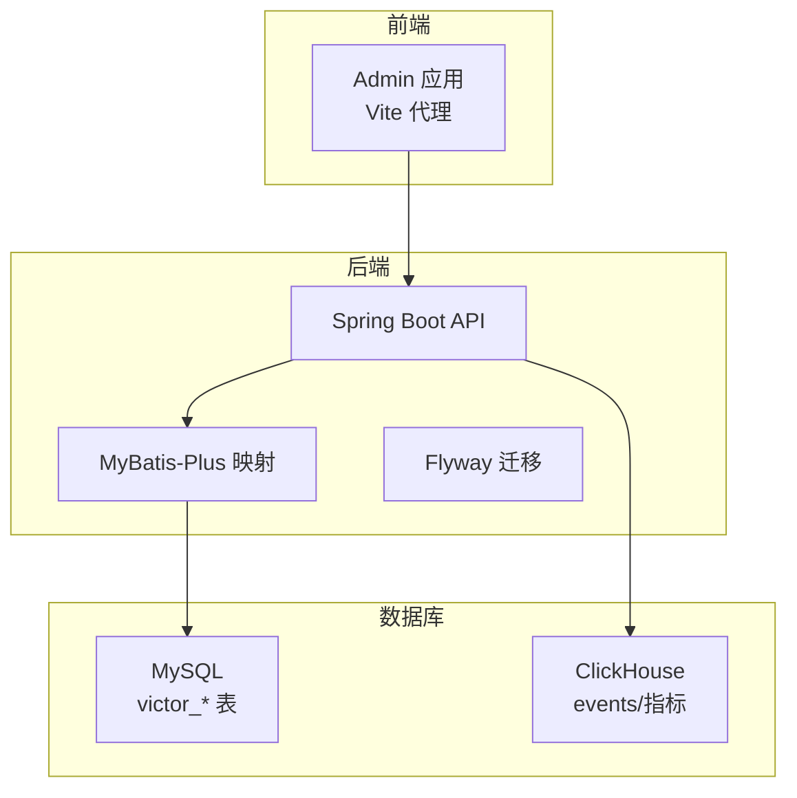
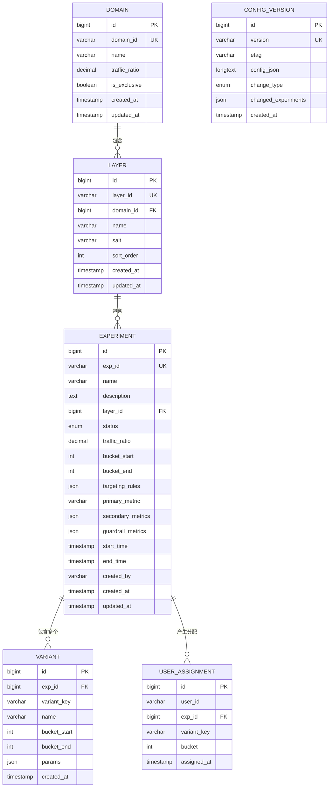
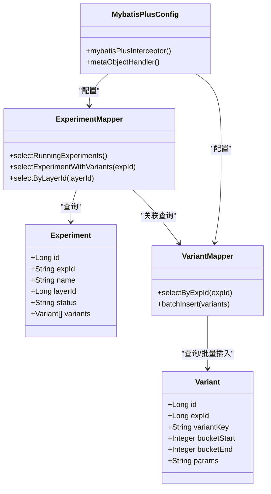
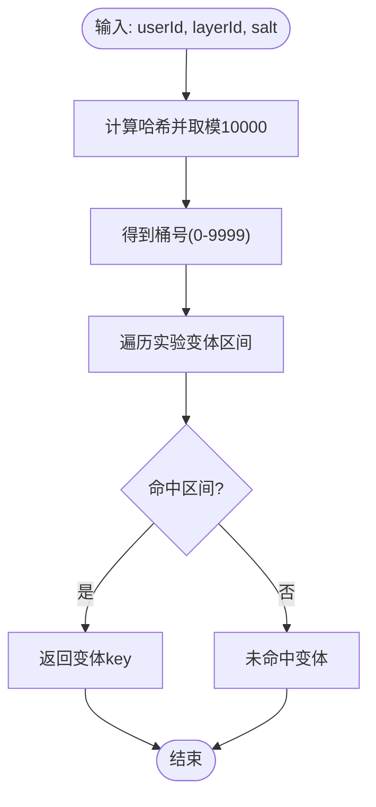
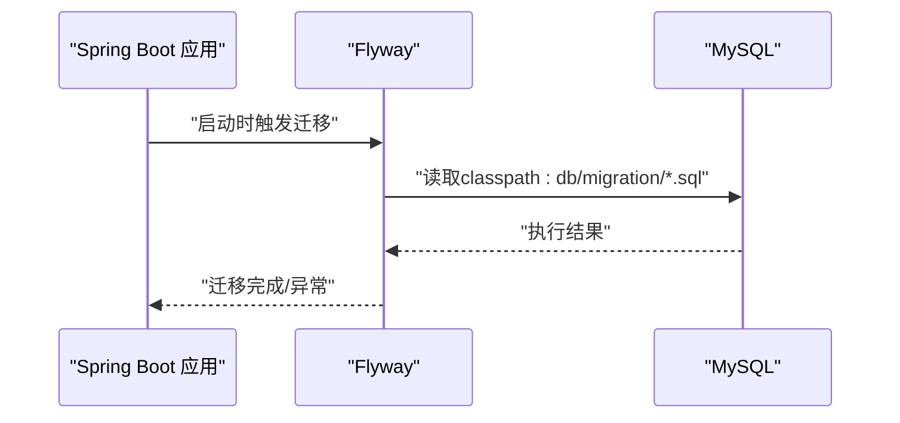
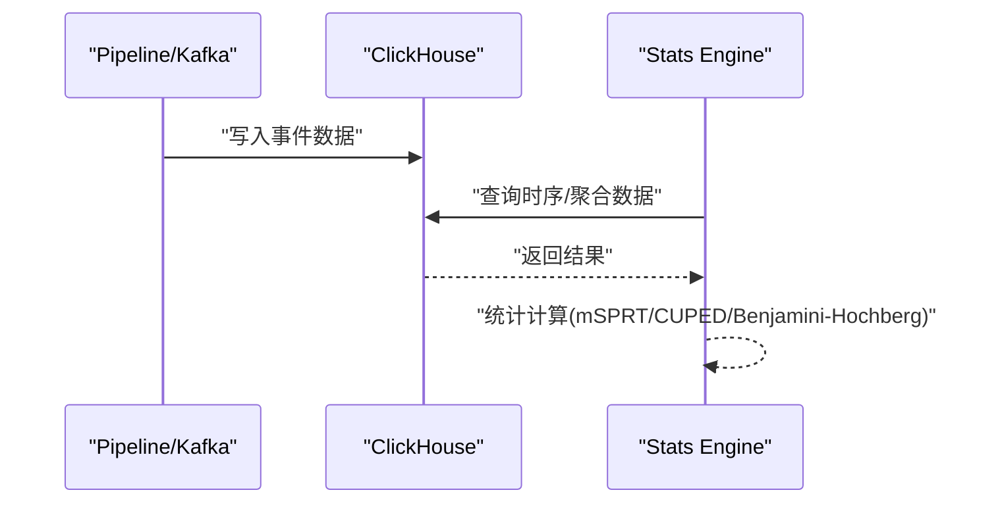
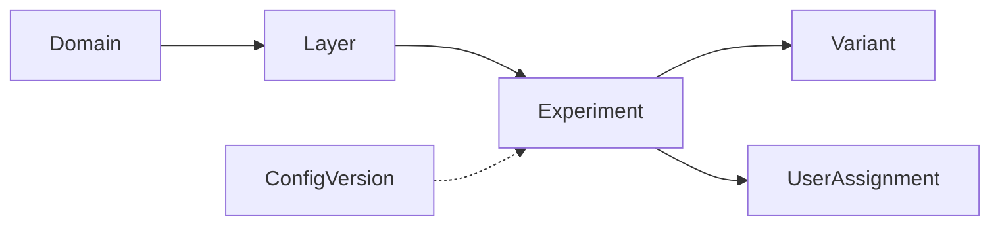

# 数据库设计

<cite>
**本文引用的文件**
- [implementation_plan.md](file://docs/ab/implementation_plan.md)
- [IMPLEMENTATION_SUMMARY.md](file://docs/ab/IMPLEMENTATION_SUMMARY.md)
- [SQL_REFACTORING_REPORT.md](file://docs/SQL_REFACTORING_REPORT.md)
- [MIGRATION_GUIDE.md](file://docs/MIGRATION_GUIDE.md)
- [README.md](file://README.md)
- [2026-05-05-victor-pipeline-stats-plan.md](file://docs/superpowers/plans/2026-05-05-victor-pipeline-stats-plan.md)
- [2026-05-05-victor-stats-engine-design.md](file://docs/superpowers/specs/2026-05-05-victor-stats-engine-design.md)
- [CLAUDE.md](file://CLAUDE.md)
</cite>

## 目录
1. [简介](#简介)
2. [项目结构](#项目结构)
3. [核心组件](#核心组件)
4. [架构总览](#架构总览)
5. [详细组件分析](#详细组件分析)
6. [依赖分析](#依赖分析)
7. [性能考量](#性能考量)
8. [故障排查指南](#故障排查指南)
9. [结论](#结论)
10. [附录](#附录)

## 简介
本文件面向GateFlow数据库设计，围绕AB实验平台的核心实体（Experiment、Variant、Layer、Domain、UserAssignment）给出完整的实体关系模型、规范化与反规范化策略、数据访问模式与ORM映射（MyBatis-Plus）、数据迁移与版本管理（Flyway）、性能优化（查询、索引、分区、缓存）以及数据安全与隐私保护（脱敏、访问控制、审计）。文档同时结合项目现有实现与规划，提供可落地的设计与运维建议。

## 项目结构
- 数据库层采用MySQL承载实验配置与分桶分配等核心数据；ClickHouse用于事件与指标存储，配合Kafka进行事件流处理。
- 后端使用Spring Boot + MyBatis-Plus，Flyway负责Schema迁移；前端通过Vite代理访问后端API。
- SQL脚本与迁移文件已规范化整理，便于维护与回溯。

**图表来源**
- [README.md:344-359](file://README.md#L344-L359)
- [2026-05-05-victor-pipeline-stats-plan.md:421-729](file://docs/superpowers/plans/2026-05-05-victor-pipeline-stats-plan.md#L421-L729)

**章节来源**
- [README.md:344-359](file://README.md#L344-L359)
- [SQL_REFACTORING_REPORT.md:1-338](file://docs/SQL_REFACTORING_REPORT.md#L1-L338)
- [MIGRATION_GUIDE.md:1-114](file://docs/MIGRATION_GUIDE.md#L1-L114)

## 核心组件
- Domain（域）：实验的逻辑边界与流量隔离单元，支持独占与流量比例配置。
- Layer（层）：在同一域内划分的正交流量层，用于避免跨层干扰。
- Experiment（实验）：实验配置与元数据，包含状态、时间窗口、指标与分桶范围。
- Variant（版本）：实验的变体集合，每个变体对应一个分桶区间与参数快照。
- UserAssignment（用户分桶记录）：记录用户被分配到的具体变体，用于审计与SRM检验。
- ConfigVersion（配置版本）：记录配置快照与变更追踪，支持全量/增量变更。

上述实体在实现中通过MyBatis-Plus实体类与Mapper接口映射，并在数据库层面建立外键与索引约束，保证一致性与查询效率。

**章节来源**
- [implementation_plan.md:226-474](file://docs/ab/implementation_plan.md#L226-L474)
- [implementation_plan.md:781-878](file://docs/ab/implementation_plan.md#L781-L878)

## 架构总览
下图展示GateFlow数据库层与后端的交互关系，包括实体表、索引与典型查询路径。

**图表来源**
- [implementation_plan.md:781-878](file://docs/ab/implementation_plan.md#L781-L878)

## 详细组件分析

### 实体与表设计
- Domain（域）
  - 主键：自增id
  - 业务键：domain_id唯一
  - 索引：idx_domain_id
  - 作用：定义流量边界与独占策略
- Layer（层）
  - 主键：自增id
  - 外键：domain_id -> Domain.id
  - 业务键：(layer_id, domain_id)唯一
  - 索引：idx_layer_id
  - 作用：在域内划分正交层，提供盐值与排序
- Experiment（实验）
  - 主键：自增id
  - 外键：layer_id -> Layer.id
  - 业务键：exp_id唯一
  - 索引：idx_exp_id, idx_status, idx_layer
  - 作用：实验元数据、状态、时间窗、指标与分桶范围
- Variant（版本）
  - 主键：自增id
  - 外键：exp_id -> Experiment.id
  - 业务键：(exp_id, variant_key)唯一
  - 索引：idx_exp_id
  - 作用：变体分桶区间与参数快照
- UserAssignment（用户分桶记录）
  - 主键：自增id
  - 索引：idx_user_exp, idx_exp_variant, idx_assigned_time
  - 作用：审计与SRM检验
- ConfigVersion（配置版本）
  - 主键：自增id
  - 业务键：version唯一
  - 索引：idx_version
  - 作用：配置快照与变更追踪

**章节来源**
- [implementation_plan.md:781-878](file://docs/ab/implementation_plan.md#L781-L878)

### 规范化与反规范化策略
- 规范化
  - 使用主键与外键约束保证参照完整性
  - 将变体从实验表中解耦至独立表，消除JSON冗余
  - 使用Domain/Layer分层隔离流量，避免跨层冲突
- 反规范化
  - 在Experiment中保留必要查询字段（如status、layer_id），提升查询效率
  - 在UserAssignment中记录variant_key与bucket，便于审计与统计
  - 在ConfigVersion中保存config_json快照，支持增量/全量变更追踪

**章节来源**
- [implementation_plan.md:781-878](file://docs/ab/implementation_plan.md#L781-L878)

### 数据访问模式与ORM映射（MyBatis-Plus）
- 实体映射
  - Experiment、Variant、ConfigVersion等通过注解映射到victor_*表
  - JSON字段使用类型处理器进行序列化/反序列化
- Mapper接口
  - ExperimentMapper：支持按状态、层ID查询，以及“实验+变体”一对多关联查询
  - VariantMapper：支持按实验批量查询与批量插入
  - ConfigVersionMapper：支持查询最新版本与版本后变更
- MyBatis-Plus配置
  - 分页插件：PaginationInnerInterceptor
  - 自动填充：MetaObjectHandler填充createdAt/updatedAt
- 查询优化技巧
  - 利用索引：exp_id、layer_id、status等
  - 关联查询：通过@Results/@Many实现延迟加载与批量查询
  - 批量操作：批量插入变体，减少往返

**图表来源**
- [implementation_plan.md:226-474](file://docs/ab/implementation_plan.md#L226-L474)

**章节来源**
- [implementation_plan.md:226-474](file://docs/ab/implementation_plan.md#L226-L474)

### 分桶算法与数据一致性
- 分桶引擎
  - 使用MurmurHash3对“userId#layerId#salt”进行哈希，取模10000得到0-9999桶号
  - 根据桶号在变体分桶区间内定位变体
- 一致性保障
  - 通过salt与层隔离，确保同一用户在同层内分桶稳定
  - UserAssignment记录分配结果，支持审计与SRM检验

**图表来源**
- [implementation_plan.md:891-926](file://docs/ab/implementation_plan.md#L891-L926)

**章节来源**
- [implementation_plan.md:891-926](file://docs/ab/implementation_plan.md#L891-L926)

### 数据迁移与版本管理（Flyway）
- 迁移脚本
  - V1__init_schema.sql：初始化Schema
  - V2__add_variant_versioning.sql：添加版本控制字段
- 迁移策略
  - 自动执行：应用启动时由Flyway执行
  - 版本编号：V1/V2/V3...
  - 不可逆变更：迁移脚本一旦执行不应修改，新增变更需新版本
- SQL脚本管理
  - 脚本已归档至backend/victor-ab/scripts/{seed,maintenance}/
  - 提供README与使用示例，支持种子数据与运维脚本

**图表来源**
- [SQL_REFACTORING_REPORT.md:158-170](file://docs/SQL_REFACTORING_REPORT.md#L158-L170)

**章节来源**
- [SQL_REFACTORING_REPORT.md:1-338](file://docs/SQL_REFACTORING_REPORT.md#L1-L338)
- [MIGRATION_GUIDE.md:1-114](file://docs/MIGRATION_GUIDE.md#L1-L114)

### ClickHouse事件存储与统计
- 存储层
  - ClickHouseConfig：JDBC连接配置
  - EventRecord：事件记录模型
  - EventRepository：事件写入与查询接口
- 数据流
  - Pipeline通过REST/Kafka写入ClickHouse
  - Stats模块基于ClickHouse数据进行统计分析（mSPRT、CUPED、多重比较校正）

**图表来源**
- [2026-05-05-victor-pipeline-stats-plan.md:421-729](file://docs/superpowers/plans/2026-05-05-victor-pipeline-stats-plan.md#L421-L729)
- [2026-05-05-victor-stats-engine-design.md:990-1026](file://docs/superpowers/specs/2026-05-05-victor-stats-engine-design.md#L990-L1026)

**章节来源**
- [2026-05-05-victor-pipeline-stats-plan.md:421-729](file://docs/superpowers/plans/2026-05-05-victor-pipeline-stats-plan.md#L421-L729)
- [2026-05-05-victor-stats-engine-design.md:990-1026](file://docs/superpowers/specs/2026-05-05-victor-stats-engine-design.md#L990-L1026)

## 依赖分析
- 组件耦合
  - Experiment依赖Layer；Variant依赖Experiment；UserAssignment依赖Experiment
  - ConfigVersion独立存在，用于配置快照与变更追踪
- 外部依赖
  - MySQL：持久化核心数据
  - ClickHouse：事件与指标存储
  - Kafka：事件流传输
  - Redis：缓存（后端配置中可见）

**图表来源**
- [implementation_plan.md:781-878](file://docs/ab/implementation_plan.md#L781-L878)

**章节来源**
- [implementation_plan.md:781-878](file://docs/ab/implementation_plan.md#L781-L878)
- [README.md:344-359](file://README.md#L344-L359)

## 性能考量
- 查询优化
  - 为高频过滤字段建立索引：exp_id、layer_id、status、user_id、exp_id+variant_key、assigned_at
  - 使用分页插件限制结果集大小
  - 关联查询采用延迟加载与批量查询，避免N+1
- 索引设计
  - 唯一索引：domain_id、layer_id+domain_id、exp_id、exp_id+variant_key、version
  - 复合索引：user_id+exp_id、exp_id+variant_key、assigned_at
- 分区策略
  - 建议按assigned_at或created_at进行分区（月/周），缩短扫描范围
- 缓存机制
  - Redis用于热点配置与分桶结果缓存（参考后端配置）
  - 缓存失效策略：配置变更时主动失效
- 写入优化
  - 批量插入变体，减少往返
  - 生产环境可考虑移除外键约束，改为服务层校验，提升写入吞吐

**章节来源**
- [implementation_plan.md:781-878](file://docs/ab/implementation_plan.md#L781-L878)
- [implementation_plan.md:226-474](file://docs/ab/implementation_plan.md#L226-L474)
- [README.md:344-359](file://README.md#L344-L359)

## 故障排查指南
- SQL脚本执行
  - 使用scripts/README.md查看脚本分类与使用说明
  - 种子脚本可重复执行；运维脚本需在事务中执行并审批
- 迁移问题
  - 确认Flyway迁移脚本命名与版本号规范
  - 若迁移失败，检查数据库权限与脚本语法
- 数据一致性
  - 核对Domain/Layer/Experiment/Variant的外键关系
  - 检查UserAssignment的索引与数据完整性
- ClickHouse集成
  - 确认ClickHouse JDBC配置与表结构
  - 校验事件写入与查询路径

**章节来源**
- [SQL_REFACTORING_REPORT.md:128-312](file://docs/SQL_REFACTORING_REPORT.md#L128-L312)
- [2026-05-05-victor-pipeline-stats-plan.md:421-729](file://docs/superpowers/plans/2026-05-05-victor-pipeline-stats-plan.md#L421-L729)

## 结论
GateFlow数据库设计遵循“规范化+适度反规范化”的原则，通过Domain/Layer分层隔离、Experiment/Variant解耦与UserAssignment审计记录，形成清晰的实体关系与高效的查询路径。结合Flyway迁移、MyBatis-Plus ORM与ClickHouse事件存储，系统具备良好的可维护性、扩展性与性能表现。建议在生产环境中进一步完善分区与缓存策略，并持续优化索引与批处理写入以提升吞吐。

## 附录
- 配置要点
  - 数据源：MySQL victor_experiment
  - Redis：本地或容器
  - Flyway：classpath:db/migration
  - OpenAPI/Swagger：/v3/api-docs、/swagger-ui.html
- 开发与运维
  - 使用scripts目录下的脚本进行初始化与运维
  - 通过Vite代理访问后端API，确保开发环境连通性

**章节来源**
- [README.md:344-359](file://README.md#L344-L359)
- [CLAUDE.md:111-135](file://CLAUDE.md#L111-L135)
- [IMPLEMENTATION_SUMMARY.md:203-234](file://docs/ab/IMPLEMENTATION_SUMMARY.md#L203-L234)