# 最佳实践

<cite>
**本文引用的文件**
- [README.md](file://README.md)
- [package.json](file://package.json)
- [pnpm-workspace.yaml](file://pnpm-workspace.yaml)
- [tsconfig.base.json](file://tsconfig.base.json)
- [packages/shared/package.json](file://packages/shared/package.json)
- [docs/knowledge/04-best-practices/WINDOWS_COMMANDS.md](file://docs/knowledge/04-best-practices/WINDOWS_COMMANDS.md)
- [docs/ab/IMPLEMENTATION_SUMMARY.md](file://docs/ab/IMPLEMENTATION_SUMMARY.md)
- [docs/MIGRATION_GUIDE.md](file://docs/MIGRATION_GUIDE.md)
- [docs/SQL_REFACTORING_REPORT.md](file://docs/SQL_REFACTORING_REPORT.md)
- [docs/knowledge/README.md](file://docs/knowledge/README.md)
- [docs/knowledge/07-test-rule/E2E_TESTING_GUIDE.md](file://docs/knowledge/07-test-rule/E2E_TESTING_GUIDE.md)
</cite>

## 目录
1. [简介](#简介)
2. [项目结构](#项目结构)
3. [核心组件](#核心组件)
4. [架构总览](#架构总览)
5. [详细组件分析](#详细组件分析)
6. [依赖关系分析](#依赖关系分析)
7. [性能考量](#性能考量)
8. [故障排查指南](#故障排查指南)
9. [结论](#结论)
10. [附录](#附录)

## 简介
本指南面向GateFlow项目的开发与运维团队，系统化梳理并沉淀开发与运维最佳实践，涵盖代码规范、性能优化、安全防护、维护升级、团队协作与实用技巧等维度，帮助团队在高质量交付的同时，持续提升研发效率与系统稳定性。

## 项目结构
- 前端采用Monorepo，包含管理控制台与营销站点两个应用，以及共享组件库；通过pnpm workspace统一管理。
- 后端采用多模块结构，围绕实验管理、分桶引擎、统计分析、数据管道、Web层等职责划分模块，便于演进与扩展。
- 文档知识库按主题分层组织，支持面向Agent的渐进式加载与检索。

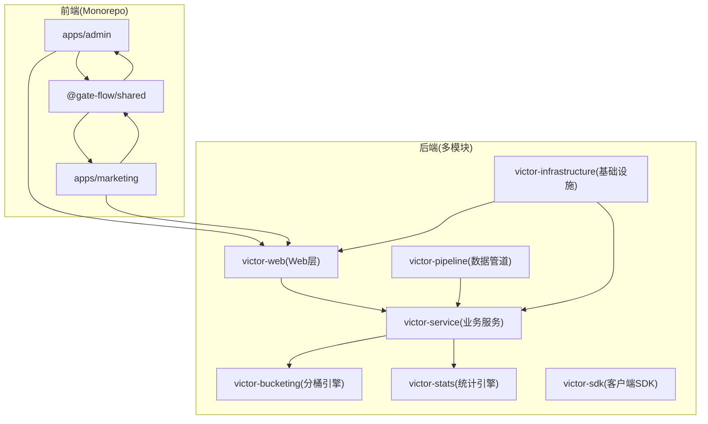

**图表来源**
- [README.md: 137-188:137-188](file://README.md#L137-L188)
- [pnpm-workspace.yaml: 1-4:1-4](file://pnpm-workspace.yaml#L1-L4)

**章节来源**
- [README.md: 137-188:137-188](file://README.md#L137-L188)
- [pnpm-workspace.yaml: 1-4:1-4](file://pnpm-workspace.yaml#L1-L4)
- [package.json: 1-18:1-18](file://package.json#L1-L18)

## 核心组件
- 前端应用与共享库
  - 管理控制台与营销站点分别位于apps/admin与apps/marketing，共享组件库位于packages/shared，统一设计令牌、工具函数与通用组件。
  - TypeScript基础配置通过tsconfig.base.json集中管理，支持路径别名与严格模式。
- 后端模块化架构
  - Web层负责REST API，业务服务封装领域逻辑，分桶引擎与统计引擎提供核心算法能力，数据管道对接事件流与分析存储，基础设施模块承载数据库迁移、缓存与外部依赖。
- 文档知识库
  - 采用面向Agent设计的知识库结构，按主题分目录组织，支持按需加载与关键词检索，便于沉淀业务规则、开发规范、排坑记录与测试规范。

**章节来源**
- [packages/shared/package.json: 1-36:1-36](file://packages/shared/package.json#L1-L36)
- [tsconfig.base.json: 1-23:1-23](file://tsconfig.base.json#L1-L23)
- [README.md: 137-188:137-188](file://README.md#L137-L188)
- [docs/knowledge/README.md: 1-94:1-94](file://docs/knowledge/README.md#L1-L94)

## 架构总览
- 前后端分离，前端通过Vite代理转发至后端服务；后端通过Spring Boot提供REST API，结合MyBatis-Plus进行数据访问，Kafka与ClickHouse支撑事件流与实时分析。
- 基础设施层包含MySQL、Redis、Kafka、ClickHouse与SDK/API，满足实验平台的高可用与高性能需求。

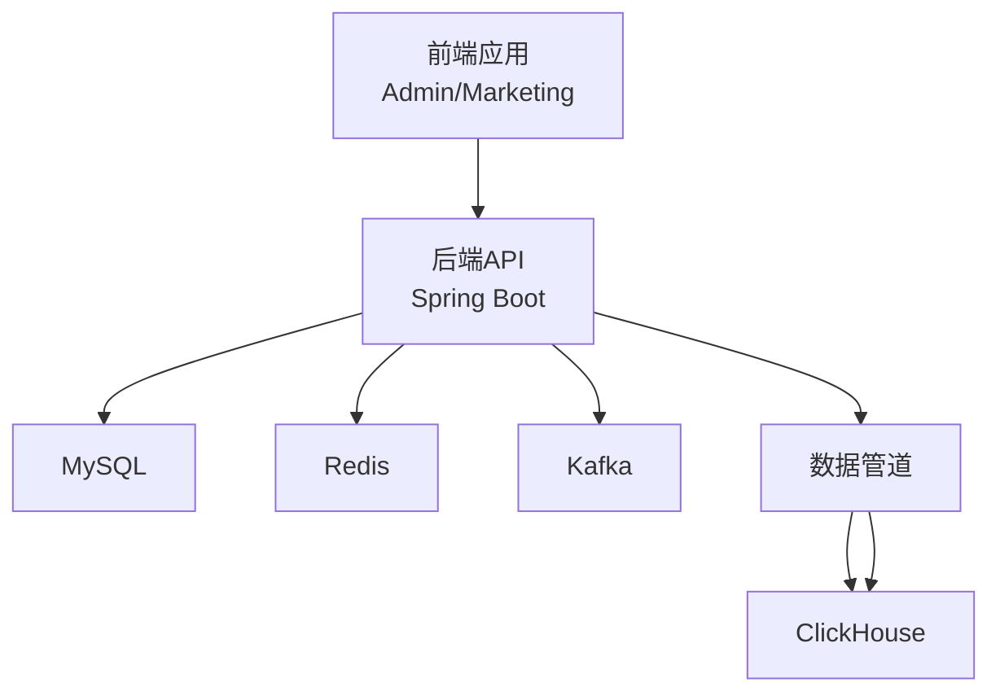

**图表来源**
- [README.md: 70-136:70-136](file://README.md#L70-L136)

**章节来源**
- [README.md: 70-136:70-136](file://README.md#L70-L136)

## 详细组件分析

### 前端TypeScript规范与工程化
- 命名与结构
  - 组件命名采用PascalCase，文件命名采用kebab-case；页面、布局、组件、状态管理与Mock数据分层清晰。
  - 共享组件库通过package.json的exports字段暴露子路径，便于按需引入。
- 类型与配置
  - 严格模式开启，路径别名配置在tsconfig.base.json中集中管理，避免相对路径混乱。
- 工具链
  - pnpm workspace统一管理依赖与脚本，根目录package.json提供并行开发与构建命令，支持按应用筛选执行。

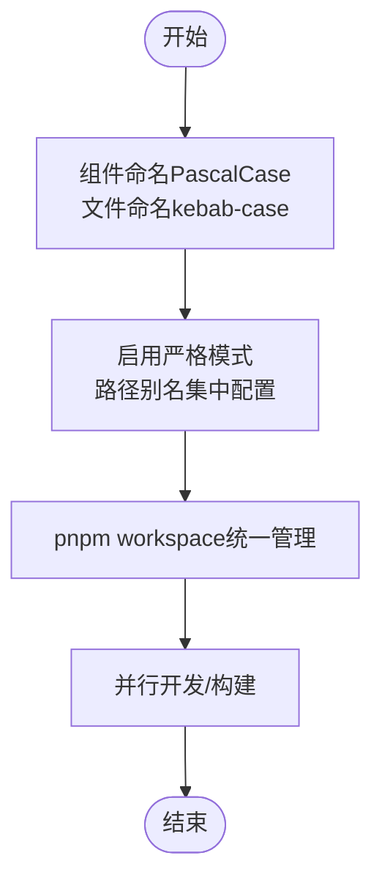

**图表来源**
- [README.md: 439-452:439-452](file://README.md#L439-L452)
- [packages/shared/package.json: 8-14:8-14](file://packages/shared/package.json#L8-L14)
- [tsconfig.base.json: 16-19:16-19](file://tsconfig.base.json#L16-L19)
- [package.json: 4-11:4-11](file://package.json#L4-L11)

**章节来源**
- [README.md: 439-452:439-452](file://README.md#L439-L452)
- [packages/shared/package.json: 1-36:1-36](file://packages/shared/package.json#L1-L36)
- [tsconfig.base.json: 1-23:1-23](file://tsconfig.base.json#L1-L23)
- [package.json: 1-18:1-18](file://package.json#L1-L18)

### 后端Java编码规范与模块化
- 规范与工具
  - 遵循阿里巴巴Java开发手册，使用Lombok简化代码，MapStruct进行对象映射，统一异常处理，确保代码一致性与可维护性。
- 模块划分
  - Web层、业务服务、分桶引擎、统计引擎、数据管道、基础设施与SDK按职责解耦，便于独立演进与测试。

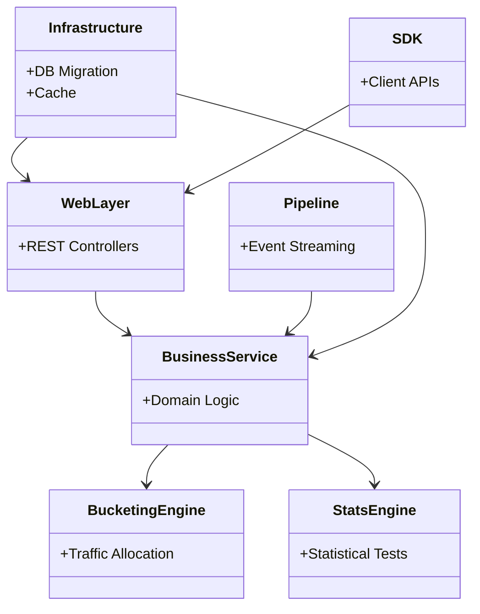

**图表来源**
- [README.md: 170-188:170-188](file://README.md#L170-L188)

**章节来源**
- [README.md: 447-452:447-452](file://README.md#L447-L452)
- [README.md: 170-188:170-188](file://README.md#L170-L188)

### Git提交规范与分支管理策略
- 分支策略
  - main：生产环境代码；develop：开发分支；feature/*：功能分支；hotfix/*：热修复分支。
- 提交类型
  - feat、fix、docs、style、refactor、test、chore等，确保提交信息清晰可追溯。

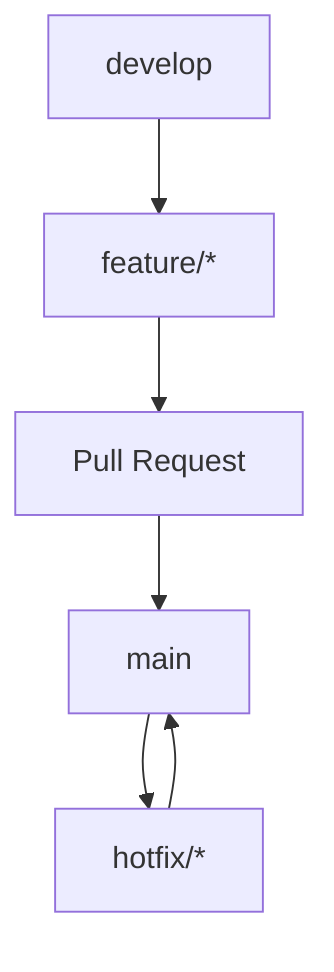

**图表来源**
- [README.md: 453-470:453-470](file://README.md#L453-L470)

**章节来源**
- [README.md: 453-470:453-470](file://README.md#L453-L470)

### 性能优化最佳实践
- 前端性能
  - 通过Vite代理与合理的组件拆分降低首屏时间；在大型组件重构时考虑拆分为独立文件，逐步替换以避免一次性大改动。
- 后端性能
  - 结合数据库迁移与Flyway版本化管理，确保Schema演进可控；合理使用缓存（本地Caffeine与分布式Redis）降低热点查询压力。
- 数据库与缓存
  - SQL文件整理归档，建立Seed、Maintenance、Flyway与Docker Init四类脚本目录，明确使用场景与最佳实践；维护脚本需在事务中执行并遵循审批流程。

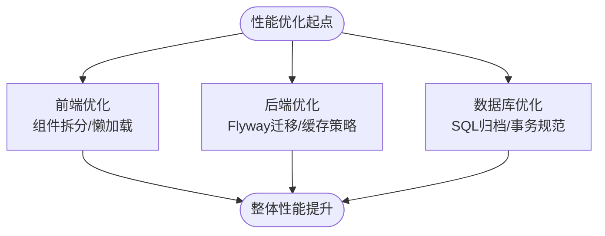

**图表来源**
- [docs/ab/IMPLEMENTATION_SUMMARY.md: 285-298:285-298](file://docs/ab/IMPLEMENTATION_SUMMARY.md#L285-L298)
- [docs/SQL_REFACTORING_REPORT.md: 128-178:128-178](file://docs/SQL_REFACTORING_REPORT.md#L128-L178)

**章节来源**
- [docs/ab/IMPLEMENTATION_SUMMARY.md: 285-298:285-298](file://docs/ab/IMPLEMENTATION_SUMMARY.md#L285-L298)
- [docs/SQL_REFACTORING_REPORT.md: 128-178:128-178](file://docs/SQL_REFACTORING_REPORT.md#L128-L178)

### 安全考虑与防护措施
- 输入验证与API安全
  - 前端与后端均需进行严格的输入验证与参数校验；后端通过统一异常处理与状态机约束（如实验状态转换）降低非法操作风险。
- CORS与跨域
  - 开发阶段允许多端口Origin，生产环境使用具体域名并限制Headers与Methods，避免过度宽松导致的安全隐患。
- 数据一致性与审计
  - 通过版本控制与活跃版本标记，确保实验配置变更可追溯；结合审计日志与合规记录，满足合规要求。

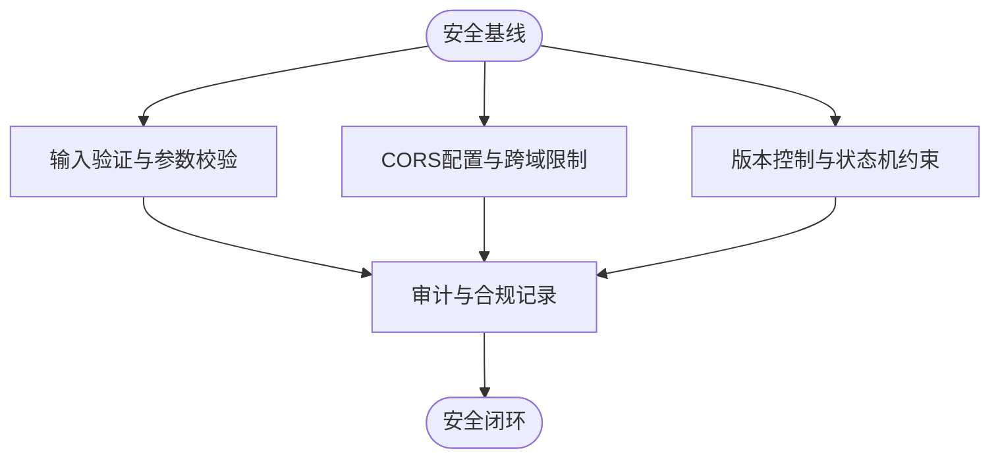

**图表来源**
- [docs/knowledge/07-test-rule/E2E_TESTING_GUIDE.md: 187-227:187-227](file://docs/knowledge/07-test-rule/E2E_TESTING_GUIDE.md#L187-L227)
- [docs/knowledge/07-test-rule/E2E_TESTING_GUIDE.md: 560-590:560-590](file://docs/knowledge/07-test-rule/E2E_TESTING_GUIDE.md#L560-L590)

**章节来源**
- [docs/knowledge/07-test-rule/E2E_TESTING_GUIDE.md: 187-227:187-227](file://docs/knowledge/07-test-rule/E2E_TESTING_GUIDE.md#L187-L227)
- [docs/knowledge/07-test-rule/E2E_TESTING_GUIDE.md: 560-590:560-590](file://docs/knowledge/07-test-rule/E2E_TESTING_GUIDE.md#L560-L590)

### 维护指南与升级策略
- 目录与命名迁移
  - 通过目录重命名迁移统一命名规范，确保包名与导入路径不受影响，提供验证清单与回滚方案，降低迁移风险。
- SQL脚本管理
  - 将散落的SQL文件归类到scripts/seed、scripts/maintenance等目录，配套README说明使用场景与最佳实践，确保可维护性与可追溯性。
- 版本升级与依赖更新
  - 采用语义化版本与分支策略，配合自动化测试与截图验证，确保升级过程可验证、可回滚。

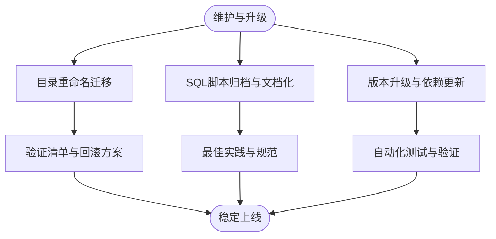

**图表来源**
- [docs/MIGRATION_GUIDE.md: 1-114:1-114](file://docs/MIGRATION_GUIDE.md#L1-L114)
- [docs/SQL_REFACTORING_REPORT.md: 1-338:1-338](file://docs/SQL_REFACTORING_REPORT.md#L1-L338)

**章节来源**
- [docs/MIGRATION_GUIDE.md: 1-114:1-114](file://docs/MIGRATION_GUIDE.md#L1-L114)
- [docs/SQL_REFACTORING_REPORT.md: 1-338:1-338](file://docs/SQL_REFACTORING_REPORT.md#L1-L338)

### 团队协作与项目管理最佳实践
- 文档知识库
  - 采用编号子目录组织知识，支持按需渐进加载与关键词匹配；新增文档需遵循模板与命名规范，便于Agent检索与复用。
- 测试规范
  - 建立前后端端到端测试流程，包含后端API测试、前端集成测试与端到端联调，配套测试清单与常见问题排查，确保质量门禁。
- 代码审查与协作
  - 通过分支策略与PR流程，结合测试验证与截图记录，形成可追溯、可复现的协作闭环。

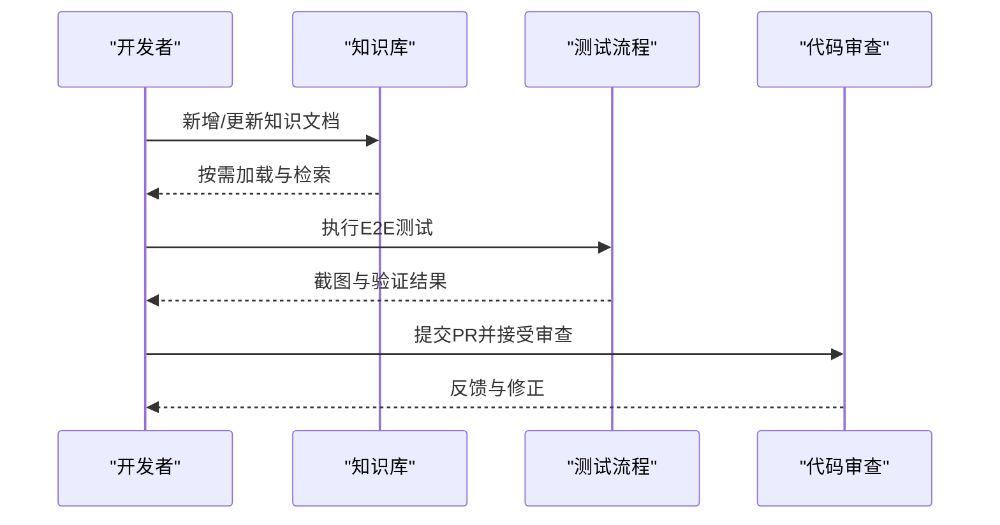

**图表来源**
- [docs/knowledge/README.md: 16-94:16-94](file://docs/knowledge/README.md#L16-L94)
- [docs/knowledge/07-test-rule/E2E_TESTING_GUIDE.md: 16-130:16-130](file://docs/knowledge/07-test-rule/E2E_TESTING_GUIDE.md#L16-L130)

**章节来源**
- [docs/knowledge/README.md: 1-94:1-94](file://docs/knowledge/README.md#L1-L94)
- [docs/knowledge/07-test-rule/E2E_TESTING_GUIDE.md: 16-130:16-130](file://docs/knowledge/07-test-rule/E2E_TESTING_GUIDE.md#L16-L130)

### 实用开发技巧（Windows命令行）
- curl与进程管理
  - 在Windows CMD中使用完整路径调用curl，避免管道处理JSON；使用netstat与taskkill进行端口占用与进程终止。
- pnpm与路径切换
  - 优先使用pnpm workspace语法在根目录统一执行命令；若使用cd，避免链式命令，使用^连接多行命令。
- PowerShell与PowerShell命令
  - 需要时使用powershell -Command前缀执行PowerShell命令；注意与CMD命令的差异。

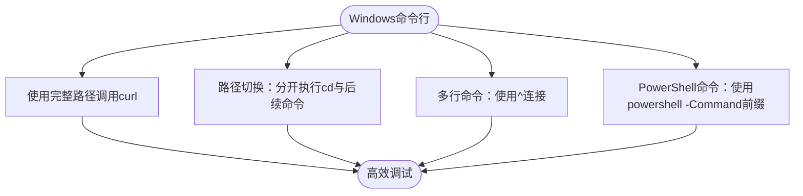

**图表来源**
- [docs/knowledge/04-best-practices/WINDOWS_COMMANDS.md: 8-214:8-214](file://docs/knowledge/04-best-practices/WINDOWS_COMMANDS.md#L8-L214)

**章节来源**
- [docs/knowledge/04-best-practices/WINDOWS_COMMANDS.md: 8-214:8-214](file://docs/knowledge/04-best-practices/WINDOWS_COMMANDS.md#L8-L214)

## 依赖关系分析
- 前端依赖
  - packages/shared作为共享库，被apps/admin与apps/marketing共同依赖；其package.json声明了exports子路径，便于按需引入。
- 工作区与脚本
  - pnpm-workspace.yaml声明了packages与apps两个工作区，根目录package.json提供并行开发与构建脚本，支持按应用筛选执行。

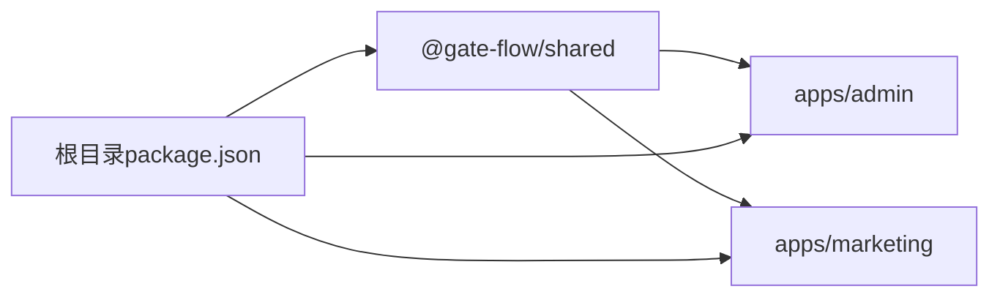

**图表来源**
- [packages/shared/package.json: 8-14:8-14](file://packages/shared/package.json#L8-L14)
- [pnpm-workspace.yaml: 1-4:1-4](file://pnpm-workspace.yaml#L1-L4)
- [package.json: 4-11:4-11](file://package.json#L4-L11)

**章节来源**
- [packages/shared/package.json: 1-36:1-36](file://packages/shared/package.json#L1-L36)
- [pnpm-workspace.yaml: 1-4:1-4](file://pnpm-workspace.yaml#L1-L4)
- [package.json: 1-18:1-18](file://package.json#L1-L18)

## 性能考量
- 前端性能优化建议
  - 生产环境构建优化、图表数据降采样、React.memo减少重渲染、虚拟滚动（版本历史>100条时）等，以降低渲染与网络开销。
- 后端性能优化建议
  - Flyway迁移确保Schema演进可控，缓存策略结合本地Caffeine与分布式Redis，减少热点查询压力。
- 数据库与缓存策略
  - SQL脚本分类与文档化，明确Seed、Maintenance、Flyway与Docker Init的使用场景；维护脚本在事务中执行并遵循审批流程，确保数据一致性与可回溯性。

**章节来源**
- [docs/ab/IMPLEMENTATION_SUMMARY.md: 285-298:285-298](file://docs/ab/IMPLEMENTATION_SUMMARY.md#L285-L298)
- [docs/SQL_REFACTORING_REPORT.md: 128-178:128-178](file://docs/SQL_REFACTORING_REPORT.md#L128-L178)

## 故障排查指南
- 常见问题与处理
  - 前端依赖安装失败：清除缓存后重新安装；前端端口冲突：修改配置文件端口；后端数据库/Redis连接失败：检查容器状态与日志。
- 端到端测试与验证
  - 通过curl验证后端API，Browser Agent截图记录前端关键步骤，对比数据一致性，确保问题可复现与可修复。

**章节来源**
- [README.md: 474-511:474-511](file://README.md#L474-L511)
- [docs/knowledge/07-test-rule/E2E_TESTING_GUIDE.md: 509-590:509-590](file://docs/knowledge/07-test-rule/E2E_TESTING_GUIDE.md#L509-L590)

## 结论
本最佳实践指南基于GateFlow项目现状，系统化沉淀了开发与运维的关键规范与方法论。通过统一的代码规范、完善的性能优化策略、严格的安全防护、稳健的维护升级流程与高效的团队协作机制，团队可在保证质量的前提下持续迭代，稳步提升系统的稳定性与可维护性。

## 附录
- 快速参考
  - Windows命令行：使用完整路径调用curl，避免链式命令，必要时使用powershell -Command前缀。
  - 目录重命名迁移：提供验证清单与回滚方案，确保升级过程可验证、可回滚。
  - SQL脚本管理：建立四类脚本目录与详细文档，明确使用场景与最佳实践。

**章节来源**
- [docs/knowledge/04-best-practices/WINDOWS_COMMANDS.md: 146-214:146-214](file://docs/knowledge/04-best-practices/WINDOWS_COMMANDS.md#L146-L214)
- [docs/MIGRATION_GUIDE.md: 58-80:58-80](file://docs/MIGRATION_GUIDE.md#L58-L80)
- [docs/SQL_REFACTORING_REPORT.md: 39-50:39-50](file://docs/SQL_REFACTORING_REPORT.md#L39-L50)