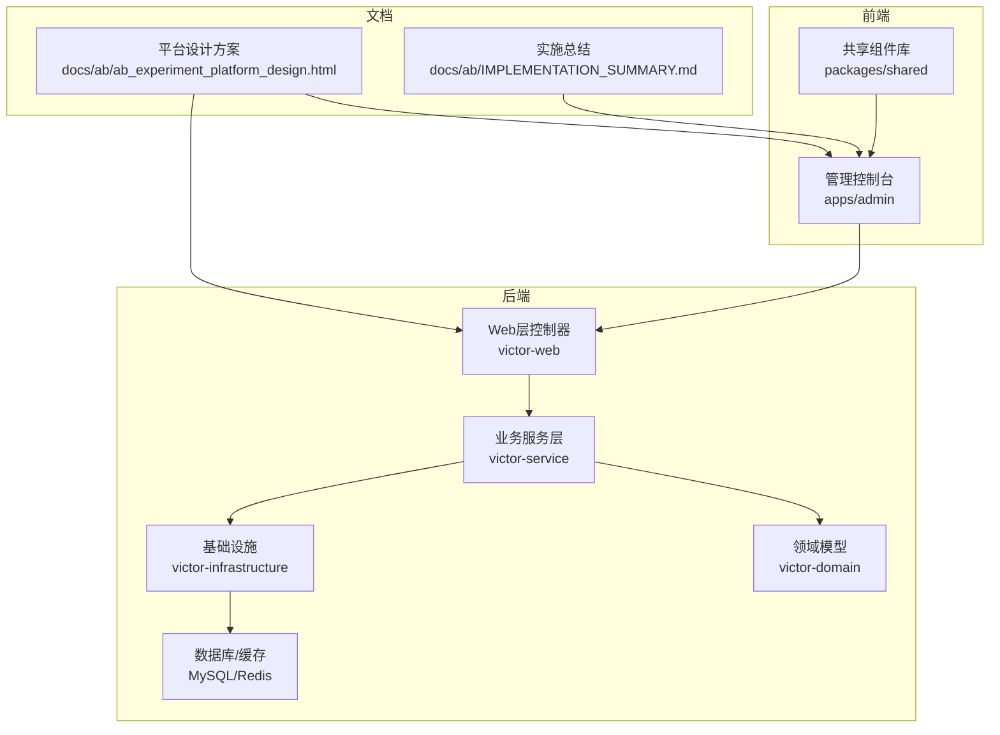
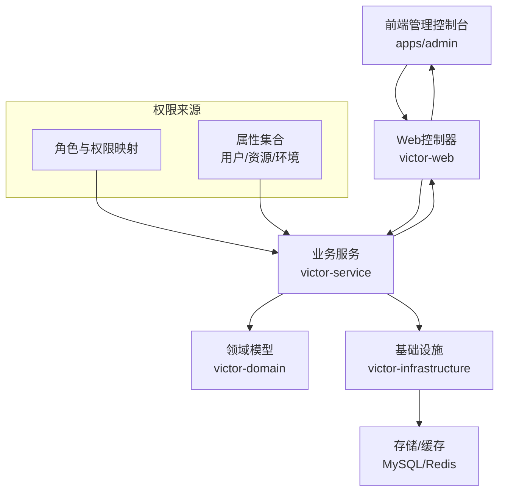
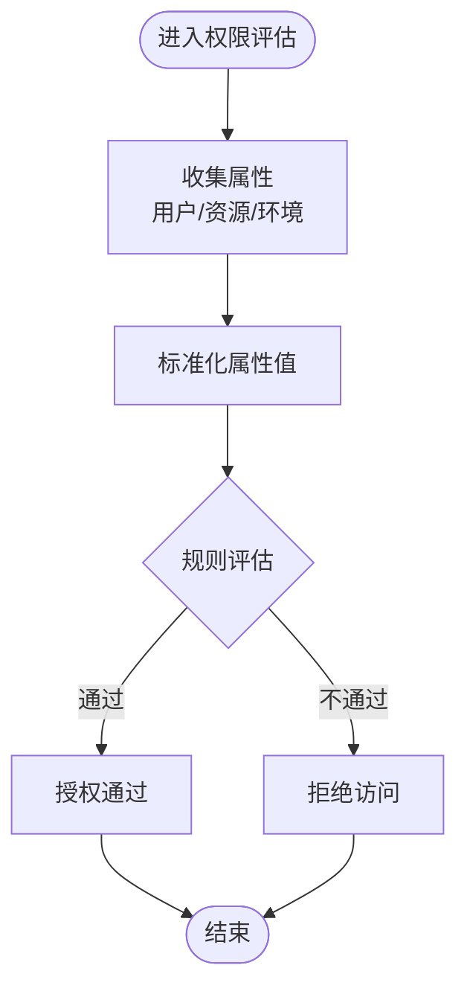
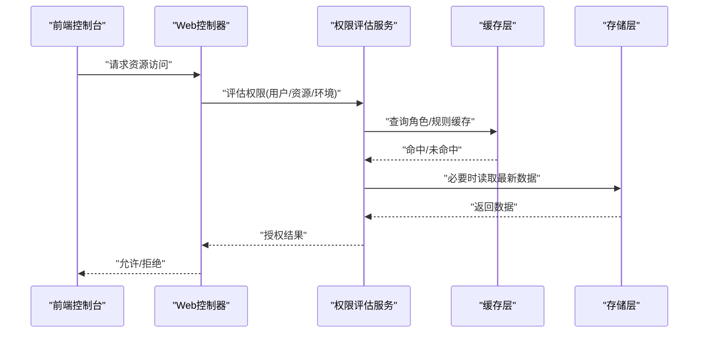
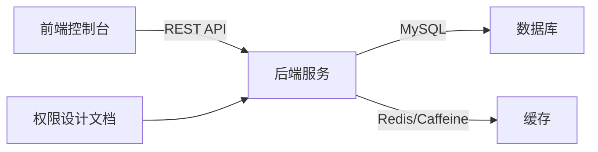

# RBAC + ABAC权限模型

<cite>
**本文引用的文件**
- [README.md](file://README.md)
- [ab_experiment_platform_design.html](file://docs/ab/ab_experiment_platform_design.html)
- [IMPLEMENTATION_SUMMARY.md](file://docs/ab/IMPLEMENTATION_SUMMARY.md)
</cite>

## 目录
1. [引言](#引言)
2. [项目结构](#项目结构)
3. [核心组件](#核心组件)
4. [架构总览](#架构总览)
5. [详细组件分析](#详细组件分析)
6. [依赖分析](#依赖分析)
7. [性能考虑](#性能考虑)
8. [故障排查指南](#故障排查指南)
9. [结论](#结论)
10. [附录](#附录)

## 引言
本文件围绕GateFlow平台的“RBAC + ABAC混合权限模型”进行系统化技术文档整理，结合项目现有资料，阐述RBAC与ABAC的设计理念、实现原理、应用场景与混合优势，并给出角色定义、权限映射、属性判断、评估算法、缓存与性能优化等实现要点与实践建议。文档同时提供权限配置示例与排障指引，帮助读者在不直接阅读源码的情况下掌握该权限体系。

## 项目结构
GateFlow采用前后端分离架构，权限模型作为平台“权限与协作”的核心能力之一，贯穿前端控制台与后端服务。根据项目README与文档，权限模型与以下模块密切相关：
- 前端管理控制台：负责权限相关的界面与交互
- 后端服务（Victor）：承载权限评估、策略执行与数据持久化
- 文档与知识库：提供权限矩阵、角色定义与ABAC属性说明

**图表来源**
- [README.md:70-188](file://README.md#L70-L188)
- [README.md:272-331](file://README.md#L272-L331)

**章节来源**
- [README.md:61-67](file://README.md#L61-L67)
- [README.md:137-188](file://README.md#L137-L188)

## 核心组件
- RBAC基础角色与权限矩阵：平台提供“超级管理员、平台管理员、数据科学家、部门管理员、产品经理、分析师、工程师、管理、访客”等角色，覆盖实验全生命周期的关键操作，并以权限矩阵明确各角色对核心功能的访问范围。
- ABAC动态权限：基于业务线属性、数据敏感度、实验状态、用户职级等属性维度，对RBAC进行补充与细化，实现“按人、按事、按时”的细粒度授权。
- 混合模型优势：RBAC提供清晰的角色与权限映射，简化管理；ABAC提供灵活的动态判断，满足复杂场景需求。

**章节来源**
- [ab_experiment_platform_design.html:572-665](file://docs/ab/ab_experiment_platform_design.html#L572-L665)
- [README.md:61-67](file://README.md#L61-L67)

## 架构总览
下图展示了权限模型在系统中的位置与交互关系：前端控制台发起权限相关操作，后端通过控制器接收请求，业务服务层执行权限评估与策略判定，基础设施层提供存储与缓存，最终返回授权结果或执行动作。

**图表来源**
- [README.md:170-188](file://README.md#L170-L188)
- [README.md:342-367](file://README.md#L342-L367)

## 详细组件分析

### RBAC角色与权限映射
- 角色层级与继承：文档未给出显式的“角色继承树”，但通过“部门管理员”“平台管理员”“超级管理员”等角色体现“按组织/职能分层”的管理思路。
- 权限映射：权限矩阵明确了各角色对“创建草稿、编辑草稿、审批实验、全量/回滚、下载原始数据、指标注册审核、用户权限管理”等核心功能的访问范围，体现最小权限与职责分离原则。
- 实践建议：
  - 将“编辑草稿”限制为“本人”或“本部门”，避免越权修改他人实验。
  - “全量/回滚”仅授予“超级管理员”“平台管理员”“管理”等角色，确保关键操作受控。
  - “用户权限管理”按“本部门”范围授权，避免跨部门越权。

**图表来源**
- [ab_experiment_platform_design.html:572-649](file://docs/ab/ab_experiment_platform_design.html#L572-L649)

**章节来源**
- [ab_experiment_platform_design.html:572-649](file://docs/ab/ab_experiment_platform_design.html#L572-L649)

### ABAC属性驱动的动态授权
- 属性维度与示例：
  - 业务线属性：电商/金融/内容，限定“仅查看本业务线实验”
  - 数据敏感度：公开/内部/机密，机密实验仅特定角色可见
  - 实验状态：草稿仅参与人可见，归档后公开
  - 用户职级：P4/P5/P6/P7+，高级别用户自动获得审批权限
- 判断逻辑：以“用户属性 + 资源属性 + 环境属性”为输入，通过布尔表达式或规则引擎进行组合判断，输出“允许/拒绝”。

**图表来源**
- [ab_experiment_platform_design.html:651-665](file://docs/ab/ab_experiment_platform_design.html#L651-L665)

**章节来源**
- [ab_experiment_platform_design.html:651-665](file://docs/ab/ab_experiment_platform_design.html#L651-L665)

### 混合权限模型：RBAC + ABAC
- 设计理念：RBAC提供稳定的“角色-权限”映射，ABAC提供动态的“属性-条件”判断，二者结合既能保持管理简洁，又能覆盖复杂场景。
- 应用场景：
  - 基于角色的静态授权：创建/编辑/审批/回滚等操作
  - 基于属性的动态授权：跨部门/跨业务线/跨状态/跨敏感度的访问控制
- 实施建议：
  - 先以RBAC定义角色与权限，再以ABAC补充边界条件
  - 将ABAC规则抽象为可维护的策略模板，便于版本化与审计

**章节来源**
- [README.md:61-67](file://README.md#L61-L67)
- [ab_experiment_platform_design.html:370-438](file://docs/ab/ab_experiment_platform_design.html#L370-L438)

### 权限评估算法与缓存策略
- 评估算法（概念性流程）：
  - 输入：用户身份、目标资源、操作类型、当前时间/环境上下文
  - 步骤：
    1) 读取用户角色集合
    2) 计算角色继承链与叠加权限
    3) 应用ABAC规则对属性进行组合判断
    4) 合并RBAC与ABAC结果，得出最终授权
- 缓存策略（建议）：
  - 角色与权限映射缓存：热点角色权限可缓存，定期失效刷新
  - ABAC规则缓存：规则集稳定时缓存评估结果，按资源维度分片
  - 用户属性缓存：用户属性变更频率较低，可做LRU或TTL缓存
- 性能优化：
  - 规则预编译与短路求值
  - 批量评估与并发裁剪
  - 本地缓存(Caffeine) + 分布式缓存(Redis)双层架构

**图表来源**
- [README.md:121-136](file://README.md#L121-L136)

**章节来源**
- [README.md:121-136](file://README.md#L121-L136)

### 权限配置实践指南
- 角色创建与继承：
  - 定义基础角色（如“产品经理”“部门管理员”），明确职责边界
  - 通过“继承/叠加”形成角色层次，减少重复配置
- 权限分配：
  - 将具体操作映射到角色，遵循最小权限原则
  - 对关键操作（如“全量/回滚”）进行严格角色限制
- 条件设置（ABAC）：
  - 业务线隔离：仅允许查看本业务线实验
  - 敏感度控制：机密实验仅特定角色可见
  - 状态控制：草稿仅参与人可见，归档后公开
  - 职级扩展：高级别用户自动获得审批权限

**章节来源**
- [ab_experiment_platform_design.html:572-665](file://docs/ab/ab_experiment_platform_design.html#L572-L665)

## 依赖分析
- 前后端耦合点：前端控制台通过REST API与后端交互；权限评估结果直接影响UI可用性与操作按钮状态。
- 存储与缓存：后端通过MySQL存储角色、权限、用户与资源元数据，Redis/Caffeine提供缓存加速。
- 文档与实现耦合：权限矩阵与属性规则来源于平台设计方案文档，需在后端实现中落地。

**图表来源**
- [README.md:170-188](file://README.md#L170-L188)
- [README.md:342-367](file://README.md#L342-L367)

**章节来源**
- [README.md:170-188](file://README.md#L170-L188)
- [README.md:342-367](file://README.md#L342-L367)

## 性能考虑
- 规则评估性能：将常用规则编译为高效表达式，避免复杂嵌套；对热点资源进行结果缓存。
- 缓存命中率：角色与属性变更频率低，适合长TTL；对规则集采用版本号控制失效。
- 并发与批处理：对批量权限查询进行合并与去重，减少数据库压力。
- 监控与可观测性：埋点记录权限评估耗时、命中率与拒绝原因，持续优化规则与缓存。

[本节为通用性能建议，无需特定文件引用]

## 故障排查指南
- 常见问题定位：
  - 权限不生效：检查角色是否正确分配、继承链是否完整、ABAC规则是否覆盖目标场景
  - 性能异常：核查缓存命中率、热点规则是否过慢、是否存在不必要的全量扫描
  - 配置漂移：核对RBAC与ABAC规则版本，确保与文档设计一致
- 建议手段：
  - 日志与审计：记录权限评估输入、中间结果与最终决策
  - A/B测试：对新规则进行灰度验证，观察影响面
  - 回滚预案：规则变更需具备快速回滚能力

**章节来源**
- [IMPLEMENTATION_SUMMARY.md:262-282](file://docs/ab/IMPLEMENTATION_SUMMARY.md#L262-L282)

## 结论
GateFlow的RBAC + ABAC混合权限模型在“角色清晰、规则灵活”方面提供了良好平衡。通过RBAC的稳定映射与ABAC的动态判断，平台能够覆盖从基础操作到复杂属性约束的多种权限场景。建议在实现中强化规则模板化、缓存与可观测性建设，持续优化评估性能与可维护性。

[本节为总结性内容，无需特定文件引用]

## 附录
- 相关文档与接口：
  - 平台设计方案与权限矩阵：参见“docs/ab/ab_experiment_platform_design.html”
  - 实施总结与技术架构：参见“docs/ab/IMPLEMENTATION_SUMMARY.md”
  - 后端配置与依赖：参见“README.md”中的后端技术栈与配置说明

**章节来源**
- [README.md:272-331](file://README.md#L272-L331)
- [README.md:342-367](file://README.md#L342-L367)