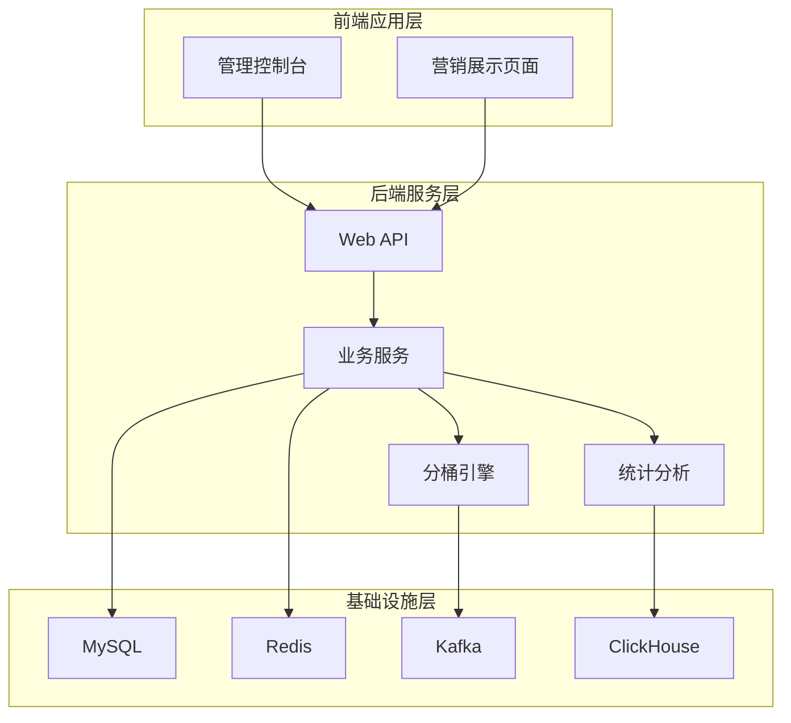
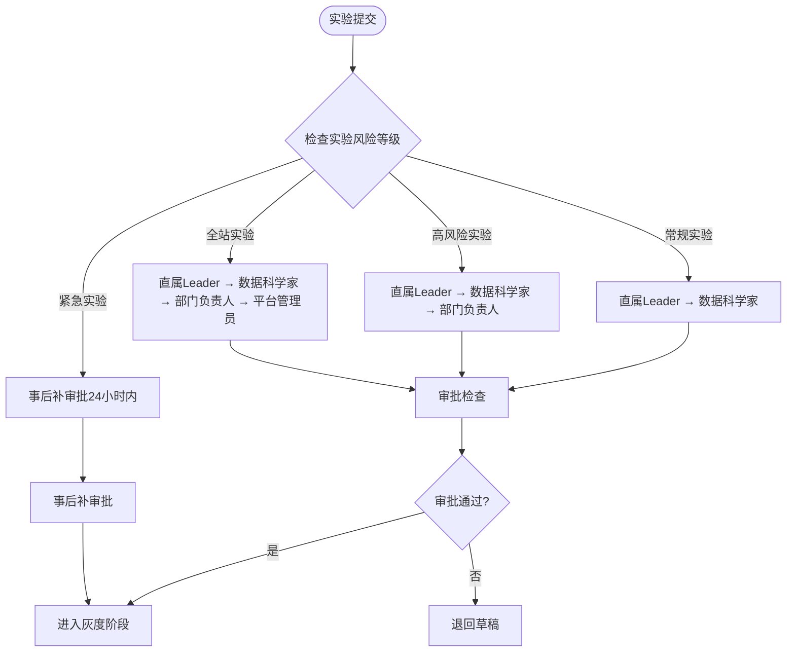
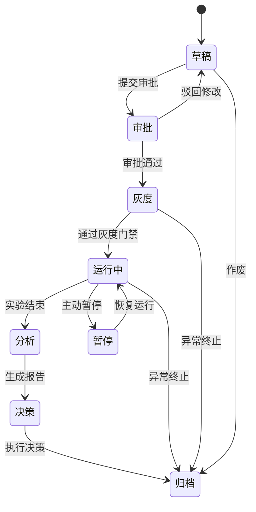
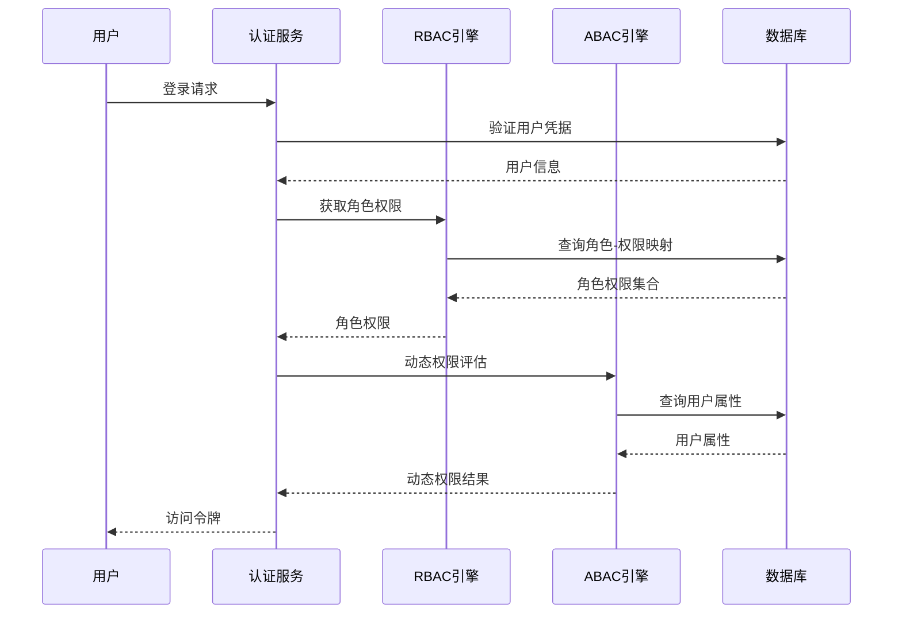
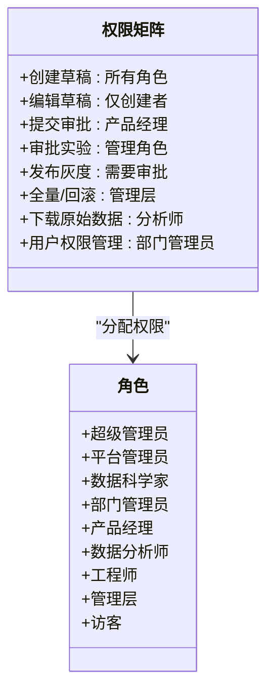
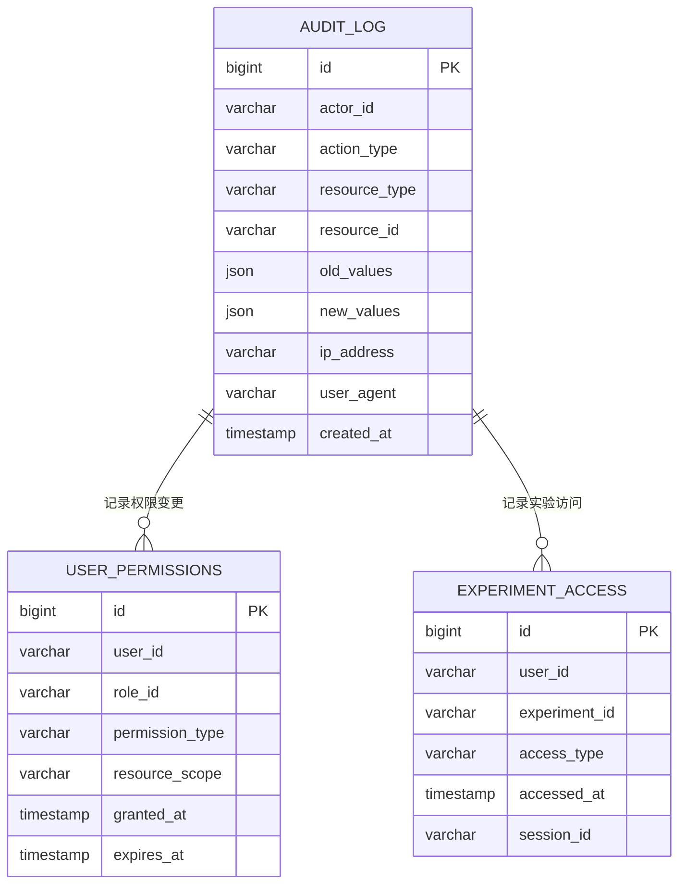
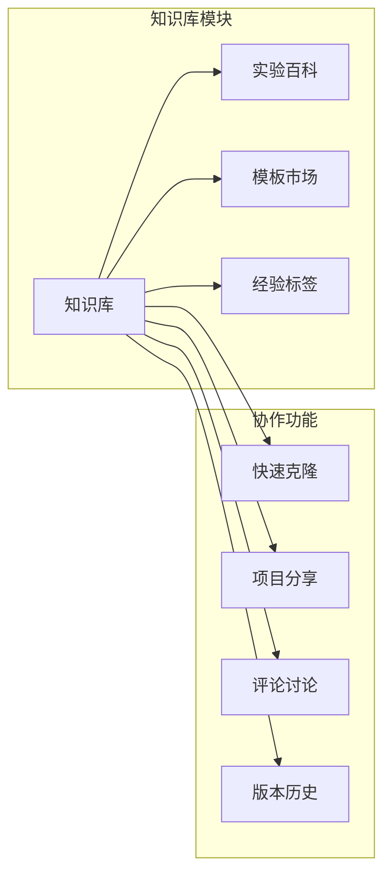
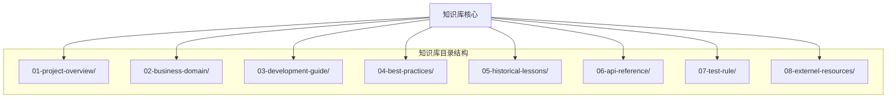
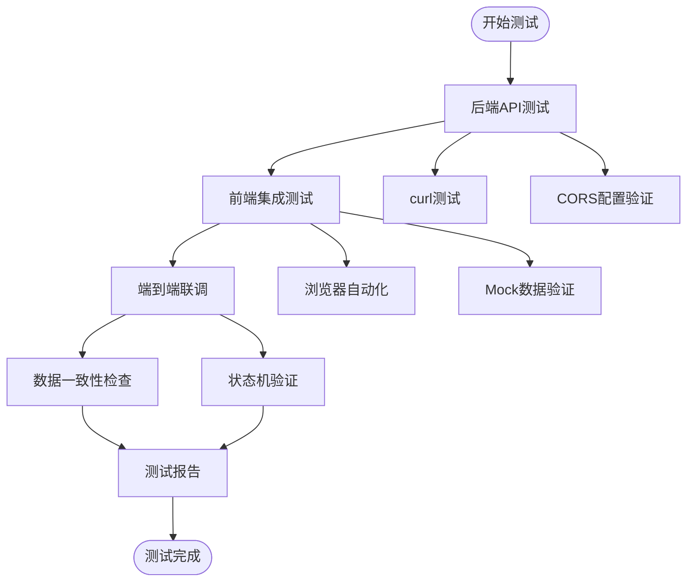
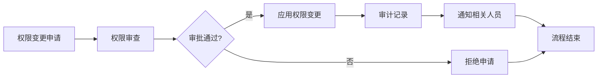

# 权限协作系统

<cite>
**本文档引用的文件**
- [README.md](file://README.md)
- [ab_experiment_platform_design.md](file://docs/ab/ab_experiment_platform_design.md)
- [ab_experiment_platform_design.html](file://docs/ab/ab_experiment_platform_design.html)
- [implementation_plan.md](file://docs/ab/implementation_plan.md)
- [knowledge/README.md](file://docs/knowledge/README.md)
- [WINDOWS_COMMANDS.md](file://docs/knowledge/04-best-practices/WINDOWS_COMMANDS.md)
- [E2E_TESTING_GUIDE.md](file://docs/knowledge/07-test-rule/E2E_TESTING_GUIDE.md)
</cite>

## 目录
1. [简介](#简介)
2. [项目结构](#项目结构)
3. [核心组件](#核心组件)
4. [架构概览](#架构概览)
5. [详细组件分析](#详细组件分析)
6. [依赖关系分析](#依赖关系分析)
7. [性能考虑](#性能考虑)
8. [故障排除指南](#故障排除指南)
9. [结论](#结论)
10. [附录](#附录)

## 简介

GateFlow权限协作系统是一个企业级的A/B测试实验平台，提供从实验创建到决策归档的一站式解决方案。系统采用RBAC + ABAC混合权限模型，支持多级审批流程、操作审计和合规记录，以及团队协作功能。

### 核心价值

- **降低实验门槛**：非技术用户也能自助创建、运行、分析实验
- **保障实验质量**：内置SRM校验、统计功效计算、护栏监控等质量门禁
- **提升决策效率**：自动化报告生成、智能决策建议、一键全量/回滚
- **沉淀实验知识**：实验知识库、经验复用、组织级实验文化积累

### 系统特性

- **RBAC + ABAC混合权限模型**
- **多级审批流程配置**
- **操作审计和合规记录**
- **团队协作和知识沉淀**

## 项目结构

GateFlow项目采用前后端分离架构，支持多层实验、正交分桶、实时数据分析和统计显著性检验。



**图表来源**
- [README.md:70-136](file://README.md#L70-L136)

### 技术栈

#### 前端技术栈
- **框架**：React 18, TypeScript 5.6
- **构建工具**：Vite 5.4
- **状态管理**：Zustand 4.5
- **路由**：React Router 6.26
- **UI组件**：Lucide React, Recharts
- **样式**：TailwindCSS 4.0
- **拖拽**：@dnd-kit/core
- **包管理**：pnpm 9+ (Monorepo)

#### 后端技术栈
- **后端框架**：Spring Boot 3.4.0, Java 17
- **ORM框架**：MyBatis-Plus 3.5.15
- **数据库**：MySQL 8.0, Redis 7, ClickHouse
- **消息队列**：Apache Kafka
- **缓存**：Caffeine (本地), Redis (分布式)
- **数据迁移**：Flyway 9.5.1
- **HTTP客户端**：OkHttp 4.12.0
- **JSON处理**：Jackson 2.17.0
- **API文档**：SpringDoc OpenAPI 2.5.0
- **构建工具**：Maven 3.x
- **容器化**：Docker, Docker Compose

**章节来源**
- [README.md:106-136](file://README.md#L106-L136)

## 核心组件

### 权限模型设计

GateFlow采用RBAC + ABAC混合权限模型，确保权限管理的灵活性和安全性。

#### RBAC基础角色

| 角色 | 职责 | 典型用户 |
|------|------|---------|
| **超级管理员** | 平台配置、用户管理、全局权限分配 | 平台负责人 |
| **平台管理员** | 指标审核、实验备案、全局监控 | 数据平台团队 |
| **数据科学家** | 实验统计方案审核、复杂分析支持 | 数据科学团队 |
| **部门管理员** | 本部门用户管理、实验审批 | 业务线负责人 |
| **产品经理** | 实验创建、灰度监控、迭代优化 | 产品经理 |
| **数据分析师** | 实验分析、报告生成、洞察挖掘 | 数据分析师 |
| **工程师** | 实验版本开发、SDK集成、技术配置 | 研发工程师 |
| **管理层** | 全量/回滚决策、全局看板查看 | 业务负责人 |
| **访客** | 只读查看实验列表和公开报告 | 新入职/跨部门 |

#### ABAC动态权限

基于属性的动态访问控制，作为RBAC的补充：

| 属性维度 | 属性示例 | 权限影响 |
|---------|---------|---------|
| **业务线** | 电商/金融/内容 | 只能查看本业务线实验 |
| **数据敏感度** | 公开/内部/机密 | 机密实验仅特定角色可见 |
| **实验状态** | 草稿/运行中/已归档 | 草稿仅参与人可见，归档后公开 |
| **用户职级** | P4/P5/P6/P7+ | 高级别用户自动获得审批权限 |
| **用户组** | 核心项目组成员 | 项目组成员共享实验编辑权限 |

**章节来源**
- [ab_experiment_platform_design.md:380-441](file://docs/ab/ab_experiment_platform_design.md#L380-L441)

### 审批流程配置

系统支持多种类型的审批流程，适应不同风险等级的实验需求。



**图表来源**
- [ab_experiment_platform_design.md:442-449](file://docs/ab/ab_experiment_platform_design.md#L442-L449)

### 审计与合规

系统提供全面的操作审计和合规记录功能：

| 审计内容 | 记录粒度 | 保留期限 |
|---------|---------|---------|
| **权限变更** | 谁、何时、变更了什么权限 | 3年 |
| **实验操作** | 谁、何时、对哪个实验做了什么 | 与实验生命周期一致 |
| **数据下载** | 谁、何时、下载了什么数据 | 3年 |
| **审批记录** | 谁、何时、审批结果、意见 | 永久 |
| **登录日志** | 谁、何时、IP、设备 | 1年 |

**章节来源**
- [ab_experiment_platform_design.md:451-460](file://docs/ab/ab_experiment_platform_design.md#L451-L460)

## 架构概览

### 实验全生命周期管理



**图表来源**
- [ab_experiment_platform_design.md:45-60](file://docs/ab/ab_experiment_platform_design.md#L45-L60)

### 权限控制流程



**图表来源**
- [ab_experiment_platform_design.md:371-441](file://docs/ab/ab_experiment_platform_design.md#L371-L441)

## 详细组件分析

### 权限矩阵分析

系统为每个核心功能提供了详细的权限矩阵，确保最小权限原则的实施。



**图表来源**
- [ab_experiment_platform_design.md:394-421](file://docs/ab/ab_experiment_platform_design.md#L394-L421)

### 审批流程执行机制

系统支持灵活的审批流程配置，包括审批人指定、流转规则、超时处理等功能。

#### 审批检查清单

| 检查项 | 说明 | 重要性 |
|-------|------|--------|
| **业务合理性** | 实验假设是否清晰？改动是否可解释？ | 高 |
| **统计功效** | 基于预期效应量和历史方差，计算所需样本量是否可达 | 高 |
| **流量冲突** | 是否与同层其他实验流量重叠？ | 中 |
| **护栏指标** | 是否定义了足够的护栏指标保护用户体验？ | 高 |
| **伦理合规** | 是否涉及敏感用户群体？是否符合数据使用规范？ | 高 |

**章节来源**
- [ab_experiment_platform_design.md:83-108](file://docs/ab/ab_experiment_platform_design.md#L83-L108)

### 操作审计实现

系统提供多层次的操作审计功能，确保所有权限操作都有迹可循。

#### 审计日志结构



**图表来源**
- [ab_experiment_platform_design.md:451-460](file://docs/ab/ab_experiment_platform_design.md#L451-L460)

### 团队协作功能

系统支持项目成员管理、权限继承、协作空间划分等团队管理需求。

#### 知识库协作



**图表来源**
- [ab_experiment_platform_design.md:352-368](file://docs/ab/ab_experiment_platform_design.md#L352-L368)

**章节来源**
- [ab_experiment_platform_design.md:352-368](file://docs/ab/ab_experiment_platform_design.md#L352-L368)

## 依赖关系分析

### 知识库系统

GateFlow采用面向Agent设计的知识库系统，支持按需渐进加载。



**图表来源**
- [knowledge/README.md:16-30](file://docs/knowledge/README.md#L16-L30)

### 测试规则体系

系统建立了完善的测试规则体系，确保代码质量和系统稳定性。



**图表来源**
- [E2E_TESTING_GUIDE.md:16-183](file://docs/knowledge/07-test-rule/E2E_TESTING_GUIDE.md#L16-L183)

**章节来源**
- [E2E_TESTING_GUIDE.md:16-183](file://docs/knowledge/07-test-rule/E2E_TESTING_GUIDE.md#L16-L183)

## 性能考虑

### 权限评估优化

系统采用多层权限缓存策略，确保权限评估的高性能：

1. **本地缓存**：Zustand状态管理缓存用户权限
2. **分布式缓存**：Redis缓存角色-权限映射
3. **数据库索引**：权限查询建立复合索引
4. **权限预加载**：用户登录时预加载相关权限

### 审计性能优化

- **异步审计**：审计日志异步写入，不影响主业务流程
- **批量写入**：审计日志批量处理，减少数据库压力
- **分区存储**：按时间分区存储审计日志，提高查询效率

## 故障排除指南

### 常见权限问题

#### 权限不足错误

**症状**：
```
403 Forbidden: Insufficient permissions
```

**排查步骤**：
1. 检查用户角色是否正确
2. 验证ABAC属性是否满足
3. 确认实验状态是否允许当前操作
4. 检查用户组权限

#### 审批流程异常

**症状**：
```
审批状态异常：等待审批超时
```

**排查步骤**：
1. 检查审批人是否在线
2. 验证审批流程配置
3. 确认超时设置是否合理
4. 检查紧急通道配置

**章节来源**
- [E2E_TESTING_GUIDE.md:509-590](file://docs/knowledge/07-test-rule/E2E_TESTING_GUIDE.md#L509-L590)

### 系统配置问题

#### CORS配置错误

**症状**：
```
Access to fetch at 'http://localhost:8081/api/v1/experiments' from origin 
'http://localhost:3003' has been blocked by CORS policy
```

**解决方法**：
1. 检查WebConfig.java中的CORS配置
2. 确认后端已重启生效
3. 清除浏览器缓存后重试

**章节来源**
- [E2E_TESTING_GUIDE.md:511-524](file://docs/knowledge/07-test-rule/E2E_TESTING_GUIDE.md#L511-L524)

## 结论

GateFlow权限协作系统通过RBAC + ABAC混合权限模型、多级审批流程、操作审计和合规记录，以及团队协作功能，为企业提供了一套完整、安全、高效的A/B测试实验管理解决方案。

### 核心优势

1. **灵活的权限模型**：RBAC + ABAC混合模型满足复杂权限需求
2. **严格的审批流程**：多级审批确保实验质量和合规性
3. **全面的审计功能**：完整的操作日志和合规记录
4. **强大的团队协作**：知识库沉淀和经验复用
5. **高性能架构**：优化的权限评估和审计性能

### 最佳实践建议

1. **最小权限原则**：严格按照最小权限原则分配权限
2. **定期权限审查**：建立定期权限审查机制
3. **权限变更流程**：规范化的权限变更审批流程
4. **安全培训**：定期进行安全意识和权限管理培训
5. **监控告警**：建立权限异常使用监控和告警机制

## 附录

### 安全加固措施

#### 数据加密

- **传输加密**：HTTPS/TLS加密所有API通信
- **存储加密**：敏感数据在数据库中加密存储
- **密钥管理**：使用硬件安全模块(HSM)管理加密密钥

#### 访问控制

- **多因素认证**：对管理员账户启用MFA
- **会话管理**：严格的会话超时和续期机制
- **IP白名单**：对关键系统启用IP访问控制

#### 安全审计

- **实时监控**：7×24小时安全事件监控
- **异常检测**：基于机器学习的异常行为检测
- **合规报告**：自动生成合规审计报告

### 权限配置最佳实践

#### 角色设计原则

1. **职责分离**：确保关键权限不集中在单一角色
2. **最小权限**：每个角色只拥有必要的最小权限
3. **定期审查**：定期审查和调整角色权限
4. **文档化**：所有角色权限变更都要有文档记录

#### 权限变更流程



**图表来源**
- [ab_experiment_platform_design.md:451-460](file://docs/ab/ab_experiment_platform_design.md#L451-L460)