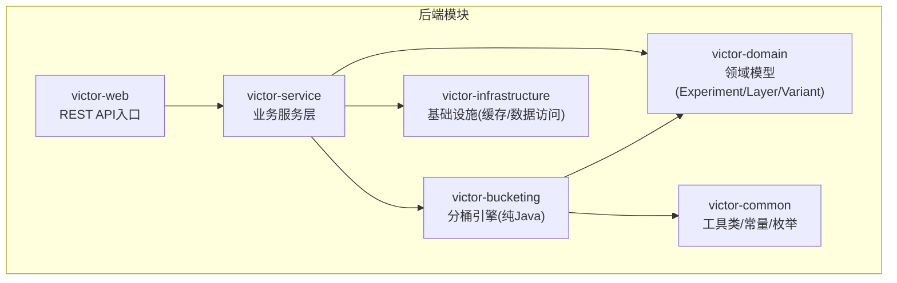
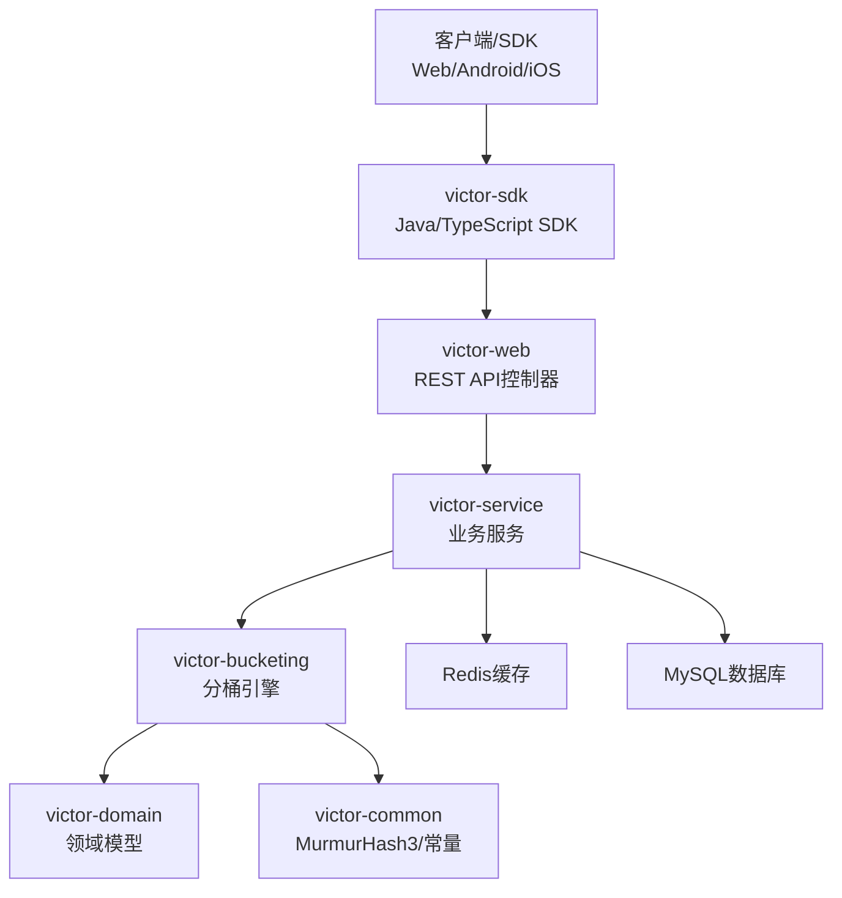
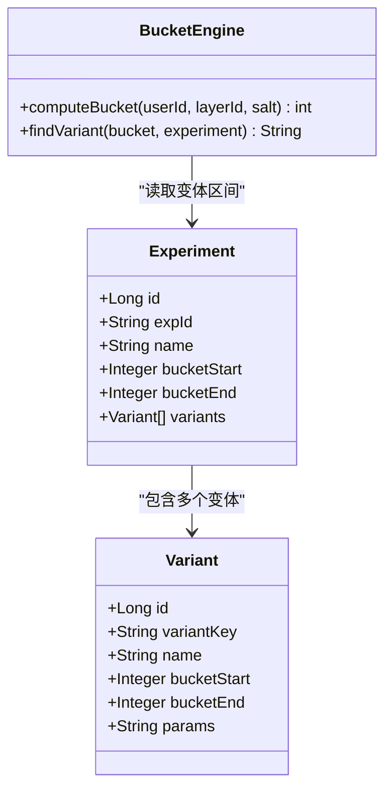
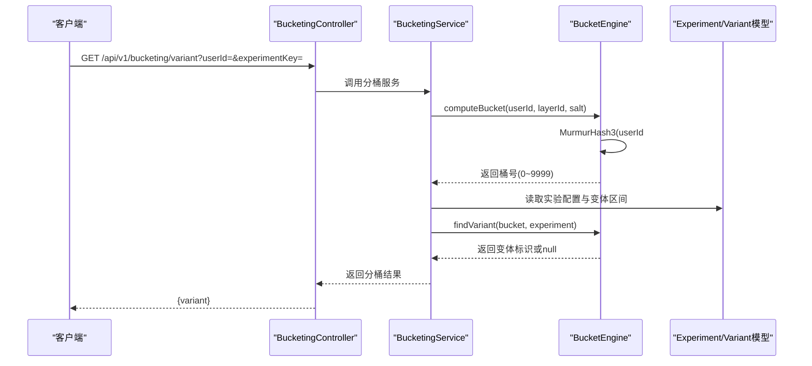
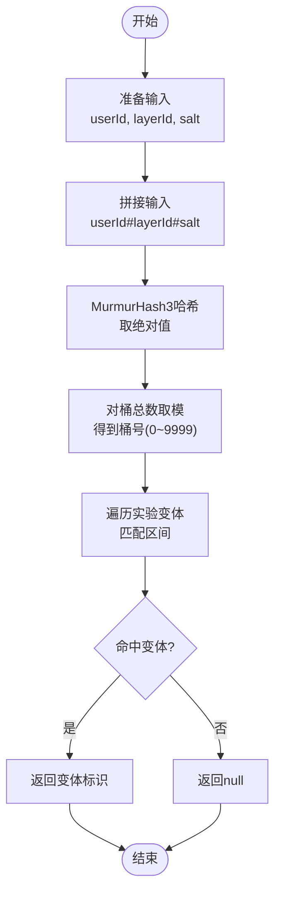
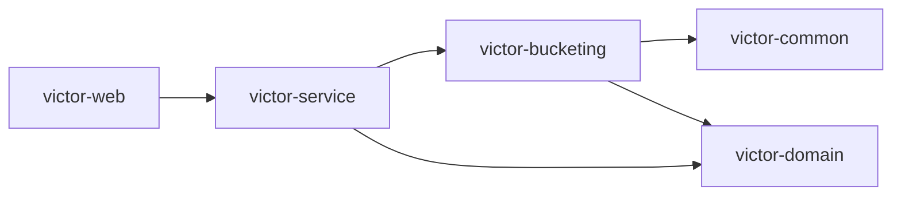

# 分桶算法原理

<cite>
**本文档引用的文件**
- [implementation_plan.md](file://docs/ab/implementation_plan.md)
- [ab_experiment_system_architecture.html](file://docs/ab/ab_experiment_system_architecture.html)
</cite>

## 目录
1. [简介](#简介)
2. [项目结构](#项目结构)
3. [核心组件](#核心组件)
4. [架构总览](#架构总览)
5. [详细组件分析](#详细组件分析)
6. [依赖分析](#依赖分析)
7. [性能考量](#性能考量)
8. [故障排查指南](#故障排查指南)
9. [结论](#结论)
10. [附录](#附录)

## 简介
本文件围绕GateFlow的分桶算法进行系统化技术说明，重点阐述基于MurmurHash3的一致性哈希实现思路与工程实践。文档涵盖哈希函数选择、哈希环构建、节点排序、虚拟节点等核心技术；详细说明分桶计算流程，包括用户标识处理、实验ID组合、哈希值计算、环上查找、变体选择等步骤；并总结一致性哈希在负载均衡、故障转移、动态扩容等方面的优势。同时给出性能分析（时间复杂度、空间复杂度、内存使用）与优化建议。

## 项目结构
分桶算法相关的设计与实现位于后端模块的victor-bucketing中，配合common模块的MurmurHash3工具类与domain模块的领域模型。整体采用多模块Maven结构，便于独立测试与跨平台复用。

**图示来源**
- [implementation_plan.md:13-143](file://docs/ab/implementation_plan.md#L13-L143)

**章节来源**
- [implementation_plan.md:13-143](file://docs/ab/implementation_plan.md#L13-L143)

## 核心组件
- 分桶引擎（BucketEngine）：负责计算用户桶号与根据桶号匹配实验变体。
- MurmurHash3工具类：提供高性能32位哈希实现。
- 领域模型：Experiment、Variant等，承载实验配置与分桶区间。
- 域-层模型：支撑“域-层正交分流”的分层结构。
- 变体匹配器：在给定实验配置下，将桶号映射到具体变体。

上述组件共同构成分桶计算的完整闭环：输入用户标识与实验上下文，输出稳定且可重复的变体分配。

**章节来源**
- [implementation_plan.md:290-297](file://docs/ab/implementation_plan.md#L290-L297)
- [implementation_plan.md:893-926](file://docs/ab/implementation_plan.md#L893-L926)

## 架构总览
分桶算法在系统中的位置如下：

**图示来源**
- [implementation_plan.md:13-143](file://docs/ab/implementation_plan.md#L13-L143)
- [implementation_plan.md:476-486](file://docs/ab/implementation_plan.md#L476-L486)

## 详细组件分析

### 分桶引擎（BucketEngine）
分桶引擎是分桶计算的核心，包含两个关键方法：
- 计算桶号：将用户标识、层标识与盐值拼接后进行MurmurHash3哈希，取绝对值后再对桶总数取模，得到0~9999的桶号。
- 查找变体：遍历实验的变体集合，依据桶号落在的区间返回对应变体标识。

**图示来源**
- [implementation_plan.md:893-926](file://docs/ab/implementation_plan.md#L893-L926)
- [implementation_plan.md:228-287](file://docs/ab/implementation_plan.md#L228-L287)

**章节来源**
- [implementation_plan.md:893-926](file://docs/ab/implementation_plan.md#L893-L926)

### 分桶计算流程（序列图）
下面以“单实验分桶查询”为例，展示从API到分桶引擎的调用链路与关键步骤。

**图示来源**
- [implementation_plan.md:490-517](file://docs/ab/implementation_plan.md#L490-L517)
- [implementation_plan.md:893-926](file://docs/ab/implementation_plan.md#L893-L926)

**章节来源**
- [implementation_plan.md:490-517](file://docs/ab/implementation_plan.md#L490-L517)
- [implementation_plan.md:893-926](file://docs/ab/implementation_plan.md#L893-L926)

### 分桶计算流程（流程图）
该流程图抽象了“用户标识处理—实验ID组合—哈希值计算—环上查找—变体选择”的核心步骤。

**图示来源**
- [implementation_plan.md:893-926](file://docs/ab/implementation_plan.md#L893-L926)

**章节来源**
- [implementation_plan.md:893-926](file://docs/ab/implementation_plan.md#L893-L926)

### 哈希函数选择与一致性哈希
- 哈希函数选择：采用MurmurHash3，具备优秀的随机性与抗碰撞能力，适合大规模均匀分布。
- 一致性哈希优势：
  - 负载均衡：哈希值均匀分布在0~9999区间，确保各变体流量接近预期。
  - 故障转移：节点变化时仅影响相邻节点的少量用户，降低抖动。
  - 动态扩容：新增节点时，仅影响局部用户重新分配，整体稳定性高。
- 工程实现要点：
  - 桶总数固定为10000，粒度达到0.1%，满足细粒度分流需求。
  - 通过“域-层正交分流”，层间流量正交，避免实验相互干扰。
  - 使用盐值（salt）与层ID参与哈希，保证同一用户在不同层获得稳定的分桶结果。

**章节来源**
- [ab_experiment_system_architecture.html:677-703](file://docs/ab/ab_experiment_system_architecture.html#L677-L703)
- [implementation_plan.md:893-926](file://docs/ab/implementation_plan.md#L893-L926)

### 算法性能分析
- 时间复杂度
  - 计算桶号：O(1)，包含字符串拼接、字节数组转换、哈希计算与取模。
  - 查找变体：O(N)，N为实验变体数量，通常较小（≤10），可视为常数时间。
- 空间复杂度
  - 分桶引擎本身为纯计算，额外空间主要来自实验配置与变体区间，与变体数量线性相关。
- 内存使用
  - 哈希计算与字符串拼接占用少量堆内存；变体区间存储紧凑，内存开销可控。
- 性能优化建议
  - 变体区间预排序与二分查找：若变体数量增长，可用二分查找替代线性扫描，将查找复杂度降至O(log N)。
  - 缓存热点实验配置：结合Redis缓存，减少重复查询与解析成本。
  - 批量分桶：在服务端提供批量接口，减少网络往返与序列化开销。
  - 预热与懒加载：首次访问时加载配置并缓存，后续请求直接命中缓存。

**章节来源**
- [implementation_plan.md:893-926](file://docs/ab/implementation_plan.md#L893-L926)

## 依赖分析
分桶引擎依赖关系如下：

**图示来源**
- [implementation_plan.md:13-143](file://docs/ab/implementation_plan.md#L13-L143)

**章节来源**
- [implementation_plan.md:13-143](file://docs/ab/implementation_plan.md#L13-L143)

## 性能考量
- 延迟：本地纯计算，延迟远小于5ms，满足实时分流需求。
- 可扩展性：模块化设计，分桶引擎可独立测试与复用，便于移植到多平台SDK。
- 可观测性：结合用户分桶记录表与配置版本追踪，支持SRM检验与审计。

**章节来源**
- [ab_experiment_system_architecture.html:687-696](file://docs/ab/ab_experiment_system_architecture.html#L687-L696)

## 故障排查指南
- 常见问题
  - 分桶结果不稳定：检查是否混用了不同的salt或layerId，确保输入一致。
  - 变体未命中：确认实验变体区间是否覆盖目标桶号，或是否存在配置未生效的情况。
  - 性能异常：关注变体数量与查找链路，必要时引入缓存或二分查找。
- 排查步骤
  - 校验输入参数：userId、layerId、salt是否正确传递。
  - 校验实验配置：确认bucketStart/bucketEnd区间连续且无重叠。
  - 核对缓存状态：检查Redis与本地缓存是否命中，避免脏数据导致的异常。

**章节来源**
- [implementation_plan.md:893-926](file://docs/ab/implementation_plan.md#L893-L926)

## 结论
GateFlow的分桶算法以MurmurHash3为核心，结合“域-层正交分流”与固定桶总数策略，在保证稳定性的同时实现了细粒度、可扩展的分流能力。通过纯Java分桶引擎与多模块架构，既满足服务端实时计算，又便于SDK跨平台复用。未来可在变体查找与缓存策略上进一步优化，以应对更大规模的实验场景。

## 附录
- 术语
  - 桶：0~9999之间的整数，代表用户被分配到的区间。
  - 变体：实验的不同版本，每个变体对应一个桶区间。
  - 盐值：用于改变哈希输入，避免不同层间的冲突。
- 参考实现路径
  - 分桶引擎：[implementation_plan.md:893-926](file://docs/ab/implementation_plan.md#L893-L926)
  - 哈希公式与分流特性：[ab_experiment_system_architecture.html:677-703](file://docs/ab/ab_experiment_system_architecture.html#L677-L703)