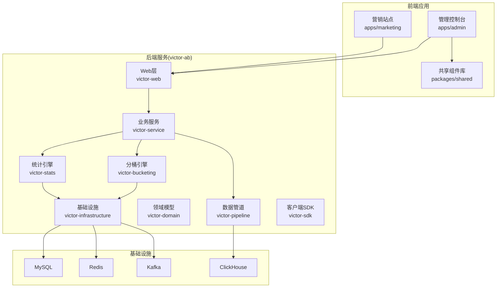
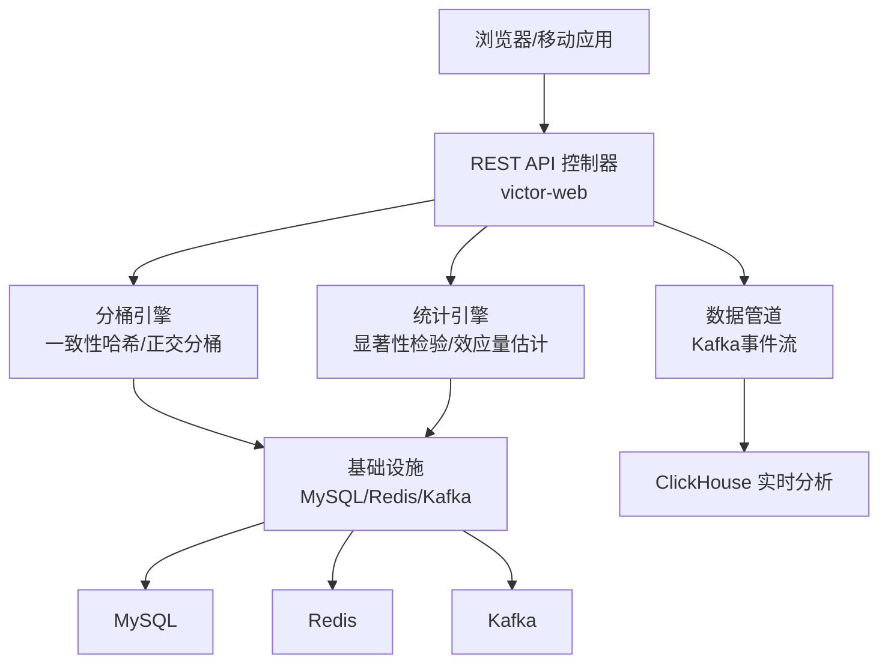
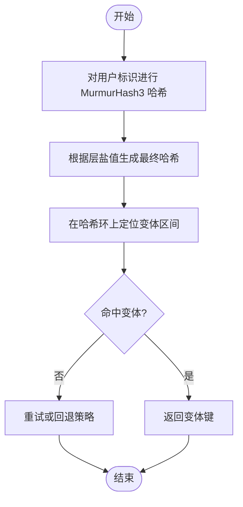
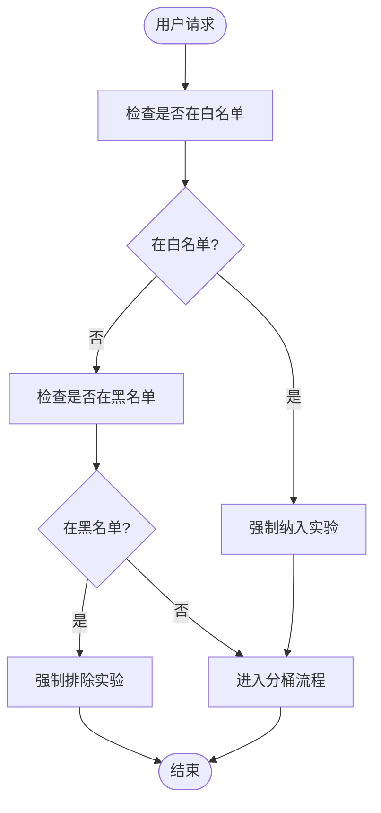
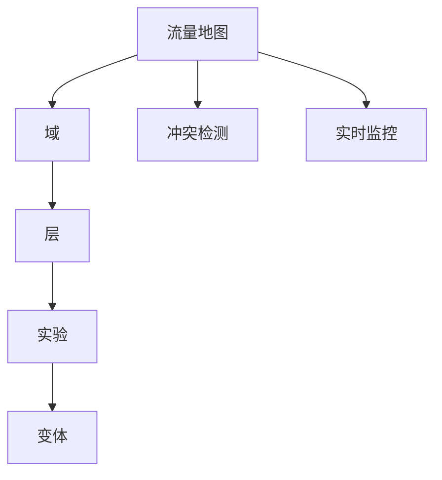
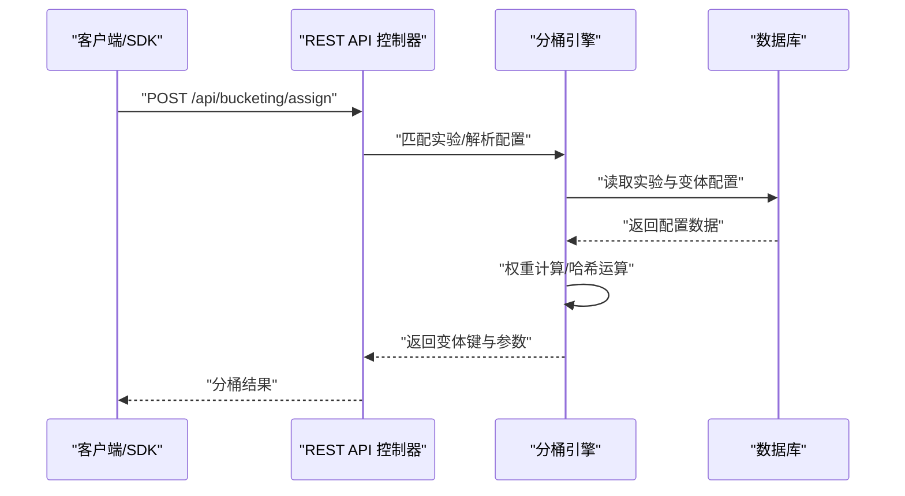
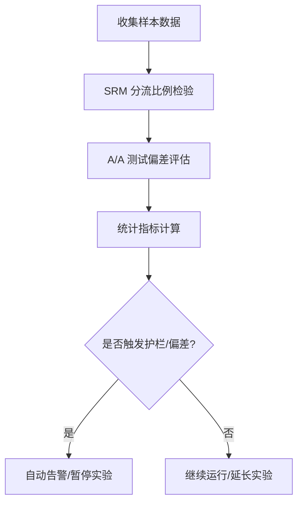
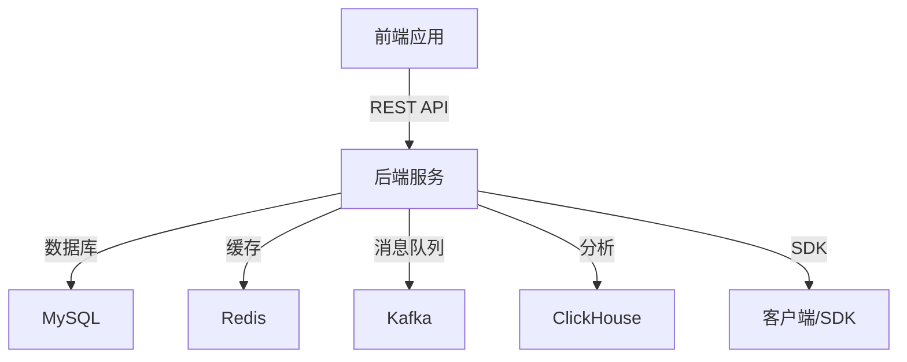

# 流量分配系统

<cite>
**本文引用的文件**
- [README.md](file://README.md)
- [ab_experiment_platform_design.md](file://docs/ab/ab_experiment_platform_design.md)
- [IMPLEMENTATION_SUMMARY.md](file://docs/ab/IMPLEMENTATION_SUMMARY.md)
- [ab_experiment_system_architecture.html](file://docs/ab/ab_experiment_system_architecture.html)
- [implementation_plan.md](file://docs/ab/implementation_plan.md)
- [enhancement_progress.md](file://docs/ab/enhancement_progress.md)
- [experiment_detail_enhancement_plan.md](file://docs/ab/experiment_detail_enhancement_plan.md)
- [E2E_TESTING_GUIDE.md](file://docs/knowledge/07-test-rule/E2E_TESTING_GUIDE.md)
- [MIGRATION_GUIDE.md](file://docs/MIGRATION_GUIDE.md)
- [SQL_REFACTORING_REPORT.md](file://docs/SQL_REFACTORING_REPORT.md)
</cite>

## 目录
1. [引言](#引言)
2. [项目结构](#项目结构)
3. [核心组件](#核心组件)
4. [架构总览](#架构总览)
5. [详细组件分析](#详细组件分析)
6. [依赖关系分析](#依赖关系分析)
7. [性能考量](#性能考量)
8. [故障排查指南](#故障排查指南)
9. [结论](#结论)
10. [附录](#附录)

## 引言
本文件为 GateFlow 流量分配系统的技术文档，聚焦于基于 MurmurHash3 的一致性哈希分桶算法、多层实验支持、流量隔离与正交分桶、白名单/黑名单机制、流量地图可视化、用户分桶计算全流程，以及分桶统计分析、A/A 测试验证与流量偏差检测等质量保证机制。文档旨在帮助产品、研发与运营人员全面理解系统设计与实现，并为后续扩展与维护提供依据。

## 项目结构
GateFlow 采用前后端分离架构，前端为 React + TypeScript 的 Monorepo，后端为 Spring Boot 微服务，核心模块围绕实验管理、流量分配、统计分析与数据管道展开。流量分配能力位于后端 victor-ab 微服务的分桶引擎模块，前端提供流量地图与冲突检测的可视化界面。

**图表来源**
- [README.md: 137-188:137-188](file://README.md#L137-L188)

**章节来源**
- [README.md: 137-188:137-188](file://README.md#L137-L188)

## 核心组件
- 分桶引擎（一致性哈希与正交分桶）
  - 基于 MurmurHash3 的哈希环构建与节点分布
  - 多层实验的流量隔离与正交性保证
  - 实验冲突检测与解决方案
- 白名单/黑名单机制
  - 用户过滤规则与优先级处理
  - 动态更新与生效策略
- 流量地图可视化
  - 流量分布图表与冲突检测界面
  - 实时监控面板与交互式探索
- 用户分桶计算流程
  - 实验匹配、权重计算、哈希运算、变体分配
- 质量保证机制
  - 分桶统计分析、A/A 测试验证、流量偏差检测

**章节来源**
- [README.md: 42-61:42-61](file://README.md#L42-L61)
- [ab_experiment_platform_design.md: 284-314:284-314](file://docs/ab/ab_experiment_platform_design.md#L284-L314)

## 架构总览
系统整体分为前端控制台、后端服务与基础设施三层。前端通过 REST API 与后端交互；后端通过分桶引擎进行流量分配，通过统计引擎进行数据分析，并通过数据管道将事件流写入 ClickHouse 实时分析。

**图表来源**
- [README.md: 70-136:70-136](file://README.md#L70-L136)
- [README.md: 170-188:170-188](file://README.md#L170-L188)

**章节来源**
- [README.md: 70-136:70-136](file://README.md#L70-L136)

## 详细组件分析

### 一致性哈希分桶与多层实验支持
- 哈希环构建与节点分布
  - 使用 MurmurHash3 对用户标识进行哈希，映射到 0~(2^32-1) 的哈希空间
  - 每个实验变体在环上放置多个虚拟节点，提高分布均匀性
  - 通过二分查找定位用户命中的变体区间，实现稳定的分桶
- 多层实验与正交分桶
  - 每层使用独立的哈希盐值，确保不同层的哈希结果相互独立
  - 同一层内的实验桶号互不重叠，跨层实验通过不同盐值实现正交性
  - 层级可视化与流量地图展示，便于人工校验与冲突检测
- 流量隔离策略
  - 域（Domain）与层（Layer）两级隔离，域内流量总和不超过 100%
  - 层内实验总流量不得超过域分配比例，溢出自动告警
- 冲突检测与解决方案
  - 同层冲突：重叠桶号禁止发布，需调整流量区间
  - 跨层正交校验：系统自动保证盐值独立，人工复核
  - 实验互斥：用户同时命中互斥实验时记录日志并触发告警

**图表来源**
- [README.md: 42-46:42-46](file://README.md#L42-L46)
- [ab_experiment_platform_design.md: 286-314:286-314](file://docs/ab/ab_experiment_platform_design.md#L286-L314)

**章节来源**
- [README.md: 42-46:42-46](file://README.md#L42-L46)
- [ab_experiment_platform_design.md: 286-314:286-314](file://docs/ab/ab_experiment_platform_design.md#L286-L314)

### 白名单与黑名单机制
- 用户过滤规则
  - 白名单：强制纳入实验，不受流量控制与互斥规则限制
  - 黑名单：强制排除实验，不参与任何分桶
- 优先级处理
  - 白名单优先于黑名单，二者冲突时以白名单为准
  - 多个白名单/黑名单规则按优先级合并，支持用户属性与实验维度
- 动态更新
  - 规则通过 API 配置，支持批量导入与增量更新
  - 更新后立即生效，历史用户保持稳定（可配置是否回滚）

**图表来源**
- [README.md: 45](file://README.md#L45)

**章节来源**
- [README.md: 45](file://README.md#L45)

### 流量地图可视化与冲突检测
- 流量分布图表
  - 域/层/实验/变体的树状结构展示，色块比例直观反映流量占比
  - 支持缩放、筛选与钻取，便于多维度观察
- 冲突检测界面
  - 同层冲突：重叠桶号高亮提示，阻止发布
  - 跨层正交：盐值独立性可视化，辅助人工复核
  - 流量溢出：超配额区域标红，限制实验发布
- 实时监控面板
  - 实时流量分布趋势图与桶内样本量
  - SRM 检验与 A/A 测试偏差等级，辅助质量门禁

**图表来源**
- [README.md: 46](file://README.md#L46)
- [ab_experiment_platform_design.md: 288-304:288-304](file://docs/ab/ab_experiment_platform_design.md#L288-L304)

**章节来源**
- [README.md: 46](file://README.md#L46)
- [ab_experiment_platform_design.md: 288-304:288-304](file://docs/ab/ab_experiment_platform_design.md#L288-L304)

### 用户分桶计算完整流程
- 实验匹配
  - 根据用户属性与实验条件筛选候选实验
  - 解析实验配置，提取变体权重与桶区间
- 权重计算
  - 按层独立计算权重，确保层内总权重为 100%
  - 支持动态权重调整与版本控制
- 哈希运算
  - 使用 MurmurHash3 与层盐值生成稳定哈希
  - 通过二分查找定位用户命中的变体区间
- 变体分配
  - 返回变体键与参数，供 SDK 使用
  - 记录分桶日志，支持回溯与审计

**图表来源**
- [README.md: 317-322:317-322](file://README.md#L317-L322)

**章节来源**
- [README.md: 317-322:317-322](file://README.md#L317-L322)

### 分桶统计分析与质量保证
- 分桶统计分析
  - 实时统计各变体样本量、转化率与流量占比
  - 时间序列分析与人群拆分，支持多维度对比
- A/A 测试验证
  - 假阳性率统计与偏差等级评估
  - 历史测试次数与最近测试日期记录
- 流量偏差检测
  - SRM 卡方检验与 p 值阈值控制
  - 护栏指标自动告警与早停机制

**图表来源**
- [README.md: 48-54:48-54](file://README.md#L48-L54)
- [IMPLEMENTATION_SUMMARY.md: 13-34:13-34](file://docs/ab/IMPLEMENTATION_SUMMARY.md#L13-L34)

**章节来源**
- [README.md: 48-54:48-54](file://README.md#L48-L54)
- [IMPLEMENTATION_SUMMARY.md: 13-34:13-34](file://docs/ab/IMPLEMENTATION_SUMMARY.md#L13-L34)

## 依赖关系分析
- 前端依赖
  - React 18、TypeScript 5.6、Zustand、Recharts、TailwindCSS、Vite
  - 通过 Vite 代理转发 /api 请求至后端服务
- 后端依赖
  - Spring Boot 3.4.0、MyBatis-Plus、Kafka、ClickHouse、Redis、MySQL
  - 分桶引擎与统计引擎作为核心服务模块，通过 Web 层暴露 REST API
- 外部集成
  - SDK/API 与客户端对接，支持多语言与多端
  - Docker Compose 支持本地与生产环境部署

**图表来源**
- [README.md: 106-136:106-136](file://README.md#L106-L136)
- [README.md: 170-188:170-188](file://README.md#L170-L188)

**章节来源**
- [README.md: 106-136:106-136](file://README.md#L106-L136)
- [README.md: 170-188:170-188](file://README.md#L170-L188)

## 性能考量
- 分桶性能
  - MurmurHash3 哈希与二分查找的时间复杂度为 O(log n)，适合高并发场景
  - 虚拟节点数量与哈希环大小需平衡均匀性与内存占用
- 可视化性能
  - 图表数据降采样与虚拟滚动优化大数据量渲染
  - 图表组件懒加载与缓存策略减少重复计算
- 实时监控
  - Kafka 事件流与 ClickHouse 实时分析，结合缓存提升查询性能
  - 护栏指标阈值与早停策略降低无效样本量

## 故障排查指南
- 常见问题
  - 前端依赖安装失败：清理 pnpm store 缓存并重新安装
  - 数据库连接失败：检查 MySQL 容器状态与连接参数
  - Redis 连接失败：确认 Redis 容器运行并使用 redis-cli ping 测试
  - 端口冲突：修改相应配置文件中的端口设置
- API 与代理
  - Vite 开发代理配置 /api 转发至后端服务，确保后端服务运行
  - 前后端字段名与数据格式需严格对齐，避免保存配置失败
- 测试与验证
  - E2E 测试覆盖页面加载、Tab 切换、版本历史、配置保存等关键流程
  - A/A 测试与 SRM 检验作为质量门禁，异常时自动暂停实验并告警

**章节来源**
- [README.md: 474-509:474-509](file://README.md#L474-L509)
- [IMPLEMENTATION_SUMMARY.md: 103-125:103-125](file://docs/ab/IMPLEMENTATION_SUMMARY.md#L103-L125)
- [E2E_TESTING_GUIDE.md](file://docs/knowledge/07-test-rule/E2E_TESTING_GUIDE.md)

## 结论
GateFlow 流量分配系统通过一致性哈希与多层正交分桶，实现了高可靠、可解释的流量分配；配合白名单/黑名单、流量地图与冲突检测，保障了实验质量与用户体验；借助 A/A 测试与 SRM 检验等质量门禁，系统能够在运行期持续监控并自动干预异常流量。该体系为实验平台提供了坚实的技术基础，支持从创建到决策归档的全生命周期管理。

## 附录
- 相关文档与路线图
  - AB 实验平台设计方案、系统架构设计、实施计划、增强进度与详情增强计划
- 迁移与重构
  - 迁移指南与 SQL 重构报告，指导数据库演进与代码重构

**章节来源**
- [ab_experiment_platform_design.md](file://docs/ab/ab_experiment_platform_design.md)
- [ab_experiment_system_architecture.html](file://docs/ab/ab_experiment_system_architecture.html)
- [implementation_plan.md](file://docs/ab/implementation_plan.md)
- [enhancement_progress.md](file://docs/ab/enhancement_progress.md)
- [experiment_detail_enhancement_plan.md](file://docs/ab/experiment_detail_enhancement_plan.md)
- [MIGRATION_GUIDE.md](file://docs/MIGRATION_GUIDE.md)
- [SQL_REFACTORING_REPORT.md](file://docs/SQL_REFACTORING_REPORT.md)