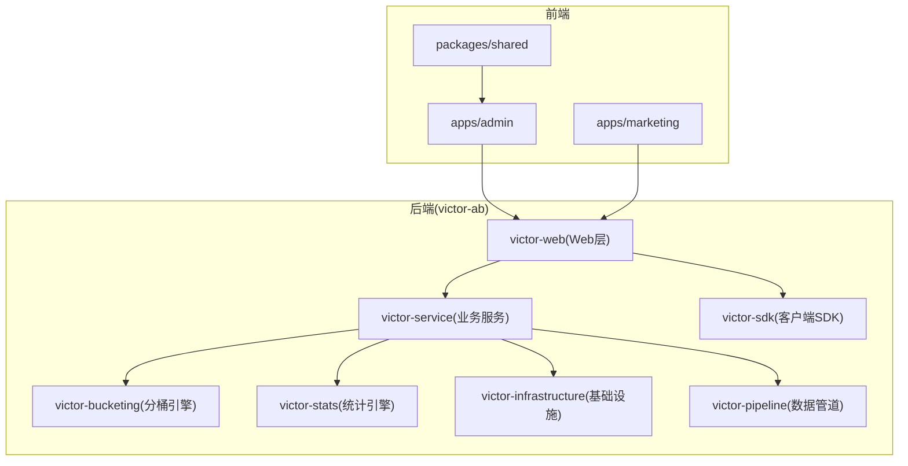
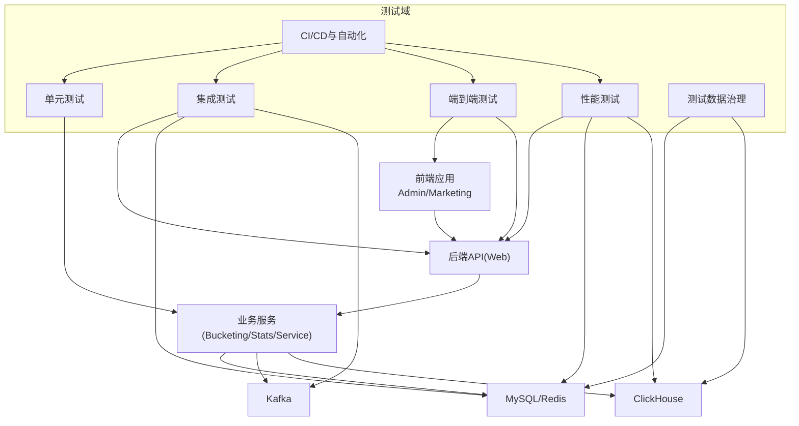
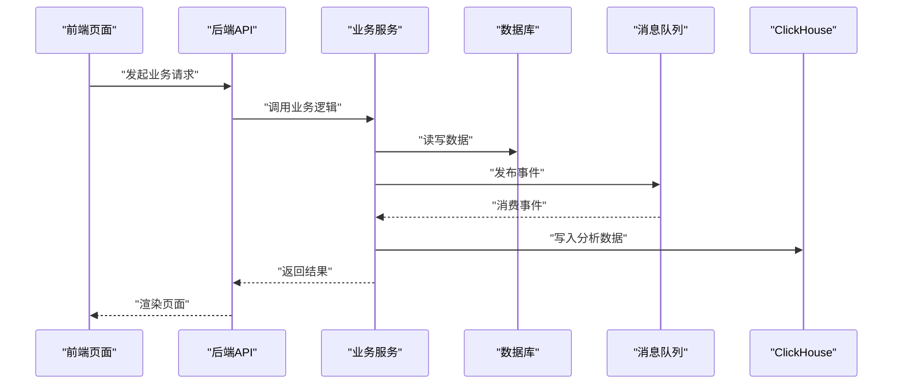
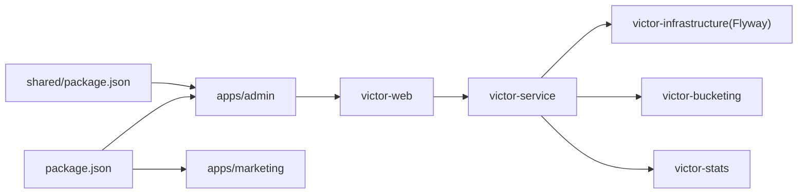

# 测试策略

<cite>
**本文引用的文件**
- [README.md](file://README.md)
- [E2E_TESTING_GUIDE.md](file://docs/knowledge/07-test-rule/E2E_TESTING_GUIDE.md)
- [WINDOWS_COMMANDS.md](file://docs/knowledge/04-best-practices/WINDOWS_COMMANDS.md)
- [2026-05-05-victor-stats-engine-design.md](file://docs/superpowers/specs/2026-05-05-victor-stats-engine-design.md)
- [SQL_REFACTORING_REPORT.md](file://docs/SQL_REFACTORING_REPORT.md)
- [package.json](file://package.json)
- [shared/package.json](file://packages/shared/package.json)
</cite>

## 目录
1. [引言](#引言)
2. [项目结构](#项目结构)
3. [核心组件](#核心组件)
4. [架构总览](#架构总览)
5. [详细组件分析](#详细组件分析)
6. [依赖分析](#依赖分析)
7. [性能考虑](#性能考虑)
8. [故障排查指南](#故障排查指南)
9. [结论](#结论)
10. [附录](#附录)

## 引言
本文件为 GateFlow 测试策略的权威质量保证文档，面向不同角色（开发者、测试工程师、运维与项目经理），系统化阐述单元测试、集成测试、端到端测试、性能测试、测试数据治理、测试自动化与持续集成、以及测试最佳实践与质量门禁。文档严格基于仓库现有资料进行归纳与扩展，确保可落地、可验证、可演进。

## 项目结构
- 前端采用 monorepo 结构，包含 admin 控制台与 marketing 展示站点，共享组件库 packages/shared。
- 后端为多模块微服务架构，核心模块包括分桶引擎、统计引擎、Web 层、基础设施等。
- 测试相关文档集中在知识库“测试规范”与“最佳实践”，并辅以 SQL 脚本治理报告。

图表来源
- [README.md: 137-188:137-188](file://README.md#L137-L188)

章节来源
- [README.md: 137-188:137-188](file://README.md#L137-L188)

## 核心组件
- 前端测试基础：类型检查与 Lint 检查脚本，支持 monorepo 并行执行。
- 后端测试基础：Maven 测试命令与模块化测试入口，覆盖分桶引擎、统计引擎、Web 层等。
- 端到端测试：基于 curl 与 Browser Agent 的全链路验证流程，强调 CORS、数据一致性与截图记录。
- 统计引擎：提供 SRM、Z-Test、Welch T-Test、CUPED、BH 校正、mSPRT 等完整分析流程，便于测试用例设计与回归验证。
- SQL 脚本治理：统一脚本目录、分类与文档，支撑数据库集成测试与运维脚本验证。

章节来源
- [README.md: 370-394:370-394](file://README.md#L370-L394)
- [E2E_TESTING_GUIDE.md: 1-692:1-692](file://docs/knowledge/07-test-rule/E2E_TESTING_GUIDE.md#L1-L692)
- [2026-05-05-victor-stats-engine-design.md: 720-926:720-926](file://docs/superpowers/specs/2026-05-05-victor-stats-engine-design.md#L720-L926)
- [SQL_REFACTORING_REPORT.md: 1-312:1-312](file://docs/SQL_REFACTORING_REPORT.md#L1-L312)

## 架构总览
下图展示了测试策略在系统中的定位与交互关系：前端通过 API 与后端交互，后端依赖数据库、缓存、消息队列与 ClickHouse 等基础设施；测试贯穿 API、服务、数据库与 UI 等多个层面。

图表来源
- [README.md: 70-136:70-136](file://README.md#L70-L136)
- [E2E_TESTING_GUIDE.md: 16-133:16-133](file://docs/knowledge/07-test-rule/E2E_TESTING_GUIDE.md#L16-L133)

## 详细组件分析

### 单元测试策略与实践
- 测试框架与执行
  - 后端：使用 Maven 测试生命周期，按模块执行测试（如分桶引擎、统计引擎、Web 层）。
  - 前端：类型检查与 Lint 检查作为基础质量门，支持 monorepo 并行执行。
- 测试用例设计
  - 针对统计引擎核心流程（SRM、Z-Test、Welch T-Test、CUPED、BH 校正、mSPRT）设计边界条件与回归用例。
  - 针对分桶引擎输入参数、一致性哈希与流量分配边界值进行验证。
  - 针对 API 控制器的请求解析、参数校验、异常处理与响应格式进行覆盖。
- Mock 对象与隔离
  - 使用内存数据库（Flyway 迁移）与嵌入式缓存进行服务内测试。
  - 对外部依赖（Kafka、ClickHouse、Redis）采用桩/假实现或容器化依赖进行隔离测试。
- 覆盖率要求
  - 建议关键模块（业务服务、统计引擎、分桶引擎）达到行覆盖率与分支覆盖率双维度 ≥ 80%，核心算法（统计检验）接近 100%。
- 最佳实践
  - 每个新增功能至少配套单元测试与边界用例。
  - 使用参数化测试覆盖典型与异常输入组合。

章节来源
- [README.md: 382-394:382-394](file://README.md#L382-L394)
- [2026-05-05-victor-stats-engine-design.md: 720-926:720-926](file://docs/superpowers/specs/2026-05-05-victor-stats-engine-design.md#L720-L926)

### 集成测试策略与实践
- 服务间通信测试
  - 通过 Swagger/OpenAPI 文档与 curl 验证 API 端点的契约一致性与行为正确性。
  - 验证跨模块调用（如分桶引擎与统计引擎）的数据传递与状态变更。
- 数据库集成测试
  - 使用 Flyway 迁移脚本初始化 schema，结合种子数据与维护脚本验证数据一致性与变更流程。
  - 验证事务边界、并发写入与幂等性。
- 外部依赖测试
  - 通过容器化启动 MySQL、Redis、Kafka、ClickHouse，验证后端对这些依赖的连接、超时与重试策略。
  - 验证 Kafka 消费与 ClickHouse 写入的端到端数据通路。
- 测试清单与验证要点
  - 列表/详情/创建/更新/状态变更/版本管理等关键路径均纳入清单，确保端到端闭环验证。

章节来源
- [E2E_TESTING_GUIDE.md: 18-133:18-133](file://docs/knowledge/07-test-rule/E2E_TESTING_GUIDE.md#L18-L133)
- [SQL_REFACTORING_REPORT.md: 266-312:266-312](file://docs/SQL_REFACTORING_REPORT.md#L266-L312)

### 端到端测试设计与执行
- 前后端联调三阶段
  - Phase 1：后端 API 测试（curl 验证），关注状态码、数据结构与业务逻辑。
  - Phase 2：前端集成测试（Browser Agent），验证页面加载、导航、数据渲染与交互。
  - Phase 3：端到端联调，覆盖完整业务流程（创建/更新/启动/停止/版本管理）。
- 自动化与证据留存
  - 每个关键步骤截图记录，控制台与网络标签检查，确保可追溯与可复现。
  - 数据一致性比对：curl 后端数据 vs 前端展示数据。
- CORS 与降级策略
  - CORS 配置需随后端重启生效；前端在 API 失败时具备降级到 mock 数据的能力，保障用户体验。

图表来源
- [E2E_TESTING_GUIDE.md: 130-182:130-182](file://docs/knowledge/07-test-rule/E2E_TESTING_GUIDE.md#L130-L182)
- [README.md: 70-136:70-136](file://README.md#L70-L136)

章节来源
- [E2E_TESTING_GUIDE.md: 16-182:16-182](file://docs/knowledge/07-test-rule/E2E_TESTING_GUIDE.md#L16-L182)

### 性能测试实施方案
- 负载测试
  - 使用压测工具对关键 API（实验管理、分桶分配、统计查询）施加逐步增长的并发与吞吐，观察响应时间与错误率拐点。
- 压力测试
  - 在数据库、消息队列与 ClickHouse 达到瓶颈时，记录资源使用率与延迟分布，定位性能瓶颈。
- 并发测试
  - 验证高并发下的数据一致性（版本管理、状态变更）、锁竞争与事务隔离。
- 性能基准测试
  - 建立统计引擎核心算法（SRM、Z-Test、Welch T-Test、CUPED、mSPRT）的基准耗时，作为回归基线。
- 测试数据与环境
  - 使用真实规模的种子数据与维护脚本，确保测试场景贴近生产。

章节来源
- [2026-05-05-victor-stats-engine-design.md: 720-926:720-926](file://docs/superpowers/specs/2026-05-05-victor-stats-engine-design.md#L720-L926)
- [SQL_REFACTORING_REPORT.md: 266-312:266-312](file://docs/SQL_REFACTORING_REPORT.md#L266-L312)

### 测试数据管理策略
- 测试数据生成
  - 使用 Flyway 迁移初始化 schema，结合 seed 目录脚本生成初始数据。
  - 使用 maintenance 目录脚本构造典型与异常场景数据。
- 数据清理与隔离
  - 采用独立测试数据库实例或容器化环境，按测试套件隔离数据。
  - 在测试结束后执行清理脚本，避免污染后续测试。
- 环境治理
  - 统一 SQL 脚本目录与文档，明确分类与使用场景，减少误用风险。
  - 通过环境变量与配置文件区分 development/staging/production，避免硬编码。

章节来源
- [SQL_REFACTORING_REPORT.md: 1-312:1-312](file://docs/SQL_REFACTORING_REPORT.md#L1-L312)
- [E2E_TESTING_GUIDE.md: 304-335:304-335](file://docs/knowledge/07-test-rule/E2E_TESTING_GUIDE.md#L304-L335)

### 测试自动化与持续集成
- CI/CD 流水线建议
  - 触发条件：PR/MR 与分支保护策略；通过质量门禁后再合并。
  - 步骤：依赖安装、类型检查、Lint、单元测试、集成测试、端到端测试、覆盖率汇总、报告输出。
- 自动化测试执行
  - 前端：并行执行 monorepo 脚本，确保各应用独立验证。
  - 后端：按模块并行执行测试，结合容器化依赖服务。
- 测试报告生成
  - 单元测试与集成测试输出结构化报告；端到端测试输出截图与日志归档。
- DevOps 实践
  - 将测试脚本与命令固化在 CI 配置中，确保可重复与可审计。
  - 对关键模块建立性能回归基线，纳入 CI 报告。

章节来源
- [README.md: 370-394:370-394](file://README.md#L370-L394)
- [package.json: 1-18:1-18](file://package.json#L1-L18)
- [shared/package.json: 1-36:1-36](file://packages/shared/package.json#L1-L36)

### 测试最佳实践与质量门禁
- 最佳实践
  - 全自动化执行、完整闭环验证、截图记录、数据对比、问题直接修复。
  - 前端降级策略：API 失败时使用 mock 数据，保障可用性。
  - CORS 配置需重启后端生效，生产环境禁止使用通配符。
- 质量门禁
  - 单元测试：关键模块行/分支覆盖率 ≥ 80%，核心算法接近 100%。
  - 集成测试：API 契约通过、数据库一致性、外部依赖连通性。
  - 端到端测试：全流程通过、截图与日志齐全、无控制台错误。
  - 性能测试：核心算法与关键 API 基线稳定，延迟与错误率在阈值内。
  - SQL 脚本：分类清晰、文档完备、可审计、可重复执行。

章节来源
- [E2E_TESTING_GUIDE.md: 509-610:509-610](file://docs/knowledge/07-test-rule/E2E_TESTING_GUIDE.md#L509-L610)
- [WINDOWS_COMMANDS.md: 146-214:146-214](file://docs/knowledge/04-best-practices/WINDOWS_COMMANDS.md#L146-L214)

## 依赖分析
- 前端依赖
  - monorepo 脚本支持并行开发与构建，类型检查与 Lint 作为前置质量门。
- 后端依赖
  - Spring Boot、MyBatis-Plus、Kafka、Redis、ClickHouse、Flyway 等构成后端生态。
- 测试依赖
  - curl、Browser Agent、容器化依赖服务、数据库迁移脚本。

图表来源
- [package.json: 1-18:1-18](file://package.json#L1-L18)
- [shared/package.json: 1-36:1-36](file://packages/shared/package.json#L1-L36)
- [README.md: 137-188:137-188](file://README.md#L137-L188)

章节来源
- [package.json: 1-18:1-18](file://package.json#L1-L18)
- [shared/package.json: 1-36:1-36](file://packages/shared/package.json#L1-L36)

## 性能考虑
- 算法性能
  - 统计引擎核心算法（SRM、Z-Test、Welch T-Test、CUPED、mSPRT、BH 校正）需建立性能基线，定期回归。
- 系统性能
  - 数据库索引与查询优化、消息队列吞吐与延迟、ClickHouse 写入与查询性能。
- 压测建议
  - 以业务峰值的 1.5~2 倍作为目标负载，逐步逼近极限，记录 P95/P99 延迟与错误率。

章节来源
- [2026-05-05-victor-stats-engine-design.md: 720-926:720-926](file://docs/superpowers/specs/2026-05-05-victor-stats-engine-design.md#L720-L926)

## 故障排查指南
- CORS 错误
  - 检查后端 CORS 配置是否包含当前前端端口，确认已重启后端；清除浏览器缓存后重试。
- 端口冲突
  - 使用系统工具查找占用进程并终止，再重启服务。
- 前端显示 mock 数据
  - 检查 Network 标签的 API 请求状态，若失败则排查 CORS；若成功则检查数据映射函数。
- 状态机限制
  - 实验状态变更需遵循后端状态机，仅 draft 或 paused 可启动，其他状态需先回退或修正。
- 依赖安装问题
  - 在 monorepo 中使用过滤参数安装依赖，观察 Vite 优化日志确认生效。

章节来源
- [E2E_TESTING_GUIDE.md: 509-610:509-610](file://docs/knowledge/07-test-rule/E2E_TESTING_GUIDE.md#L509-L610)
- [WINDOWS_COMMANDS.md: 146-214:146-214](file://docs/knowledge/04-best-practices/WINDOWS_COMMANDS.md#L146-L214)

## 结论
本测试策略以“全链路闭环验证”为核心，覆盖单元、集成、端到端与性能测试，并配套测试数据治理与自动化流水线。通过明确的质量门禁与最佳实践，确保 GateFlow 在快速迭代的同时维持高质量交付。

## 附录
- 常用命令与模板
  - curl API 测试模板与服务启动模板，便于快速验证与排障。
- 文档维护
  - 新增 API 时同步更新测试清单，定期回顾并优化流程，保持示例代码与环境配置最新。

章节来源
- [WINDOWS_COMMANDS.md: 186-214:186-214](file://docs/knowledge/04-best-practices/WINDOWS_COMMANDS.md#L186-L214)
- [E2E_TESTING_GUIDE.md: 681-687:681-687](file://docs/knowledge/07-test-rule/E2E_TESTING_GUIDE.md#L681-L687)