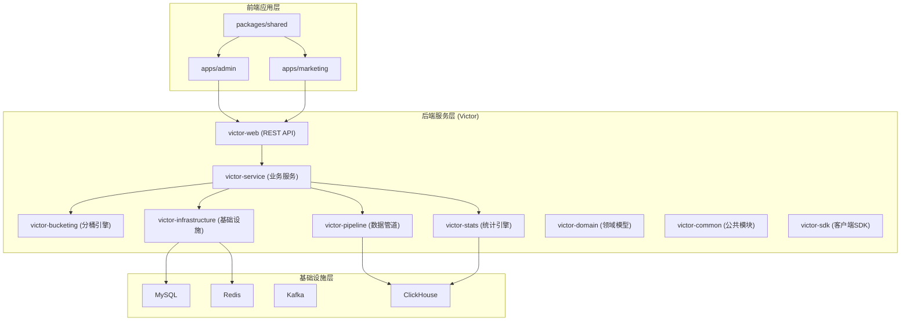
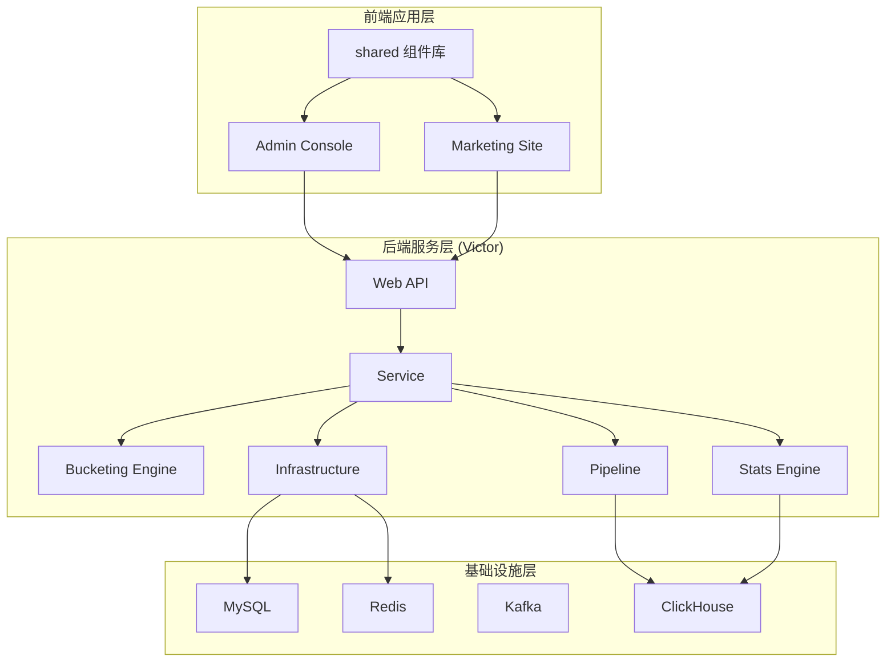
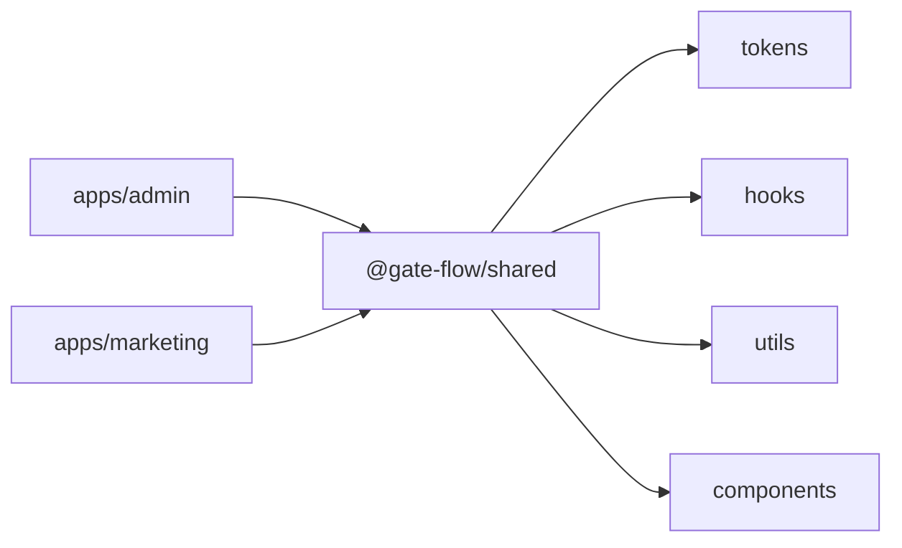
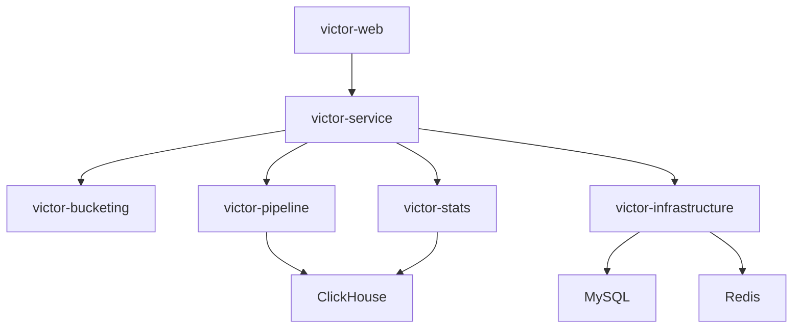
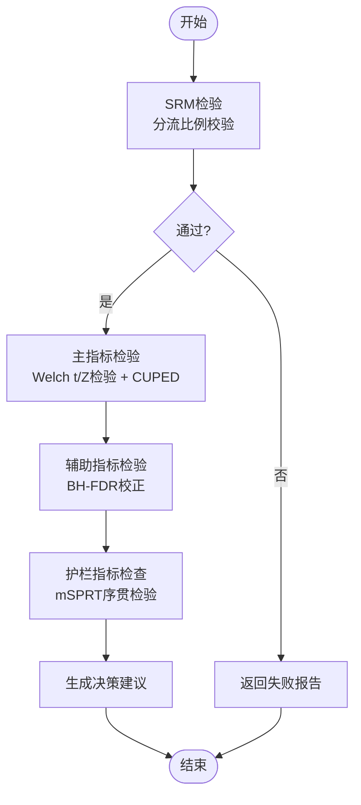
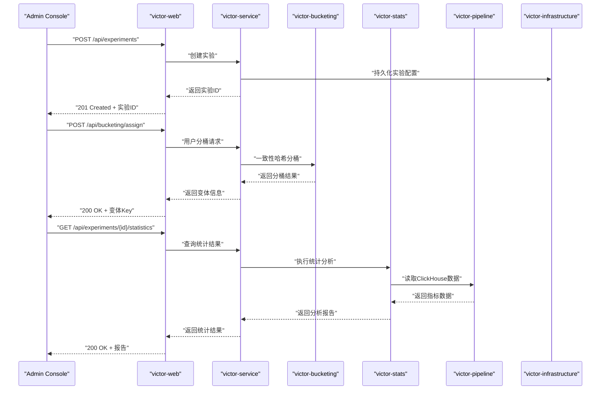
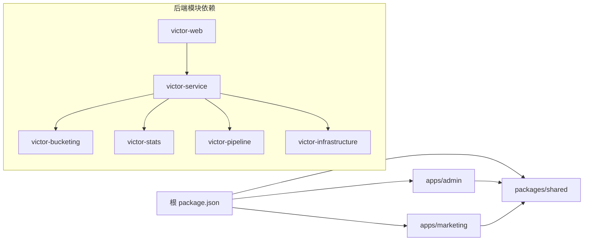

# 整体架构设计

<cite>
**本文引用的文件**
- [README.md](file://README.md)
- [pnpm-workspace.yaml](file://pnpm-workspace.yaml)
- [package.json](file://package.json)
- [tsconfig.base.json](file://tsconfig.base.json)
- [packages/shared/package.json](file://packages/shared/package.json)
- [packages/shared/src/index.ts](file://packages/shared/src/index.ts)
- [docs/ab/ab_experiment_platform_design.md](file://docs/ab/ab_experiment_platform_design.md)
- [docs/superpowers/specs/2026-05-05-victor-stats-engine-design.md](file://docs/superpowers/specs/2026-05-05-victor-stats-engine-design.md)
</cite>

## 目录
1. [引言](#引言)
2. [项目结构](#项目结构)
3. [核心组件](#核心组件)
4. [架构总览](#架构总览)
5. [详细组件分析](#详细组件分析)
6. [依赖分析](#依赖分析)
7. [性能考虑](#性能考虑)
8. [故障排查指南](#故障排查指南)
9. [结论](#结论)
10. [附录](#附录)

## 引言
本文件面向GateFlow整体架构设计，系统性阐述三层架构模式（前端应用层、后端服务层、基础设施层），并深入解析Monorepo架构（pnpm workspace）的组织方式与依赖管理策略。文档以“高内聚低耦合、可扩展性、可维护性”为核心设计原则，结合平台的实验管理、流量分配、数据分析与实时监控能力，给出系统边界、组件交互关系、数据流与控制流，并提供架构图与组件关系图，帮助开发者快速理解系统布局与协作关系。

## 项目结构
GateFlow采用Monorepo组织方式，前端通过apps目录下的Admin Console与Marketing Site两个应用构成，共享组件库位于packages/shared；后端采用多模块分层的微服务架构，位于backend/victor-ab目录下。整体结构如下：

图表来源
- [README.md:70-188](file://README.md#L70-L188)
- [pnpm-workspace.yaml:1-4](file://pnpm-workspace.yaml#L1-L4)
- [package.json:1-18](file://package.json#L1-L18)
- [tsconfig.base.json:16-19](file://tsconfig.base.json#L16-L19)

章节来源
- [README.md:137-188](file://README.md#L137-L188)
- [pnpm-workspace.yaml:1-4](file://pnpm-workspace.yaml#L1-L4)
- [package.json:1-18](file://package.json#L1-L18)
- [tsconfig.base.json:16-19](file://tsconfig.base.json#L16-L19)

## 核心组件
- 前端应用层
  - Admin Console：实验管理、流量配置、数据分析、知识库等核心功能的统一控制台。
  - Marketing Site：面向用户的营销展示页面。
  - 共享组件库shared：提供通用UI组件、Hooks、设计令牌与工具函数，供两个前端应用复用。
- 后端服务层（Victor）
  - Web层：REST API控制器，对外提供实验管理、流量分配、统计分析等接口。
  - 业务服务层：实验编排、分桶与统计服务协调。
  - 分桶引擎：基于一致性哈希的流量分配与正交分桶。
  - 统计引擎：SRM检验、Z检验、Welch t检验、CUPED方差缩减、BH多重校正、mSPRT序贯检验。
  - 数据管道：Kafka事件流消费与ClickHouse写入。
  - 基础设施：数据访问、缓存、Flyway迁移、连接池等。
  - 领域模型与公共模块：实体、DTO、枚举与工具类。
  - 客户端SDK：Java SDK，便于业务方集成。
- 基础设施层
  - MySQL：持久化存储。
  - Redis：缓存与会话。
  - Kafka：事件流。
  - ClickHouse：实时分析。

章节来源
- [README.md:70-136](file://README.md#L70-L136)
- [README.md:137-188](file://README.md#L137-L188)
- [docs/ab/ab_experiment_platform_design.md:21-39](file://docs/ab/ab_experiment_platform_design.md#L21-L39)
- [docs/superpowers/specs/2026-05-05-victor-stats-engine-design.md:26-67](file://docs/superpowers/specs/2026-05-05-victor-stats-engine-design.md#L26-L67)

## 架构总览
GateFlow采用三层架构与微服务解耦：
- 前端应用层：Admin Console与Marketing Site通过共享组件库实现高内聚低耦合，统一UI与交互体验。
- 后端服务层：以Victor为核心，按功能域划分模块，Web层仅暴露API，业务逻辑下沉至服务层，分桶与统计分别由引擎模块实现，数据管道与基础设施模块支撑。
- 基础设施层：MySQL、Redis、Kafka、ClickHouse形成数据与消息通道，支撑实验数据的持久化、缓存与实时分析。

图表来源
- [README.md:70-136](file://README.md#L70-L136)
- [docs/ab/ab_experiment_platform_design.md:21-39](file://docs/ab/ab_experiment_platform_design.md#L21-L39)

## 详细组件分析

### 前端Monorepo与共享组件库
- Monorepo组织：通过pnpm workspace将apps与packages纳入统一管理，实现依赖去重与跨包引用。
- 路径别名：tsconfig.base.json配置@gate-flow/shared路径别名，简化导入。
- 共享组件：packages/shared提供tokens、hooks、utils、components四大类，统一设计语言与交互行为，降低重复开发成本。
- 依赖策略：shared声明peerDependencies与devDependencies，确保与宿主应用React生态兼容。

图表来源
- [pnpm-workspace.yaml:1-4](file://pnpm-workspace.yaml#L1-L4)
- [package.json:1-18](file://package.json#L1-L18)
- [tsconfig.base.json:16-19](file://tsconfig.base.json#L16-L19)
- [packages/shared/package.json:1-36](file://packages/shared/package.json#L1-L36)
- [packages/shared/src/index.ts:1-5](file://packages/shared/src/index.ts#L1-L5)

章节来源
- [pnpm-workspace.yaml:1-4](file://pnpm-workspace.yaml#L1-L4)
- [package.json:1-18](file://package.json#L1-L18)
- [tsconfig.base.json:16-19](file://tsconfig.base.json#L16-L19)
- [packages/shared/package.json:1-36](file://packages/shared/package.json#L1-L36)
- [packages/shared/src/index.ts:1-5](file://packages/shared/src/index.ts#L1-L5)

### 后端微服务模块与职责边界
- Web层：提供REST API，作为唯一对外入口，负责请求路由与响应封装。
- Service层：编排业务流程，协调分桶与统计引擎，调用基础设施模块。
- Bucketing Engine：实现一致性哈希与正交分桶，保障流量隔离与冲突检测。
- Stats Engine：实现SRM、Welch t检验、Z检验、CUPED、BH校正、mSPRT等统计算法，输出实验报告与决策建议。
- Pipeline：消费Kafka事件，清洗与落库至ClickHouse，支撑实时分析。
- Infrastructure：数据访问、缓存、Flyway迁移、连接配置等。
- Domain/Common/SDK：领域模型、公共常量与客户端SDK。

图表来源
- [README.md:170-188](file://README.md#L170-L188)
- [docs/superpowers/specs/2026-05-05-victor-stats-engine-design.md:26-67](file://docs/superpowers/specs/2026-05-05-victor-stats-engine-design.md#L26-L67)

章节来源
- [README.md:170-188](file://README.md#L170-L188)
- [docs/superpowers/specs/2026-05-05-victor-stats-engine-design.md:26-67](file://docs/superpowers/specs/2026-05-05-victor-stats-engine-design.md#L26-L67)

### 统计引擎核心流程
统计引擎遵循“SRM校验—主指标检验—辅助指标校正—护栏指标检查”的顺序流程，结合CUPED降方差、BH校正与mSPRT早停，确保结论可信与实验周期可控。

图表来源
- [docs/superpowers/specs/2026-05-05-victor-stats-engine-design.md:14-22](file://docs/superpowers/specs/2026-05-05-victor-stats-engine-design.md#L14-L22)
- [docs/superpowers/specs/2026-05-05-victor-stats-engine-design.md:720-790](file://docs/superpowers/specs/2026-05-05-victor-stats-engine-design.md#L720-L790)

章节来源
- [docs/superpowers/specs/2026-05-05-victor-stats-engine-design.md:14-22](file://docs/superpowers/specs/2026-05-05-victor-stats-engine-design.md#L14-L22)
- [docs/superpowers/specs/2026-05-05-victor-stats-engine-design.md:720-790](file://docs/superpowers/specs/2026-05-05-victor-stats-engine-design.md#L720-L790)

### API调用序列（以实验管理为例）
以下序列图展示前端Admin Console调用后端Web层的典型流程，体现控制流与数据流的边界。

图表来源
- [README.md:304-331](file://README.md#L304-L331)
- [README.md:170-188](file://README.md#L170-L188)

章节来源
- [README.md:304-331](file://README.md#L304-L331)
- [README.md:170-188](file://README.md#L170-L188)

## 依赖分析
- 前端依赖管理
  - pnpm workspace统一管理apps与packages，根package.json提供并行开发脚本，支持按应用过滤启动。
  - tsconfig.base.json通过路径别名@gate-flow/shared实现跨包引用，避免硬编码路径。
  - shared组件库声明peerDependencies，确保与宿主应用React版本一致。
- 后端模块依赖
  - 后端模块通过Maven多模块管理，Web层依赖Service层，Service层再依赖Bucketing、Stats、Pipeline与Infrastructure模块，形成清晰的层次依赖。
  - 统计引擎模块独立性强，仅通过聚合器与数据源交互，便于替换与扩展。

图表来源
- [pnpm-workspace.yaml:1-4](file://pnpm-workspace.yaml#L1-L4)
- [package.json:1-18](file://package.json#L1-L18)
- [tsconfig.base.json:16-19](file://tsconfig.base.json#L16-L19)
- [README.md:170-188](file://README.md#L170-L188)

章节来源
- [pnpm-workspace.yaml:1-4](file://pnpm-workspace.yaml#L1-L4)
- [package.json:1-18](file://package.json#L1-L18)
- [tsconfig.base.json:16-19](file://tsconfig.base.json#L16-L19)
- [README.md:170-188](file://README.md#L170-L188)

## 性能考虑
- 前端性能
  - 通过共享组件库减少重复实现，提升构建与运行效率。
  - 路径别名与按需引入降低打包体积与循环依赖风险。
- 后端性能
  - 统计引擎采用CUPED降方差与mSPRT早停，缩短实验周期并降低无效样本量。
  - 数据管道基于Kafka与ClickHouse，支持高吞吐事件流与实时分析。
  - 基础设施模块通过缓存与连接池优化数据库访问延迟。

## 故障排查指南
- 前端常见问题
  - 依赖安装失败：清理pnpm store并重新安装。
  - 端口冲突：修改相应应用的端口配置。
- 后端常见问题
  - 数据库连接失败：检查MySQL容器状态与日志。
  - Redis连接失败：检查Redis容器状态并使用CLI测试连通性。
- 通用排查
  - 查看后端Swagger文档与健康检查端点，定位服务状态。

章节来源
- [README.md:474-510](file://README.md#L474-L510)

## 结论
GateFlow通过三层架构与Monorepo组织，实现了前端高内聚低耦合、后端模块化微服务与基础设施解耦。统计引擎与数据管道的设计确保了实验结论的科学性与实时性，配合严格的权限模型与审计体系，为实验平台提供了可扩展、可维护、可治理的整体架构。

## 附录
- 快速开始与配置参考
  - 前端开发：并行启动Admin Console与Marketing Site，或单独启动任一应用。
  - 后端开发：启动依赖服务（MySQL、Redis），编译并启动Web层。
  - 配置覆盖：通过环境变量覆盖Spring配置。
- API参考
  - 实验管理、流量分配、统计分析等接口可通过Swagger文档查看。

章节来源
- [README.md:192-270](file://README.md#L192-L270)
- [README.md:334-367](file://README.md#L334-L367)
- [README.md:296-331](file://README.md#L296-L331)