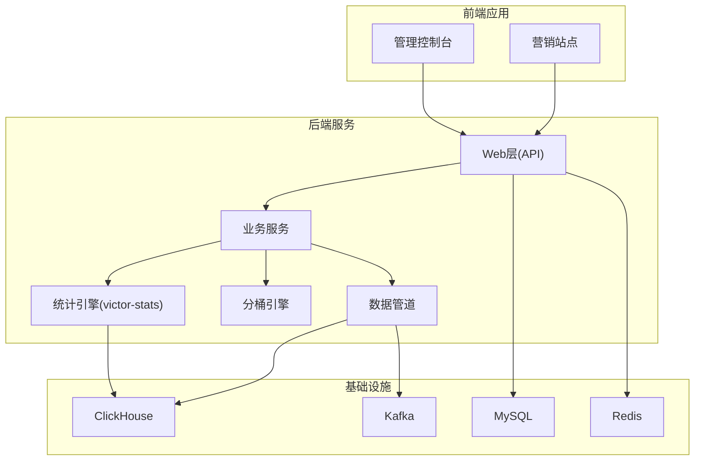
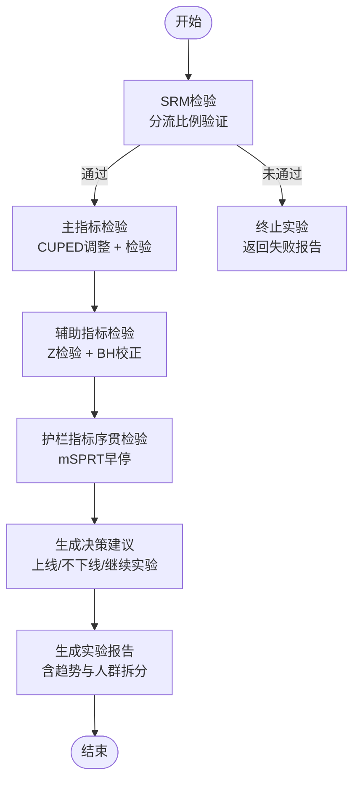
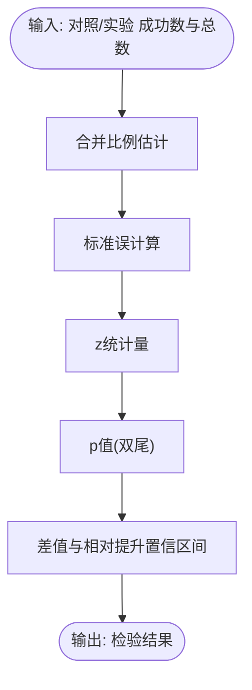
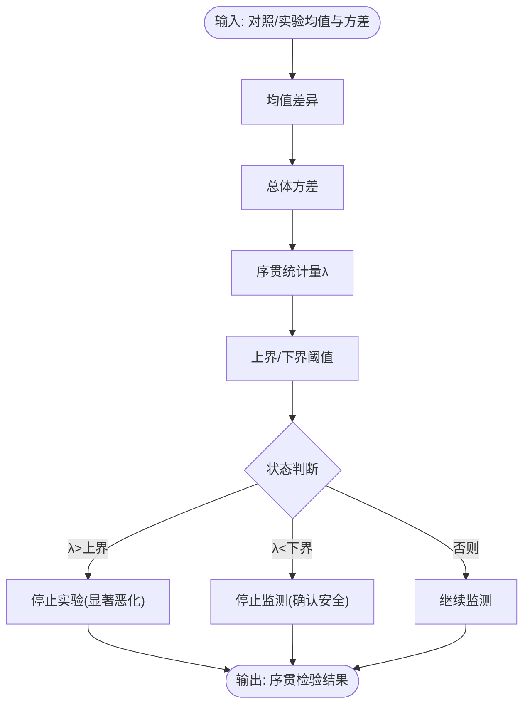
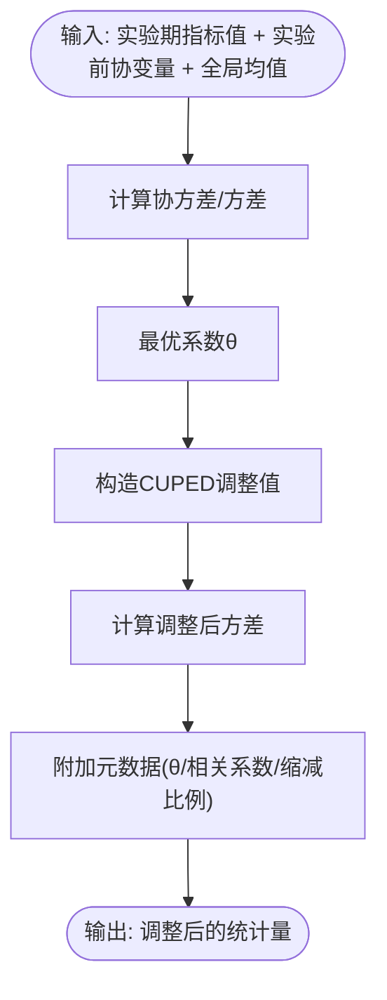
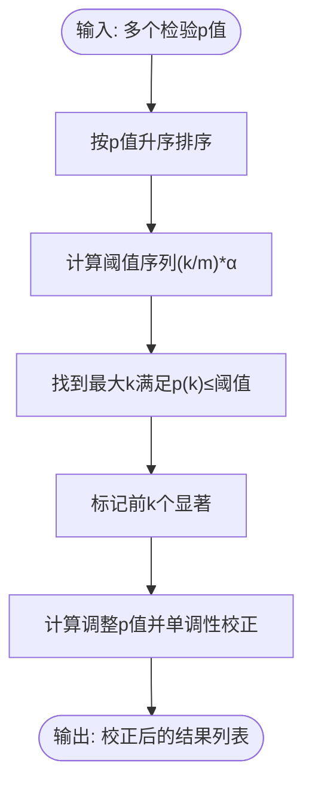
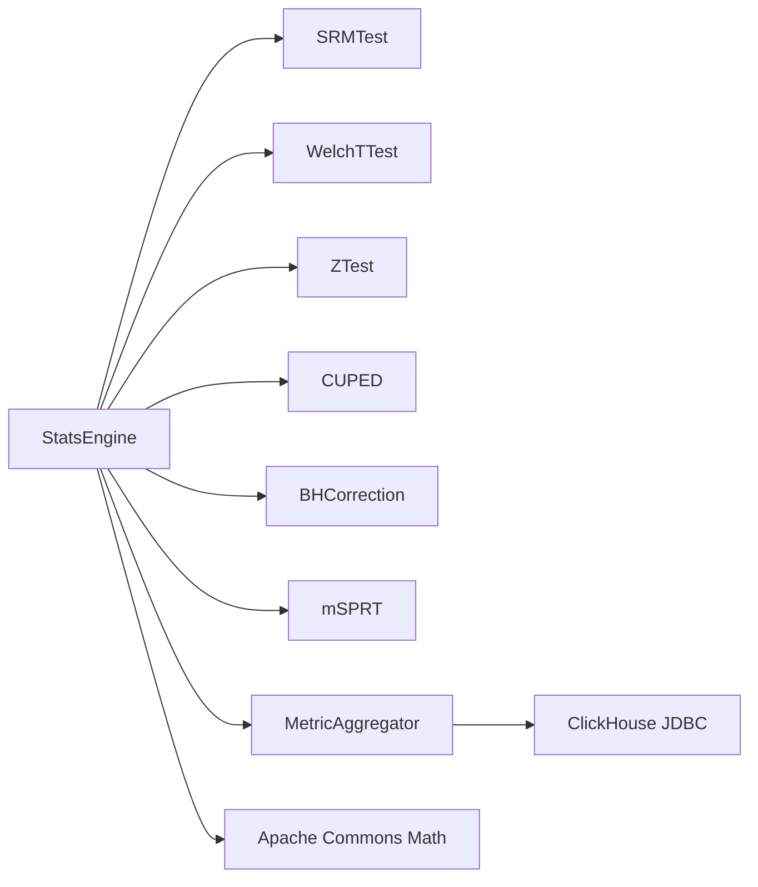

# 统计分析系统

<cite>
**本文引用的文件**
- [README.md](file://README.md)
- [2026-05-05-victor-stats-engine-design.md](file://docs/superpowers/specs/2026-05-05-victor-stats-engine-design.md)
- [2026-05-05-victor-pipeline-stats-plan.md](file://docs/superpowers/plans/2026-05-05-victor-pipeline-stats-plan.md)
- [ab_experiment_system_architecture.html](file://docs/ab/ab_experiment_system_architecture.html)
</cite>

## 目录
1. [引言](#引言)
2. [项目结构](#项目结构)
3. [核心组件](#核心组件)
4. [架构总览](#架构总览)
5. [详细组件分析](#详细组件分析)
6. [依赖分析](#依赖分析)
7. [性能考虑](#性能考虑)
8. [故障排查指南](#故障排查指南)
9. [结论](#结论)
10. [附录](#附录)

## 引言
本文件面向GateFlow统计分析系统，围绕A/B实验平台的统计引擎进行深入的技术与统计学说明。内容涵盖Z-Test显著性检验、mSPRT序贯检验（支持早停）、CUPED方差缩减技术、BH多重检验校正等先进统计方法；解释统计功效与样本量估算的实现思路；阐述A/A测试验证机制（零假设检验、假阳性率控制、实验质量评估）；介绍时间序列分析与人群拆分的实现方法；并提供统计结果解读指南与智能化报告生成、自动化决策建议、结果可视化的实现路径。

## 项目结构
GateFlow采用前后端分离架构，统计分析能力集中在后端的victor-stats模块，结合ClickHouse进行实时数据聚合与统计计算，并通过Web API对外提供实验统计分析服务。

图表来源
- [README.md:70-136](file://README.md#L70-L136)
- [README.md:170-188](file://README.md#L170-L188)

章节来源
- [README.md:21-67](file://README.md#L21-L67)
- [README.md:70-136](file://README.md#L70-L136)
- [README.md:170-188](file://README.md#L170-L188)

## 核心组件
- 统计引擎（StatsEngine）：统筹SRM检验、主指标检验（含CUPED）、辅助指标BH校正、护栏指标mSPRT序贯检验，并生成实验报告与决策建议。
- 核心算法：SRM卡方检验、Welch t检验、Z检验（大样本比例）、CUPED方差缩减、BH-FDR多重校正、mSPRT序贯检验。
- 数据聚合：基于ClickHouse的指标聚合与实验前数据提取，支撑CUPED与趋势分析。
- 报告与可视化：实验报告结构化输出、趋势分析、人群拆分分析、自动化决策建议。

章节来源
- [2026-05-05-victor-stats-engine-design.md:720-926](file://docs/superpowers/specs/2026-05-05-victor-stats-engine-design.md#L720-L926)
- [2026-05-05-victor-stats-engine-design.md:930-986](file://docs/superpowers/specs/2026-05-05-victor-stats-engine-design.md#L930-L986)
- [2026-05-05-victor-stats-engine-design.md:1027-1069](file://docs/superpowers/specs/2026-05-05-victor-stats-engine-design.md#L1027-L1069)

## 架构总览
统计分析流程遵循“分流验证—主指标—辅助指标—护栏指标”的顺序，确保实验质量与安全性。

图表来源
- [2026-05-05-victor-stats-engine-design.md:14-22](file://docs/superpowers/specs/2026-05-05-victor-stats-engine-design.md#L14-L22)
- [2026-05-05-victor-stats-engine-design.md:759-789](file://docs/superpowers/specs/2026-05-05-victor-stats-engine-design.md#L759-L789)

章节来源
- [2026-05-05-victor-stats-engine-design.md:14-22](file://docs/superpowers/specs/2026-05-05-victor-stats-engine-design.md#L14-L22)
- [2026-05-05-victor-stats-engine-design.md:759-789](file://docs/superpowers/specs/2026-05-05-victor-stats-engine-design.md#L759-L789)

## 详细组件分析

### Z-Test 显著性检验
- 适用场景：大样本比例类指标（如转化率、点击率），样本量每组>10000。
- 关键实现要点：
  - 合并比例估计用于标准误计算，提高稳定性。
  - 使用正态近似计算z统计量与p值。
  - 计算差值与相对提升的置信区间，支持效应量解读。
- 输出：包含检验统计量、p值、显著性、提升估计与置信区间。

图表来源
- [2026-05-05-victor-stats-engine-design.md:422-491](file://docs/superpowers/specs/2026-05-05-victor-stats-engine-design.md#L422-L491)
- [2026-05-05-victor-pipeline-stats-plan.md:1097-1152](file://docs/superpowers/plans/2026-05-05-victor-pipeline-stats-plan.md#L1097-L1152)

章节来源
- [2026-05-05-victor-stats-engine-design.md:415-491](file://docs/superpowers/specs/2026-05-05-victor-stats-engine-design.md#L415-L491)
- [2026-05-05-victor-pipeline-stats-plan.md:1097-1152](file://docs/superpowers/plans/2026-05-05-victor-pipeline-stats-plan.md#L1097-L1152)

### mSPRT 序贯检验（支持早停）
- 目的：护栏指标持续监测，支持早停（显著恶化即停止实验）。
- 关键实现要点：
  - 基于混合效应量假设的序贯统计量λ，设定上界与下界阈值。
  - 单侧检验检测“恶化”方向，避免误判“改善”。
  - 状态：停止实验（显著恶化）、停止监测（确认安全）、继续监测。
- 应用：对关键用户体验指标（如加载延迟）进行早停保护。

图表来源
- [2026-05-05-victor-stats-engine-design.md:590-716](file://docs/superpowers/specs/2026-05-05-victor-stats-engine-design.md#L590-L716)
- [2026-05-05-victor-pipeline-stats-plan.md:1427-1478](file://docs/superpowers/plans/2026-05-05-victor-pipeline-stats-plan.md#L1427-L1478)

章节来源
- [2026-05-05-victor-stats-engine-design.md:590-716](file://docs/superpowers/specs/2026-05-05-victor-stats-engine-design.md#L590-L716)
- [2026-05-05-victor-pipeline-stats-plan.md:1427-1478](file://docs/superpowers/plans/2026-05-05-victor-pipeline-stats-plan.md#L1427-L1478)

### CUPED 方差缩减技术
- 目的：利用实验前协变量降低指标方差，缩短实验周期。
- 关键实现要点：
  - 计算最优系数θ=协方差/协变量方差，构造CUPED调整值。
  - 保留均值不变，降低方差，提升检验效能。
  - 适用条件：协变量在实验前已确定、与指标高相关、所有用户具备实验前数据。
- 输出：包含θ、相关系数、方差缩减比例与原始方差元数据。

图表来源
- [2026-05-05-victor-stats-engine-design.md:287-405](file://docs/superpowers/specs/2026-05-05-victor-stats-engine-design.md#L287-L405)
- [2026-05-05-victor-pipeline-stats-plan.md:1207-1262](file://docs/superpowers/plans/2026-05-05-victor-pipeline-stats-plan.md#L1207-L1262)

章节来源
- [2026-05-05-victor-stats-engine-design.md:287-405](file://docs/superpowers/specs/2026-05-05-victor-stats-engine-design.md#L287-L405)
- [2026-05-05-victor-pipeline-stats-plan.md:1207-1262](file://docs/superpowers/plans/2026-05-05-victor-pipeline-stats-plan.md#L1207-L1262)

### BH 多重检验校正
- 目的：多辅助指标检验时控制假发现率（FDR），避免族错误率膨胀。
- 关键实现要点：
  - 将p值按升序排列，找到最大k使p(k) ≤ (k/m)·α。
  - 对后续p值进行单调性校正，输出BH校正后的显著性与调整p值。
- 应用：在主指标检验后对多个辅助指标进行校正，确保整体推断稳健。

图表来源
- [2026-05-05-victor-stats-engine-design.md:495-586](file://docs/superpowers/specs/2026-05-05-victor-stats-engine-design.md#L495-L586)

章节来源
- [2026-05-05-victor-stats-engine-design.md:495-586](file://docs/superpowers/specs/2026-05-05-victor-stats-engine-design.md#L495-L586)

### Welch t 检验
- 适用场景：样本量较小或方差不齐时的均值差异检验。
- 关键实现要点：
  - 使用Welch标准误与自由度（Welch-Satterthwaite公式）。
  - 双尾检验，计算置信区间与相对提升。
- 应用：主指标为连续指标且样本量不足大样本时的首选。

章节来源
- [2026-05-05-victor-stats-engine-design.md:154-230](file://docs/superpowers/specs/2026-05-05-victor-stats-engine-design.md#L154-L230)

### SRM 检验（分流比例验证）
- 目的：验证实际分流比例与预期一致，检测分流系统缺陷。
- 关键实现要点：
  - 卡方检验统计量与p值，显著性阈值通常较低以保护实验质量。
- 应用：实验启动后与运行期间定期校验，异常则暂停实验。

章节来源
- [2026-05-05-victor-stats-engine-design.md:73-144](file://docs/superpowers/specs/2026-05-05-victor-stats-engine-design.md#L73-L144)

### A/A 测试验证机制
- 目的：在对照组之间验证统计流程的稳定性，控制假阳性率。
- 关键实现要点：
  - 将同一实验组作为对照与实验组进行检验，理论上应不显著。
  - 通过长期运行A/A测试评估整体假阳性率，作为实验质量评估指标。
- 应用：平台级质量门禁，确保统计流程稳健。

章节来源
- [README.md:48-54](file://README.md#L48-L54)

### 时间序列分析与人群拆分
- 时间序列分析：基于ClickHouse聚合的每日指标，进行趋势分析与周期性检测，辅助实验解读与归因。
- 人群拆分：按维度（如地区、设备、用户属性）拆分，评估不同群体的异质性效应，指导精细化决策。

章节来源
- [2026-05-05-victor-stats-engine-design.md:1027-1069](file://docs/superpowers/specs/2026-05-05-victor-stats-engine-design.md#L1027-L1069)
- [2026-05-05-victor-stats-engine-design.md:930-986](file://docs/superpowers/specs/2026-05-05-victor-stats-engine-design.md#L930-L986)

### 统计结果解读指南
- p值：在H0成立前提下，观察到当前或更极端结果的概率。p<α（通常0.05）拒绝H0，认为存在显著差异。
- 置信区间：以一定概率包含真实参数的区间。宽度反映估计精度，包含0表示不显著。
- 效应量：相对提升（lift）与差值提升，结合置信区间评估实际意义。
- 早停与稳健性：mSPRT早停保护用户体验，BH校正控制多重比较风险，CUPED提升检验效能。

章节来源
- [2026-05-05-victor-stats-engine-design.md:14-22](file://docs/superpowers/specs/2026-05-05-victor-stats-engine-design.md#L14-L22)
- [2026-05-05-victor-stats-engine-design.md:1135-1160](file://docs/superpowers/specs/2026-05-05-victor-stats-engine-design.md#L1135-L1160)

### 统计报告生成与自动化决策
- 报告结构：包含SRM、主指标、辅助指标（含BH校正）、护栏指标（含mSPRT）、推荐决策、时间趋势与人群拆分。
- 决策规则：护栏指标显著恶化则不下线；主指标显著且正向则上线；否则继续实验。
- 可视化：结合前端图表组件展示趋势与拆分结果，辅助非技术用户理解。

章节来源
- [2026-05-05-victor-stats-engine-design.md:1027-1069](file://docs/superpowers/specs/2026-05-05-victor-stats-engine-design.md#L1027-L1069)
- [2026-05-05-victor-stats-engine-design.md:720-926](file://docs/superpowers/specs/2026-05-05-victor-stats-engine-design.md#L720-L926)

## 依赖分析
- 统计计算依赖：Apache Commons Math（概率分布、CDF等）。
- 数据访问：ClickHouse JDBC，支持大规模指标聚合与实验前数据查询。
- Spring生态：Spring Boot、Lombok、MapStruct等，统一异常处理与对象映射。

图表来源
- [2026-05-05-victor-stats-engine-design.md:26-67](file://docs/superpowers/specs/2026-05-05-victor-stats-engine-design.md#L26-L67)
- [2026-05-05-victor-stats-engine-design.md:990-1023](file://docs/superpowers/specs/2026-05-05-victor-stats-engine-design.md#L990-L1023)

章节来源
- [2026-05-05-victor-stats-engine-design.md:26-67](file://docs/superpowers/specs/2026-05-05-victor-stats-engine-design.md#L26-L67)
- [2026-05-05-victor-stats-engine-design.md:990-1023](file://docs/superpowers/specs/2026-05-05-victor-stats-engine-design.md#L990-L1023)

## 性能考虑
- CUPED方差缩减：通过协变量信息降低方差，显著缩短实验周期（理论缩减比例见附录）。
- 大样本近似：Z检验在大样本下计算高效，减少自由度迭代与t分布查找成本。
- 序贯检验：mSPRT支持早停，避免无效长时间运行，节省资源。
- 实时聚合：基于ClickHouse的批量聚合与索引设计，支撑高频指标查询与趋势分析。

章节来源
- [2026-05-05-victor-stats-engine-design.md:287-405](file://docs/superpowers/specs/2026-05-05-victor-stats-engine-design.md#L287-L405)
- [2026-05-05-victor-stats-engine-design.md:415-491](file://docs/superpowers/specs/2026-05-05-victor-stats-engine-design.md#L415-L491)
- [2026-05-05-victor-stats-engine-design.md:590-716](file://docs/superpowers/specs/2026-05-05-victor-stats-engine-design.md#L590-L716)

## 故障排查指南
- 分流异常（SRM检验失败）：检查分流配置与实验ID，必要时暂停实验并排查分流逻辑。
- 多辅助指标显著但主指标不显著：关注BH校正后的结果，避免过度解读单一指标。
- 护栏指标早停：若出现“显著恶化”，立即停止实验并回滚，评估用户体验影响。
- 数据质量问题：核查ClickHouse聚合SQL与实验前数据提取逻辑，确保协变量完整性。

章节来源
- [2026-05-05-victor-stats-engine-design.md:73-144](file://docs/superpowers/specs/2026-05-05-victor-stats-engine-design.md#L73-L144)
- [2026-05-05-victor-stats-engine-design.md:495-586](file://docs/superpowers/specs/2026-05-05-victor-stats-engine-design.md#L495-L586)
- [2026-05-05-victor-stats-engine-design.md:590-716](file://docs/superpowers/specs/2026-05-05-victor-stats-engine-design.md#L590-L716)
- [2026-05-05-victor-stats-engine-design.md:930-986](file://docs/superpowers/specs/2026-05-05-victor-stats-engine-design.md#L930-L986)

## 结论
GateFlow统计分析系统通过SRM、Z检验、Welch t检验、CUPED、BH校正与mSPRT序贯检验的组合，构建了从分流验证到早停保护的全流程统计质量门禁。系统在保证统计稳健性的同时，借助CUPED与序贯检验显著提升实验效率，并通过结构化报告与自动化决策建议，帮助非技术用户理解复杂统计结果，实现智能化实验管理。

## 附录
- 统计量临界值参考（t分布）：见附录A。
- 方差缩减效果估算：见附录B。
- 决策规则汇总：见附录C。

章节来源
- [2026-05-05-victor-stats-engine-design.md:1135-1160](file://docs/superpowers/specs/2026-05-05-victor-stats-engine-design.md#L1135-L1160)