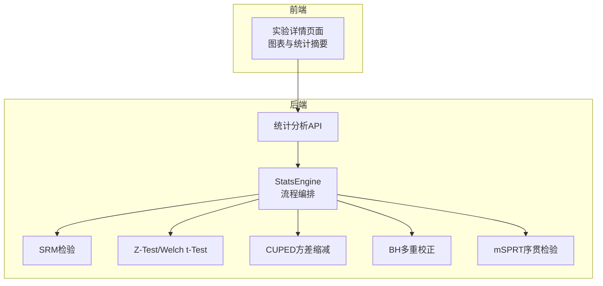
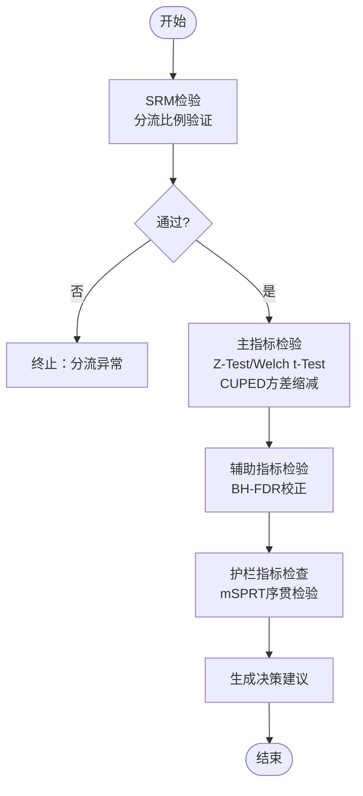
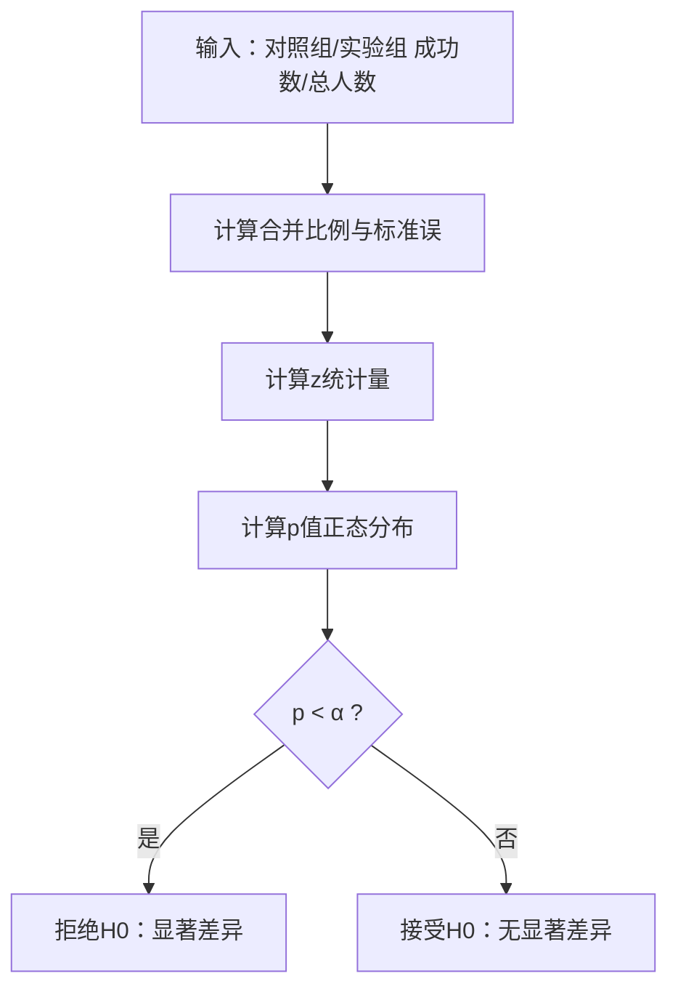
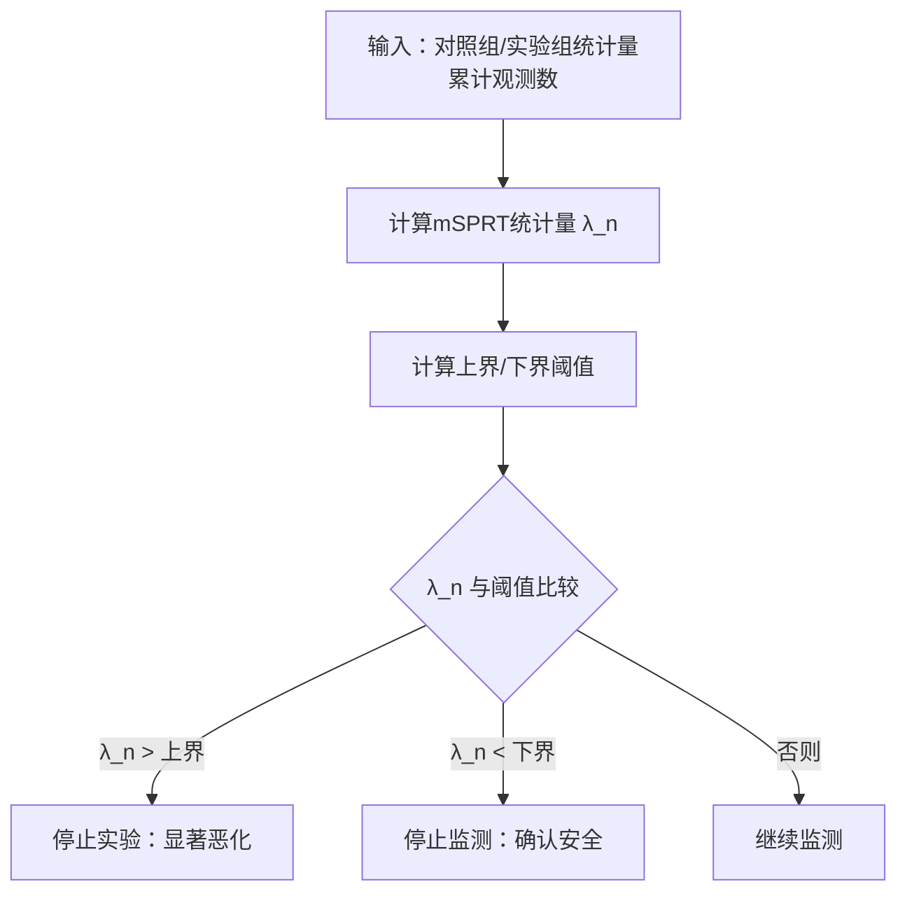
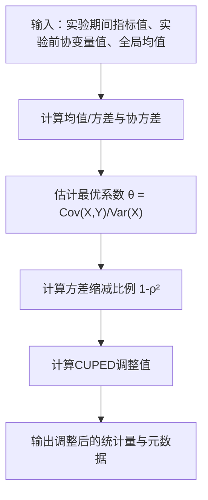
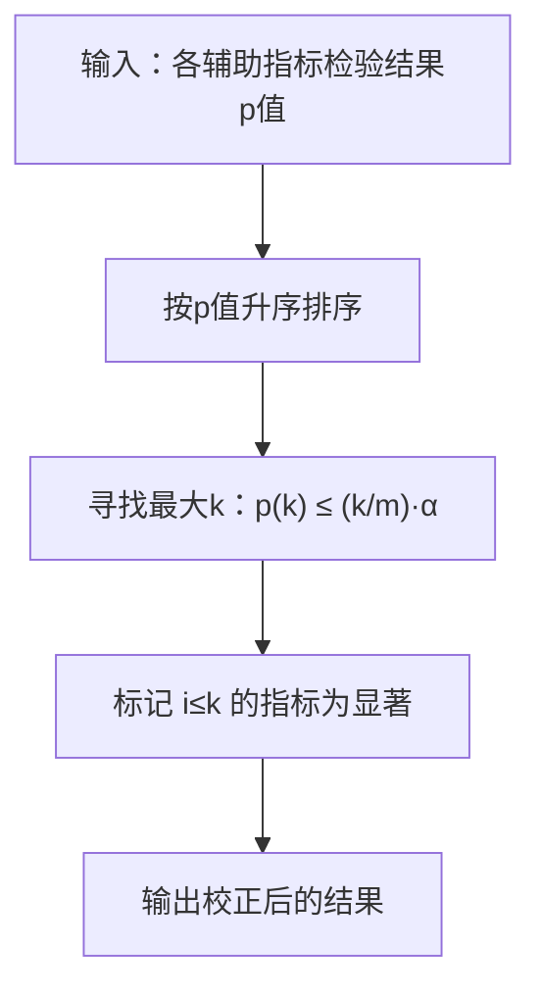
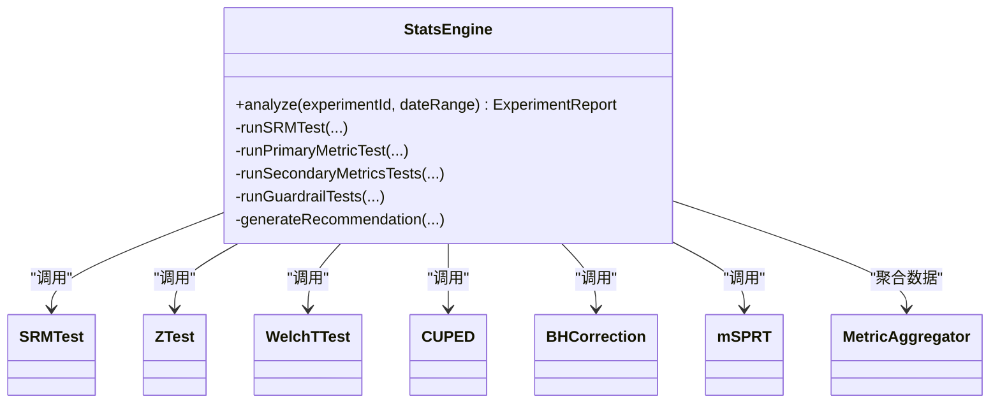

# 统计检验方法

<cite>
**本文引用的文件**
- [README.md](file://README.md)
- [2026-05-05-victor-stats-engine-design.md](file://docs/superpowers/specs/2026-05-05-victor-stats-engine-design.md)
- [ab_experiment_system_proposal.md](file://docs/ab/ab_experiment_system_proposal.md)
- [ab_experiment_system_architecture.html](file://docs/ab/ab_experiment_system_architecture.html)
- [IMPLEMENTATION_SUMMARY.md](file://docs/ab/IMPLEMENTATION_SUMMARY.md)
- [experiment_detail_enhancement_plan.md](file://docs/ab/experiment_detail_enhancement_plan.md)
- [enhancement_progress.md](file://docs/ab/enhancement_progress.md)
</cite>

## 目录
1. [引言](#引言)
2. [项目结构](#项目结构)
3. [核心组件](#核心组件)
4. [架构总览](#架构总览)
5. [详细组件分析](#详细组件分析)
6. [依赖分析](#依赖分析)
7. [性能考量](#性能考量)
8. [故障排查指南](#故障排查指南)
9. [结论](#结论)
10. [附录](#附录)

## 引言
本文件面向GateFlow平台的统计检验方法，系统性阐述以下四种核心技术：Z-Test显著性检验（单尾/双尾）、mSPRT序贯检验（早停机制）、CUPED方差缩减（协变量回归与方差降低）、以及BH多重检验校正（FDR控制）。文档将结合平台现有设计文档，给出方法论、实现要点、适用场景、优缺点对比、参数调优建议与实际应用案例，并提供可视化流程图帮助理解。

## 项目结构
- 平台后端包含“统计引擎”模块（victor-stats），负责实现SRM、Z-Test、Welch t-Test、CUPED、BH校正、mSPRT等算法，并在StatsEngine中编排完整分析流程。
- 前端在实验详情页面集成统计结果展示（转化率对比、趋势图、显著性状态等），并与后端统计API对接。

**图表来源**
- [2026-05-05-victor-stats-engine-design.md:720-926](file://docs/superpowers/specs/2026-05-05-victor-stats-engine-design.md#L720-L926)
- [ab_experiment_system_architecture.html:806-848](file://docs/ab/ab_experiment_system_architecture.html#L806-L848)

**章节来源**
- [README.md:48-61](file://README.md#L48-L61)
- [2026-05-05-victor-stats-engine-design.md:1-24](file://docs/superpowers/specs/2026-05-05-victor-stats-engine-design.md#L1-L24)

## 核心组件
- SRM检验（样本比例不匹配，卡方检验）：用于验证分流比例是否符合预期，作为后续分析的前提。
- 主指标检验：根据样本量与指标类型选择Z-Test（大样本比例）或Welch t-Test（小样本/方差不等），并可结合CUPED进行方差缩减。
- 辅助指标校正：对多个辅助指标进行BH-FDR校正，控制假发现率。
- 护栏指标检查：使用mSPRT序贯检验，持续监测核心用户体验指标，支持早停。

**章节来源**
- [2026-05-05-victor-stats-engine-design.md:14-22](file://docs/superpowers/specs/2026-05-05-victor-stats-engine-design.md#L14-L22)
- [ab_experiment_system_architecture.html:806-848](file://docs/ab/ab_experiment_system_architecture.html#L806-L848)

## 架构总览
统计分析流程如下：先做SRM检验，再进行主指标检验（含CUPED），随后对辅助指标进行BH校正，最后对护栏指标进行mSPRT序贯检验并生成决策建议。

**图表来源**
- [2026-05-05-victor-stats-engine-design.md:759-926](file://docs/superpowers/specs/2026-05-05-victor-stats-engine-design.md#L759-L926)

**章节来源**
- [2026-05-05-victor-stats-engine-design.md:720-926](file://docs/superpowers/specs/2026-05-05-victor-stats-engine-design.md#L720-L926)

## 详细组件分析

### Z-Test显著性检验（单尾/双尾）
- 目标：在大样本比例类指标（如转化率、点击率）下，比较对照组与实验组的差异是否具有统计显著性。
- 方法与步骤：
  - 假设设定：双尾检验通常以α=0.05为显著性水平；单尾检验用于明确方向性（如提升/恶化）。
  - 统计量：z统计量，基于合并比例的方差估计。
  - p值计算：基于标准正态分布的累积分布函数。
  - 显著性判断：若p值小于α，则拒绝零假设，认为存在显著差异。
- 适用场景：
  - 大样本（每组>10000）且指标为比例类。
  - 需要快速得出显著性结论，且对方向性不敏感时采用双尾；若关注提升或恶化方向时采用单尾。
- 优缺点：
  - 优点：计算简单、适用面广、在大样本下近似可靠。
  - 缺点：对小样本不稳健；对非正态分布的连续指标不适用。
- 参数调优建议：
  - 显著性水平α：常规0.05；若追求更保守结论可降至0.01。
  - 单尾/双尾：根据业务目标选择；单尾检验需有明确方向假设。
- 实际应用案例：
  - 转化率差异检验：对照组与实验组的成功数/总人数分别输入，得到z统计量、p值与置信区间。

**图表来源**
- [2026-05-05-victor-stats-engine-design.md:429-491](file://docs/superpowers/specs/2026-05-05-victor-stats-engine-design.md#L429-L491)

**章节来源**
- [2026-05-05-victor-stats-engine-design.md:415-491](file://docs/superpowers/specs/2026-05-05-victor-stats-engine-design.md#L415-L491)
- [ab_experiment_system_proposal.md:746-773](file://docs/ab/ab_experiment_system_proposal.md#L746-L773)

### mSPRT序贯检验（早停机制）
- 目标：在实验运行期间持续监测护栏指标，支持早停（显著恶化停止实验；确认安全则停止监测）。
- 理论基础与关键概念：
  - 似然比检验：基于假设效应量的混合分布（如正态分布），构造检验统计量λ_n。
  - 边界设定：上界阈值（检测恶化）与下界阈值（确认安全），控制整体第一类错误率。
  - 停止规则：当λ_n超过上界→停止实验；当λ_n低于下界→停止监测；否则继续观察。
- 适用场景：
  - 核心用户体验指标（如加载P90、崩溃率、关键转化率）的持续监控。
  - 需要动态样本量与早停能力，避免长期暴露潜在风险。
- 优缺点：
  - 优点：支持早停、控制整体假阳性率、无需预设样本量。
  - 缺点：边界计算较复杂；对参数（如效应量混合分布）敏感。
- 参数调优建议：
  - α：常规0.05；上界与下界的计算需与α匹配。
  - 效应量混合参数（如τ）：结合历史数据或专家经验设定。
- 实际应用案例：
  - 护栏指标（如页面加载P90）在每日监测中，若mSPRT统计量超过上界则触发早停建议。

**图表来源**
- [2026-05-05-victor-stats-engine-design.md:617-716](file://docs/superpowers/specs/2026-05-05-victor-stats-engine-design.md#L617-L716)

**章节来源**
- [2026-05-05-victor-stats-engine-design.md:590-716](file://docs/superpowers/specs/2026-05-05-victor-stats-engine-design.md#L590-L716)
- [ab_experiment_system_architecture.html:791-799](file://docs/ab/ab_experiment_system_architecture.html#L791-L799)

### CUPED方差缩减（协变量回归与方差降低）
- 数学原理：
  - 核心公式：Y_CUPED = Y − θ(X − E[X])，其中θ=Cov(X,Y)/Var(X)为最优回归系数。
  - 方差缩减效果：Var(Y_CUPED)=Var(Y)(1−ρ²)，ρ为协变量与指标的相关系数。
- 实现方法：
  - 输入：实验期间指标值、实验前协变量值、协变量全局均值。
  - 输出：调整后的样本统计量（均值不变，方差降低），并记录θ、相关系数、方差缩减比例等元数据。
- 适用场景：
  - 协变量在实验前已确定且与指标高度相关（ρ>0.5）。
  - 所有用户均有实验前数据（新用户不适用）。
- 优缺点：
  - 优点：显著缩短实验周期（20%-50%）、提高检验功效。
  - 缺点：对协变量选择敏感、需高质量的实验前数据。
- 参数调优建议：
  - 协变量选择：选择与主指标强相关的历史指标（如历史GMV、历史点击率）。
  - θ估计：确保协变量与指标的协方差与方差估计准确。
- 实际应用案例：
  - 主指标为转化率，协变量为用户历史GMV，经CUPED调整后显著降低方差，使Z-Test/Welch t-Test更稳健。

**图表来源**
- [2026-05-05-victor-stats-engine-design.md:316-405](file://docs/superpowers/specs/2026-05-05-victor-stats-engine-design.md#L316-L405)

**章节来源**
- [2026-05-05-victor-stats-engine-design.md:287-405](file://docs/superpowers/specs/2026-05-05-victor-stats-engine-design.md#L287-L405)
- [ab_experiment_system_proposal.md:750-767](file://docs/ab/ab_experiment_system_proposal.md#L750-L767)

### BH多重检验校正（FDR控制）
- 目的：在同时检验多个辅助指标时，控制假发现率（FDR），避免族错误率膨胀。
- 算法原理：
  - 对所有p值按升序排序：p(1)≤p(2)≤…≤p(m)。
  - 找到最大k，使得p(k) ≤ (k/m)·α。
  - 拒绝所有i≤k的假设。
- 实现与输出：
  - 对每个辅助指标执行检验，得到原始p值与置信区间。
  - 使用BH公式计算调整后的p值并标记显著性。
- 适用场景：
  - 探索性分析中同时检验多个指标，希望保留更多潜在效应。
- 优缺点：
  - 优点：控制FDR，提高检出能力。
  - 缺点：对多重比较数量敏感，需合理设定α。
- 参数调优建议：
  - α：常规0.05；可根据业务容忍度调整。
- 实际应用案例：
  - 同时检验多个辅助指标（如点击率、加购率、收藏率），经BH校正后筛选出真正显著的指标。

**图表来源**
- [2026-05-05-victor-stats-engine-design.md:518-586](file://docs/superpowers/specs/2026-05-05-victor-stats-engine-design.md#L518-L586)

**章节来源**
- [2026-05-05-victor-stats-engine-design.md:495-586](file://docs/superpowers/specs/2026-05-05-victor-stats-engine-design.md#L495-L586)
- [ab_experiment_system_proposal.md:774-789](file://docs/ab/ab_experiment_system_proposal.md#L774-L789)

## 依赖分析
- 统计引擎（StatsEngine）依赖多个算法模块：SRM、Z-Test、Welch t-Test、CUPED、BH校正、mSPRT。
- 数据聚合（MetricAggregator）为各算法提供样本统计量与指标数据。
- 决策建议（generateRecommendation）综合主指标与护栏指标结果，决定是否上线、不上线或继续实验。

**图表来源**
- [2026-05-05-victor-stats-engine-design.md:729-926](file://docs/superpowers/specs/2026-05-05-victor-stats-engine-design.md#L729-L926)

**章节来源**
- [2026-05-05-victor-stats-engine-design.md:720-926](file://docs/superpowers/specs/2026-05-05-victor-stats-engine-design.md#L720-L926)

## 性能考量
- 大样本优先：Z-Test适用于大样本比例类指标，可显著降低计算与存储压力。
- CUPED降方差：通过协变量回归降低方差，减少达到显著性的样本量需求。
- 序贯检验早停：mSPRT可在早期发现恶化并停止实验，节省资源。
- 多指标校正：BH校正控制FDR，避免无效指标拖累整体分析效率。

[本节为通用指导，无需引用具体文件]

## 故障排查指南
- SRM检验失败：若p值小于阈值（如0.01），应暂停实验并排查分流配置与数据采集问题。
- 主指标检验异常：检查样本量是否足够、是否应采用CUPED或Welch t-Test替代Z-Test。
- 辅助指标过多导致假阳性：启用BH校正，合理设定α并关注校正后的显著性。
- 护栏指标早停：若mSPRT触发停止实验，需评估用户体验风险并回滚变更。

**章节来源**
- [2026-05-05-victor-stats-engine-design.md:95-144](file://docs/superpowers/specs/2026-05-05-victor-stats-engine-design.md#L95-L144)
- [ab_experiment_system_architecture.html:791-799](file://docs/ab/ab_experiment_system_architecture.html#L791-L799)

## 结论
GateFlow平台通过SRM、Z-Test/Welch t-Test、CUPED、BH校正与mSPRT的组合，构建了从分流验证到早停决策的科学统计体系。实践中应依据样本量与指标类型选择合适方法，结合协变量与多重校正提升检验效率与可靠性，并以护栏指标保障用户体验安全。

[本节为总结，无需引用具体文件]

## 附录
- 前端实验详情页面增强：包含分流诊断（SRM检验、AA验证）、实验报告（转化率对比、趋势图、显著性状态）等可视化展示，便于业务人员理解统计结果。
- API对接建议：前端通过Vite代理访问后端统计API，逐步替换Mock数据为真实接口调用，并增加加载状态与错误处理。

**章节来源**
- [IMPLEMENTATION_SUMMARY.md:11-91](file://docs/ab/IMPLEMENTATION_SUMMARY.md#L11-L91)
- [enhancement_progress.md:63-108](file://docs/ab/enhancement_progress.md#L63-L108)
- [experiment_detail_enhancement_plan.md:63-122](file://docs/ab/experiment_detail_enhancement_plan.md#L63-L122)