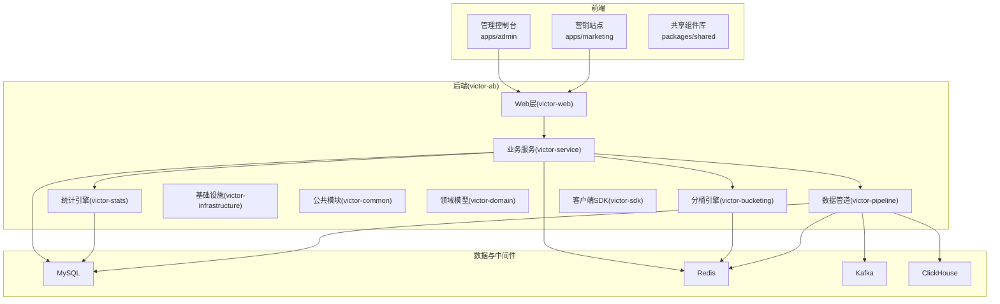
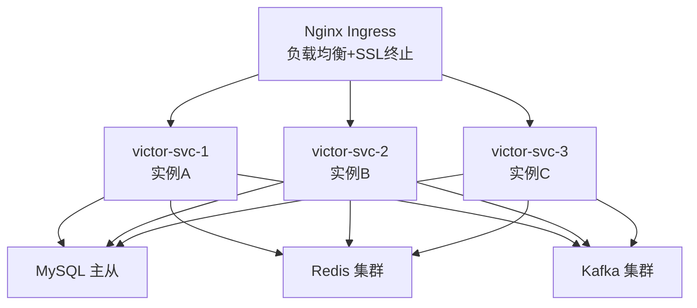
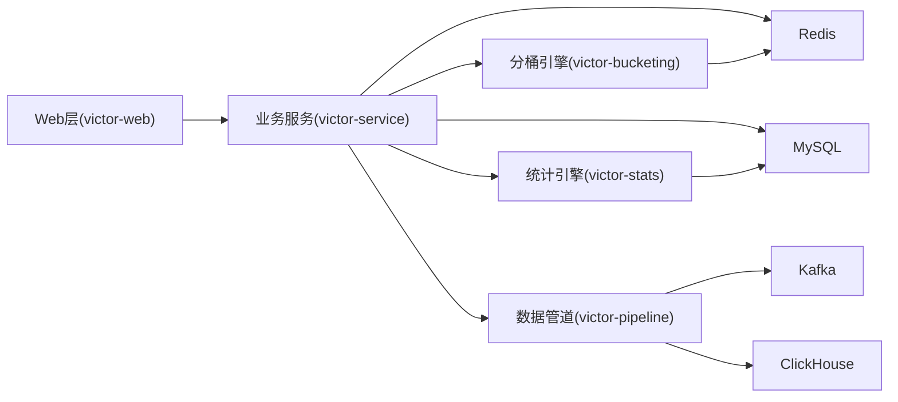

# 部署运维

<cite>
**本文引用的文件**
- [README.md](file://README.md)
- [package.json](file://package.json)
- [pnpm-workspace.yaml](file://pnpm-workspace.yaml)
- [2026-05-05-victor-pipeline-stats-plan.md](file://docs/superpowers/plans/2026-05-05-victor-pipeline-stats-plan.md)
- [2026-05-05-victor-stats-engine-design.md](file://docs/superpowers/specs/2026-05-05-victor-stats-engine-design.md)
- [2026-05-05-implementation-plan.md](file://docs/ab/implementation_plan.md)
- [2026-05-05-enhancement-progress.md](file://docs/ab/enhancement_progress.md)
- [2026-05-05-ab_experiment_platform_design.html](file://docs/ab/ab_experiment_platform_design.html)
</cite>

## 目录
1. [引言](#引言)
2. [项目结构](#项目结构)
3. [核心组件](#核心组件)
4. [架构总览](#架构总览)
5. [详细组件分析](#详细组件分析)
6. [依赖关系分析](#依赖关系分析)
7. [性能考虑](#性能考虑)
8. [故障排查指南](#故障排查指南)
9. [结论](#结论)
10. [附录](#附录)

## 引言
本文件面向GateFlow项目的部署与运维团队，提供从Docker容器化到Kubernetes云原生部署、监控告警、故障排查、应急响应、自动化脚本与容量规划的全流程运维指南。内容基于仓库现有文档与架构设计，结合后端微服务模块与数据管道设计，给出可落地的部署策略与最佳实践。

## 项目结构
- 前端采用Monorepo，包含管理控制台与营销站点两个应用，共享组件库。
- 后端为多模块微服务，包含Web层、领域模型、分桶引擎、基础设施、业务服务、SDK、数据管道与统计引擎等。
- 数据层涉及MySQL、Redis、Kafka与ClickHouse，支撑实验配置、分桶与事件流处理、实时分析。

**图表来源**
- [README.md: 前后端模块结构:137-188](file://README.md#L137-L188)
- [2026-05-05-victor-pipeline-stats-plan.md: 模块结构与技术栈:1-36](file://docs/superpowers/plans/2026-05-05-victor-pipeline-stats-plan.md#L1-L36)
- [2026-05-05-victor-stats-engine-design.md: 统计引擎服务层:720-926](file://docs/superpowers/specs/2026-05-05-victor-stats-engine-design.md#L720-L926)

**章节来源**
- [README.md: 前后端模块结构:137-188](file://README.md#L137-L188)
- [pnpm-workspace.yaml: 包管理器工作区配置:1-4](file://pnpm-workspace.yaml#L1-L4)
- [package.json: 顶层脚本与引擎约束:1-18](file://package.json#L1-L18)

## 核心组件
- Web层(victor-web)：对外提供REST API，承载实验管理、流量分配、配置下发等接口。
- 业务服务(victor-service)：封装实验生命周期、分桶与统计服务的业务逻辑。
- 数据管道(victor-pipeline)：事件采集、Kafka入湖、批量写入ClickHouse。
- 统计引擎(victor-stats)：SRM检验、Z检验、CUPED、BH多重检验校正、mSPRT序贯检验。
- 基础设施(victor-infrastructure)：数据访问、缓存、Flyway迁移。
- 分桶引擎(victor-bucketing)：一致性哈希分桶算法与流量分配。
- 领域模型与公共模块：统一的数据模型与工具类。
- 客户端SDK(victor-sdk)：提供配置拉取与事件上报能力。

**章节来源**
- [README.md: 后端模块结构:170-188](file://README.md#L170-L188)
- [2026-05-05-victor-stats-engine-design.md: 统计引擎服务层:720-926](file://docs/superpowers/specs/2026-05-05-victor-stats-engine-design.md#L720-L926)
- [2026-05-05-victor-pipeline-stats-plan.md: 模块结构与技术栈:1-36](file://docs/superpowers/plans/2026-05-05-victor-pipeline-stats-plan.md#L1-L36)

## 架构总览
下图展示了生产环境推荐的云原生部署拓扑，包含Ingress、多副本服务、以及核心依赖服务的高可用布局。

**图表来源**
- [2026-05-05-implementation-plan.md: 生产环境架构:1505-1530](file://docs/ab/implementation_plan.md#L1505-L1530)

## 详细组件分析

### Docker容器化部署方案
- 基础镜像与构建
  - 后端服务镜像构建：在后端根目录执行镜像构建命令，产出可运行的服务镜像。
  - 前端应用镜像：可基于静态产物构建Nginx镜像，或使用多阶段构建减少体积。
- 容器编排
  - 使用Compose编排后端服务与依赖（MySQL、Redis），便于本地与预生产环境快速拉起。
  - 生产环境建议迁移到Kubernetes，以Deployment/Service/Ingress实现弹性伸缩与流量治理。
- 环境变量与配置
  - 后端通过Spring配置覆盖环境变量，如数据库URL、Redis主机等。
  - 前端通过.env文件与Vite代理配置区分开发与生产环境。
- 容器最佳实践
  - 使用多阶段构建减少镜像体积；设置健康检查与资源限制；分离日志输出至标准输出；使用只读根文件系统与最小权限。

**章节来源**
- [README.md: Docker部署与日志查看:250-269](file://README.md#L250-L269)
- [README.md: 后端配置与环境变量覆盖:342-367](file://README.md#L342-L367)
- [README.md: 前端配置与Vite代理:336-341](file://README.md#L336-L341)

### Kubernetes集群部署策略
- Deployment配置
  - 为victor-web与各子服务分别创建Deployment，设置副本数、滚动更新策略、就绪/存活探针。
  - 使用PodDisruptionBudget保障关键服务的可用性。
- Service暴露
  - 使用ClusterIP暴露内部服务（如MySQL、Redis、Kafka），使用LoadBalancer或Ingress暴露Web API。
- Ingress路由
  - 通过Ingress规则将域名映射到对应Service，启用TLS终止与WAF/速率限制。
- ConfigMap与Secret管理
  - 将数据库连接串、Redis地址、Kafka主题等配置放入ConfigMap；敏感信息放入Secret。
  - 通过挂载或环境变量注入到Pod。
- 存储与持久化
  - MySQL与ClickHouse使用持久卷（PV/PVC），确保数据不丢失。
- 网络策略
  - 限制出站流量，仅放行必要端口；对内部服务启用NetworkPolicy。

**章节来源**
- [2026-05-05-implementation-plan.md: 生产环境架构:1505-1530](file://docs/ab/implementation_plan.md#L1505-L1530)
- [2026-05-05-victor-pipeline-stats-plan.md: 模块结构与技术栈:1-36](file://docs/superpowers/plans/2026-05-05-victor-pipeline-stats-plan.md#L1-L36)

### 监控告警系统配置
- 应用健康检查
  - 启用Spring Actuator健康端点，配置存活/就绪探针，结合K8s探针实现自动重启与流量摘除。
- 性能指标监控
  - 暴露Prometheus指标，关注JVM指标、数据库连接池、Kafka消费者滞后、ClickHouse写入延迟。
- 日志收集分析
  - 使用DaemonSet部署日志收集器，集中输出至ELK或Loki，结合告警规则进行异常检测。
- 告警规则设置
  - 护栏指标：mSPRT单侧阈值触发；SRM异常分流；Kafka堆积；数据库连接失败；Redis不可用。
  - 前端：页面加载时延、错误率；后端：接口P95/P99、超时、异常码占比。

**章节来源**
- [README.md: 健康检查地址:245-249](file://README.md#L245-L249)
- [2026-05-05-ab_experiment_platform_design.html: 实时监控与自动告警:404-427](file://docs/ab/ab_experiment_platform_design.html#L404-L427)
- [2026-05-05-victor-stats-engine-design.md: 决策规则阈值:1154-1160](file://docs/superpowers/specs/2026-05-05-victor-stats-engine-design.md#L1154-L1160)

### 故障排查与应急响应
- 常见故障诊断
  - 前端依赖安装失败：清理pnpm store与node_modules后重装。
  - 数据库连接失败：检查容器状态与日志；确认网络连通与凭据正确。
  - Redis连接失败：检查容器状态与ping连通性。
  - 端口冲突：修改配置文件中的端口设置。
- 性能问题定位
  - 关注Kafka消费者滞后、ClickHouse写入延迟、数据库慢查询、Redis热点键。
- 数据恢复方案
  - MySQL：定期全量+增量备份，演练恢复流程；使用只读副本进行备份。
  - ClickHouse：冷热分层存储，定期快照与校验。
- 灾难恢复策略
  - 多可用区部署，跨AZ复制；建立RTO/RPO目标；定期演练切换。

**章节来源**
- [README.md: 故障排查:474-511](file://README.md#L474-L511)

### 运维脚本与自动化工具
- 部署脚本
  - Docker Compose一键拉起后端与依赖；Kubernetes部署脚本（YAML清单）自动化创建命名空间、ConfigMap/Secret、Deployment、Service、Ingress。
- 备份脚本
  - MySQL定时备份脚本；ClickHouse快照脚本；Kafka主题导出脚本。
- 监控脚本
  - 指标采集脚本（Prometheus Exporter）、日志采集脚本、健康检查脚本。
- 维护脚本
  - 数据库迁移脚本（Flyway）、ClickHouse表结构同步脚本、SDK配置发布脚本。

**章节来源**
- [README.md: Docker部署与日志查看:250-269](file://README.md#L250-L269)
- [2026-05-05-victor-pipeline-stats-plan.md: 模块结构与技术栈:1-36](file://docs/superpowers/plans/2026-05-05-victor-pipeline-stats-plan.md#L1-L36)

### 容量规划与性能优化
- 资源评估
  - 依据QPS与并发峰值估算CPU/内存；根据数据量与写入速率估算存储与带宽。
- 扩容策略
  - 前端：CDN与边缘缓存；后端：水平扩展victor-web副本；数据层：MySQL主从、Redis集群、Kafka分区扩展。
- 性能调优
  - 数据库：索引优化、慢查询分析、连接池参数；缓存：热点数据预热、淘汰策略；消息：分区数与批大小；ClickHouse：分区与排序键设计。
- 成本优化
  - 混合云与预留实例；按需弹性；存储分层；日志与指标保留周期。

**章节来源**
- [2026-05-05-implementation-plan.md: 生产环境架构:1505-1530](file://docs/ab/implementation_plan.md#L1505-L1530)

## 依赖关系分析
- 组件耦合
  - Web层依赖业务服务；业务服务依赖分桶引擎、统计引擎与数据管道；数据管道依赖Kafka与ClickHouse；统计引擎依赖数据库与缓存。
- 外部依赖
  - Spring Boot、MyBatis-Plus、Kafka、ClickHouse、Redis、Flyway。
- 配置契约
  - ConfigController提供配置版本查询与增量/全量拉取接口，配合Redis缓存与Kafka事件驱动。

**图表来源**
- [2026-05-05-victor-stats-engine-design.md: 统计引擎服务层:720-926](file://docs/superpowers/specs/2026-05-05-victor-stats-engine-design.md#L720-L926)
- [2026-05-05-victor-pipeline-stats-plan.md: 模块结构与技术栈:1-36](file://docs/superpowers/plans/2026-05-05-victor-pipeline-stats-plan.md#L1-L36)

**章节来源**
- [2026-05-05-victor-stats-engine-design.md: 统计引擎服务层:720-926](file://docs/superpowers/specs/2026-05-05-victor-stats-engine-design.md#L720-L926)
- [2026-05-05-victor-pipeline-stats-plan.md: 模块结构与技术栈:1-36](file://docs/superpowers/plans/2026-05-05-victor-pipeline-stats-plan.md#L1-L36)

## 性能考虑
- 数据管道吞吐
  - Kafka分区数与消费者组规模匹配；批量写入ClickHouse，合理设置批次大小与压缩。
- 统计分析延迟
  - 使用CUPED降方差、BH校正多重假设，缩短实验判定周期；mSPRT实现护栏早停。
- 缓存命中
  - SDK配置缓存与ETag机制，减少全量传输；Redis热点键分片与过期策略。
- 数据库与缓存
  - 连接池参数与超时设置；慢查询日志与索引优化；读写分离与只读副本。

**章节来源**
- [2026-05-05-victor-stats-engine-design.md: 统计引擎服务层:720-926](file://docs/superpowers/specs/2026-05-05-victor-stats-engine-design.md#L720-L926)
- [2026-05-05-victor-stats-engine-design.md: 决策规则阈值:1154-1160](file://docs/superpowers/specs/2026-05-05-victor-stats-engine-design.md#L1154-L1160)

## 故障排查指南
- 前端
  - 依赖安装失败：清理缓存与节点模块后重装。
  - Vite代理未转发：检查代理配置与目标端口。
- 后端
  - 数据库连接失败：检查容器状态、日志与网络连通。
  - Redis连接失败：检查容器状态与ping连通。
  - 端口冲突：修改配置文件中的端口设置。
- 数据管道
  - Kafka不可用：检查Broker状态与ZooKeeper；确认主题存在与权限。
  - ClickHouse写入失败：检查表结构、分区键与磁盘空间。

**章节来源**
- [README.md: 故障排查:474-511](file://README.md#L474-L511)

## 结论
本文基于仓库现有架构与文档，给出了从容器化到Kubernetes云原生部署、监控告警、故障排查与容量规划的完整运维蓝图。建议在生产环境中优先采用Kubernetes编排，结合Ingress与Secret/ConfigMap管理，配合完善的监控与告警体系，持续优化性能与成本，并制定完善的备份与灾备策略。

## 附录
- API概览（来源于文档）
  - 实验管理、流量分配、统计分析等接口路径与用途详见项目文档。
- 配置样例（来源于文档）
  - 后端application.yml与环境变量覆盖方式、前端Vite代理配置等。

**章节来源**
- [README.md: API文档与主要接口:296-331](file://README.md#L296-L331)
- [README.md: 后端配置与环境变量覆盖:342-367](file://README.md#L342-L367)
- [2026-05-05-enhancement-progress.md: Vite代理配置:28-41](file://docs/ab/enhancement_progress.md#L28-L41)