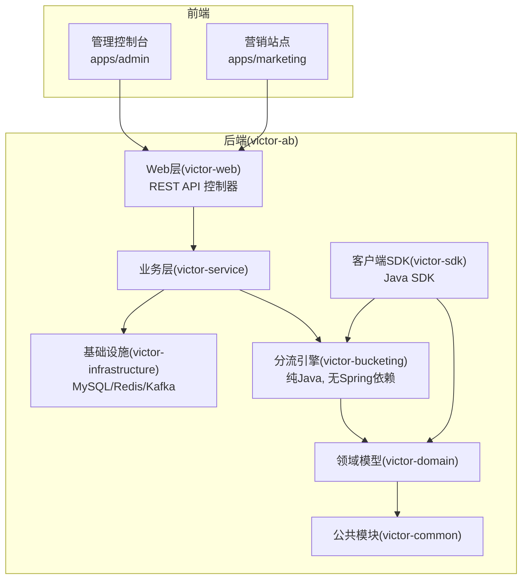
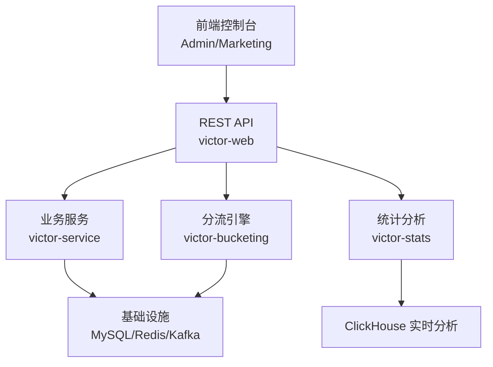
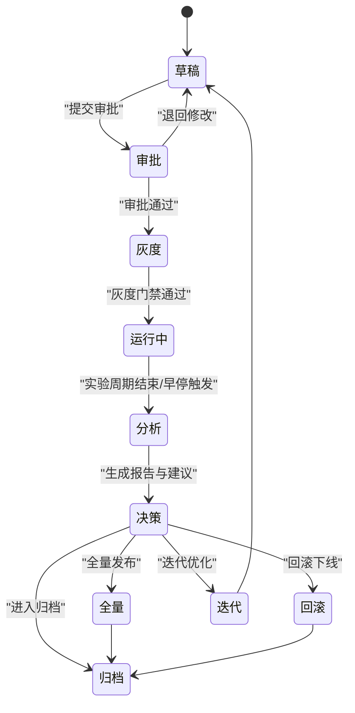
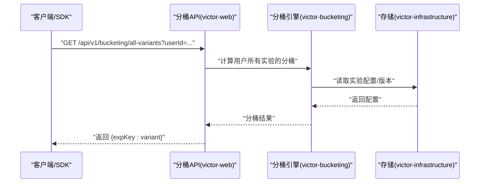
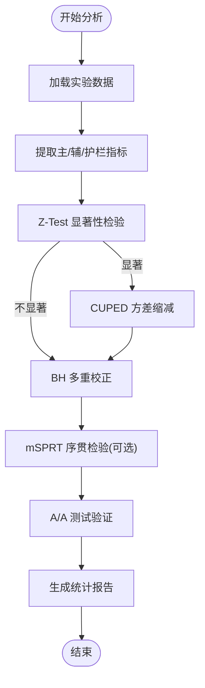
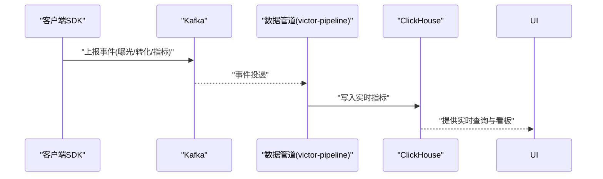
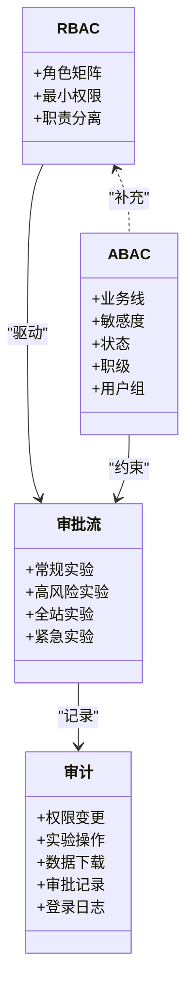
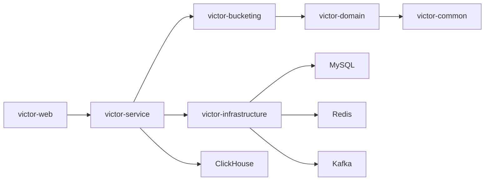

# 核心特性

<cite>
**本文引用的文件**
- [README.md](file://README.md)
- [ab_experiment_platform_design.md](file://docs/ab/ab_experiment_platform_design.md)
- [IMPLEMENTATION_SUMMARY.md](file://docs/ab/IMPLEMENTATION_SUMMARY.md)
- [experiment_detail_enhancement_plan.md](file://docs/ab/experiment_detail_enhancement_plan.md)
- [implementation_plan.md](file://docs/ab/implementation_plan.md)
</cite>

## 目录
1. [简介](#简介)
2. [项目结构](#项目结构)
3. [核心组件](#核心组件)
4. [架构总览](#架构总览)
5. [详细组件分析](#详细组件分析)
6. [依赖分析](#依赖分析)
7. [性能考量](#性能考量)
8. [故障排查指南](#故障排查指南)
9. [结论](#结论)
10. [附录](#附录)

## 简介
本文件围绕 GateFlow A/B 测试实验平台的五大核心特性进行系统化说明：实验管理、流量分配、数据分析、实时监控与权限协作。每个特性均从技术实现原理、业务价值、典型使用场景与实际效果四个维度展开，并结合项目文档中的架构与接口设计，给出可落地的集成指引与配置说明，帮助开发者快速理解并高效集成。

## 项目结构
- 前端采用 Monorepo，包含管理控制台与营销站点，分别对应不同的业务视角与用户角色。
- 后端以 Maven 多模块划分，形成“公共-领域-分流-基础设施-业务-SDK-Web”的分层架构，确保分桶核心逻辑可复用、可独立测试，同时便于未来微服务演进。

**图表来源**
- [implementation_plan.md:15-107](file://docs/ab/implementation_plan.md#L15-L107)
- [implementation_plan.md:109-144](file://docs/ab/implementation_plan.md#L109-L144)

**章节来源**
- [README.md:137-188](file://README.md#L137-L188)
- [implementation_plan.md:15-107](file://docs/ab/implementation_plan.md#L15-L107)

## 核心组件
- 实验管理：覆盖从草稿到归档的全生命周期，内置灰度门禁、自动分析与决策建议，支撑高质量实验交付。
- 流量分配：基于一致性哈希分桶算法，支持多层实验隔离与正交性保证，提供可视化流量地图与冲突检测。
- 数据分析：提供 Z-Test 显著性检验、mSPRT 序贯检验、CUPED 方差缩减、BH 多重校正等统计方法，配套 A/A 测试与时间序列分析。
- 实时监控：依托 Kafka 事件流与 ClickHouse 实时分析，结合护栏监控与样本量追踪，实现自动告警与早停建议。
- 权限协作：采用 RBAC+ABAC 混合权限模型，支持多级审批、操作审计与团队协作，满足合规与治理需求。

**章节来源**
- [README.md:34-67](file://README.md#L34-L67)
- [ab_experiment_platform_design.md:43-210](file://docs/ab/ab_experiment_platform_design.md#L43-L210)

## 架构总览
整体采用“前端控制台 + 后端服务 + 基础设施”的三层架构。前端通过 REST API 与后端交互；后端以模块化分层实现业务编排、分流计算、配置下发与统计分析；基础设施层提供 MySQL、Redis、Kafka、ClickHouse 等能力，支撑数据持久化、缓存与实时分析。

**图表来源**
- [README.md:70-104](file://README.md#L70-L104)
- [implementation_plan.md:179-190](file://docs/ab/implementation_plan.md#L179-L190)

## 详细组件分析

### 实验管理
- 技术实现原理
  - 生命周期状态机：草稿→审批→灰度→运行→分析→决策→归档，各阶段具备自动门禁与自动化动作。
  - 灰度门禁：SRM 检验、崩溃率阈值、护栏指标、样本量与统计功效等自动判定，满足质量门禁。
  - 决策建议：基于显著性与效应量生成智能建议，支持全量/回滚/迭代/延长等决策类型。
- 业务价值
  - 降低实验门槛：非技术用户可自助创建与监控实验。
  - 保障实验质量：内置校验与护栏，减少实验风险。
  - 提升决策效率：自动化报告与建议，缩短从实验到决策的周期。
- 典型使用场景
  - 产品功能上线前的对照实验；大规模灰度发布前的护栏验证；长期实验的样本量追踪与早停。
- 实际效果
  - 显著降低实验失败率与回归风险；提升跨团队协作效率与知识沉淀。
- 集成与配置
  - API 参考：实验管理相关接口在后端模块中提供，前端通过控制台调用。
  - 配置参考：后端 application.yml 中包含数据源与 Redis 等基础配置项。

**图表来源**
- [ab_experiment_platform_design.md:45-60](file://docs/ab/ab_experiment_platform_design.md#L45-L60)

**章节来源**
- [ab_experiment_platform_design.md:43-210](file://docs/ab/ab_experiment_platform_design.md#L43-L210)
- [README.md:306-331](file://README.md#L306-L331)

### 流量分配
- 技术实现原理
  - 一致性哈希分桶：基于 MurmurHash3 的分桶算法，确保用户 ID 到桶号的稳定映射，支持跨实验正交性与白/黑名单机制。
  - 多层实验隔离：域-层-桶三级结构，域内流量比例与层间正交性由系统自动校验，冲突检测与可视化流量地图辅助配置。
- 业务价值
  - 确保实验隔离与正交性，避免跨实验干扰；可视化地图降低配置复杂度与误配风险。
- 典型使用场景
  - 多实验并发运行、跨业务线资源抢占、A/B 与多变量实验组合。
- 实际效果
  - 显著降低流量冲突与实验偏差；提升实验可解释性与可运维性。
- 集成与配置
  - 分桶 API：后端提供用户分桶与批量分桶查询接口，前端在控制台与 SDK 中调用。
  - SDK：Java SDK 提供定时拉取配置、本地缓存与离线兜底策略，确保弱网与离线场景下的稳定性。

**图表来源**
- [implementation_plan.md:490-517](file://docs/ab/implementation_plan.md#L490-L517)
- [implementation_plan.md:290-297](file://docs/ab/implementation_plan.md#L290-L297)

**章节来源**
- [README.md:42-47](file://README.md#L42-L47)
- [implementation_plan.md:193-205](file://docs/ab/implementation_plan.md#L193-L205)
- [implementation_plan.md:490-517](file://docs/ab/implementation_plan.md#L490-L517)

### 数据分析
- 技术实现原理
  - Z-Test 显著性检验：用于主指标的组间差异显著性判断。
  - mSPRT 序贯检验：支持早停，降低实验时长与样本量。
  - CUPED 方差缩减：利用协变量降低方差，提高检验功效。
  - BH 多重校正：对多个辅助指标进行多重假设检验校正，控制 FWER/FDR。
  - A/A 测试验证：通过历史数据回测评估平台偏差与假阳性率。
  - 时间序列与人群拆分：支持按天/小时的趋势分析与用户属性细分。
- 业务价值
  - 提升统计决策的科学性与稳健性；缩短实验周期并降低成本。
- 典型使用场景
  - 主指标显著性判断、多指标综合评估、护栏指标异常监测、迭代实验的对比分析。
- 实际效果
  - 显著提升实验结论的可信度与可重复性；减少误判与漏判。
- 集成与配置
  - 统计 API：后端提供实验统计数据、指标数据与 A/A 测试结果接口，前端在报告与诊断 Tab 中展示。

**图表来源**
- [README.md:48-55](file://README.md#L48-L55)

**章节来源**
- [README.md:48-55](file://README.md#L48-L55)
- [README.md:323-329](file://README.md#L323-L329)

### 实时监控
- 技术实现原理
  - Kafka 事件流：实验事件（曝光、转化、护栏指标）通过事件流进入数据管道。
  - ClickHouse 实时分析：分钟级/秒级指标写入 ClickHouse，支持实时看板与告警。
  - 护栏监控与早停：基于护栏阈值与统计模型自动触发告警与早停建议。
  - 样本量追踪与统计功效预估：实时展示样本进度与到达统计功效的时间预测。
- 业务价值
  - 实时掌握实验状态，快速发现异常并采取行动；降低实验风险与成本。
- 典型使用场景
  - 运行中实验的实时监控、护栏指标异常告警、样本量不足预警、早停建议推送。
- 实际效果
  - 显著缩短异常发现与处置时间；提升实验成功率与用户满意度。
- 集成与配置
  - 数据管道：事件经由 Kafka 进入数据管道，最终写入 ClickHouse，前端通过看板展示。
  - 告警策略：可配置护栏阈值与统计门禁，系统自动触发告警与暂停。

**图表来源**
- [README.md:56-61](file://README.md#L56-L61)

**章节来源**
- [README.md:56-61](file://README.md#L56-L61)

### 权限协作
- 技术实现原理
  - RBAC+ABAC 混合权限：基础角色矩阵 + 动态属性（业务线、敏感度、状态、职级、用户组）实现细粒度授权。
  - 多级审批：根据实验类型与影响范围配置审批链，支持紧急实验事后补审。
  - 操作审计：记录权限变更、实验操作、数据下载、审批过程等，满足合规与审计需求。
  - 团队协作：支持实验 Owner、部门管理员、跨团队共享与知识沉淀。
- 业务价值
  - 保障平台安全与合规；提升跨团队协作效率与责任清晰度。
- 典型使用场景
  - 实验创建与审批、指标注册审核、高风险实验的多层审批、敏感数据的访问控制。
- 实际效果
  - 显著降低越权与误操作风险；提升组织级实验治理水平。
- 集成与配置
  - 权限矩阵与审批流在平台中集中配置，前端根据用户角色与属性动态渲染与控制操作。

**图表来源**
- [ab_experiment_platform_design.md:371-461](file://docs/ab/ab_experiment_platform_design.md#L371-L461)

**章节来源**
- [ab_experiment_platform_design.md:371-461](file://docs/ab/ab_experiment_platform_design.md#L371-L461)

## 依赖分析
- 模块耦合与内聚
  - 分流引擎为纯 Java 模块，不依赖 Spring，便于 SDK 复用与独立测试，体现高内聚、低耦合的设计。
  - 领域模型独立于框架，支持跨平台复用，增强可扩展性。
- 外部依赖与集成点
  - 基础设施：MySQL（持久化）、Redis（缓存/版本）、Kafka（事件流）、ClickHouse（实时分析）。
  - 前后端通过 REST API 交互，前端控制台与 SDK 通过统一接口访问后端能力。
- 潜在循环依赖
  - 通过模块化分层与清晰的依赖方向（Web → Service → Infra → Domain → Common）避免循环依赖。

**图表来源**
- [implementation_plan.md:109-144](file://docs/ab/implementation_plan.md#L109-L144)

**章节来源**
- [implementation_plan.md:109-144](file://docs/ab/implementation_plan.md#L109-L144)

## 性能考量
- 分桶计算性能
  - 分流引擎为纯 Java 实现，无框架依赖，具备良好的可移植性与测试性；建议在高并发场景下结合 SDK 本地缓存与离线兜底策略，降低网络抖动对业务的影响。
- 数据分析与实时监控
  - ClickHouse 适合高吞吐、低延迟的实时分析；建议对热点指标建立物化视图与分区策略，优化查询性能。
- 前端体验
  - 图表渲染与数据刷新需结合虚拟滚动与降采样策略，避免大数据量下的卡顿。

## 故障排查指南
- 常见问题定位
  - 前端 API 404：检查 Vite 代理配置是否正确转发到后端服务端口。
  - 后端连接失败：检查 MySQL/Redis/Kafka 服务状态与网络连通性。
  - 分桶结果异常：核对实验配置、分桶边界与用户 ID 的哈希输入是否一致。
- 建议排查步骤
  - 核对环境变量与配置文件；查看后端健康检查与日志；确认 Kafka 消费与 ClickHouse 写入状态；验证前端代理与跨域设置。

**章节来源**
- [README.md:474-510](file://README.md#L474-L510)

## 结论
GateFlow A/B 测试实验平台通过清晰的模块化架构与五大核心特性，实现了从实验创建到决策归档的全链路闭环。实验管理保障质量与效率，流量分配确保隔离与正交，数据分析提供科学决策依据，实时监控与护栏告警降低风险，权限协作满足合规与治理需求。结合本文的技术实现原理、业务价值与集成指引，开发者可快速理解并高效落地各模块能力。

## 附录
- API 参考
  - 实验管理：创建、查询、启动、停止等接口。
  - 分桶服务：用户分桶与批量分桶查询。
  - 统计分析：实验统计数据、指标数据、A/A 测试结果。
- 配置参考
  - 后端 application.yml 中包含数据源与 Redis 等基础配置项，可通过环境变量覆盖。

**章节来源**
- [README.md:306-331](file://README.md#L306-L331)
- [README.md:342-367](file://README.md#L342-L367)