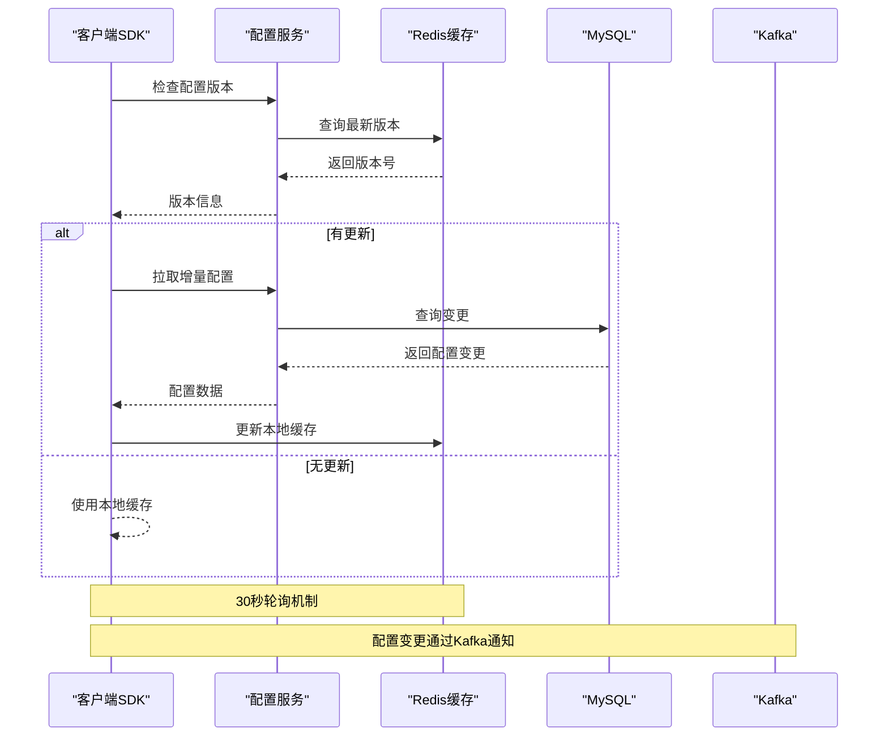
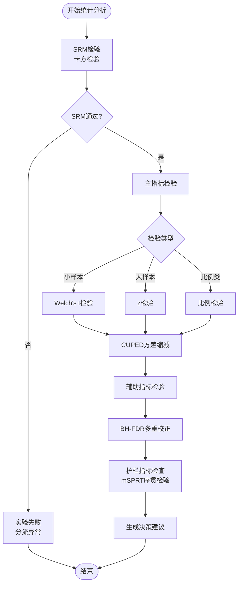
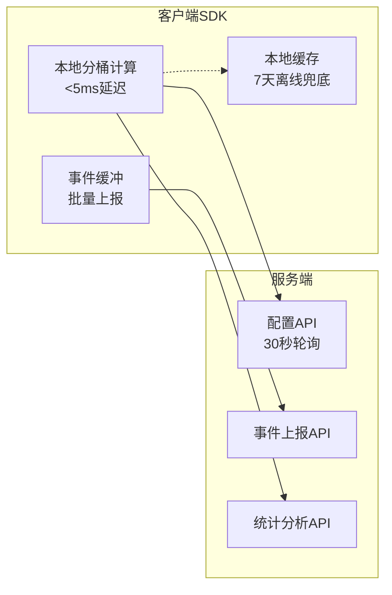

# 项目概述

<cite>
**本文档引用的文件**
- [README.md](file://README.md)
- [package.json](file://package.json)
- [pnpm-workspace.yaml](file://pnpm-workspace.yaml)
- [packages/shared/package.json](file://packages/shared/package.json)
- [docs/ab/ab_experiment_platform_design.md](file://docs/ab/ab_experiment_platform_design.md)
- [docs/ab/implementation_plan.md](file://docs/ab/implementation_plan.md)
- [docs/ab/architecture_review.md](file://docs/ab/architecture_review.md)
- [docs/superpowers/specs/2026-05-05-victor-stats-engine-design.md](file://docs/superpowers/specs/2026-05-05-victor-stats-engine-design.md)
- [docs/knowledge/README.md](file://docs/knowledge/README.md)
</cite>

## 目录
1. [项目简介](#项目简介)
2. [核心价值主张](#核心价值主张)
3. [系统架构总览](#系统架构总览)
4. [技术栈概览](#技术栈概览)
5. [Monorepo与模块结构](#monorepo与模块结构)
6. [快速开始指南](#快速开始指南)
7. [A/B测试基础概念](#ab测试基础概念)
8. [架构设计深度解析](#架构设计深度解析)
9. [统计分析引擎设计](#统计分析引擎设计)
10. [知识库与最佳实践](#知识库与最佳实践)
11. [性能与可扩展性](#性能与可扩展性)
12. [故障排查与运维](#故障排查与运维)
13. [结语](#结语)

## 项目简介
GateFlow是一个企业级A/B测试实验平台，提供从实验创建到决策归档的全生命周期管理。平台采用前后端分离架构，支持多层实验、正交分桶、实时数据分析和统计显著性检验，旨在降低实验门槛、保障实验质量、提升决策效率并沉淀实验知识。

## 核心价值主张
- 🎯 降低实验门槛：非技术用户也能自助创建、运行、分析实验
- 🛡️ 保障实验质量：内置SRM校验、统计功效计算、护栏监控等质量门禁
- ⚡ 提升决策效率：自动化报告生成、智能决策建议、一键全量/回滚
- 📚 沉淀实验知识：实验知识库、经验复用、组织级实验文化积累

## 系统架构总览
平台采用“前端应用层 + 后端服务层 + 基础设施层”的三层架构设计：

```mermaid
graph TB
subgraph "前端应用层"
Admin["管理控制台<br/>Admin Console"]
Marketing["营销站点<br/>Marketing Site"]
Shared["共享组件库<br/>Shared Components"]
end
subgraph "后端服务层 (Victor)"
Web["Web API<br/>(REST)"]
Service["业务服务<br/>(Business)"]
Bucketing["分桶引擎<br/>(Engine)"]
Stats["统计分析<br/>(Analysis)"]
end
subgraph "基础设施层"
MySQL["MySQL 8.0"]
Redis["Redis 7"]
Kafka["Apache Kafka"]
ClickHouse["ClickHouse"]
SDK["客户端SDK/API"]
end
Admin --> Web
Marketing --> Web
Shared --> Admin
Shared --> Marketing
Web --> Service
Service --> Bucketing
Service --> Stats
Bucketing --> MySQL
Bucketing --> Redis
Stats --> MySQL
Stats --> ClickHouse
Web --> MySQL
Web --> Redis
Web --> Kafka
Web --> ClickHouse
Marketing --> SDK
Admin --> SDK
```



**图表来源**
- [README.md:70-104](file://README.md#L70-L104)
- [docs/ab/ab_experiment_platform_design.md:21-39](file://docs/ab/ab_experiment_platform_design.md#L21-L39)

## 技术栈概览
平台采用现代化技术栈，确保高性能、可扩展性和开发效率：

### 前端技术栈
- **框架**：React 18 + TypeScript 5.6
- **构建工具**：Vite 5.4
- **状态管理**：Zustand 4.5
- **路由**：React Router 6.26
- **UI组件**：Lucide React, Recharts
- **样式**：TailwindCSS 4.0
- **拖拽**：@dnd-kit/core
- **包管理**：pnpm 9+ (Monorepo)

### 后端技术栈
- **后端框架**：Spring Boot 3.4.0, Java 17
- **ORM框架**：MyBatis-Plus 3.5.15
- **数据库**：MySQL 8.0, Redis 7, ClickHouse
- **消息队列**：Apache Kafka
- **缓存**：Caffeine (本地), Redis (分布式)
- **数据迁移**：Flyway 9.5.1
- **HTTP客户端**：OkHttp 4.12.0
- **JSON处理**：Jackson 2.17.0
- **API文档**：SpringDoc OpenAPI 2.5.0
- **构建工具**：Maven 3.x
- **容器化**：Docker, Docker Compose

**章节来源**
- [README.md:106-136](file://README.md#L106-L136)

## Monorepo与模块结构
平台采用Monorepo管理模式，前端和后端均采用模块化架构：

### 前端 Monorepo 结构
```
apps/
├── admin/                    # AB实验管理控制台
│   ├── src/
│   │   ├── api/               # API接口定义
│   │   ├── components/        # React组件
│   │   ├── layouts/           # 布局组件
│   │   ├── pages/             # 页面组件
│   │   ├── stores/            # Zustand状态管理
│   │   └── mocks/             # Mock数据
│   └── package.json
│
├── marketing/          # 营销展示页面
│   ├── src/
│   │   ├── components/        # 营销组件
│   │   ├── layouts/           # 布局
│   │   └── pages/             # 营销页面
│   └── package.json
│
packages/
└── shared/                     # 共享组件库
    ├── src/
    │   ├── components/        # 通用UI组件
    │   ├── hooks/             # 自定义Hooks
    │   ├── tokens/            # 设计令牌（颜色、间距等）
    │   └── utils/             # 工具函数
    └── package.json
```

### 后端微服务模块结构
```
backend/victor-ab/
├── victor-common/              # 公共模块：常量、枚举、工具类
├── victor-domain/              # 领域模型：实体、DTO、事件
├── victor-bucketing/           # 分桶引擎：流量分配算法
├── victor-infrastructure/      # 基础设施：数据访问、缓存、迁移
├── victor-service/             # 业务服务：实验、分桶、统计服务
├── victor-sdk/                 # 客户端SDK：Java SDK
├── victor-pipeline/            # 数据管道：Kafka消费、ClickHouse写入
├── victor-stats/               # 统计引擎：统计算法和模型
├── victor-web/                 # Web层：REST API控制器
└── scripts/                    # 数据库脚本
```

**章节来源**
- [README.md:137-188](file://README.md#L137-L188)
- [pnpm-workspace.yaml:1-4](file://pnpm-workspace.yaml#L1-L4)
- [packages/shared/package.json:1-36](file://packages/shared/package.json#L1-L36)

## 快速开始指南
提供两种部署方式：本地开发环境和Docker部署。

### 前置要求
- **Node.js** >= 18
- **pnpm** >= 9
- **JDK** >= 17
- **Maven** >= 3.6
- **Docker & Docker Compose** (可选，用于容器化部署)

### 本地开发环境搭建

#### 1. 克隆项目
```bash
git clone <repository-url>
cd gate-flow
```

#### 2. 启动前端应用
```bash
# 安装依赖
pnpm install

# 启动所有前端应用（并行）
pnpm dev

# 或单独启动
pnpm dev:admin      # 启动管理控制台
pnpm dev:marketing  # 启动营销页面
```

前端应用地址：
- Admin Console: http://localhost:5173
- Marketing Site: http://localhost:5174

#### 3. 启动后端服务
```bash
cd backend/victor-ab

# 启动依赖服务（MySQL, Redis）
docker-compose up -d mysql redis

# 编译项目
mvn clean install

# 启动应用
cd victor-web
mvn spring-boot:run
```

后端服务地址：
- API服务: http://localhost:8080
- Swagger文档: http://localhost:8080/swagger-ui.html
- 健康检查: http://localhost:8080/actuator/health

### Docker 部署

#### 1. 构建并启动所有服务
```bash
cd backend/victor-ab

# 构建后端镜像
docker build -t victor-service .

# 启动所有服务（MySQL, Redis, Victor Service）
docker-compose up -d
```

#### 2. 查看日志
```bash
docker-compose logs -f victor-service
```

**章节来源**
- [README.md:192-270](file://README.md#L192-L270)

## A/B测试基础概念
为初学者提供A/B测试的基本理解：

### 什么是A/B测试
A/B测试是一种统计实验方法，通过将用户随机分配到不同的组别（对照组A和实验组B），比较不同版本的表现差异，从而做出数据驱动的决策。

### 核心要素
- **实验设计**：明确假设、目标指标、流量分配
- **样本量**：确保统计检验的效力
- **显著性检验**：判断结果是否具有统计学意义
- **护栏指标**：保护用户体验的关键指标

### 实验生命周期
```
草稿 → 审批 → 灰度 → 运行 → 分析 → 决策 → 归档
```

**章节来源**
- [docs/ab/ab_experiment_platform_design.md:43-60](file://docs/ab/ab_experiment_platform_design.md#L43-L60)

## 架构设计深度解析
平台采用"分流服务优先"的设计理念，确保核心功能的稳定性和性能。

### 分流服务核心设计


**图表来源**
- [docs/ab/implementation_plan.md:548-574](file://docs/ab/implementation_plan.md#L548-L574)

### 数据库设计优化
平台对数据库设计进行了多项优化，解决了P0级别的问题：

#### 外键约束修正
- 将外键从业务ID改为引用主键id
- 移除variants JSON字段，使用victor_variant表作为唯一数据源
- 新增victor_user_assignment表支持审计和SRM检验

#### 配置版本追踪
```sql
-- 配置版本表
CREATE TABLE victor_config_version (
    id BIGINT PRIMARY KEY AUTO_INCREMENT,
    version VARCHAR(64) NOT NULL,
    platform VARCHAR(32) NOT NULL,
    config_data JSON NOT NULL,
    created_at TIMESTAMP DEFAULT CURRENT_TIMESTAMP,
    INDEX idx_version (version),
    INDEX idx_platform (platform)
);
```

**章节来源**
- [docs/ab/architecture_review.md:11-18](file://docs/ab/architecture_review.md#L11-L18)
- [docs/ab/implementation_plan.md:880-889](file://docs/ab/implementation_plan.md#L880-L889)

## 统计分析引擎设计
平台实现了完整的统计分析引擎，支持多种统计检验方法：

### 核心统计算法


**图表来源**
- [docs/superpowers/specs/2026-05-05-victor-stats-engine-design.md:14-22](file://docs/superpowers/specs/2026-05-05-victor-stats-engine-design.md#L14-L22)

### 统计引擎模块结构
```
victor-stats/
├── engine/                       # 统计引擎核心
│   ├── StatsEngine.java          # 统计引擎入口
│   ├── StatsContext.java         # 统计上下文
│   └── StatsResult.java          # 统计结果
├── algorithm/                    # 核心算法
│   ├── SRMTest.java              # SRM检验（卡方检验）
│   ├── WelchTTest.java           # Welch's t检验
│   ├── ZTest.java                # z检验（大样本）
│   ├── CUPED.java                # 方差缩减
│   ├── BHCorrection.java         # BH-FDR多重校正
│   └── mSPRT.java                # 序贯检验
├── model/                        # 数据模型
│   ├── SampleStatistics.java     # 样本统计量
│   ├── TestResult.java           # 检验结果
│   ├── LiftEstimate.java         # 提升估计
│   ├── ConfidenceInterval.java   # 置信区间
│   └── MetricType.java           # 指标类型枚举
└── aggregation/                  # 数据聚合
    ├── MetricAggregator.java     # 指标聚合器
    └── ClickHouseQuery.java      # ClickHouse查询
```

**章节来源**
- [docs/superpowers/specs/2026-05-05-victor-stats-engine-design.md:26-67](file://docs/superpowers/specs/2026-05-05-victor-stats-engine-design.md#L26-L67)

## 知识库与最佳实践
平台采用面向Agent设计的知识库系统，支持按需渐进加载：

### 知识库组织结构
```
docs/knowledge/
├── 01-project-overview/     # 项目目标、高层架构、术语表
├── 02-business-domain/      # 业务规则、业务术语、运营逻辑
├── 03-development-guide/    # 环境搭建、编码规范、项目约定
├── 04-best-practices/       # 已验证模式、性能技巧、设计准则
├── 05-historical-lessons/   # 事故复盘、踩坑记录、已废弃决策
├── 06-api-reference/        # API 契约、接入说明、外部服务文档
├── 07-test-rule/            # 测试规范、用例设计、质量门禁规则
└── 08-external-resources/   # 外部链接、参考资料、第三方文档
```

### Agent加载策略
1. **先读本README** - 包含全部知识文件的目录索引
2. **按关键词匹配** - 根据当前任务定位相关文件
3. **优先读前置依赖** - 按文档标注的依赖关系先读
4. **按需跟随关联** - 仅在任务需要时链式读取关联文档

**章节来源**
- [docs/knowledge/README.md:1-94](file://docs/knowledge/README.md#L1-L94)

## 性能与可扩展性
平台在性能和可扩展性方面采用了多项优化措施：

### SDK本地计算架构


**图表来源**
- [docs/ab/architecture_review.md:51-60](file://docs/ab/architecture_review.md#L51-L60)

### 高并发设计建议
1. **CDN缓存静态配置** - 减少服务端压力
2. **Nginx限流** - 10QPS/IP的防护
3. **Spring Boot集群部署** - 处理实验管理操作
4. **WebSocket/SSE推送** - 实时配置变更通知

**章节来源**
- [docs/ab/architecture_review.md:129-149](file://docs/ab/architecture_review.md#L129-L149)

## 故障排查与运维
提供常见问题的排查和解决方案：

### 前端依赖安装失败
```bash
# 清除缓存重新安装
pnpm store prune
rm -rf node_modules
pnpm install
```

### 数据库连接失败
```bash
# 检查MySQL是否启动
docker ps | grep mysql

# 查看日志
docker logs victor-mysql
```

### Redis连接失败
```bash
# 检查Redis是否启动
docker ps | grep redis

# 测试连接
docker exec -it victor-redis redis-cli ping
```

### 端口冲突
修改相应配置文件中的端口设置。

**章节来源**
- [README.md:474-510](file://README.md#L474-L510)

## 结语
GateFlow A/B测试实验平台通过先进的技术架构和完善的工程实践，为企业提供了从实验创建到决策归档的一站式解决方案。平台不仅降低了实验门槛，更重要的是通过严格的质量门禁和智能化的决策支持，帮助企业做出更加科学的数据驱动决策。

平台的核心优势在于：
- **技术架构先进**：前后端分离、微服务设计、Monorepo管理模式
- **性能表现卓越**：SDK本地计算、缓存优化、高并发设计
- **工程实践完善**：完整的统计分析引擎、严格的数据库设计、丰富的知识库
- **可扩展性强**：模块化设计、易于维护和扩展

随着平台的不断发展和完善，GateFlow将成为企业数字化转型和数据驱动决策的重要基石。