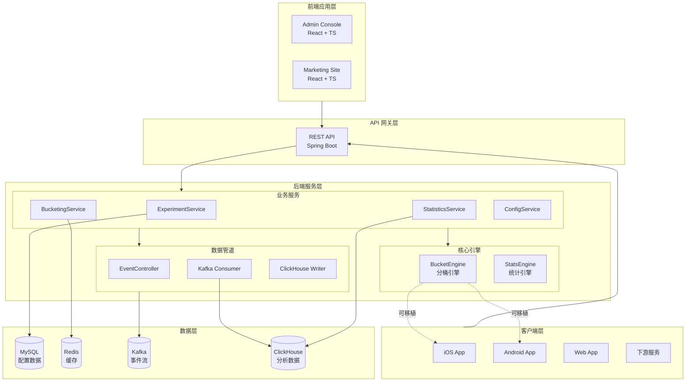
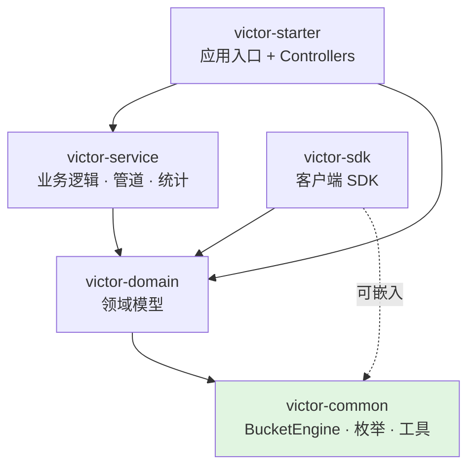
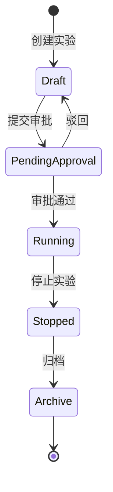
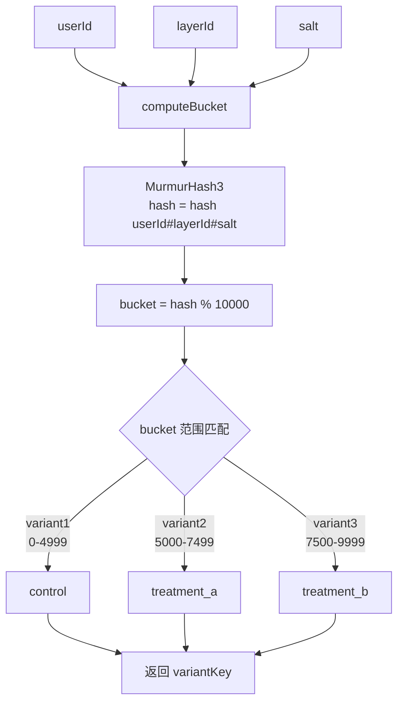

# AB实验系统架构

本文档描述 GateFlow AB实验系统的整体架构、模块依赖关系和技术选型。

## 整体系统架构

## 模块依赖关系

> 绿色模块 `victor-common` 是纯 Java 实现，无 Spring 依赖。`BucketEngine` 可直接嵌入客户端 SDK（Java / Kotlin / Swift / TypeScript）。

## 实验生命周期

实验遵循 5 状态简化生命周期（经由 Flyway V2 迁移从 12 个状态简化为 5 个）：

| 状态 | 说明 | 允许的操作 |
|------|------|-----------|
| `draft` | 草稿，实验设计中 | 编辑、提交审批、启动、删除 |
| `pending_approval` | 待审批 | 审批通过、驳回 |
| `running` | 运行中，分流活跃 | 停止（可启用 auto_ramp 自动放量） |
| `stopped` | 已停止，数据收集结束 | 归档、查看分析报告 |
| `archive` | 已归档，知识沉淀 | 查看 |

> 灰度放量（ramp）不再是独立状态，而是 running 状态的特性（通过 `auto_ramp_enabled` 标志和 `ramp_config` JSON 配置实现）。`RampScheduler` 每 5 分钟检查 Redis 健康结果并自动推进流量比例。

## 分桶算法流程

## 技术栈

### 后端

| 技术 | 用途 |
|------|------|
| Java 17 + Spring Boot 3.4 | 后端框架 |
| MyBatis-Plus 3.5 | ORM |
| MySQL 8.0 | 配置数据库 |
| Redis 7 | 缓存 |
| Apache Kafka | 事件流 |
| ClickHouse | 分析数据库 |
| Flyway | 数据库迁移 |
| SpringDoc OpenAPI | API 文档 |

### 前端

| 技术 | 用途 |
|------|------|
| React 18 + TypeScript | UI 框架 |
| Vite | 构建工具 |
| Tailwind CSS v4 | 样式系统 |
| Zustand | 状态管理 |
| Recharts | 图表库 |

## 安全架构

`victor-starter` 通过以下组件实现 JWT + RBAC 安全模型：

| 组件 | 职责 |
|------|------|
| `JwtTokenProvider` | JWT Token 生成与验证 |
| `JwtAuthenticationFilter` | 从请求头提取 Bearer Token，设置 SecurityContext |
| `PermissionInterceptor` | 拦截 `@RequirePermission` 注解，校验用户权限 |
| `SecurityConfig` | 白名单配置（`/api/v1/auth/**`、`/api/v1/config/**`、`/api/v1/bucketing/**` 无需认证） |

**4 个角色**:
- **ADMIN** — 全部权限（含用户管理）
- **OPERATOR** — 实验创建/编辑/审批/查看分析
- **VIEWER** — 只读（查看实验和分析）
- **SDK_CLIENT** — 仅分流/配置/事件 API 访问

**10 项权限**: `CREATE_EXPERIMENT`、`EDIT_EXPERIMENT`、`DELETE_EXPERIMENT`、`VIEW_EXPERIMENT`、`APPROVE_EXPERIMENT`、`SUBMIT_APPROVAL`、`VIEW_TRAFFIC`、`VIEW_ANALYSIS`、`POWER_ANALYSIS`、`MANAGE_USERS`

## 详细文档

| 文档 | 说明 |
|------|------|
| [分流引擎](./bucketing-engine) | MurmurHash3 分桶算法详解 |
| [统计引擎](./stats-engine) | Z-Test、mSPRT、CUPED 算法 |
| [数据模型](./data-model) | 数据库表结构设计 |
| [模块设计](./module-design) | Maven 多模块职责与依赖 |