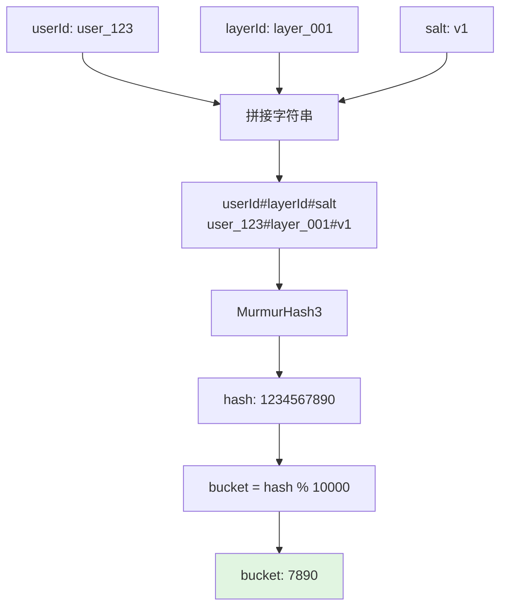
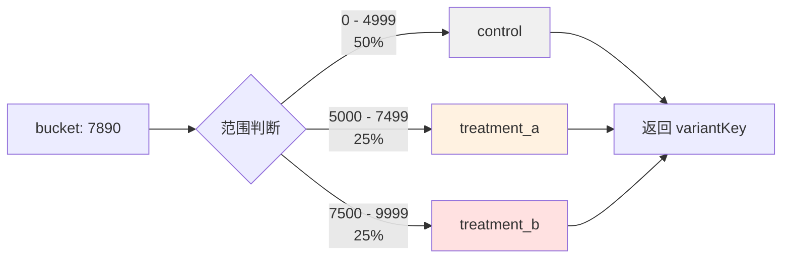
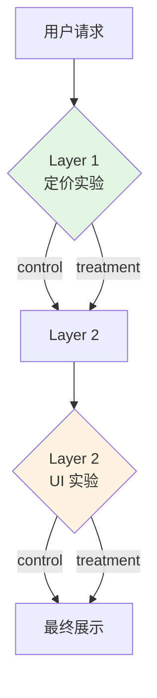
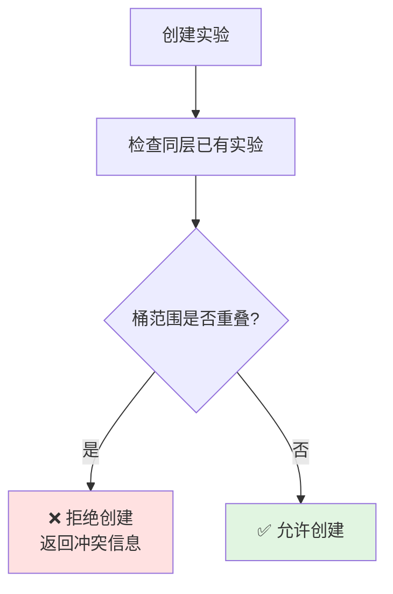

# 分桶引擎

本文档介绍 GateFlow 的分桶算法和实现原理。

## 架构定位

`victor-bucketing` 是 GateFlow 的核心引擎之一,负责将用户分配到不同的实验变体。

**关键设计决策**: 该模块是**纯 Java 实现,无任何 Spring 依赖**,这使得它可以:
- 直接嵌入到客户端 SDK (iOS/Android/RN)
- 保证服务端和客户端分桶结果一致
- 独立测试和验证

## 分桶算法

### 核心公式

```
bucket = MurmurHash3(userId + "#" + layerId + "#" + salt) % 10000
```

- **输入**: 用户 ID、层级 ID、盐值
- **输出**: 0-9999 的整数 (共 10000 个桶)
- **算法**: MurmurHash3 (非加密哈希,性能优异)

### 算法流程图



### 变体匹配

分桶完成后,根据桶号匹配实验变体:



## 核心 API

```java
public class BucketEngine {

    /**
     * 计算用户分桶号
     *
     * @param userId  用户 ID
     * @param layerId 层级 ID
     * @param salt    盐值 (用于版本控制)
     * @return 桶号 (0-9999)
     */
    public static int computeBucket(String userId, String layerId, String salt);

    /**
     * 根据桶号匹配实验变体
     *
     * @param bucket         桶号
     * @param variantSpecs   变体规格列表
     * @return 变体 Key,未命中返回 null
     */
    public static String findVariant(int bucket, List<VariantSpec> variantSpecs);
}
```

## 变体规格模型

```java
public class VariantSpec {
    private String variantKey;    // 变体标识
    private int bucketStart;      // 起始桶号 (包含)
    private int bucketEnd;        // 结束桶号 (包含)
}
```

## 流量分配示例

| 变体 | bucketStart | bucketEnd | 流量占比 | 桶范围 |
|------|-------------|-----------|---------|--------|
| control | 0 | 4999 | 50% | 0-4999 |
| treatment_a | 5000 | 7499 | 25% | 5000-7499 |
| treatment_b | 7500 | 9999 | 25% | 7500-9999 |

## 跨平台一致性保证

为确保各平台 SDK 与后端分桶结果一致:

| 平台 | 实现 | 验证方式 |
|------|------|---------|
| Java (后端) | `BucketEngine.java` | 单元测试 |
| Java (SDK) | 嵌入 `victor-bucketing` | 与后端比对 |
| Swift (iOS) | 移植 MurmurHash3 | 测试向量比对 |
| Kotlin (Android) | 移植 MurmurHash3 | 测试向量比对 |
| TypeScript (RN) | 移植 MurmurHash3 | 测试向量比对 |

### 测试用例

```
Input:  userId = "user_123"
        layerId = "layer_001"
        salt = "v1"
Output: bucket = 7890  (所有平台必须一致)
```

## 正交分层

GateFlow 支持多层实验,不同层级的实验流量互不干扰:



每层独立计算分桶,确保:
- Layer 1 的定价策略与 Layer 2 的 UI 样式正交
- 用户在 Layer 1 的分桶不影响 Layer 2 的分桶

## 冲突检测

创建实验时,系统自动检测同层内的桶范围冲突:


