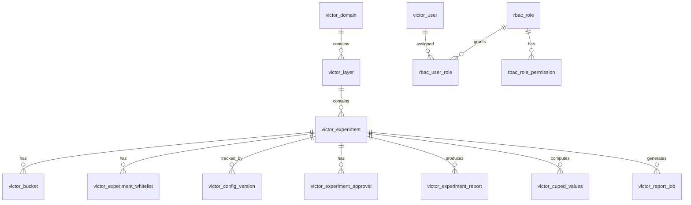
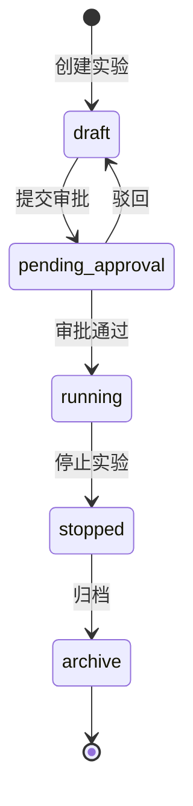
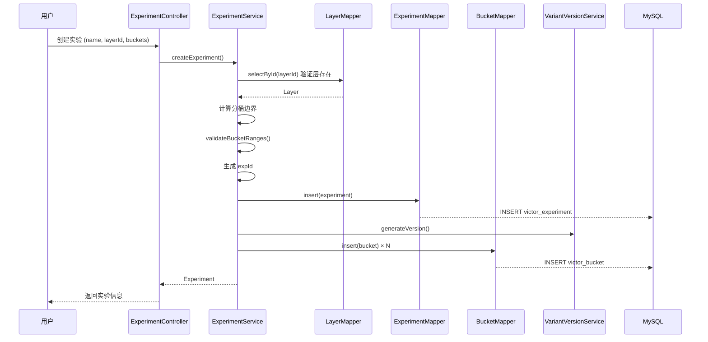
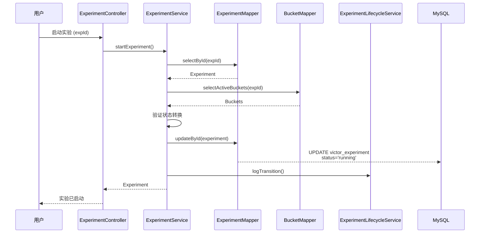
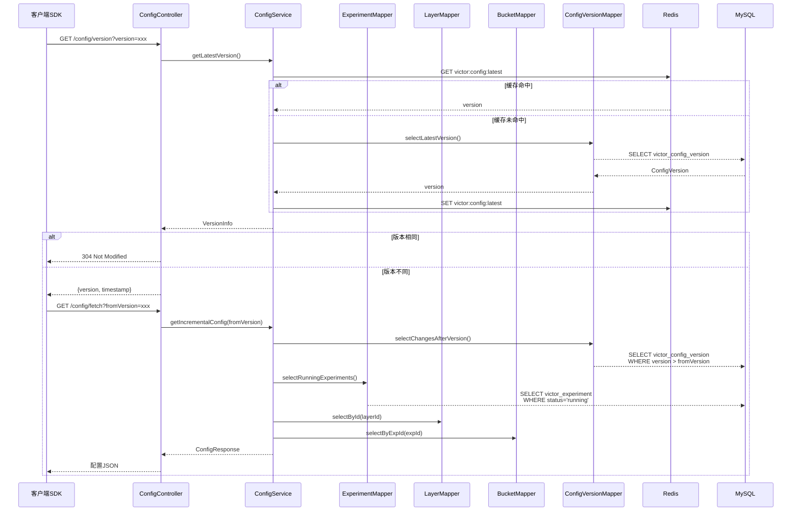

# 数据模型

本文档详细介绍 GateFlow 的数据库表结构设计。

## 实体关系图



## 核心表结构

### 1. victor_domain - 域配置表

流量分域，用于隔离不同业务线的实验流量。

| 字段 | 类型 | 说明 |
|------|------|------|
| id | BIGINT | 主键，自增 |
| domain_id | VARCHAR(64) | 业务ID，用于API调用，唯一 |
| name | VARCHAR(128) | 域名称 |
| traffic_ratio | DECIMAL(5,4) | 流量占比，0-1之间 |
| is_exclusive | BOOLEAN | 是否独占域（独占域内实验互斥） |
| created_at | TIMESTAMP | 创建时间 |
| updated_at | TIMESTAMP | 更新时间 |

**Java 实体**: `com.gateflow.victor.domain.entity.Domain`

### 2. victor_layer - 层配置表

正交分层，确保不同层级的实验流量互不干扰。

| 字段 | 类型 | 说明 |
|------|------|------|
| id | BIGINT | 主键，自增 |
| layer_id | VARCHAR(64) | 业务ID |
| domain_id | BIGINT | 引用 victor_domain.id |
| name | VARCHAR(128) | 层名称 |
| salt | VARCHAR(64) | 盐值，用于层间哈希正交 |
| sort_order | INT | 排序顺序 |
| created_at | TIMESTAMP | 创建时间 |
| updated_at | TIMESTAMP | 更新时间 |

**约束**: 唯一索引 `uk_layer_domain(layer_id, domain_id)`

**Java 实体**: `com.gateflow.victor.domain.entity.Layer`

### 3. victor_experiment - 实验配置表

核心实验表，记录实验的基本信息和配置。

| 字段 | 类型 | 说明 |
|------|------|------|
| id | BIGINT | 主键，自增 |
| exp_id | VARCHAR(64) | 业务ID，唯一，用于API调用 |
| name | VARCHAR(128) | 实验名称 |
| description | TEXT | 实验描述 |
| layer_id | BIGINT | 引用 victor_layer.id |
| status | ENUM | 实验状态：`draft`, `pending_approval`, `running`, `stopped`, `archive` |
| auto_ramp_enabled | TINYINT(1) | 是否启用灰度自动推进，默认 0 |
| ramp_config | JSON | 灰度推进阶段配置（如 STAGE_1:2h, STAGE_5:4h 等） |
| targeting_rules | JSON | 定向规则 |
| primary_metric | VARCHAR(64) | 主指标 |
| secondary_metrics | JSON | 次指标列表 |
| guardrail_metrics | JSON | 护栏指标列表 |
| start_time | TIMESTAMP | 开始时间 |
| end_time | TIMESTAMP | 结束时间 |
| created_by | VARCHAR(64) | 创建人 |
| created_at | TIMESTAMP | 创建时间 |
| updated_at | TIMESTAMP | 更新时间 |

**索引**:
- `idx_exp_id` - 实验业务ID
- `idx_status` - 实验状态
- `idx_layer` - 所属层级

**Java 实体**: `com.gateflow.victor.domain.entity.Experiment`

### 4. victor_bucket - 分桶/变体配置表

实验分桶表，记录实验各分桶的版本和流量分配。实体类为 `Bucket`。

| 字段 | 类型 | 说明 |
|------|------|------|
| id | BIGINT | 主键，自增 |
| exp_id | BIGINT | 引用 victor_experiment.id |
| version | VARCHAR(32) | 版本号，时间戳格式如 20260506143000 |
| bucket_key | VARCHAR(64) | 分桶标识（如 control, treatment） |
| name | VARCHAR(128) | 分桶名称 |
| bucket_start | INT | 桶起始位置（包含） |
| bucket_end | INT | 桶结束位置（包含） |
| params | VARCHAR(64) | 分桶参数，支持任意字符串格式 |
| is_active | BOOLEAN | 是否为当前活跃版本 |
| created_at | TIMESTAMP | 创建时间 |

**约束**: 唯一索引 `uk_exp_version_bucket(exp_id, version, bucket_key)`

**流量分配示例**:
```
control:     bucket_start=0,     bucket_end=4999   → 50%
treatment_a: bucket_start=5000,  bucket_end=7499   → 25%
treatment_b: bucket_start=7500,  bucket_end=9999   → 25%
```

**Java 实体**: `com.gateflow.victor.domain.entity.Bucket`

**Mapper**: `com.gateflow.victor.infra.mapper.BucketMapper`

### 5. victor_config_version - 配置版本表

配置变更追踪，支持SDK配置的ETag和增量更新。

| 字段 | 类型 | 说明 |
|------|------|------|
| id | BIGINT | 主键，自增 |
| version | VARCHAR(32) | 版本号，唯一 |
| etag | VARCHAR(16) | 配置摘要（ETag） |
| config_json | LONGTEXT | 完整配置JSON快照 |
| change_type | ENUM | 变更类型：full, incremental |
| changed_experiments | JSON | 变更的实验ID列表 |
| created_at | TIMESTAMP | 创建时间 |

**Java 实体**: `com.gateflow.victor.domain.entity.ConfigVersion`

### 6. victor_experiment_whitelist - 实验白名单表

用于强制指定用户进入特定分桶，跳过常规hash分桶逻辑。

| 字段 | 类型 | 说明 |
|------|------|------|
| id | BIGINT | 主键，自增 |
| exp_id | VARCHAR(64) | 实验业务ID |
| bucket_id | VARCHAR(64) | 分桶ID |
| user_ids | TEXT | 用户ID列表，逗号分隔 |
| created_at | DATETIME | 创建时间 |
| updated_at | DATETIME | 更新时间 |

**索引**:
- `idx_exp_id(exp_id)`
- `idx_exp_bucket(exp_id, bucket_id)`

**Java 实体**: `com.gateflow.victor.domain.entity.ExperimentWhitelist`

### 7. victor_experiment_approval - 实验审批记录表

记录实验审批流程信息。

| 字段 | 类型 | 说明 |
|------|------|------|
| id | BIGINT | 主键，自增 |
| exp_id | VARCHAR(64) | 实验业务ID |
| approver | VARCHAR(64) | 审批人 |
| action | VARCHAR(16) | 审批动作：approved / rejected |
| comment | TEXT | 审批意见 |
| created_at | TIMESTAMP | 审批时间 |

**Java 实体**: `com.gateflow.victor.domain.entity.ExperimentApproval`

### 8. victor_experiment_report - 统计分析报告表

存储 StatsEngine 端到端分析的结果。

| 字段 | 类型 | 说明 |
|------|------|------|
| id | BIGINT | 主键，自增 |
| exp_id | VARCHAR(64) | 实验业务ID |
| report_date | DATE | 报告日期 |
| srm_passed | BOOLEAN | SRM 检验是否通过 |
| srm_p_value | DOUBLE | SRM 卡方检验 p 值 |
| primary_p_value | DOUBLE | 主指标 Z-Test p 值 |
| primary_lift | DOUBLE | 主指标相对提升 |
| primary_ci_lower | DOUBLE | 置信区间下界 |
| primary_ci_upper | DOUBLE | 置信区间上界 |
| cuped_applied | BOOLEAN | 是否应用 CUPED 方差缩减 |
| recommendation | VARCHAR(32) | 决策建议：LAUNCH / DO_NOT_LAUNCH / CONTINUE_EXPERIMENT |
| created_at | TIMESTAMP | 创建时间 |

**索引**: `uk_exp_report_date(exp_id, report_date)`

### 9. victor_cuped_values - CUPED 方差缩减值表

存储各分桶各日期的 CUPED 调整后统计量。

| 字段 | 类型 | 说明 |
|------|------|------|
| id | BIGINT | 主键，自增 |
| exp_id | VARCHAR(64) | 实验业务ID |
| bucket | VARCHAR(64) | 分桶标识 |
| report_date | DATE | 统计日期 |
| adjusted_mean | DOUBLE | CUPED 调整后的均值 |
| adjusted_variance | DOUBLE | CUPED 调整后的方差 |
| n | INT | 样本量 |
| created_at | TIMESTAMP | 创建时间 |

**索引**: `uk_exp_bucket_date(exp_id, bucket, report_date)`

## RBAC 表结构

### 10. victor_user - 用户表

JWT 认证用户。

| 字段 | 类型 | 说明 |
|------|------|------|
| id | BIGINT | 主键，自增 |
| username | VARCHAR(64) | 用户名，唯一 |
| password_hash | VARCHAR(255) | BCrypt 加密密码 |
| email | VARCHAR(128) | 邮箱 |
| enabled | TINYINT(1) | 是否启用，默认 1 |
| created_at | TIMESTAMP | 创建时间 |
| updated_at | TIMESTAMP | 更新时间 |
| deleted | TINYINT(1) | 逻辑删除，默认 0 |

**Java 实体**: `com.gateflow.victor.domain.entity.User`

### 11. rbac_role - 角色表

| 字段 | 类型 | 说明 |
|------|------|------|
| id | BIGINT | 主键，自增 |
| name | VARCHAR(64) | 角色名：ADMIN / OPERATOR / VIEWER / SDK_CLIENT |
| description | VARCHAR(255) | 角色描述 |
| created_at | TIMESTAMP | 创建时间 |
| updated_at | TIMESTAMP | 更新时间 |
| deleted | TINYINT(1) | 逻辑删除 |

**约束**: `uk_name`

**Java 实体**: `com.gateflow.victor.domain.entity.Role`

### 12. rbac_user_role - 用户-角色关联表

| 字段 | 类型 | 说明 |
|------|------|------|
| id | BIGINT | 主键，自增 |
| user_id | BIGINT | 用户ID |
| role_id | BIGINT | 角色ID |
| created_at | TIMESTAMP | 创建时间 |

**约束**: `uk_user_role(user_id, role_id)`

**Java 实体**: `com.gateflow.victor.domain.entity.UserRole`

### 13. rbac_role_permission - 角色-权限关联表

| 字段 | 类型 | 说明 |
|------|------|------|
| id | BIGINT | 主键，自增 |
| role_id | BIGINT | 角色ID |
| permission | VARCHAR(64) | 权限枚举名 |
| created_at | TIMESTAMP | 创建时间 |

**约束**: `uk_role_permission(role_id, permission)`

**Java 实体**: `com.gateflow.victor.domain.entity.RolePermission`

### 14. victor_report_job - 报告任务持久化表

异步分析报告任务追踪。

| 字段 | 类型 | 说明 |
|------|------|------|
| id | VARCHAR(64) | 主键 |
| type | VARCHAR(32) | 任务类型 |
| experiment_id | VARCHAR(64) | 实验业务ID |
| status | VARCHAR(16) | 状态：pending / running / completed / failed |
| progress | INT | 进度百分比 |
| message | VARCHAR(512) | 状态消息 |
| start_time | TIMESTAMP | 开始时间 |
| end_time | TIMESTAMP | 结束时间 |
| created_at | TIMESTAMP | 创建时间 |

**索引**: `idx_experiment_id(experiment_id)`, `idx_status(status)`

## 实验状态机

实验在 V2 迁移后遵循简化 5 状态生命周期：



| 状态 | 说明 |
|------|------|
| `draft` | 草稿 |
| `pending_approval` | 待审批 |
| `running` | 运行中（可在 running 状态内启用 auto_ramp 自动放量） |
| `stopped` | 已停止 |
| `archive` | 已归档 |

> 通过 Flyway V2 迁移 (`simplify_experiment_status.sql`) 从旧版 12 个状态简化为 5 个状态。

## 分桶算法

GateFlow 使用 MurmurHash3 进行用户分桶：

```
bucket = MurmurHash3(userId + "#" + layerId + "#" + salt) % 10000
```

- **输入**: 用户ID、层级ID、盐值
- **输出**: 0-9999 的整数（共10000个桶）
- **特点**: 确定性、均匀分布、跨平台一致

详见 [分桶引擎](./bucketing-engine.md)

## 索引设计说明

| 表名 | 索引类型 | 用途 |
|------|---------|------|
| victor_domain | uk_domain_id | 业务ID唯一查询 |
| victor_layer | uk_layer_domain | 域内层唯一性 |
| victor_layer | idx_layer_id | 层业务ID查询 |
| victor_experiment | idx_exp_id | 实验业务ID查询 |
| victor_experiment | idx_status | 状态筛选 |
| victor_experiment | idx_layer | 同层实验查询 |
| victor_bucket | uk_exp_version_bucket | 版本分桶唯一性 |
| victor_bucket | idx_exp_version | 实验版本查询 |
| victor_bucket | idx_exp_active | 活跃分桶查询 |
| victor_config_version | idx_version | 版本查询 |
| rbac_role | uk_name | 角色名唯一 |
| rbac_user_role | uk_user_role | 用户角色唯一 |
| rbac_role_permission | uk_role_permission | 角色权限唯一 |
| victor_experiment_report | uk_exp_report_date | 报告按日唯一 |
| victor_cuped_values | uk_exp_bucket_date | CUPED 值按日唯一 |
| victor_report_job | idx_experiment_id | 按实验查询报告任务 |
| victor_report_job | idx_status | 按状态查询 |

## Flyway 迁移

数据库迁移文件位于 `victor-service/src/main/resources/db/migration/`:

| 版本 | 文件 | 说明 |
|------|------|------|
| V1 | init_schema.sql | 初始化 14 张表（含 RBAC、用户、审批、报告、CUPED、白名单、报告任务） |
| V2 | simplify_experiment_status.sql | 实验状态从 12 个简化为 5 个 |

迁移在应用启动时自动执行。

## 表使用场景

### 创建实验



### 启动实验



### SDK 拉取配置



### 表使用频率汇总

| 操作 | victor_domain | victor_layer | victor_experiment | victor_bucket | victor_config_version | victor_experiment_whitelist |
|------|:------------:|:------------:|:-----------------:|:-------------:|:---------------------:|:---------------------------:|
| 创建实验 | - | 验证 | 写入 | 写入 | - | - |
| 更新实验 | - | - | 更新 | 新版本写入 | - | - |
| 启动实验 | - | - | 更新状态 | - | - | - |
| 渐进放量 | - | - | 更新状态 | 更新桶边界 | - | - |
| 停止/归档 | - | - | 更新状态 | - | - | - |
| SDK配置拉取 | - | 读取 | 读取 | 读取 | 读取(版本比对) | - |
| 白名单用户 | - | - | - | - | - | 读取 |

### victor_config_version 表说明

该表为增量更新预留，当前实现中尚未写入数据。设计意图：

1. **版本追踪**: 当实验配置变更时（如启动、停止、修改分桶），自动记录一条 ConfigVersion
2. **增量拉取**: SDK 比对本地版本与服务器版本，只拉取变更部分
3. **配置快照**: `config_json` 字段存储完整配置，支持全量回溯

目前 SDK 采用全量拉取模式，待功能完善后可开启增量更新以降低网络开销。
