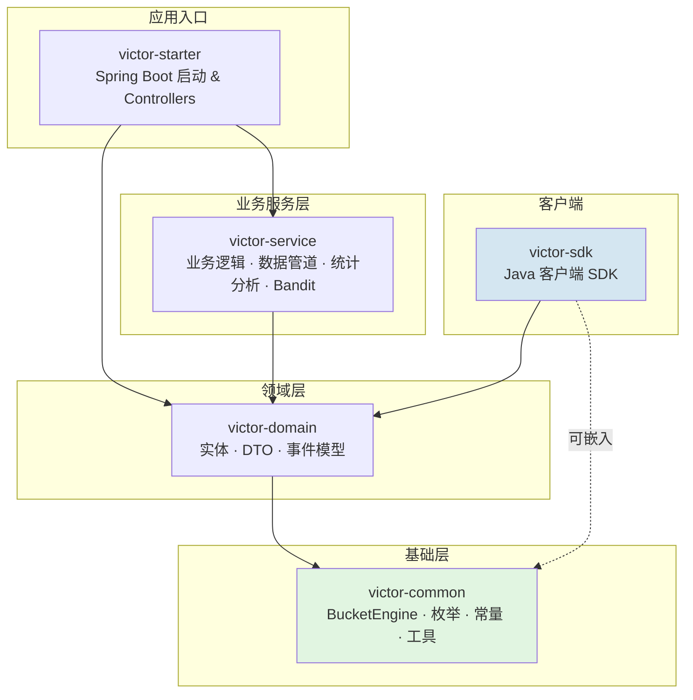

# 模块设计

本文档详细介绍 GateFlow 后端各模块的职责和依赖关系。

## 模块概览

GateFlow 后端采用 Maven 多模块架构，共 5 个模块，严格遵循自底向上的依赖关系，无循环依赖。



## 模块详细职责

### victor-common（公共模块）

| 职责 | 内容 |
|------|------|
| 分桶引擎 | `BucketEngine.computeBucket()` / `findVariant()`（纯 Java，可嵌入 SDK） |
| 常量定义 | 业务常量、配置键 |
| 枚举类型 | ExperimentStatus、Platform 等 |
| 异常体系 | BaseException、ErrorCode |
| 工具类 | MurmurHash3、日期处理、加密工具 |

**约束**: 不依赖任何 Spring 组件，纯 Java 工具库。BucketEngine 位于 `com.gateflow.victor.common.bucketing` 包内。

```java
// 核心 API — 位于 victor-common
public class BucketEngine {
    public static int computeBucket(String userId, String layerId, String salt);
    public static String findVariant(int bucket, List<VariantSpec> variants);
}
```

### victor-domain（领域模型）

| 职责 | 内容 |
|------|------|
| 实体类 | Experiment、Layer、Bucket、Domain、ConfigVersion、ExperimentWhitelist、ExperimentApproval、User、Role、Permission 等 |
| DTO | 请求/响应对象（17+ 个 DTO 类）、查询参数 |
| 事件模型 | ExperimentEvent、MetricEvent |

**约束**: 仅依赖 `victor-common`，不含业务逻辑。

### victor-service（业务服务）

核心业务模块，包含以下子包：

**业务服务** (`com.gateflow.victor.service`):

| 服务 | 职责 |
|------|------|
| `ExperimentService` | 实验 CRUD、状态转换、冲突检测 |
| `ExperimentLifecycleService` | 5 状态生命周期状态机 |
| `BucketingService` | 分桶请求处理、批量查询优化 |
| `StatisticsService` | 统计数据聚合（调用 StatsEngine + ClickHouse） |
| `ConfigService` | SDK 配置获取、版本管理 |
| `BanditService` | 多臂老虎机流量优化（Thompson Sampling、Epsilon-Greedy、UCB） |
| `RampScheduler` | 灰度自动推进调度（每 5 分钟检查） |
| `RbacService` | 角色权限管理 |

**统计数据管道** (`com.gateflow.victor.service.pipeline`):

| 组件 | 职责 |
|------|------|
| `EventController` | 事件接收 REST API |
| `EventKafkaProducer` | 事件发布到 Kafka |
| `EventConsumer` | Kafka 批量消费 |
| `ClickHouseWriter` | 批量写入 ClickHouse |

**统计分析引擎** (`com.gateflow.victor.stats`):

| 算法 | 用途 |
|------|------|
| Z-Test | 比例显著性检验 |
| mSPRT | 序贯检验，支持早停 |
| CUPED | 方差缩减 |
| BH Correction | 多重检验校正 |
| SRM Check | 样本比率匹配校验 |
| Bayesian Analysis | 贝叶斯后验分析 |
| Power Analysis | 样本量估算 |

**基础设施** (`com.gateflow.victor.infra`):

| 组件 | 职责 |
|------|------|
| MyBatis Mapper | 18 个数据访问接口 |
| Flyway 迁移 | `victor-service/src/main/resources/db/migration/` |

### victor-sdk（客户端 SDK）

| 组件 | 职责 |
|------|------|
| `VictorClient` | 主客户端类 |
| `VictorConfig` | 配置构建器 |
| Caffeine Cache | 本地配置缓存 |
| OkHttp | HTTP 客户端 |
| 离线降级 | 本地缓存过期后使用上一次有效配置 |

**核心功能**: 配置拉取、本地缓存、定时轮询、版本比对、异步事件上报。

### victor-starter（应用入口）

| 组件 | 职责 |
|------|------|
| Controllers | 18 个 REST Controller |
| `SecurityConfig` | JWT 认证 + RBAC 权限拦截器 |
| `JwtAuthenticationFilter` | JWT Token 解析与身份提取 |
| `PermissionInterceptor` | `@RequirePermission` 注解处理 |
| `GlobalExceptionHandler` | 统一错误响应 |
| `VictorServiceApplication` | Spring Boot 启动类 |

## API 端点映射

| Controller | 路径 | 说明 |
|-----------|------|------|
| `AuthController` | `/api/v1/auth` | JWT 登录/注册 |
| `ExperimentController` | `/api/v1/experiments` | 实验管理 |
| `ExperimentStatisticsController` | `/api/v1/experiments` | 实验统计分析 |
| `ExperimentVersionController` | `/api/v1/experiments/{expId}/versions` | 版本管理 |
| `LayerController` | `/api/v1/layers` | 层级管理 |
| `DomainController` | `/api/v1/domains` | 业务域管理 |
| `BucketController` | `/api/v1/buckets` | 分桶/变体管理 |
| `BucketingController` | `/api/v1/bucketing` | 运行时分流 |
| `ConfigController` | `/api/v1/config` | SDK 配置 |
| `EventController` | `/api/v1/events` | 事件上报 |
| `MetricsController` | `/api/v1/metrics` | 指标查询 |
| `BanditController` | `/api/v1/bandit` | 多臂老虎机 |
| `BayesianAnalysisController` | `/api/v1/analysis` | 贝叶斯分析 |
| `PowerAnalysisController` | `/api/v1/power-analysis` | 样本量估算 |
| `RampController` | `/api/v1/ramp` | 灰度推进 |
| `TrafficMapController` | `/api/v1/traffic` | 流量地图 |
| `ExperimentWhitelistController` | `/api/v1/whitelist` | 白名单 |
| `ExperimentReportController` | `/api/v1/reports` | 分析报告 |
| `RbacController` | `/api/v1/rbac` | 角色权限 |
| `SubgroupAnalysisController` | `/api/v1/subgroup-analysis` | 子群分析 |

## 依赖关系总结

```
victor-starter → victor-service → victor-domain → victor-common
victor-sdk → victor-domain → victor-common
victor-sdk 可直接内嵌 victor-common 的 BucketEngine（纯 Java，跨平台可移植）
```
