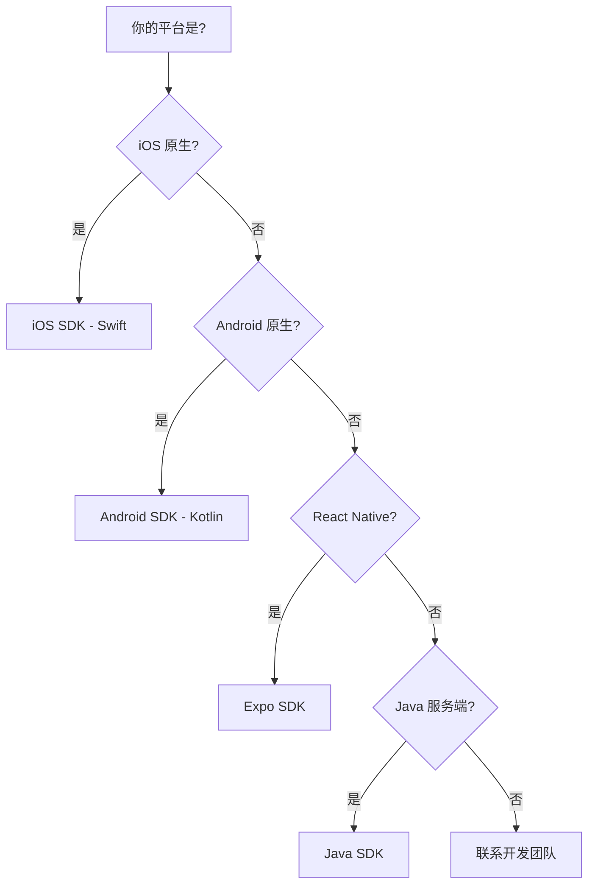

# SDK 集成指南

GateFlow 提供多平台 SDK,方便各端集成。

## SDK 概览

| SDK | 平台 | 状态 | 说明 |
|-----|------|------|------|
| Java SDK | 服务端 | ✅ 可用 | 用于下游服务集成 |
| iOS SDK | iOS (Swift) | 🚧 开发中 | 原生 iOS 应用 |
| Android SDK | Android (Kotlin) | 🚧 开发中 | 原生 Android 应用 |
| Expo SDK | React Native | ✅ 可用 | 跨平台移动应用 |

## 如何选择 SDK

## 详细内容

- [Java SDK](/dev/sdk/java-sdk) - 服务端集成
- [iOS SDK](/dev/sdk/ios-sdk) - iOS 原生集成
- [Android SDK](/dev/sdk/android-sdk) - Android 原生集成
- [Expo SDK](/dev/sdk/expo-sdk) - React Native 集成
