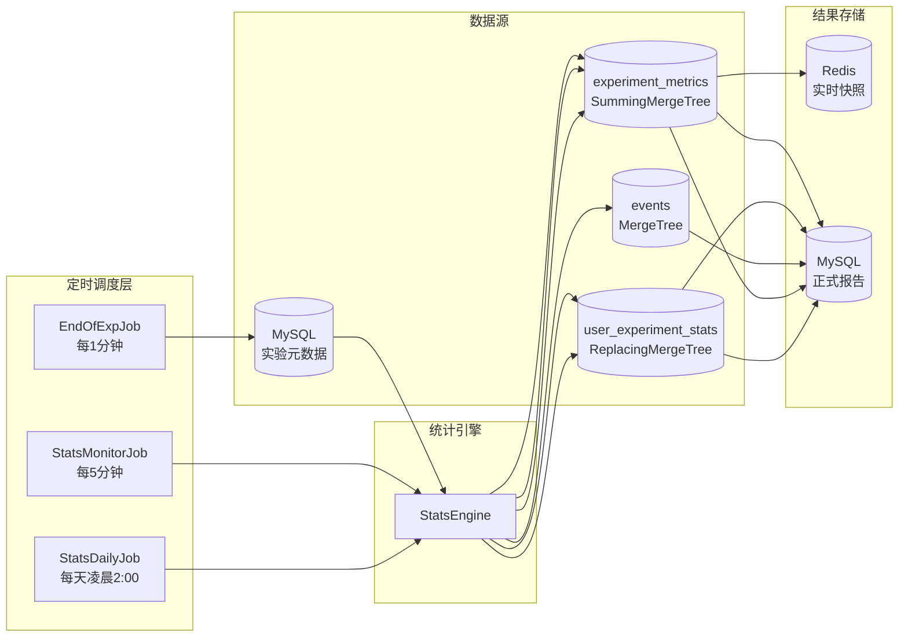

# 离线统计计算任务设计

本文档描述 victor-stats 作为独立进程的离线定时计算方案，确保统计算法在科学上正确的前提下高效运行。

## 架构定位

victor-stats 从 `victor-web` 的同步调用中解耦为**独立 Spring Boot 进程**，通过定时任务驱动离线计算，结果写回 MySQL/Redis 供 dashboard 查询。



## 数据源与算法匹配分析

不同算法对数据粒度的要求从根本上不同：

| 算法 | 输入参数 | 数据粒度 | 数据源 | 能否用聚合表 |
|------|---------|---------|--------|------------|
| SRM (卡方) | `long[] observed` — 各变体用户数 | 聚合 | `experiment_metrics` SUM(unique_users) | ✅ |
| Z-Test (比例) | `(cSuccess, cTotal, tSuccess, tTotal)` — 4个整数 | 聚合 | `experiment_metrics` SUM(conversions), SUM(unique_users) | ✅ |
| mSPRT (序贯) | `SampleStatistics{mean, variance, n}` — 累积统计量 | 聚合 | 从累积量推导 mean/variance | ✅ |
| BH Correction | `List<TestResult>` — p-value 列表 | 无数据依赖 | 纯计算 | N/A |
| **CUPED** (方差缩减) | `List<Double>` 实验值 Y + 实验前值 X — **每用户** | **用户级** | `user_experiment_stats` + `events` | ❌ 必须用户级 |

关键结论：CUPED 的协方差 `cov(Y, X) / var(X)` 无法从聚合均值反推——需要每用户的 `(Y_i, X_i)` 对。其他算法均可直接用 `experiment_metrics` 聚合表计算。

---

## 任务一：StatsMonitorJob（每5分钟）

**目的**：对运行中实验做轻量健康检查，不做完整统计推断。

### 查询

```sql
SELECT variant,
    sum(unique_users) AS total_users,
    sum(conversions)  AS total_conversions
FROM victor.experiment_metrics
WHERE exp_id = ?
  AND metric_date >= toDate(now() - INTERVAL 1 DAY)
GROUP BY variant
```

### 计算

**仅 SRM 检验**，不执行 Z-Test / mSPRT / CUPED：

```java
// 1. 提取各变体用户数
long[] observed = variantStats.values().stream()
    .mapToLong(VariantStats::getTotalUsers).toArray();

// 2. 等比例期望
double[] expected = new double[observed.length];
Arrays.fill(expected, 1.0 / observed.length);

// 3. 卡方检验
double pValue = SrmTest.chiSquareTest(observed, expected);
boolean passed = pValue >= 0.01; // SRM 阈值 1%
```

**同时计算转化率快照**供看板展示：
- 各变体 `conversionRate = conversions / totalUsers`
- 对照组 vs 治疗组的朴素 lift

### 输出

写入 Redis（TTL 10 分钟），dashboard 直接读取：

```
stats:monitor:{expId} → JSON {
  srmPassed, srmPValue,
  variants: [{ name, users, conversions, conversionRate }]
}
```

### 为什么每5分钟只做 SRM

- **SRM 是安全网**，检测分流 bug，不是推断性检验——适合高频。
- **Z-Test 不能高频跑**：每5分钟做一次显著性检验会产生严重的多重比较问题，假阳性率爆炸。
- **CUPED 计算成本高**：需要查询 `user_experiment_stats` 做逐用户协方差计算。

---

## 任务二：StatsDailyJob（每天凌晨 2:00）

**目的**：对前一天有数据的所有运行中/已结束实验，做完整统计分析并生成报告。

### 阶段 2.1：聚合层计算

**数据源**：`experiment_metrics`（SummingMergeTree 自动合并）

```sql
SELECT variant,
    sum(unique_users)  AS total_users,
    sum(conversions)   AS total_conversions,
    sum(total_events)  AS total_events,
    sum(total_revenue) AS total_revenue
FROM victor.experiment_metrics
WHERE exp_id = ?
  AND metric_date >= ?   -- 实验开始日期
  AND metric_date <= ?   -- 昨天
GROUP BY variant
```

返回的 `Map<String, VariantStats>` 直接用于：

#### a) SRM 检验

```java
long[] observed = ...;     // 各变体 total_users
double[] expected = ...;   // 等比例 1/k
double srmPValue = SrmTest.chiSquareTest(observed, expected);
```

#### b) Z-Test 主指标检验

```java
// 仅需 4 个聚合整数，无需用户明细
TestResult result = zTest.executeProportion(
    controlStats.getTotalConversions(),  // 对照组转化数
    controlStats.getTotalUsers(),        // 对照组总用户
    treatmentStats.getTotalConversions(),// 治疗组转化数
    treatmentStats.getTotalUsers()       // 治疗组总用户
);
```

#### c) 辅助指标 BH 校正

```java
List<TestResult> results = new ArrayList<>();
for (String variant : treatmentVariants) {
    results.add(zTest.executeProportion(cSuccess, cTotal, tSuccess, tTotal));
}
List<TestResult> corrected = bhCorrection.correct(results);
```

#### d) mSPRT 护栏指标序贯检验

```java
// 从累积聚合量构造 SampleStatistics
SampleStatistics control = SampleStatistics.builder()
    .n(controlStats.getTotalUsers())
    .mean(controlStats.getConversionRate())
    .variance(mean * (1 - mean))  // 二项分布方差近似
    .build();

SequentialTestResult result = msprt.execute(control, treatment, cumulativeObs);
// 若 status == STOP_NEGATIVE → 护栏恶化，触发告警
```

### 阶段 2.2：CUPED 用户级计算

**仅对已结束实验或运行超过 7 天的实验执行**（CUPED 需要充分的实验前窗口）。

#### Step 1：查询实验期每用户转化状态

```sql
SELECT user_id, converted, conversion_count, total_revenue
FROM victor.user_experiment_stats FINAL
WHERE exp_id = ?
  AND variant = ?
  AND stat_date >= ?   -- 实验开始日期
```

#### Step 2：查询同一批用户的实验前行为

```sql
-- 查询实验前 7-14 天同一批用户的转化率（作为协变量 X）
SELECT user_id,
       countIf(event_type = 'conversion') / count() AS pre_cvr
FROM victor.events
WHERE user_id IN (?)                      -- 实验参与用户
  AND event_date BETWEEN ? AND ?          -- 实验前窗口
  AND event_type IN ('page_view', 'conversion')
GROUP BY user_id
```

#### Step 3：计算 CUPED 调整

```java
// 构建 per-user 数组（必须对齐）
List<Double> experimentValues = ...;     // Y: 0/1 转化标记
List<Double> preExperimentValues = ...;  // X: 历史转化率
double overallMeanX = preExperimentValues.stream()
    .mapToDouble(d -> d).average().orElse(0);

// CUPED 调整，返回方差缩减后的 SampleStatistics
SampleStatistics cupedStats = cuped.adjust(
    experimentValues, preExperimentValues, overallMeanX);

// 将 cupedStats 用于后续 Z-Test 的 mean/variance
```

### 输出

写入 MySQL 结果表，供 `ExperimentStatisticsController` 查询：

- 主指标 Z-Test 结果（p-value, lift, CI）
- 辅助指标 BH 校正结果
- CUPED 调整后方差对比
- 护栏指标 mSPRT 状态
- 每日趋势数据
- 决策建议（LAUNCH / DO_NOT_LAUNCH / CONTINUE）

---

## 任务三：EndOfExpJob（每1分钟）

**目的**：检测刚被停止的实验，触发最终报告生成并更新状态。

### 逻辑

```java
// 1. 查询 MySQL 中状态为 STOPPING 的实验
List<Experiment> stopping = experimentMapper.selectByStatus("STOPPING");

for (Experiment exp : stopping) {
    // 2. 调用完整分析
    ExperimentReport report = statsEngine.analyzeExperiment(
        exp.getId(), exp.getLayer(),
        exp.getStartDate(), exp.getEndDate(),
        exp.getControlVariant(), exp.getTreatmentVariants()
    );

    // 3. 写入报告表
    reportMapper.insert(report.toEntity());

    // 4. 更新实验状态
    experimentMapper.updateStatus(exp.getId(), "ANALYZING");
}
```

---

## 计算正确性总结

| 算法 | 数据源 | 计算方式 | 为何正确 |
|------|--------|---------|---------|
| SRM | `experiment_metrics` SUM | `chiSquareTest(observed, expected)` | 用户数是可加聚合量 |
| Z-Test | `experiment_metrics` SUM | `executeProportion(S1, N1, S2, N2)` | 转化率检验仅需成功数+总数 |
| mSPRT | `experiment_metrics` 累积 SUM | `execute(stats, stats, cumObs)` | mean/variance 可从累积量推导 |
| BH | 无 | `correct(pValues)` | 纯数学后处理 |
| CUPED | `user_experiment_stats` + `events` 用户级查询 | `adjust(perUserY[], perUserX[], meanX)` | 协方差必须从 (Y_i, X_i) 对计算 |

> CUPED 需要约 `O(实验用户数)` 次计算，对百万级用户的实验约 1-3 秒完成。
