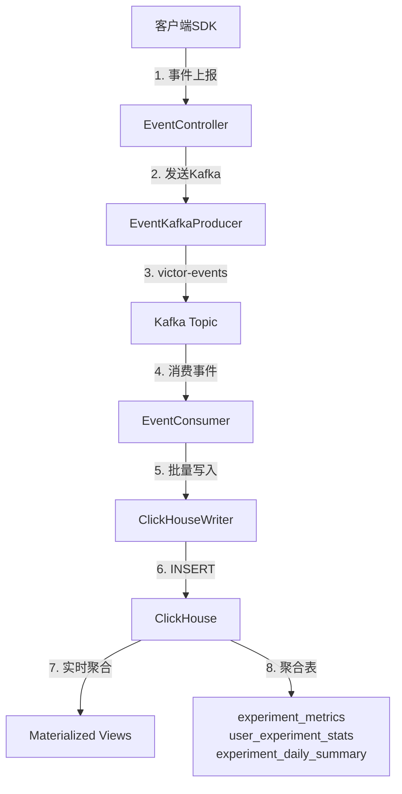

# 事件管道

本文档详细介绍 GateFlow AB 实验系统的事件采集、传输、存储和实时聚合架构。

## 整体架构



**数据流说明**：
1. 客户端 SDK 上报曝光/点击/转化事件
2. EventController 接收并验证事件
3. EventKafkaProducer 异步发送到 Kafka
4. EventConsumer 批量消费事件
5. ClickHouseWriter 批量写入 ClickHouse
6. Materialized Views 自动聚合数据

## 核心组件

| 组件 | 类路径 | 职责 |
|------|--------|------|
| EventController | `victor-pipeline/.../ingestion/EventController` | REST API 接收事件 |
| EventKafkaProducer | `victor-pipeline/.../ingestion/EventKafkaProducer` | 异步发送 Kafka |
| EventConsumer | `victor-pipeline/.../consumer/EventConsumer` | 批量消费事件 |
| ClickHouseWriter | `victor-pipeline/.../consumer/ClickHouseWriter` | 批量写入优化 |
| EventRepository | `victor-pipeline/.../storage/EventRepository` | ClickHouse 操作 |

### 1. EventController

事件接收 REST API，负责验证和分发事件。

**接口**：`POST /api/v1/events`

```java
@RestController
@RequestMapping("/api/v1/events")
public class EventController {
    private final EventKafkaProducer kafkaProducer;

    @PostMapping
    public ResponseEntity<EventResponse> collectEvents(@RequestBody EventRequest request) {
        // 验证每个事件的时间戳
        // 发送到 Kafka
        // 返回接受/拒绝数量
    }
}
```

**请求格式**：
```json
{
  "events": [
    {
      "eventId": "evt_123456",
      "eventType": "exposure",
      "userId": "user_001",
      "timestamp": 1704067200000,
      "platform": "ios",
      "deviceId": "device_abc",
      "sessionId": "sess_xyz",
      "experimentTags": [
        {
          "expId": "exp_homepage_v1",
          "variant": "treatment",
          "layer": "layer_001"
        }
      ],
      "properties": {
        "page": "home",
        "position": 1
      }
    }
  ]
}
```

### 2. EventKafkaProducer

异步发送到 Kafka，使用用户ID作为分区键保证同一用户事件有序。

```java
@Component
public class EventKafkaProducer {
    private final KafkaTemplate<String, EventDTO> kafkaTemplate;

    public void sendEvent(EventDTO event) {
        String topic = properties.getKafkaTopic();
        String key = event.getUserId();  // 分区键
        
        kafkaTemplate.send(topic, key, event)
            .whenComplete((result, ex) -> {
                if (ex != null) {
                    log.error("Failed to send event", ex);
                }
            });
    }
}
```

**Kafka 配置**：
```yaml
spring:
  kafka:
    bootstrap-servers: localhost:9092
    producer:
      key-serializer: org.apache.kafka.common.serialization.StringSerializer
      value-serializer: org.apache.kafka.common.serialization.StringSerializer
      acks: all
      retries: 3
    consumer:
      group-id: victor-consumer
      auto-offset-reset: earliest
```

### 3. EventConsumer

批量消费 Kafka 事件，使用批量消费提升吞吐量。

```java
@Component
public class EventConsumer {
    private final ClickHouseWriter writer;

    @KafkaListener(
        topics = "${victor.pipeline.kafka-topic:victor-events}",
        groupId = "victor-consumer",
        batch = "true"
    )
    public void consumeBatch(List<ConsumerRecord<String, EventDTO>> records) {
        List<EventDTO> events = records.stream()
            .map(ConsumerRecord::value)
            .collect(Collectors.toList());
        
        writer.writeBatch(events);
    }
}
```

### 4. ClickHouseWriter

批量写入优化，支持回退策略。

```java
@Component
public class ClickHouseWriter {
    private final EventRepository eventRepository;

    public void writeBatch(List<EventDTO> events) {
        try {
            int count = eventRepository.insertBatch(events);
            log.info("Batch inserted {} events", count);
        } catch (Exception e) {
            log.error("Batch failed, fallback to single insert");
            fallbackToSingleInsert(events);
        }
    }
}
```

## 事件数据模型

### EventDTO 结构

```java
@Data
@Builder
public class EventDTO {
    @NotBlank private String eventId;
    @NotBlank private String eventType;  // exposure/click/conversion
    @NotBlank private String userId;
    @NotNull private Long timestamp;
    
    private String platform;
    private String deviceId;
    private String sessionId;
    
    private List<ExperimentTagDTO> experimentTags;
    private Map<String, Object> properties;
}

@Data
public class ExperimentTagDTO {
    private String expId;      // 实验ID
    private String variant;   // 变体ID
    private String layer;    // 层ID
}
```

### 事件类型

| 类型 | 说明 | 上报策略 | 典型场景 |
|------|------|----------|----------|
| exposure | 曝光事件 | 立即上报 | 卡片展示、弹窗显示 |
| click | 点击事件 | 立即上报 | 按钮点击、链接跳转 |
| conversion | 转化事件 | 批量上报 | 下单、付费 |

## ClickHouse 存储

### 1. 原始事件表 - victor.events

```sql
CREATE TABLE IF NOT EXISTS victor.events (
    event_date Date DEFAULT toDate(timestamp),
    event_id String,
    event_type String,
    user_id String,
    timestamp DateTime64(3),
    platform String,
    device_id String,
    session_id String,
    exp_ids Array(String),      -- 实验ID数组
    variants Array(String),     -- 变体ID数组
    layers Array(String),        -- 层ID数组
    properties String,         -- JSON属性
    received_at DateTime64(3) DEFAULT now64(3)
)
ENGINE = MergeTree()
PARTITION BY toYYYYMMDD(event_date)
ORDER BY (event_date, event_type, user_id, timestamp)
SETTINGS index_granularity = 8192;
```

### 2. 指标聚合表 - experiment_metrics

按分钟聚合的实验指标，用于实时监控。

```sql
CREATE TABLE IF NOT EXISTS victor.experiment_metrics (
    metric_date Date DEFAULT toDate(minute_bucket),
    minute_bucket DateTime,
    exp_id String,
    variant String,
    layer String,
    
    -- 事件统计
    total_events UInt64 DEFAULT 0,
    unique_users UInt64 DEFAULT 0,
    
    -- 转化统计
    conversions UInt64 DEFAULT 0,
    conversion_users UInt64 DEFAULT 0,
    
    -- 收入统计
    total_revenue Float64 DEFAULT 0,
    avg_revenue Float64 DEFAULT 0,
    
    updated_at DateTime64(3) DEFAULT now64(3)
)
ENGINE = SummingMergeTree()
PARTITION BY toYYYYMMDD(metric_date)
ORDER BY (metric_date, exp_id, variant, layer, minute_bucket);
```

### 3. 用户统计表 - user_experiment_stats

用户级别的参与记录，用于用户留存分析。

```sql
CREATE TABLE IF NOT EXISTS victor.user_experiment_stats (
    stat_date Date DEFAULT toDate(created_at),
    exp_id String,
    variant String,
    layer String,
    user_id String,
    
    first_seen_at DateTime64(3),
    last_seen_at DateTime64(3),
    event_count UInt32 DEFAULT 0,
    
    converted Bool DEFAULT false,
    first_conversion_at DateTime64(3),
    conversion_count UInt32 DEFAULT 0,
    
    total_revenue Float64 DEFAULT 0,
    platform String DEFAULT '',
    device_id String DEFAULT '',
    created_at DateTime64(3) DEFAULT now64(3)
)
ENGINE = ReplacingMergeTree(last_seen_at)
PARTITION BY toYYYYMMDD(stat_date)
ORDER BY (stat_date, exp_id, variant, user_id);
```

### 4. 每日汇总表 - experiment_daily_summary

用于 Dashboard 快速查询的预聚合表。

```sql
CREATE TABLE IF NOT EXISTS victor.experiment_daily_summary (
    summary_date Date,
    exp_id String,
    variant String,
    layer String,
    
    total_users UInt64 DEFAULT 0,
    converted_users UInt64 DEFAULT 0,
    total_events UInt64 DEFAULT 0,
    
    conversion_rate Float64 DEFAULT 0,
    confidence_interval_lower Float64 DEFAULT 0,
    confidence_interval_upper Float64 DEFAULT 0,
    
    total_revenue Float64 DEFAULT 0,
    avg_revenue_per_user Float64 DEFAULT 0,
    significance_score Float64 DEFAULT 0,
    
    updated_at DateTime64(3) DEFAULT now64(3)
)
ENGINE = SummingMergeTree()
PARTITION BY toYYYYMMDD(summary_date)
ORDER BY (summary_date, exp_id, variant, layer);
```

## 物化视图

Materialized Views 自动聚合原始事件，生成实时指标。

### 1. 事件聚合视图

```sql
CREATE MATERIALIZED VIEW IF NOT EXISTS victor.mv_experiment_metrics
ENGINE = SummingMergeTree()
PARTITION BY toYYYYMMDD(minute_bucket)
ORDER BY (minute_bucket, exp_id, variant, layer)
AS SELECT
    toStartOfMinute(timestamp) AS minute_bucket,
    exp_ids[1] AS exp_id,
    variants[1] AS variant,
    layers[1] AS layer,
    count() AS total_events,
    uniqExact(user_id) AS unique_users,
    0 AS conversions,
    0 AS conversion_users,
    0.0 AS total_revenue,
    0.0 AS avg_revenue,
    now64(3) AS updated_at
FROM victor.events
WHERE length(exp_ids) > 0
GROUP BY 
    minute_bucket,
    exp_ids[1],
    variants[1],
    layers[1];
```

### 2. 转化事件视图

```sql
CREATE MATERIALIZED VIEW IF NOT EXISTS victor.mv_conversion_metrics
ENGINE = SummingMergeTree()
PARTITION BY toYYYYMMDD(minute_bucket)
ORDER BY (minute_bucket, exp_id, variant, layer)
AS SELECT
    toStartOfMinute(timestamp) AS minute_bucket,
    exp_ids[1] AS exp_id,
    variants[1] AS variant,
    layers[1] AS layer,
    count() AS conversions,
    uniqExact(user_id) AS conversion_users,
    sum(toFloat64(JSONExtractString(properties, 'revenue'))) AS total_revenue,
    now64(3) AS updated_at
FROM victor.events
WHERE length(exp_ids) > 0
  AND event_type = 'conversion'
GROUP BY 
    minute_bucket,
    exp_ids[1],
    variants[1],
    layers[1];
```

## 数据存储说明

| 存储层 | 数据库 | 表 | 用途 |
|--------|--------|-----|------|
| 原始数据 | ClickHouse | `victor.events` | 原始事件日志 |
| 实时指标 | ClickHouse | `victor.experiment_metrics` | 分钟级聚合 |
| 用户统计 | ClickHouse | `victor.user_experiment_stats` | 用户级统计 |
| 每日汇总 | ClickHouse | `victor.experiment_daily_summary` | 日级聚合 |
| 配置存储 | MySQL | `victor_experiment` 库 | 实验配置 |

**注意**：AB 分流事件数据存储在 ClickHouse 中，不存储在 MySQL。MySQL 只存储实验配置（Domain、Layer、Experiment、Variant）。

## 配置项

Pipeline 配置位于 `application.yml`：

```yaml
victor:
  pipeline:
    kafka-topic: victor-events
    batch-size: 1000
    flush-interval-ms: 5000

spring:
  kafka:
    bootstrap-servers: ${KAFKA_SERVERS:localhost:9092}
    producer:
      acks: all
      retries: 3
    consumer:
      group-id: victor-consumer
      auto-offset-reset: earliest
```

## 相关代码文���

| 文件 | 路径 |
|------|------|
| EventController | `victor-pipeline/src/main/java/.../ingestion/EventController.java` |
| EventKafkaProducer | `victor-pipeline/src/main/java/.../ingestion/EventKafkaProducer.java` |
| EventConsumer | `victor-pipeline/src/main/java/.../consumer/EventConsumer.java` |
| ClickHouseWriter | `victor-pipeline/src/main/java/.../consumer/ClickHouseWriter.java` |
| EventRepository | `victor-pipeline/src/main/java/.../storage/EventRepository.java` |
| EventDTO | `victor-pipeline/src/main/java/.../ingestion/dto/EventDTO.java` |
| 建表SQL | `docker/init-db/01-create-events-table.sql` |
| 指标SQL | `docker/init-db/02-create-metrics-table.sql` |