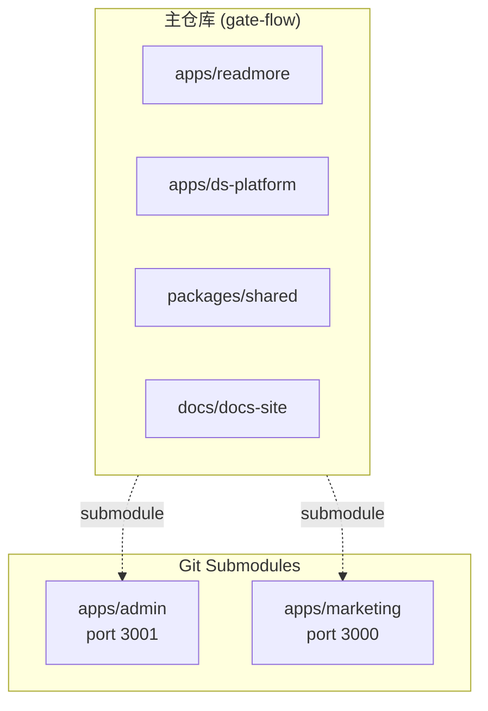

# 前端架构

本文档介绍 GateFlow 前端应用技术栈和架构。

## 项目结构

GateFlow 前端采用 pnpm workspaces monorepo 结构,包含多个应用和共享组件库:



## 应用概览

| 应用 | 说明 | 端口 | 仓库 |
|------|------|------|------|
| **Admin Console** | 管理控制台,实验管理、流量配置、数据分析 | `http://localhost:3001` | `HiCooper/superab-admin` (submodule) |
| **Marketing Site** | 营销站点,产品介绍、定价、文档 | `http://localhost:3000` | `HiCooper/superab-marketing` (submodule) |
| **ReadMore** | 阅读增强应用 | 待配置 | 本仓库 `apps/readmore` |
| **DS Platform** | 数据科学分析平台 | 待配置 | 本仓库 `apps/ds-platform` |
| **Docs Site** | 文档网站 | `http://localhost:5173` | 本仓库 `docs/docs-site` |

## 技术栈

| 技术 | 用途 |
|------|------|
| React 18 | UI 框架 |
| TypeScript | 类型系统 |
| Vite 5.4 | 构建工具 |
| Tailwind CSS v4 | 样式系统 (CSS-first 配置) |
| React Router v6 | 路由 |
| Zustand | 状态管理 |
| Recharts | 图表库 |
| @dnd-kit | 拖拽组件 |

## 共享组件库

`packages/shared` 是共享组件库,导出以下模块:

| 模块 | 说明 |
|------|------|
| `tokens` | 设计令牌 (颜色、间距、字体) |
| `hooks` | 自定义 React Hooks |
| `utils` | 工具函数 |
| `components` | 通用 UI 组件 |

使用方式:
```typescript
import { tokens, hooks, utils, components } from '@gate-flow/shared'
import { Button } from '@gate-flow/shared/components'
```

## 启动命令

```bash
# 安装依赖
pnpm install

# 初始化 submodules (首次)
git submodule update --init --recursive

# 启动所有前端应用
pnpm dev

# 单独启动
pnpm dev:admin       # Admin Console (3001)
pnpm dev:marketing   # Marketing Site (3000)
pnpm dev:readmore   # ReadMore App
pnpm dev:ds         # DS Platform
pnpm docs:dev       # Docs Site (5173)
```

## 编码规范

- Tailwind CSS v4 使用 `@theme` 和 `@import "tailwindcss"` 配置,无需 `tailwind.config.js`
- 所有应用的 `@` 别名指向 `./src` 目录
- 根目录 `tsconfig.base.json` 定义共享的编译选项和路径映射
- 组件命名采用 PascalCase
- 文件命名采用 kebab-case
