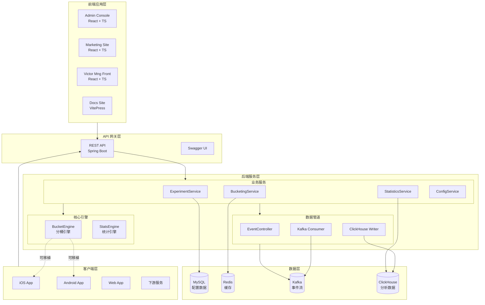
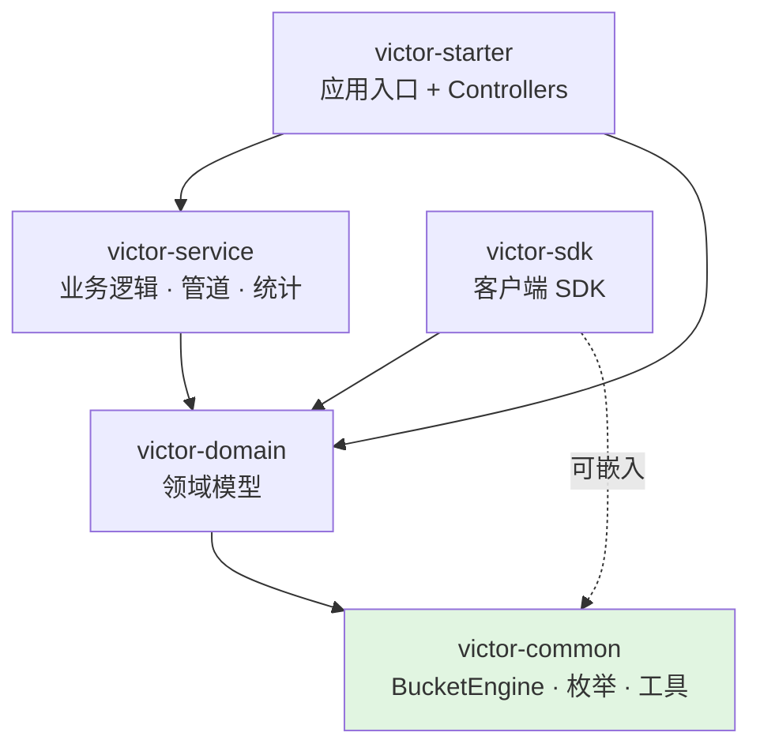
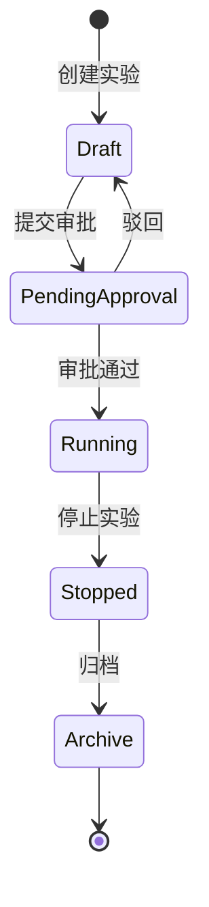
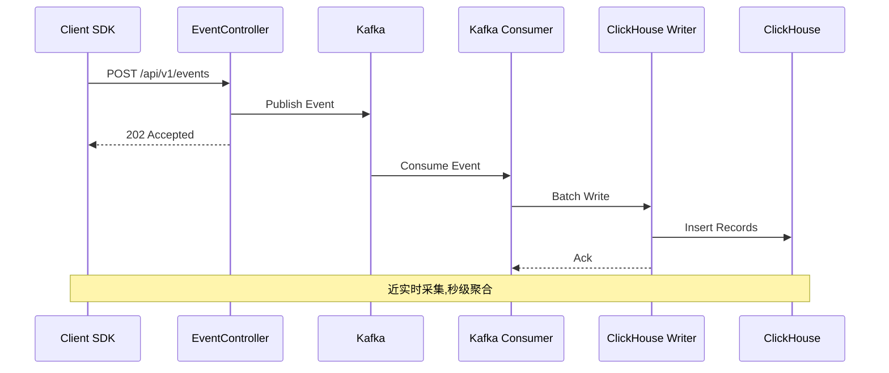
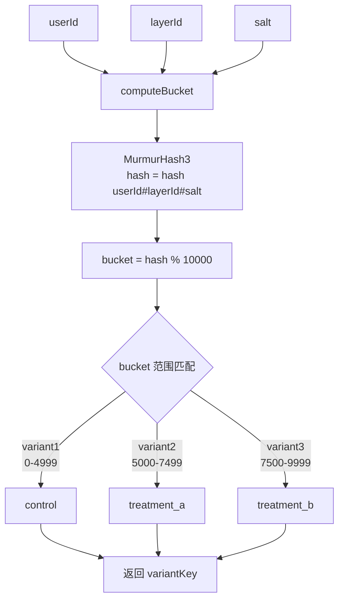

# 架构总览

GateFlow 采用分层微服务架构,各模块职责清晰,支持水平扩展。

## 整体系统架构

## 模块依赖关系

> 绿色模块 `victor-common` 是纯 Java 实现，无 Spring 依赖。`BucketEngine` 可直接嵌入客户端 SDK（Java / Kotlin / Swift / TypeScript）。

## 实验生命周期状态机

| 状态 | 说明 | 允许的操作 |
|------|------|-----------|
| `draft` | 草稿 | 编辑、提交审批、启动、删除 |
| `pending_approval` | 待审批 | 审批通过、驳回 |
| `running` | 运行中 | 停止（可启用 auto_ramp 灰度自动推进） |
| `stopped` | 已停止 | 归档、查看分析报告 |
| `archive` | 已归档 | 查看 |

> 灰度放量不再是独立状态，而是 running 状态内的特性（`auto_ramp_enabled` + `ramp_config`）。

## 事件流管道架构

## 分桶算法流程

## 技术栈总览

### 前端

| 技术 | 用途 |
|------|------|
| React 18 + TypeScript | UI 框架 |
| Vite 5.4 | 构建工具 |
| Tailwind CSS v4 | 样式系统 |
| React Router v6/v7 | 路由 |
| Zustand | 状态管理 |
| Recharts | 图表库 |
| @dnd-kit | 拖拽组件 |

### 后端

| 技术 | 用途 |
|------|------|
| Java 17 + Spring Boot 3.4 | 后端框架 |
| MyBatis-Plus 3.5 | ORM |
| MySQL 8.0 | 主数据库 |
| Redis 7 | 缓存 |
| Apache Kafka | 事件流 |
| ClickHouse | 分析数据库 |
| Flyway | 数据库迁移 |
| SpringDoc OpenAPI | API 文档 |

## 详细内容

GateFlow 包含两个核心子系统，各自有独立的文档章节：

| 文档 | 说明 |
|------|------|
| [AB实验系统](/dev/ab-system/) | 分流引擎、统计引擎、数据模型、模块设计、SDK 集成等 |
| [埋点分析系统](/dev/analytics-system/) | 事件管道、数据模型、SDK 设计、会话管理、DLQ 重放等 |
| [前端架构](/dev/architecture/frontend-arch) | 前端应用技术栈和架构 |
