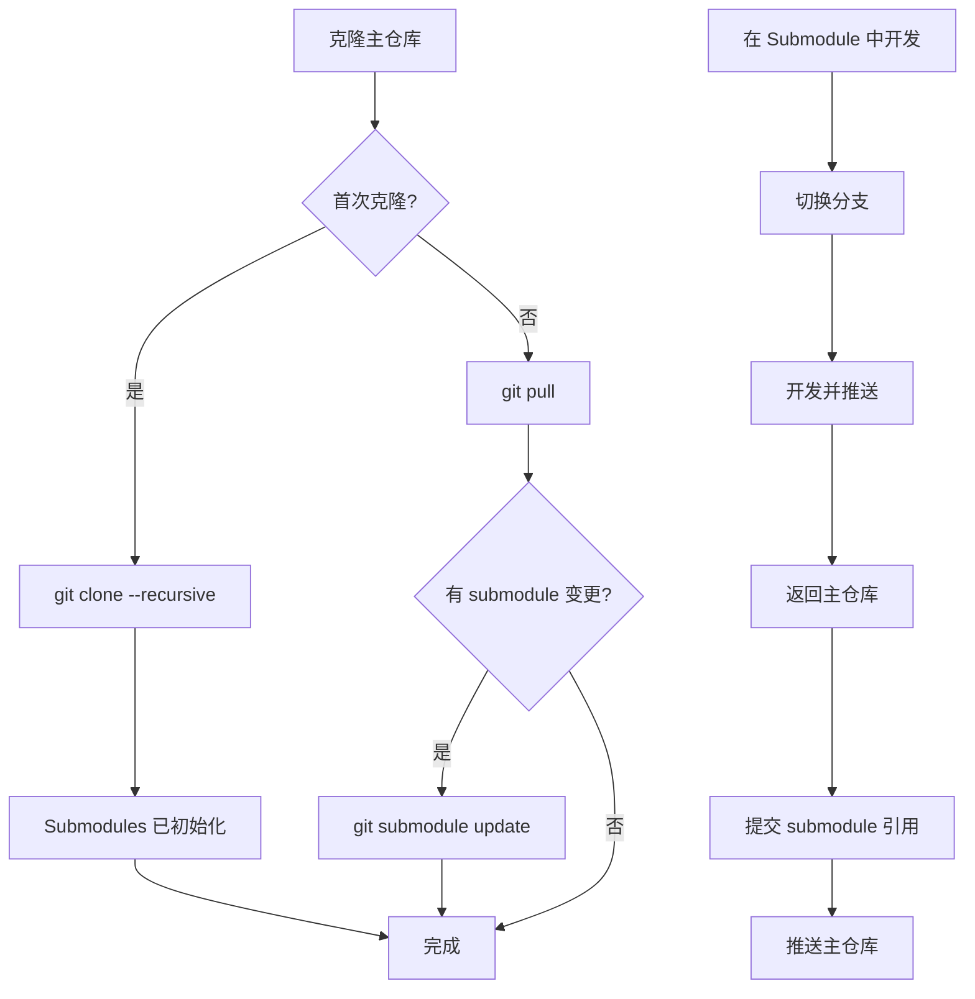

# Git Submodule 工作流

GateFlow 采用 Git Submodule 结构管理多个仓库。本文档介绍如何正确使用 submodules。

## 什么是 Git Submodule?

Git Submodule 允许在一个 Git 仓库中包含另一个 Git 仓库,作为子目录存在,同时保持独立的版本历史。

## GateFlow Submodule 结构

| 组件 | Submodule 路径 | 远程仓库 |
|------|--------------|---------|
| Admin Console | `apps/admin` | `HiCooper/superab-admin` |
| Marketing Site | `apps/marketing` | `HiCooper/superab-marketing` |
| Backend Service | `backend/victor-ab` | `HiCooper/victor-ab` |

## 常用命令

### 1. 克隆包含 Submodules 的仓库

```bash
# 方法一: 递归克隆 (推荐)
git clone --recursive https://github.com/HiCooper/gate-flow.git

# 方法二: 先克隆主仓库,再初始化 submodules
git clone https://github.com/HiCooper/gate-flow.git
cd gate-flow
git submodule update --init --recursive
```

### 2. 查看 Submodule 状态

```bash
# 查看所有 submodule 的当前 commit
git submodule status

# 查看 submodule 的远程仓库信息
git submodule foreach git remote -v
```

### 3. 更新 Submodules

```bash
# 更新所有 submodule 到当前记录的 commit
git submodule update

# 更新所有 submodule 到远程仓库的最新 commit
git submodule update --remote

# 更新指定的 submodule
git submodule update --remote apps/admin
```

### 4. 在 Submodule 中工作

```bash
# 进入 submodule 目录
cd apps/admin

# 创建分支并进行开发
git checkout -b feature/my-feature
# ... 进行开发工作 ...
git push -u origin feature/my-feature

# 返回主仓库
cd ../..

# 在主仓库中更新 submodule 引用
git add apps/admin
git commit -m "chore: update admin submodule to new feature branch"
git push
```

### 5. 切换 Submodule 分支

```bash
# 在 submodule 中切换分支
cd apps/admin
git checkout develop

# 返回主仓库并提交变更
cd ..
git add apps/admin
git commit -m "chore: update admin submodule to develop"
```

### 6. 拉取包含 Submodule 变更的主仓库

```bash
git pull

# 如果有 submodule 变更,需要同步更新
git submodule update
```

## 工作流程图



## 注意事项

### 1. 不要直接在 Submodule 中提交主仓库的变更

Submodule 是独立的仓库,应该在 submodule 内部进行开发工作。

### 2. 注意 Submodule 的分支

默认情况下,submodule 指向特定的 commit。如果需要使用不同的分支,需要:

```bash
cd apps/admin
git checkout <branch-name>
cd ..
git add apps/admin
git commit -m "chore: switch admin to <branch-name>"
```

### 3. Submodule 引用冲突

如果多人同时更新了 submodule,可能会遇到引用冲突:

```bash
# 解决方法: 先拉取 submodule 最新,再更新主仓库
git submodule update
git add apps/admin
git commit -m "chore: sync admin submodule"
git push
```

### 4. 删除 Submodule (不常用)

如果确实需要删除 submodule:

```bash
# 1. 从主仓库中移除
git submodule deinit apps/admin
git rm apps/admin

# 2. 删除 .git/modules 中的引用
rm -rf .git/modules/apps/admin

# 3. 提交变更
git commit -m "chore: remove admin submodule"
```

## 常见问题

### Q: Submodule 目录为空?

```bash
git submodule update --init
```

### Q: 如何强制更新到远程最新?

```bash
git submodule update --remote
```

### Q: 如何查看 Submodule 的 diff?

```bash
git diff apps/admin
git diff --submodule apps/admin
```

### Q: Submodule 的提交历史在哪里?

Submodule 有自己的 `.git` 目录,在主仓库中以文件形式存在:

```bash
cat apps/admin/.git  # 显示指向的 commit
```
