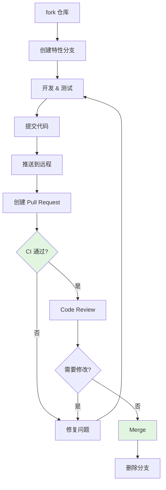

# PR 工作流

本文档介绍 GateFlow 项目的 Pull Request 工作流程。

## 开发流程



## 分支命名

```
feature/exp-xxx          # 新功能
bugfix/exp-xxx           # Bug 修复
hotfix/exp-xxx            # 紧急修复
docs/exp-xxx              # 文档更新
```

## 创建 PR

### PR 标题格式

```
<type>: <简短描述>

feat: 添加实验克隆功能
fix: 修复分桶引擎内存泄漏
```

### PR 描述模板

```markdown
## 描述
简要说明本次修改的内容和目的。

## 变更类型
- [ ] 新功能 (feat)
- [ ] Bug 修复 (fix)
- [ ] 重构 (refactor)
- [ ] 文档更新 (docs)

## 测试计划
- [ ] 已添加单元测试
- [ ] 已本地验证
- [ ] 需要人工测试
```

## Code Review 检查清单

### 功能性
- [ ] 代码逻辑正确
- [ ] 处理了边界情况
- [ ] 没有引入安全漏洞

### 代码质量
- [ ] 遵循编码规范
- [ ] 有必要的注释
- [ ] 无重复代码

### 测试
- [ ] 有新增测试
- [ ] 测试通过
- [ ] 覆盖率未下降

## 合并策略

- 需要至少 1 人 review 通过
- 所有 CI 检查必须通过
- 使用 Squash Merge 合并到主分支

## 注意事项

- 保持 PR 小巧单一
- 及时响应 review 意见
- 不要在 PR 中混合多个改动