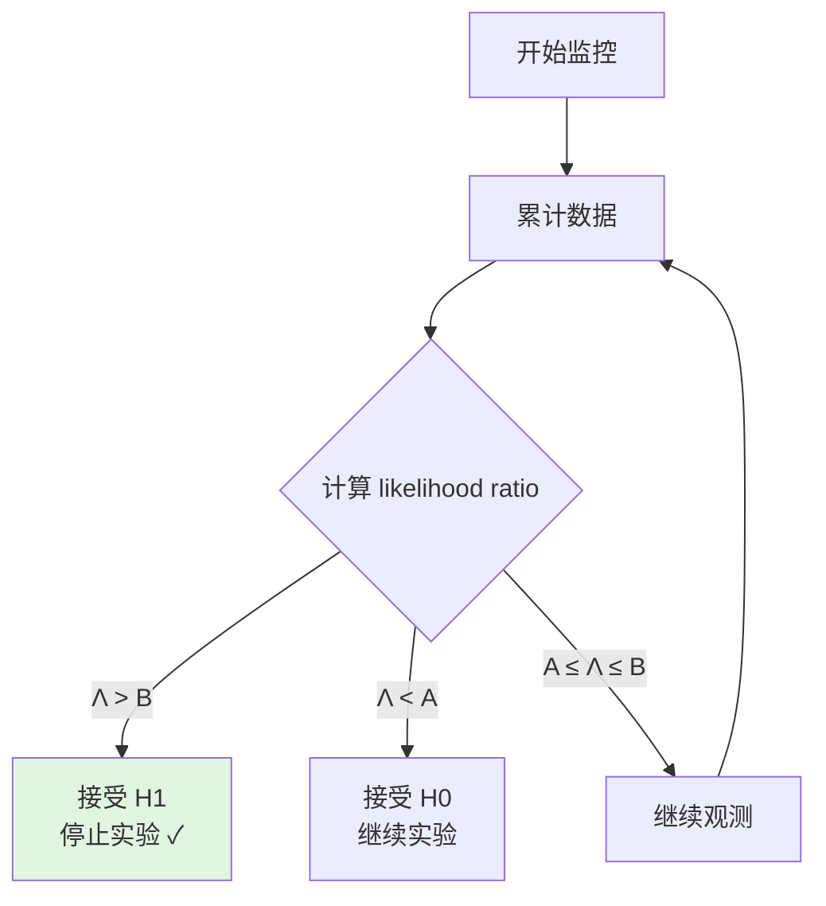

# 序贯检验 (mSPRT)

本文档介绍序贯检验的概念及其在 GateFlow 中的应用。

## 什么是序贯检验？

传统 Z-Test 需要预先确定样本量，但序贯检验允许在实验运行期间持续监控结果，**支持提前停止**。

## 优势

| 特性 | 传统检验 | 序贯检验 |
|------|----------|----------|
| 样本量 | 固定，预估 | 动态，可变 |
| 早停 | 不支持 | 支持 |
| 灵活性 | 低 | 高 |
| 错误率控制 | 固定 α | 固定 α/β |

## mSPRT 算法

```
H0: p_treatment = p_control
H1: p_treatment = p_control × (1 + θ)

计算 likelihood ratio:
Λ = ∏ P(data|H1) / P(data|H0)

判断：
- Λ > B: 接受 H1，停止实验
- Λ < A: 接受 H0，继续实验
- A ≤ Λ ≤ B: 继续观测
```

## 可视化



## 适用场景

- 期望效果明显，希望快速验证
- 负面效应明显，希望及时止损
- 样本获取成本高

## 注意事项

1. 需要预设效应大小 θ
2. 边界选择影响实验时长
3. 不适合微小效果的检测