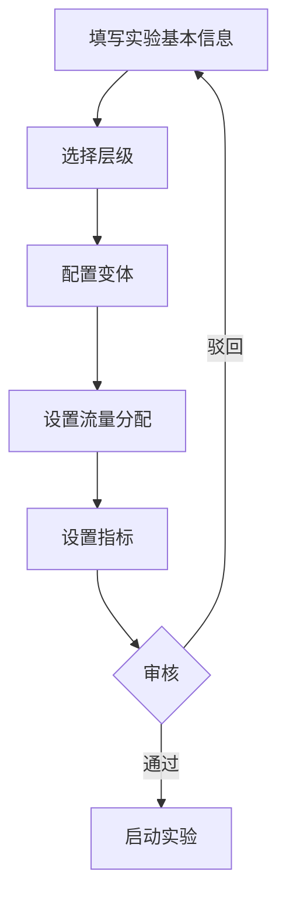

# 创建实验

本文档介绍如何在 GateFlow 中创建一个新的 A/B 测试实验。

## 创建流程



## 实验基本信息

| 字段 | 说明 | 必填 |
|------|------|------|
| 实验名称 | 简洁明了，描述实验目的 | 是 |
| 实验描述 | 详细说明实验背景和假设 | 是 |
| 实验 ID | 系统自动生成，唯一标识 | - |

## 选择层级

层级决定了实验流量的隔离方式：

- **同层实验**：流量互斥，不同实验不能同时命中同一用户
- **跨层实验**：流量正交，用户可能同时参与多个实验

## 变体配置

至少需要配置对照组 (control)：

| 变体 | 说明 | 流量占比 |
|------|------|----------|
| control | 对照组，保持现状 | 0-100% |
| treatment | 实验组，使用新方案 | 0-100% |

**注意**：所有变体流量占比之和必须等于 100%

## 流量分配示例

```
control:     50%  (bucket 0-4999)
treatment_a: 30%  (bucket 5000-7999)
treatment_b: 20%  (bucket 8000-9999)
```

## 指标设置

| 指标类型 | 说明 | 示例 |
|----------|------|------|
| 主指标 | 衡量实验效果的核心指标 | 转化率、点击率 |
| 次指标 | 辅助评估的指标 | 页面停留时长 |
| 护栏指标 | 监控负面影响的指标 | 页面加载时间 |

## 实验创建完成

创建后实验状态为 `草稿 (draft)`，需要提交审核后才能启动。

### 下一步

1. [实验生命周期](./lifecycle.md) - 了解实验的完整生命周期
2. [流量分配](./traffic-allocation.md) - 深入理解流量分配机制