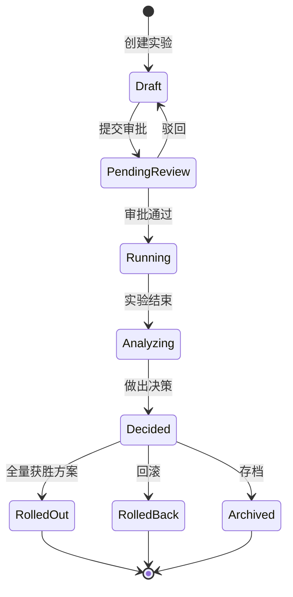

# 实验生命周期

本文档介绍实验从创建到归档的完整生命周期。

## 状态流转

## 状态说明

| 状态 | 说明 | 可执行操作 |
|------|------|-----------|
| Draft | 草稿状态 | 编辑、删除、提交审批 |
| PendingReview | 等待审批 | 撤回 |
| Running | 运行中 | 停止、查看数据 |
| Analyzing | 分析中 | 查看报告、做出决策 |
| Decided | 已决策 | 全量、回滚、存档 |
