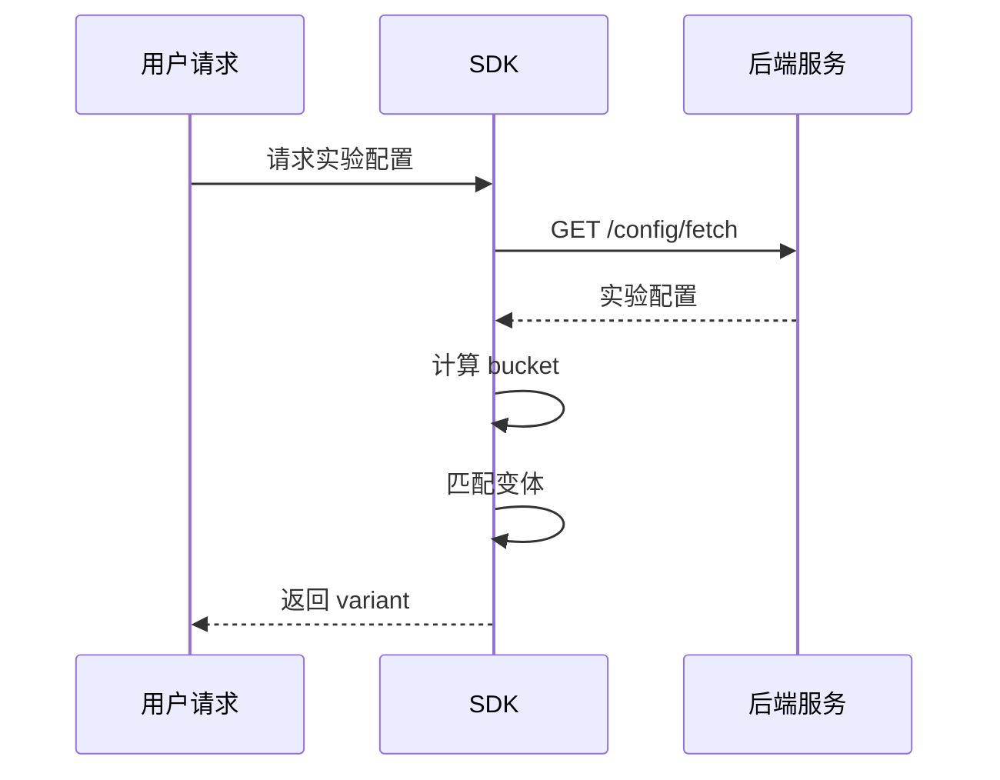

# 流量分配

本文档介绍 GateFlow 的流量分配机制。

## 分桶原理

GateFlow 使用 MurmurHash3 算法进行一致性哈希分桶：

```
bucket = MurmurHash3(userId + "#" + layerId + "#" + salt) % 10000
```

- **输入**: 用户 ID、层级 ID、盐值
- **输出**: 0-9999 的整数（共 10000 个桶）
- **特点**:
  - 确定性：同一用户始终获得相同桶号
  - 均匀分布：用户均匀分配到各变体
  - 跨平台一致：各端 SDK 算法一致

## 流量分配方式

### 1. 按比例分配

直接设置各变体的流量百分比：

| 变体 | 流量占比 | 桶范围 |
|------|----------|--------|
| control | 50% | 0-4999 |
| treatment | 50% | 5000-9999 |

### 2. 渐进放量 (Ramp Up)

从小流量逐步放大：

```
Day 1-3:  5%   (bucket 0-499)
Day 4-7:  20%  (bucket 0-1999)
Day 8+:   50%  (bucket 0-4999)
```

## 分桶流程



## 同层互斥

同一层内的实验流量互斥：

```
Layer: layer_001

实验 A: bucket 0-4999
实验 B: bucket 5000-9999

用户 user_123 -> bucket 2345 -> 命中实验 A
用户 user_456 -> bucket 6789 -> 命中实验 B
```

## 跨层正交

不同层的实验流量正交：

```
用户同时参与 Layer1 和 Layer2 的实验

Layer1: 计算 bucket_A = Hash(user_123 + layer1)
Layer2: 计算 bucket_B = Hash(user_123 + layer2)

bucket_A 和 bucket_B 独立计算
```

## 注意事项

- 流量比例必须为整数百分比
- 各变体占比之和必须等于 100%
- 实验期间避免大幅调整流量