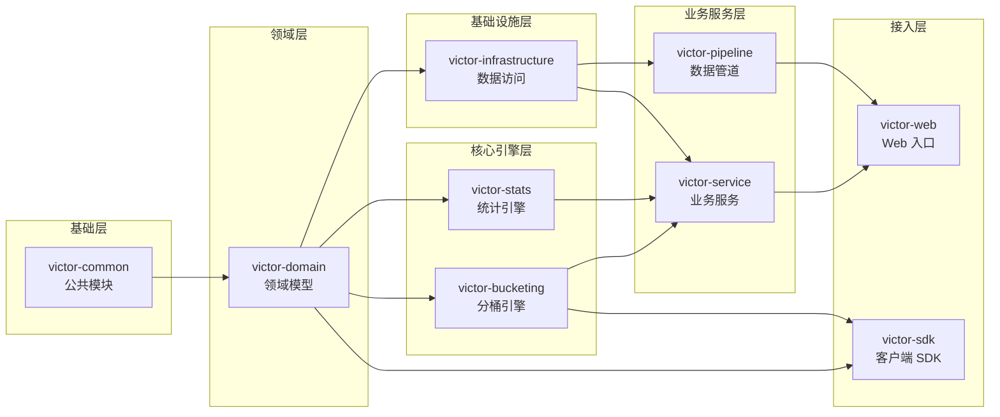

# 模块设计

本文档详细介绍 GateFlow 后端各模块的职责和依赖关系。

## 模块概览

GateFlow 后端采用 Maven 多模块架构,严格遵循自底向上的依赖关系,无循环依赖。



## 模块详细职责

### victor-common (公共模块)

| 职责 | 内容 |
|------|------|
| 常量定义 | 业务常量、配置键 |
| 枚举类型 | 实验状态、变体类型、事件类型 |
| 异常体系 | BaseException、错误码枚举 |
| 工具类 | 日期处理、字符串工具、加密工具 |

**约束**: 不依赖任何 Spring 组件,纯 Java 工具库。

### victor-domain (领域模型)

| 职责 | 内容 |
|------|------|
| 实体类 | Experiment、Layer、Variant、UserAssignment |
| DTO | 请求/响应对象、查询参数 |
| 事件模型 | ExperimentEvent、MetricEvent |

**约束**: 仅依赖 `victor-common`,不含业务逻辑。

### victor-bucketing (分桶引擎)

| 职责 | 内容 |
|------|------|
| 分桶计算 | `BucketEngine.computeBucket()` |
| 变体匹配 | `BucketEngine.findVariant()` |
| 流量分配 | 桶范围计算、冲突检测 |

**约束**: **纯 Java,无 Spring 依赖**,可直接嵌入客户端 SDK。

```java
// 核心 API
public class BucketEngine {
    public static int computeBucket(String userId, String layerId, String salt);
    public static String findVariant(int bucket, List<VariantSpec> variants);
}
```

### victor-infrastructure (基础设施)

| 职责 | 内容 |
|------|------|
| MyBatis Mapper | 数据访问接口 |
| Redis 配置 | 连接池、缓存策略 |
| Kafka 配置 | Producer/Consumer 配置 |
| Flyway 迁移 | 数据库版本管理 |

**关键 Mapper**:
- `ExperimentMapper` - 实验数据访问
- `LayerMapper` - 层级数据访问
- `VariantMapper` - 变体数据访问
- `UserAssignmentMapper` - 用户分配记录

### victor-service (业务服务)

| 服务 | 职责 |
|------|------|
| `ExperimentService` | 实验 CRUD、状态转换、冲突检测 |
| `BucketingService` | 分桶请求处理、批量查询优化 |
| `StatisticsService` | 统计数据聚合(调用 StatsEngine + ClickHouse) |
| `ConfigService` | SDK 配置获取、版本管理 |
| `ExperimentLifecycleService` | 实验生命周期状态机 |

### victor-pipeline (数据管道)

| 组件 | 职责 |
|------|------|
| `EventController` | 事件接收 REST API |
| `KafkaProducer` | 事件发布到 Kafka |
| `KafkaConsumer` | 事件消费、批量处理 |
| `ClickHouseWriter` | 数据写入 ClickHouse |

### victor-stats (统计引擎)

| 算法 | 用途 |
|------|------|
| Z-Test | 显著性检验 |
| mSPRT | 序贯检验,支持早停 |
| CUPED | 方差缩减 |
| BH Correction | 多重检验校正 |
| SRM Check | 样本比率匹配校验 |

**约束**: 使用 Apache Commons Math,可考虑抽为纯 Java 模块。

### victor-sdk (客户端 SDK)

| 组件 | 职责 |
|------|------|
| `VictorClient` | 主客户端类 |
| `VictorConfig` | 配置构建器 |
| Caffeine Cache | 本地配置缓存 |
| OkHttp | HTTP 客户端 |

**核心功能**: 配置拉取、本地缓存、定时轮询、版本比对。

### victor-web (Web 入口)

| 组件 | 职责 |
|------|------|
| Controllers | REST API 端点 |
| `GlobalExceptionHandler` | 统一错误响应 |
| `WebConfig` | CORS、拦截器配置 |
| `VictorServiceApplication` | Spring Boot 启动类 |

## API 端点映射

| Controller | 路径 | 依赖服务 |
|-----------|------|---------|
| `ExperimentController` | `/api/v1/experiments` | ExperimentService |
| `LayerController` | `/api/v1/layers` | LayerService |
| `VariantController` | `/api/v1/variants` | VariantService |
| `BucketingController` | `/api/v1/bucket` | BucketingService |
| `ConfigController` | `/api/v1/config` | ConfigService |
| `EventController` | `/api/v1/events` | KafkaProducer |
