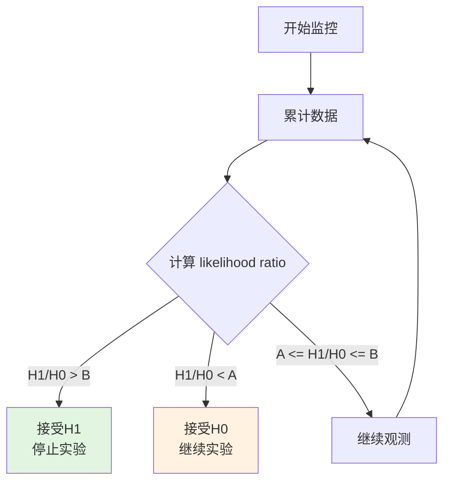

# 统计引擎

本文档介绍 GateFlow 内置的统计算法，实现位于 `victor-stats` 模块。

## 核心算法

| 算法 | 用途 | 状态 |
|------|------|------|
| Z-Test | 显著性检验 | 已实现 |
| mSPRT | 序贯检验,支持早停 | 已实现 |
| CUPED | 方差缩减 | 已实现 |
| BH Correction | 多重检验校正 (Benjamini-Hochberg) | 已实现 |
| SRM Check | 样本比率匹配校验 | 已实现 |

## 算法详解

### Z-Test

用于判断实验组与对照组的指标差异是否具有统计显著性。

```
Z = (p_treatment - p_control) / SE_pooled
```

- |Z| > 1.96: p < 0.05，结果显著
- |Z| > 2.576: p < 0.01，结果高度显著

### 置信区间

置信区间（Confidence Interval）是检验结果的核心输出之一，比单纯的 p-value 包含更丰富的信息。

**绝对差异的置信区间**（95% CI）：

```
SE_unpooled = sqrt(p_c * (1-p_c) / n_c  +  p_t * (1-p_t) / n_t)

CI_lower = (p_t - p_c) - 1.96 × SE_unpooled
CI_upper = (p_t - p_c) + 1.96 × SE_unpooled
```

使用非合并标准误（unpooled SE），因为原假设成立时两组方差可能不同。

**相对提升的置信区间**：

```
Lift = (p_t - p_c) / p_c

Lift_CI_lower = CI_lower / p_c
Lift_CI_upper = CI_upper / p_c
```

**如何解读**：

| 置信区间情况 | 结论 |
|-------------|------|
| CI 下限 > 0 | 实验组显著优于对照组（正向显著） |
| CI 上限 < 0 | 实验组显著差于对照组（负向显著） |
| CI 包含 0 | 差异不显著，无法拒绝 H₀ |
| CI 很宽 | 样本量不足，估计精度低 |
| CI 很窄 | 样本量充足，估计精度高 |

置信区间比 p-value 更直观地展示了效应量的可能范围。例如「转化率提升 2.3%（95% CI: 0.8% ~ 3.8%）」比「p = 0.003」更易于业务决策。

模型实现见 `ZTest.java:33-40` 和 `ConfidenceInterval.java`。

### mSPRT (Sequential Probability Ratio Test)

序贯检验算法，支持在实验运行期间持续监控结果并可提前停止。



**优势**:
- 支持 Early Stopping，可缩短实验周期
- 控制第一类错误率
- 减少样本量需求

### CUPED (Variance Reduction)

利用实验前数据降低指标方差，提高统计检验灵敏度。

```
Y_CUPED = Y - θ × (X - E[X])
Var(Y_CUPED) < Var(Y)
```

其中:
- Y: 原始指标
- X: 实验前协变量（如历史数据）
- θ: 回归系数

### Benjamini-Hochberg Correction

多重检验校正，控制假发现率 (FDR)。

```
p_adjusted = p_original × (n / rank)
```

当比较多个指标时，未校正的多重检验会显著增加假阳性概率，BH 校正可有效控制 FDR。

### SRM Check (Sample Ratio Mismatch Check)

检验实验组与对照组的样本分配比例是否符合预期。

```
χ² = Σ(O_i - E_i)² / E_i
```

- 若 p < 0.001，检测到 SRM，需排查分流异常

## 使用示例

```java
// 显著性检验
ZTestResult result = StatsEngine.zTest(controlData, treatmentData);

// 序贯检验
mSPRTVariant test = new mSPRTVariant(alpha, beta, theta);
test.update(controlSum, controlVar, treatmentSum, treatmentVar);
SequentialResult seqResult = test.getResult();

// 方差缩减
double cupedEstimate = CUPED.apply(originalMetric, preExperimentData);

// 多重检验校正
double[] adjustedPValues = BenjaminiHochberg.correct(pValues);
```

## 离线定时计算

统计引擎以独立进程运行，通过定时任务驱动离线计算。详见 [离线计算任务设计](/dev/ab-system/stats-offline-design)。

## 依赖

统计引擎使用 Apache Commons Math 进行数学计算：

```xml
<dependency>
    <groupId>org.apache.commons</groupId>
    <artifactId>commons-math3</artifactId>
    <version>3.6.1</version>
</dependency>
```