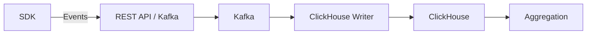

# 事件管道

本文档介绍 GateFlow 的实时事件处理管道。

::: warning 待完善
本文档正在编写中。
:::

## 架构

```mermaid
graph LR
    A[SDK] -->|Events| B[REST API / Kafka]
    B --> C[Kafka]
    C --> D[ClickHouse Writer]
    D --> E[ClickHouse]
    E --> F[Aggregation]
```
