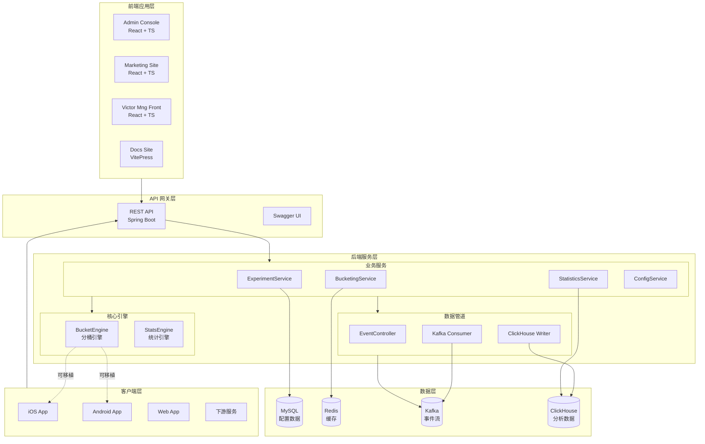
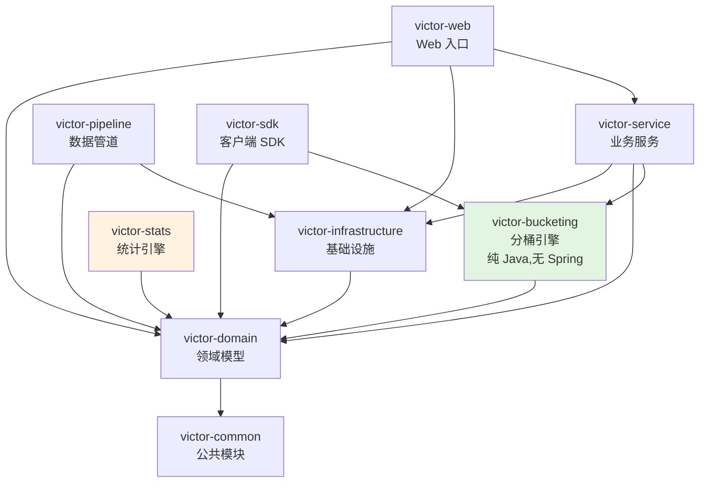
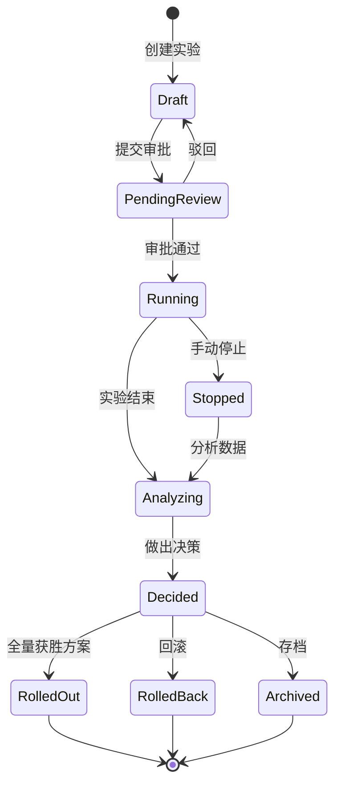
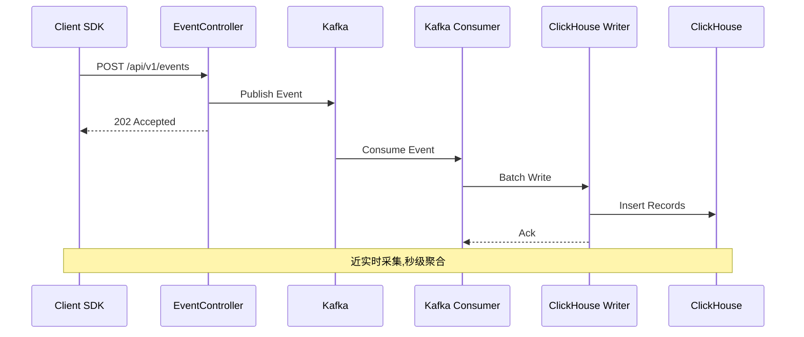
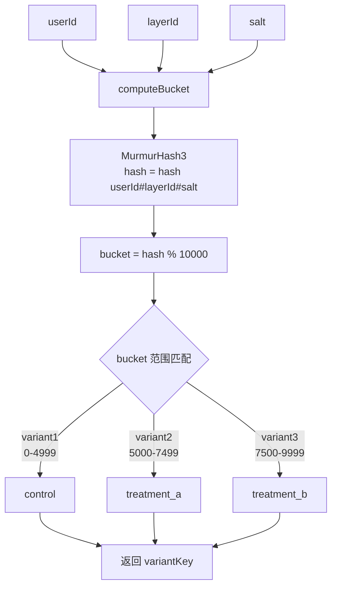

# 架构总览

GateFlow 采用分层微服务架构,各模块职责清晰,支持水平扩展。

## 整体系统架构

## 模块依赖关系

> 绿色模块 `victor-bucketing` 是纯 Java 实现,无 Spring 依赖,可直接嵌入客户端 SDK。

## 实验生命周期状态机

## 事件流管道架构

## 分桶算法流程

## 技术栈总览

### 前端

| 技术 | 用途 |
|------|------|
| React 18 + TypeScript | UI 框架 |
| Vite 5.4 | 构建工具 |
| Tailwind CSS v4 | 样式系统 |
| React Router v6/v7 | 路由 |
| Zustand | 状态管理 |
| Recharts | 图表库 |
| @dnd-kit | 拖拽组件 |

### 后端

| 技术 | 用途 |
|------|------|
| Java 17 + Spring Boot 3.4 | 后端框架 |
| MyBatis-Plus 3.5 | ORM |
| MySQL 8.0 | 主数据库 |
| Redis 7 | 缓存 |
| Apache Kafka | 事件流 |
| ClickHouse | 分析数据库 |
| Flyway | 数据库迁移 |
| SpringDoc OpenAPI | API 文档 |

## 详细内容

| 文档 | 说明 |
|------|------|
| [模块设计](/dev/architecture/module-design) | 各模块职责和依赖关系 |
| [分桶引擎](/dev/architecture/bucketing-engine) | MurmurHash3 分桶算法原理 |
| [统计引擎](/dev/architecture/stats-engine) | Z-Test、mSPRT、CUPED 等算法 |
| [事件管道](/dev/architecture/event-pipeline) | Kafka + ClickHouse 实时流 |
| [数据模型](/dev/architecture/data-model) | 数据库表结构设计 |
| [前端架构](/dev/architecture/frontend-arch) | 前端应用技术栈和架构 |
