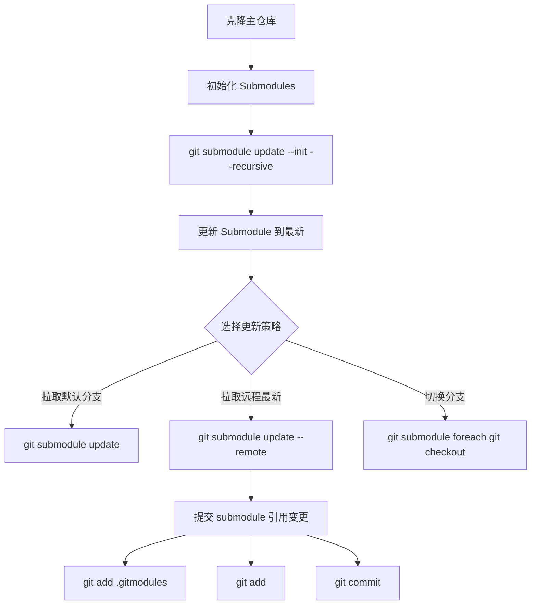

# 服务访问入口

本文档列出 GateFlow 系统各个服务的访问入口和部署信息。

## 项目结构说明

GateFlow 采用 Git Submodule 结构:

| 组件 | 仓库 | 类型 |
|------|------|------|
| Admin Console | `HiCooper/superab-admin` | Git Submodule |
| Marketing Site | `HiCooper/superab-marketing` | Git Submodule |
| Backend Service | `HiCooper/victor-ab` | Git Submodule |
| ReadMore App | 本仓库 | 本地目录 |
| DS Platform | 本仓库 | 本地目录 |

```bash
# 初始化/更新所有 submodules
git submodule update --init --recursive
git submodule update --remote
```

## 前端应用

| 应用 | 说明 | 本地端口 | 仓库 |
|------|------|---------|------|
| **Admin Console** | 管理控制台,实验管理、流量配置、数据分析 | `http://localhost:3001` | `HiCooper/superab-admin` |
| **Marketing Site** | 营销站点,产品介绍、定价、文档 | `http://localhost:3000` | `HiCooper/superab-marketing` |
| **ReadMore** | 阅读增强应用 | 待配置 | 本仓库 `apps/readmore` |
| **DS Platform** | 数据科学分析平台 | 待配置 | 本仓库 `apps/ds-platform` |
| **Docs Site** | 本文档网站 | `http://localhost:5173` | 本仓库 `docs/docs-site` |

### 启动方式

```bash
# 克隆仓库后初始化 submodules
git submodule update --init --recursive

# 安装依赖
pnpm install

# 启动所有前端应用
pnpm dev

# 单独启动
pnpm dev:admin       # Admin Console (3001)
pnpm dev:marketing   # Marketing Site (3000)
pnpm dev:readmore   # ReadMore App
pnpm dev:ds         # DS Platform
pnpm docs:dev       # Docs Site (5173)
```

## 后端服务

| 服务 | 说明 | 本地端口 | 仓库 |
|------|------|---------|------|
| **Victor API** | 主后端服务 (Spring Boot) | `http://localhost:8080` | `HiCooper/victor-ab` |
| **Swagger UI** | API 交互式文档 | `http://localhost:8080/swagger-ui.html` | 同上 |
| **OpenAPI Spec** | OpenAPI JSON 规范 | `http://localhost:8080/v3/api-docs` | 同上 |
| **Health Check** | 健康检查端点 | `http://localhost:8080/actuator/health` | 同上 |

### 启动方式

```bash
cd backend/victor-ab

# 初始化 submodule (首次)
git submodule update --init --recursive

# 启动依赖服务
docker-compose up -d mysql redis

# 编译项目
mvn clean install

# 启动后端
mvn spring-boot:run -pl victor-web
```

## 基础设施

| 组件 | 说明 | 本地端口 | 配置 |
|------|------|---------|------|
| **MySQL** | 主数据库 (实验配置、用户数据) | `localhost:3306` | `victor_experiment` |
| **Redis** | 缓存服务 (配置缓存、会话) | `localhost:6379` | DB 0 |
| **Kafka** | 事件消息管道 (事件流处理) | `localhost:9092` | - |
| **ClickHouse** | 分析数据库 (实时指标聚合) | `localhost:8123` (HTTP) / `9000` (Native) | - |

### 启动方式

```bash
cd backend/victor-ab
docker-compose up -d mysql redis kafka clickhouse
```

## Git Submodule 工作流



### 常用命令

```bash
# 查看 submodule 状态
git submodule status

# 更新所有 submodule 到远程最新
git submodule update --remote

# 在 submodule 中切换分支
cd <submodule-path>
git checkout <branch>
cd ..
git add <submodule-path>
git commit -m "chore: update submodule to <branch>"

# 推送 submodule 变更
cd <submodule-path>
git push
cd ..
git push
```

## SDK 集成点

| SDK | 类型 | 状态 | 配置地址 |
|-----|------|------|---------|
| Java SDK | 服务端 | 可用 | `/api/v1/config/latest` |
| Expo SDK | React Native | 可用 | 同上 |
| iOS SDK | iOS 原生 | 开发中 | 同上 |
| Android SDK | Android 原生 | 开发中 | 同上 |

## API 端点速查

| 分组 | 路径前缀 | 说明 |
|------|---------|------|
| 实验管理 | `/api/v1/experiments` | 实验 CRUD、启停 |
| 层级管理 | `/api/v1/layers` | 实验层级 |
| 变体管理 | `/api/v1/variants` | 实验变体 |
| 流量分配 | `/api/v1/bucket` | 运行时分桶 |
| 配置获取 | `/api/v1/config` | SDK 配置 |
| 事件上报 | `/api/v1/events` | 事件采集 |

## 部署信息

| 环境 | API 地址 | 前端地址 | 数据库 | 状态 |
|------|---------|---------|--------|------|
| **Local** | `localhost:8080` | `localhost:3001` | Docker Compose | 开发中 |
| **Staging** | 待配置 | 待配置 | 待配置 | 未部署 |
| **Production** | 待配置 | 待配置 | 待配置 | 未部署 |

## 相关链接

- [GitHub 仓库](https://github.com/HiCooper/gate-flow)
- [Admin Console 仓库](https://github.com/HiCooper/superab-admin)
- [Marketing 仓库](https://github.com/HiCooper/superab-marketing)
- [Backend 仓库](https://github.com/HiCooper/victor-ab)
- [CONTRIBUTING.md](/CONTRIBUTING.md)
- [CHANGELOG.md](/CHANGELOG.md)
