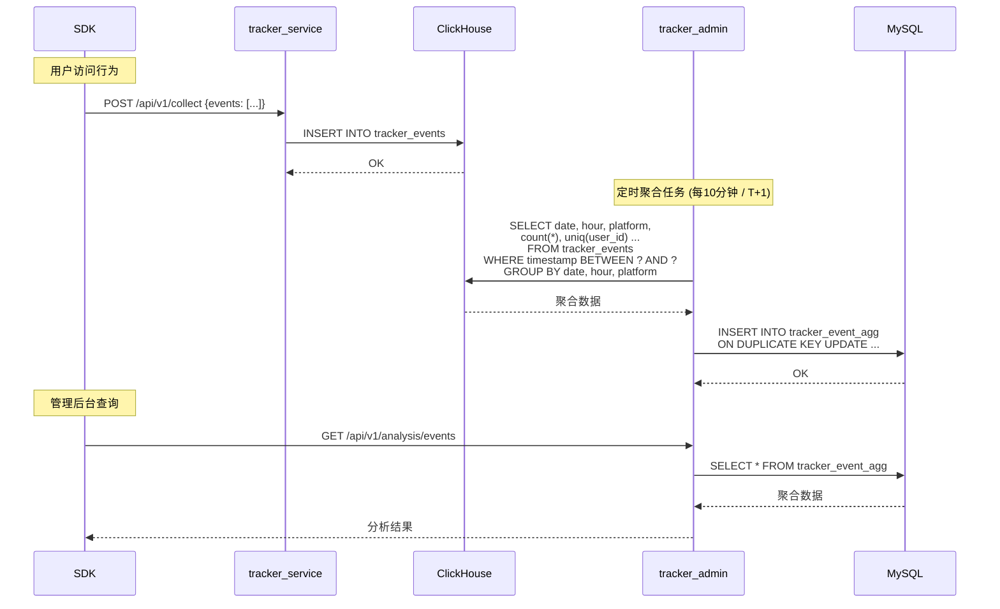
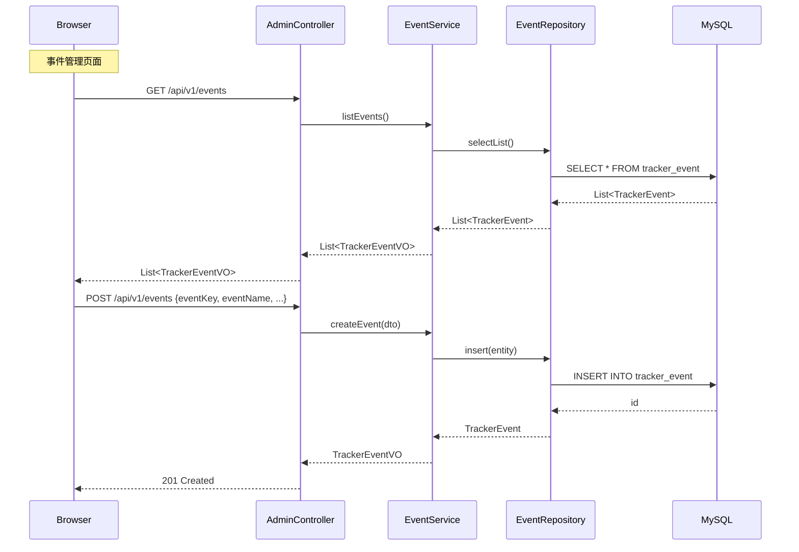
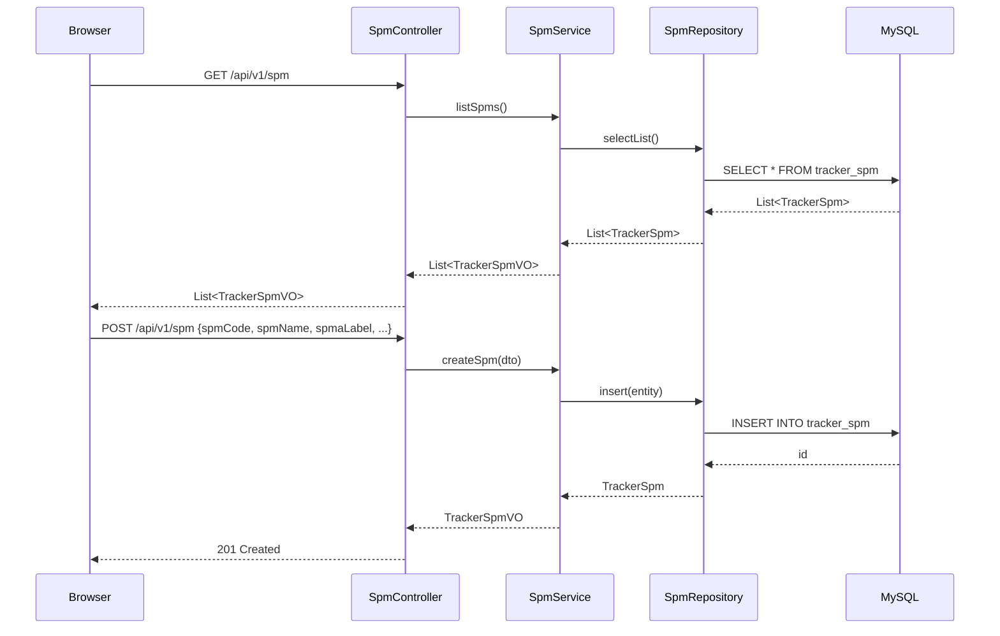
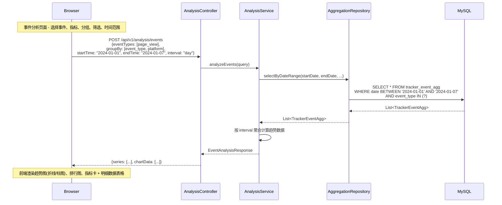
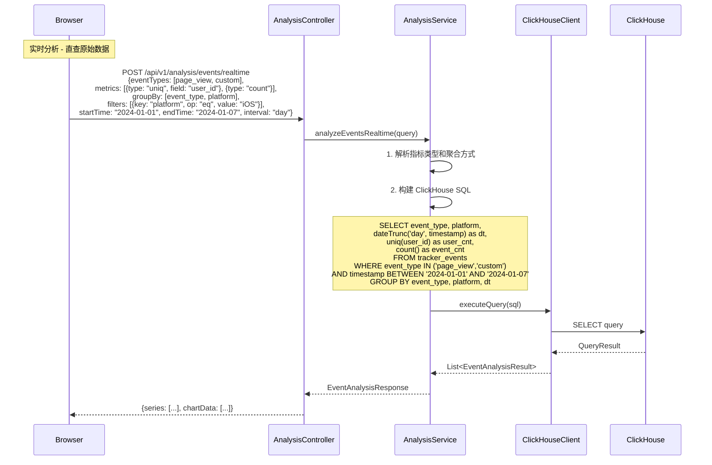
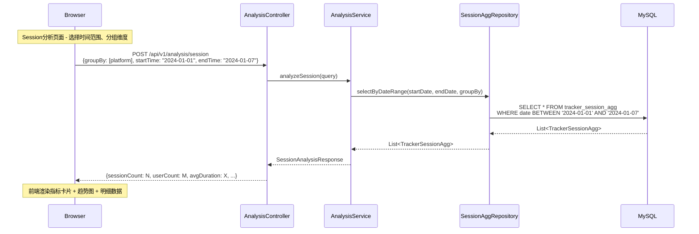
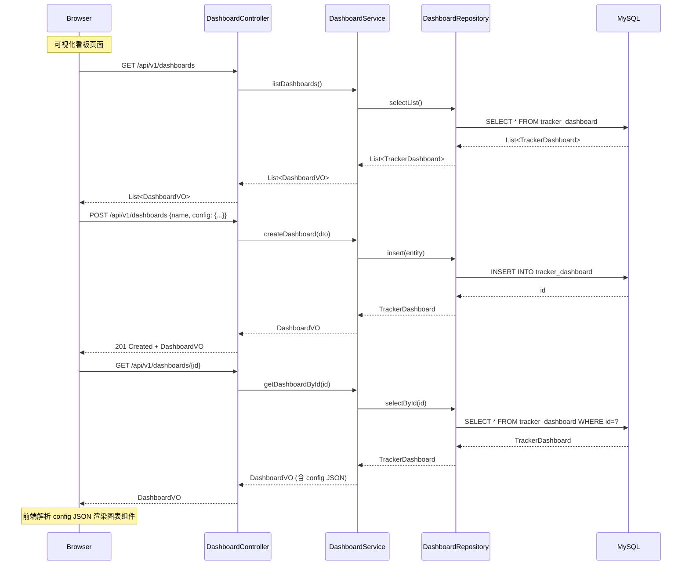
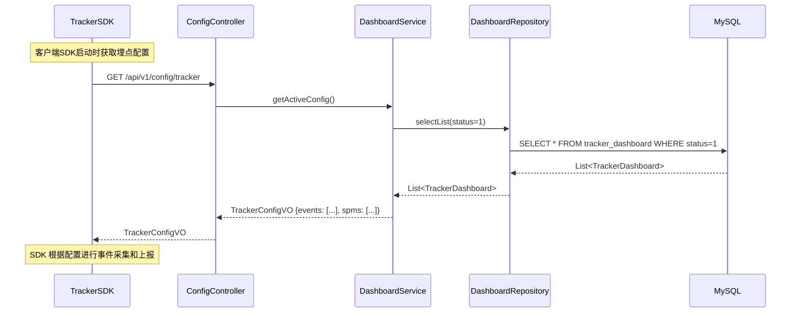
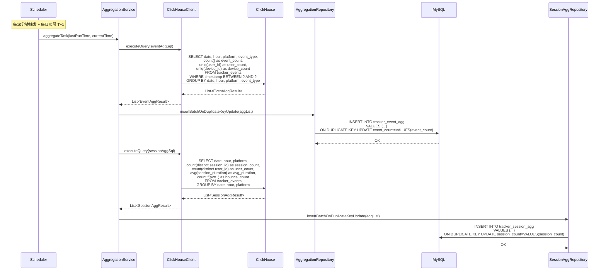

# Tracker 管理后台架构设计方案

## Context

GateFlow 已实现 tracker SDK 和事件采集服务端，但缺少管理后台。本次需要：
1. 新建独立 Spring Boot 后端项目 `backend/tracker-admin/`
2. 在 `apps/admin` 中新增管理页面
3. 支持埋点管理（事件、属性、SPM）和行为分析（事件分析、可视化看板、Session分析）

---

## 一、系统定位与架构

### 1.1 服务定位

```
┌─────────────────────────────────────────────────────────────────────────┐
│                           Tracker 系统架构                               │
├─────────────────────────────────────────────────────────────────────────┤
│                                                                         │
│  ┌──────────────┐    事件上报     ┌──────────────────┐                 │
│  │  Tracker SDK  │ ──────────────▶│  tracker-service │──▶ ClickHouse  │
│  │  (客户端)     │                │  (事件采集服务)    │    原始数据     │
│  └──────────────┘                └──────────────────┘                 │
│                                         │                              │
│                                         │ T+1 / 定时汇总               │
│                                         ▼                              │
│  ┌──────────────────────────────────────────────────────────────────┐  │
│  │                     tracker-admin                                  │  │
│  │                     (管理后台服务)                                  │  │
│  │  ┌─────────────┐  ┌─────────────┐  ┌─────────────────────────┐   │  │
│  │  │  埋点管理    │  │  行为分析    │  │  数据聚合 (定时任务)      │   │  │
│  │  │  事件/属性   │  │  事件分析    │  │  T+1 / 10分钟级汇总      │   │  │
│  │  │  SPM管理     │  │  Session    │  │  从 ClickHouse 聚合      │   │  │
│  │  │  看板配置    │  │  可视化看板  │  │  写入 MySQL 聚合表       │   │  │
│  │  └─────────────┘  └─────────────┘  └─────────────────────────┘   │  │
│  └──────────────────────────────────────────────────────────────────┘  │
│                                         │                              │
│                                         ▼                              │
│  ┌──────────────────────────────────────────────────────────────────┐  │
│  │                        MySQL (tracker-admin)                      │  │
│  │  tracker_event │ tracker_property │ tracker_spm │ tracker_dashboard│  │
│  │  tracker_event_agg │ tracker_session_agg (聚合表)              │  │
│  └──────────────────────────────────────────────────────────────────┘  │
│                                                                         │
└─────────────────────────────────────────────────────────────────────────┘
```

**tracker-service 定位**：
- 负责**事件采集**：接收 SDK 上报的埋点事件
- 产出**原始数据**：写入 ClickHouse 的用户访问行为明细数据
- 不提供管理功能

**tracker-admin 定位**：
- 从**用户侧视角**出发，管理自身应用的埋点点位
- 提供**行为数据分析能力**：基于 tracker-service 产出的原始数据
- 提供**数据聚合能力**：定时从 ClickHouse 汇总数据到 MySQL，供前端查询

### 1.2 数据流转



### 1.3 聚合策略

| 聚合类型 | 触发时机 | 说明 |
|----------|----------|------|
| **实时聚合** | 10分钟级定时 | 每10分钟从 ClickHouse 聚合最近数据，写入 `tracker_event_agg` |
| **T+1 聚合** | 每日凌晨 | 补齐前一日完整数据，确保数据准确性 |
| **手动触发** | API 接口 | 支持管理员触发重新聚合指定时间范围 |

聚合表结构：
```sql
-- 事件聚合表 (按时间窗口聚合)
CREATE TABLE tracker_event_agg (
    id              BIGINT PRIMARY KEY AUTO_INCREMENT,
    date            DATE NOT NULL COMMENT '日期',
    hour            TINYINT COMMENT '小时 (0-23, -1表示全天)',
    platform        VARCHAR(32) COMMENT '平台',
    event_type      VARCHAR(64) NOT NULL COMMENT '事件类型',
    event_count     BIGINT DEFAULT 0 COMMENT '事件次数',
    user_count      BIGINT DEFAULT 0 COMMENT '用户数 (去重)',
    device_count    BIGINT DEFAULT 0 COMMENT '设备数 (去重)',
    created_at      DATETIME DEFAULT CURRENT_TIMESTAMP,
    updated_at      DATETIME DEFAULT CURRENT_TIMESTAMP ON UPDATE CURRENT_TIMESTAMP,
    UNIQUE KEY uk_date_hour_platform_event (date, hour, platform, event_type)
);

-- Session 聚合表
CREATE TABLE tracker_session_agg (
    id                  BIGINT PRIMARY KEY AUTO_INCREMENT,
    date                DATE NOT NULL COMMENT '日期',
    hour                TINYINT COMMENT '小时',
    platform            VARCHAR(32) COMMENT '平台',
    session_count       BIGINT DEFAULT 0 COMMENT '会话次数',
    user_count          BIGINT DEFAULT 0 COMMENT '用户数 (去重)',
    avg_duration        DECIMAL(10,2) DEFAULT 0 COMMENT '平均会话时长(秒)',
    avg_page_depth      DECIMAL(10,2) DEFAULT 0 COMMENT '平均页面深度',
    bounce_count        BIGINT DEFAULT 0 COMMENT '跳出次数 (单页Session)',
    bounce_rate         DECIMAL(5,4) DEFAULT 0 COMMENT '跳出率',
    created_at          DATETIME DEFAULT CURRENT_TIMESTAMP,
    updated_at          DATETIME DEFAULT CURRENT_TIMESTAMP ON UPDATE CURRENT_TIMESTAMP,
    UNIQUE KEY uk_date_hour_platform (date, hour, platform)
);
```

### 1.4 后端项目 `backend/tracker-admin/`

```
backend/tracker-admin/
├── src/main/java/com/gateflow/tracker/
│   ├── TrackerAdminApplication.java
│   ├── controller/          # REST API
│   │   ├── EventController.java
│   │   ├── PropertyController.java
│   │   ├── SpmController.java
│   │   ├── AnalysisController.java
│   │   └── DashboardController.java
│   ├── service/             # 业务逻辑
│   │   ├── EventService.java
│   │   ├── AnalysisService.java
│   │   └── AggregationService.java    # 聚合定时任务
│   ├── repository/          # MyBatis Mapper
│   ├── domain/
│   │   ├── entity/          # 数据库实体
│   │   └── dto/             # 请求/响应 DTO
│   ├── config/              # 配置类
│   └── clickhouse/          # ClickHouse 客户端
│       └── ClickHouseClient.java
├── src/main/resources/
│   ├── application.yml
│   └── db/migration/        # Flyway migrations
└── pom.xml
```

**技术栈**：Spring Boot 3.x + MyBatis-Plus 3.5 + MySQL 8 + Flyway + ClickHouse Client

### 1.2 前端页面（新增）

```
apps/admin/src/pages/tracker/
├── EventsPage.tsx           # 事件管理
├── PropertiesPage.tsx       # 属性管理
├── SpmPage.tsx              # SPM管理
├── EventAnalysisPage.tsx    # 事件分析
├── DashboardPage.tsx        # 可视化看板
└── SessionAnalysisPage.tsx  # Session分析
```

---

## 二、数据模型

### 2.1 MySQL 表结构

```sql
-- 事件定义表
CREATE TABLE tracker_event (
    id          BIGINT PRIMARY KEY AUTO_INCREMENT,
    event_key   VARCHAR(64) NOT NULL UNIQUE COMMENT '事件标识',
    event_name  VARCHAR(128) NOT NULL COMMENT '事件名称',
    description VARCHAR(512),
    category    VARCHAR(32) DEFAULT 'custom' COMMENT '事件分类: page_view/click/exposure/custom',
    status      TINYINT DEFAULT 1 COMMENT '状态: 0禁用 1启用',
    created_at  DATETIME DEFAULT CURRENT_TIMESTAMP,
    updated_at  DATETIME DEFAULT CURRENT_TIMESTAMP ON UPDATE CURRENT_TIMESTAMP
);

-- 属性定义表
CREATE TABLE tracker_property (
    id          BIGINT PRIMARY KEY AUTO_INCREMENT,
    event_id    BIGINT NOT NULL COMMENT '关联事件ID',
    prop_key    VARCHAR(64) NOT NULL COMMENT '属性标识',
    prop_name   VARCHAR(128) NOT NULL COMMENT '属性名称',
    data_type   VARCHAR(32) DEFAULT 'string' COMMENT '类型: string/number/boolean/date',
    description VARCHAR(512),
    created_at  DATETIME DEFAULT CURRENT_TIMESTAMP,
    FOREIGN KEY (event_id) REFERENCES tracker_event(id),
    UNIQUE KEY uk_event_prop (event_id, prop_key)
);

-- SPM 配置表
CREATE TABLE tracker_spm (
    id          BIGINT PRIMARY KEY AUTO_INCREMENT,
    spm_code    VARCHAR(64) NOT NULL UNIQUE COMMENT 'SPM编码',
    spm_name    VARCHAR(128) NOT NULL COMMENT 'SPM名称',
    spma_label  VARCHAR(64) COMMENT 'A层标签',
    spmb_label  VARCHAR(64) COMMENT 'B层标签',
    spmc_label  VARCHAR(64) COMMENT 'C层标签',
    spmd_label  VARCHAR(64) COMMENT 'D层标签',
    description VARCHAR(512),
    created_at  DATETIME DEFAULT CURRENT_TIMESTAMP
);

-- 看板配置表
CREATE TABLE tracker_dashboard (
    id          BIGINT PRIMARY KEY AUTO_INCREMENT,
    name        VARCHAR(128) NOT NULL COMMENT '看板名称',
    config      JSON NOT NULL COMMENT '看板配置JSON',
    created_by  VARCHAR(64),
    status      TINYINT DEFAULT 1 COMMENT '状态: 0禁用 1启用',
    created_at  DATETIME DEFAULT CURRENT_TIMESTAMP,
    updated_at  DATETIME DEFAULT CURRENT_TIMESTAMP ON UPDATE CURRENT_TIMESTAMP
);

-- 聚合任务调度记录表
CREATE TABLE tracker_aggregation_job (
    id                  BIGINT PRIMARY KEY AUTO_INCREMENT,
    job_type            VARCHAR(32) NOT NULL COMMENT '任务类型: event/session',
    job_status          VARCHAR(32) NOT NULL COMMENT '任务状态: running/success/failed',
    trigger_type        VARCHAR(32) NOT NULL COMMENT '触发类型: scheduled/manual',
    start_time          DATETIME NOT NULL COMMENT '开始时间',
    end_time            DATETIME COMMENT '结束时间',
    time_range_start    DATETIME NOT NULL COMMENT '数据时间范围开始',
    time_range_end      DATETIME NOT NULL COMMENT '数据时间范围结束',
    records_processed   BIGINT DEFAULT 0 COMMENT '处理记录数',
    error_message       VARCHAR(1024) COMMENT '错误信息',
    created_at          DATETIME DEFAULT CURRENT_TIMESTAMP,
    updated_at          DATETIME DEFAULT CURRENT_TIMESTAMP ON UPDATE CURRENT_TIMESTAMP,
    INDEX idx_job_type_status (job_type, job_status),
    INDEX idx_trigger_type (trigger_type),
    INDEX idx_start_time (start_time)
);
```

### 2.2 Entity 完整字段定义

#### TrackerEvent 实体

```java
package com.gateflow.tracker.domain.entity;

import com.baomidou.mybatisplus.annotation.*;
import lombok.Data;
import java.time.LocalDateTime;

@Data
@TableName("tracker_event")
public class TrackerEvent {

    @TableId(type = IdType.AUTO)
    private Long id;

    @TableField("event_key")
    private String eventKey;           // 事件标识 (唯一)

    @TableField("event_name")
    private String eventName;          // 事件名称

    @TableField("description")
    private String description;        // 描述

    @TableField("category")
    private String category;           // 分类: page_view/click/exposure/custom

    @TableField("status")
    private Integer status;            // 状态: 0禁用 1启用

    @TableField(value = "created_at", fill = FieldFill.INSERT)
    private LocalDateTime createdAt;   // 创建时间

    @TableField(value = "updated_at", fill = FieldFill.INSERT_UPDATE)
    private LocalDateTime updatedAt;   // 更新时间
}
```

#### TrackerProperty 实体

```java
package com.gateflow.tracker.domain.entity;

import com.baomidou.mybatisplus.annotation.*;
import lombok.Data;
import java.time.LocalDateTime;

@Data
@TableName("tracker_property")
public class TrackerProperty {

    @TableId(type = IdType.AUTO)
    private Long id;

    @TableField("event_id")
    private Long eventId;             // 关联事件ID

    @TableField("prop_key")
    private String propKey;            // 属性标识

    @TableField("prop_name")
    private String propName;          // 属性名称

    @TableField("data_type")
    private String dataType;           // 数据类型: string/number/boolean/date

    @TableField("description")
    private String description;       // 描述

    @TableField(value = "created_at", fill = FieldFill.INSERT)
    private LocalDateTime createdAt;  // 创建时间
}
```

#### TrackerSpm 实体

```java
package com.gateflow.tracker.domain.entity;

import com.baomidou.mybatisplus.annotation.*;
import lombok.Data;
import java.time.LocalDateTime;

@Data
@TableName("tracker_spm")
public class TrackerSpm {

    @TableId(type = IdType.AUTO)
    private Long id;

    @TableField("spm_code")
    private String spmCode;           // SPM编码 (唯一)

    @TableField("spm_name")
    private String spmName;           // SPM名称

    @TableField("spma_label")
    private String spmaLabel;         // A层标签

    @TableField("spmb_label")
    private String spmbLabel;         // B层标签

    @TableField("spmc_label")
    private String spmcLabel;         // C层标签

    @TableField("spmd_label")
    private String spmdLabel;         // D层标签

    @TableField("description")
    private String description;       // 描述

    @TableField(value = "created_at", fill = FieldFill.INSERT)
    private LocalDateTime createdAt;  // 创建时间
}
```

#### TrackerDashboard 实体

```java
package com.gateflow.tracker.domain.entity;

import com.baomidou.mybatisplus.annotation.*;
import lombok.Data;
import java.time.LocalDateTime;

@Data
@TableName("tracker_dashboard")
public class TrackerDashboard {

    @TableId(type = IdType.AUTO)
    private Long id;

    @TableField("name")
    private String name;              // 看板名称

    @TableField("config")
    private String config;            // 看板配置JSON

    @TableField("created_by")
    private String createdBy;         // 创建人

    @TableField("status")
    private Integer status;            // 状态: 0禁用 1启用

    @TableField(value = "created_at", fill = FieldFill.INSERT)
    private LocalDateTime createdAt; // 创建时间

    @TableField(value = "updated_at", fill = FieldFill.INSERT_UPDATE)
    private LocalDateTime updatedAt; // 更新时间
}
```

#### TrackerAggregationJob 实体 (聚合任务记录)

```java
package com.gateflow.tracker.domain.entity;

import com.baomidou.mybatisplus.annotation.*;
import lombok.Data;
import java.time.LocalDateTime;

@Data
@TableName("tracker_aggregation_job")
public class TrackerAggregationJob {

    @TableId(type = IdType.AUTO)
    private Long id;

    @TableField("job_type")
    private String jobType;             // 任务类型: event/session

    @TableField("job_status")
    private String jobStatus;           // 任务状态: running/success/failed

    @TableField("trigger_type")
    private String triggerType;         // 触发类型: scheduled/manual

    @TableField("start_time")
    private LocalDateTime startTime;    // 开始时间

    @TableField("end_time")
    private LocalDateTime endTime;      // 结束时间

    @TableField("time_range_start")
    private LocalDateTime timeRangeStart; // 数据时间范围开始

    @TableField("time_range_end")
    private LocalDateTime timeRangeEnd;   // 数据时间范围结束

    @TableField("records_processed")
    private Long recordsProcessed;      // 处理记录数

    @TableField("error_message")
    private String errorMessage;        // 错误信息

    @TableField(value = "created_at", fill = FieldFill.INSERT)
    private LocalDateTime createdAt;

    @TableField(value = "updated_at", fill = FieldFill.INSERT_UPDATE)
    private LocalDateTime updatedAt;
}
```

#### TrackerEventAgg 实体 (聚合表)

```java
package com.gateflow.tracker.domain.entity;

import com.baomidou.mybatisplus.annotation.*;
import lombok.Data;
import java.math.BigDecimal;
import java.time.LocalDate;
import java.time.LocalDateTime;

@Data
@TableName("tracker_event_agg")
public class TrackerEventAgg {

    @TableId(type = IdType.AUTO)
    private Long id;

    @TableField("date")
    private LocalDate date;              // 日期

    @TableField("hour")
    private Integer hour;             // 小时 (0-23, -1表示全天)

    @TableField("platform")
    private String platform;         // 平台

    @TableField("event_type")
    private String eventType;        // 事件类型

    @TableField("event_count")
    private Long eventCount;         // 事件次数

    @TableField("user_count")
    private Long userCount;         // 用户数 (去重)

    @TableField("device_count")
    private Long deviceCount;        // 设备数 (去重)

    @TableField(value = "created_at", fill = FieldFill.INSERT)
    private LocalDateTime createdAt; // 创建时间

    @TableField(value = "updated_at", fill = FieldFill.INSERT_UPDATE)
    private LocalDateTime updatedAt; // 更新时间
}
```

#### TrackerSessionAgg 实体 (聚合表)

```java
package com.gateflow.tracker.domain.entity;

import com.baomidou.mybatisplus.annotation.*;
import lombok.Data;
import java.math.BigDecimal;
import java.time.LocalDate;
import java.time.LocalDateTime;

@Data
@TableName("tracker_session_agg")
public class TrackerSessionAgg {

    @TableId(type = IdType.AUTO)
    private Long id;

    @TableField("date")
    private LocalDate date;              // 日期

    @TableField("hour")
    private Integer hour;             // 小时

    @TableField("platform")
    private String platform;         // 平台

    @TableField("session_count")
    private Long sessionCount;        // 会话次数

    @TableField("user_count")
    private Long userCount;          // 用户数 (去重)

    @TableField("avg_duration")
    private BigDecimal avgDuration;  // 平均会话时长(秒)

    @TableField("avg_page_depth")
    private BigDecimal avgPageDepth; // 平均页面深度

    @TableField("bounce_count")
    private Long bounceCount;        // 跳出次数

    @TableField("bounce_rate")
    private BigDecimal bounceRate;   // 跳出率

    @TableField(value = "created_at", fill = FieldFill.INSERT)
    private LocalDateTime createdAt;

    @TableField(value = "updated_at", fill = FieldFill.INSERT_UPDATE)
    private LocalDateTime updatedAt;
}
```

### 2.3 ClickHouse 原始事件表

tracker-service 写入的原始事件明细（在 ClickHouse 中）：

```sql
-- 事件明细表: tracker_events
-- 由 tracker-service 写入，供聚合任务读取
CREATE TABLE tracker_events (
    event_id         String,
    event_type       String,
    user_id          String,
    anonymous_id     String,
    timestamp        DateTime,
    platform         String,
    app_version      String,
    page_url         String,
    page_title       String,
    spma             String,
    spmb             String,
    spmc             String,
    spmd             String,
    device_type      String,
    os               String,
    browser          String,
    country          String,
    province         String,
    city             String,
    session_id       String,
    scroll_depth     Int,
    stay_duration    Int,
    is_new_device    UInt8,
    is_new_user      UInt8,
    utm_source       String,
    utm_medium       String,
    utm_campaign     String,
    utm_content      String,
    utm_term         String,
    referrer         String,
    created_at       DateTime DEFAULT now()
) ENGINE = MergeTree()
ORDER BY (timestamp, event_type);
```

### 2.3 DTO 定义

#### 通用响应结构

```java
package com.gateflow.tracker.domain.dto;

import lombok.AllArgsConstructor;
import lombok.Data;
import lombok.NoArgsConstructor;
import java.time.LocalDateTime;

@Data
@NoArgsConstructor
@AllArgsConstructor
public class ApiResponse<T> {
    private Integer code;       // 状态码: 200成功, 400参数错误, 404不存在, 500服务器错误
    private String message;    // 消息
    private T data;            // 数据
    private Long timestamp;    // 时间戳

    public static <T> ApiResponse<T> success(T data) {
        return new ApiResponse<>(200, "success", data, System.currentTimeMillis());
    }

    public static <T> ApiResponse<T> success(String message, T data) {
        return new ApiResponse<>(200, message, data, System.currentTimeMillis());
    }

    public static <T> ApiResponse<T> error(Integer code, String message) {
        return new ApiResponse<>(code, message, null, System.currentTimeMillis());
    }
}
```

#### 分页响应结构

```java
package com.gateflow.tracker.domain.dto;

import lombok.Data;
import java.util.List;

@Data
public class PageResponse<T> {
    private Integer code;
    private String message;
    private PageData<T> data;

    @Data
    public static class PageData<T> {
        private List<T> list;       // 数据列表
        private Long total;       // 总记录数
        private Integer page;      // 当前页码
        private Integer size;      // 每页大小
        private Integer pages;    // 总页数
    }
}
```

#### 事件管理 DTO

```java
// 创建事件请求
@Data
public class CreateEventRequest {
    @NotBlank(message = "事件标识不能为空")
    @Size(max = 64, message = "事件标识长度不能超过64")
    private String eventKey;

    @NotBlank(message = "事件名称不能为空")
    @Size(max = 128, message = "事件名称长度不能超过128")
    private String eventName;

    @Size(max = 512, message = "描述长度不能超过512")
    private String description;

    @Pattern(regexp = "^(page_view|click|exposure|custom)$", message = "分类只能是 page_view/click/exposure/custom")
    private String category = "custom";

    private Integer status = 1;
}

// 更新事件请求
@Data
public class UpdateEventRequest {
    @Size(max = 128, message = "事件名称长度不能超过128")
    private String eventName;

    @Size(max = 512, message = "描述长度不能超过512")
    private String description;

    @Pattern(regexp = "^(page_view|click|exposure|custom)$", message = "分类只能是 page_view/click/exposure/custom")
    private String category;

    @Pattern(regexp = "^(0|1)$", message = "状态只能是 0禁用 1启用")
    private String status;
}

// 事件响应 VO
@Data
public class EventVO {
    private Long id;
    private String eventKey;
    private String eventName;
    private String description;
    private String category;
    private Integer status;
    private LocalDateTime createdAt;
    private LocalDateTime updatedAt;
}
```

#### 属性管理 DTO

```java
// 创建属性请求
@Data
public class CreatePropertyRequest {
    @NotNull(message = "事件ID不能为空")
    private Long eventId;

    @NotBlank(message = "属性标识不能为空")
    @Size(max = 64, message = "属性标识长度不能超过64")
    @Pattern(regexp = "^[a-zA-Z_][a-zA-Z0-9_]*$", message = "属性标识格式不正确")
    private String propKey;

    @NotBlank(message = "属性名称不能为空")
    @Size(max = 128, message = "属性名称长度不能超过128")
    private String propName;

    @Pattern(regexp = "^(string|number|boolean|date)$", message = "数据类型只能是 string/number/boolean/date")
    private String dataType = "string";

    @Size(max = 512, message = "描述长度不能超过512")
    private String description;
}

// 属性响应 VO
@Data
public class PropertyVO {
    private Long id;
    private Long eventId;
    private String eventName;      // 关联的事件名称
    private String propKey;
    private String propName;
    private String dataType;
    private String description;
    private LocalDateTime createdAt;
}
```

#### SPM 管理 DTO

```java
// 创建 SPM 请求
@Data
public class CreateSpmRequest {
    @NotBlank(message = "SPM编码不能为空")
    @Size(max = 64, message = "SPM编码长度不能超过64")
    @Pattern(regexp = "^[A-Z0-9_]+$", message = "SPM编码只能包含大写字母、数字、下划线")
    private String spmCode;

    @NotBlank(message = "SPM名称不能为空")
    @Size(max = 128, message = "SPM名称长度不能超过128")
    private String spmName;

    @Size(max = 64, message = "A层标签长度不能超过64")
    private String spmaLabel;

    @Size(max = 64, message = "B层标签长度不能超过64")
    private String spmbLabel;

    @Size(max = 64, message = "C层标签长度不能超过64")
    private String spmcLabel;

    @Size(max = 64, message = "D层标签长度不能超过64")
    private String spmdLabel;

    @Size(max = 512, message = "描述长度不能超过512")
    private String description;
}

// SPM 响应 VO
@Data
public class SpmVO {
    private Long id;
    private String spmCode;
    private String spmName;
    private String spmaLabel;
    private String spmbLabel;
    private String spmcLabel;
    private String spmdLabel;
    private String description;
    private LocalDateTime createdAt;
}
```

#### 行为分析 DTO

```java
// 事件分析请求
@Data
public class EventAnalysisRequest {
    private List<String> eventTypes;           // 事件类型列表
    private List<MetricQuery> metrics;         // 指标列表
    private List<String> groupBy;              // 分组维度
    private List<FilterCondition> filters;     // 筛选条件
    @NotBlank(message = "开始时间不能为空")
    private String startTime;                   // 开始时间 yyyy-MM-dd
    @NotBlank(message = "结束时间不能为空")
    private String endTime;                     // 结束时间 yyyy-MM-dd
    @Pattern(regexp = "^(hour|day|week|month)$", message = "时间粒度只能是 hour/day/week/month")
    private String interval = "day";            // 时间粒度
}

@Data
public class MetricQuery {
    @Pattern(regexp = "^(uniq|count|sum|avg)$", message = "聚合类型只能是 uniq/count/sum/avg")
    private String aggType;                    // 聚合类型

    @Pattern(regexp = "^(user_id|device_id|anonymous_id)$", message = "字段只能是 user_id/device_id/anonymous_id")
    private String field;                       // 字段

    @Pattern(regexp = "^(event_count|user_count|device_count)$", message = "预置指标")
    private String preset;                      // 预置指标名称
}

@Data
public class FilterCondition {
    private String key;                        // 字段名
    @Pattern(regexp = "^(eq|neq|gt|gte|lt|lte|contains|not_contains|is_null|is_not_null|in)$", 
            message = "操作符不正确")
    private String operator;                   // 操作符
    private Object value;                      // 值
}

// 事件分析响应
@Data
public class EventAnalysisResponse {
    private String interval;                   // 时间粒度
    private List<Series> series;              // 趋势数据
    private List<Map<String, Object>> tableData; // 明细数据

    @Data
    public static class Series {
        private String name;                   // 系列名称
        private String eventType;              // 事件类型
        private List<Point> data;             // 数据点

        @Data
        public static class Point {
            private String time;               // 时间点
            private Long value;                // 值
        }
    }
}

// Session 分析请求
@Data
public class SessionAnalysisRequest {
    private List<String> groupBy;             // 分组维度
    @NotBlank(message = "开始时间不能为空")
    private String startTime;
    @NotBlank(message = "结束时间不能为空")
    private String endTime;
    @Pattern(regexp = "^(hour|day)$", message = "时间粒度只能是 hour/day")
    private String interval = "day";
}

// Session 分析响应
@Data
public class SessionAnalysisResponse {
    private String interval;
    private List<Series> series;
    private Map<String, Object> summary;      // 汇总指标

    @Data
    public static class Series {
        private String name;
        private String groupValue;           // 分组值
        private List<Point> data;

        @Data
        public static class Point {
            private String time;
            private Long value;
        }
    }
}

// 聚合任务触发请求
@Data
public class AggregationTriggerRequest {
    @NotBlank(message = "开始时间不能为空")
    private String startTime;
    @NotBlank(message = "结束时间不能为空")
    private String endTime;

    @Pattern(regexp = "^(event|session|all)$", message = "类型只能是 event/session/all")
    private String type = "all";              // 聚合类型
}
```

#### 看板管理 DTO

```java
// 创建看板请求
@Data
public class CreateDashboardRequest {
    @NotBlank(message = "看板名称不能为空")
    @Size(max = 128, message = "看板名称长度不能超过128")
    private String name;

    @NotNull(message = "配置不能为空")
    private Map<String, Object> config;        // 看板配置JSON

    @Pattern(regexp = "^(0|1)$", message = "状态只能是 0禁用 1启用")
    private Integer status = 1;
}

// 更新看板请求
@Data
public class UpdateDashboardRequest {
    @Size(max = 128, message = "看板名称长度不能超过128")
    private String name;

    private Map<String, Object> config;

    @Pattern(regexp = "^(0|1)$", message = "状态只能是 0禁用 1启用")
    private Integer status;
}

// 看板响应 VO
@Data
public class DashboardVO {
    private Long id;
    private String name;
    private Map<String, Object> config;      // 自动反序列化
    private String createdBy;
    private Integer status;
    private LocalDateTime createdAt;
    private LocalDateTime updatedAt;
}
```

### 2.4 错误码规范

```java
package com.gateflow.tracker.domain.exception;

/**
 * 错误码定义
 * 1000-1999: 参数错误
 * 2000-2999: 业务错误
 * 3000-3999: 数据不存在
 * 5000-5999: 服务器错误
 */
public class ErrorCode {

    // 参数错误 (1000-1999)
    public static final Integer PARAM_INVALID = 1001;
    public static final Integer PARAM_MISSING = 1002;

    // 业务错误 (2000-2999)
    public static final Integer EVENT_KEY_DUPLICATED = 2001;
    public static final Integer SPM_CODE_DUPLICATED = 2002;
    public static final Integer EVENT_DISABLED = 2003;

    // 数据不存在 (3000-3999)
    public static final Integer EVENT_NOT_FOUND = 3001;
    public static final Integer PROPERTY_NOT_FOUND = 3002;
    public static final Integer SPM_NOT_FOUND = 3003;
    public static final Integer DASHBOARD_NOT_FOUND = 3004;

    // 服务器错误 (5000-5999)
    public static final Integer INTERNAL_ERROR = 5001;
    public static final Integer CLICKHOUSE_ERROR = 5002;
}
```

---

## 三、API 设计

### 3.1 API 通用规范

#### 3.1.1 分页规范

列表接口支持 **page + size** 分页参数：

| 参数 | 类型 | 默认值 | 最大值 | 说明 |
|------|------|--------|--------|------|
| page | Integer | 1 | - | 页码，从1开始 |
| size | Integer | 20 | 100 | 每页记录数 |

**响应示例**：
```json
{
  "code": 200,
  "message": "success",
  "data": {
    "list": [...],
    "total": 100,
    "page": 1,
    "size": 20,
    "pages": 5
  }
}
```

#### 3.1.2 排序规范

| 参数 | 说明 |
|------|------|
| sort | 排序字段，默认 `createdAt,desc` |
| order | 排序方式：`asc` / `desc`，默认 `desc` |

示例：`GET /api/v1/events?page=1&size=20&sort=createdAt&order=desc`

#### 3.1.3 通用响应示例

**成功响应**：
```json
{
  "code": 200,
  "message": "success",
  "data": {
    "id": 1,
    "eventKey": "page_view",
    "eventName": "页面浏览"
  },
  "timestamp": 1704067200000
}
```

**错误响应**：
```json
{
  "code": 1001,
  "message": "事件标识不能为空",
  "data": null,
  "timestamp": 1704067200000
}
```

#### 3.1.4 常见错误码

| code | 说明 |
|------|------|
| 200 | 成功 |
| 1001 | 参数校验失败 |
| 2001 | 事件标识重复 |
| 2002 | SPM编码重复 |
| 3001 | 事件不存在 |
| 5001 | 服务器内部错误 |

### 3.2 埋点管理 API

| 方法 | 路径 | 说明 |
|------|------|------|
| GET | `/api/v1/events` | 查询事件列表 |
| GET | `/api/v1/events/{id}` | 获取事件详情 |
| POST | `/api/v1/events` | 创建事件 |
| PUT | `/api/v1/events/{id}` | 更新事件 |
| DELETE | `/api/v1/events/{id}` | 删除事件 |
| GET | `/api/v1/events/{id}/properties` | 获取事件属性 |
| POST | `/api/v1/properties` | 创建属性 |
| DELETE | `/api/v1/properties/{id}` | 删除属性 |
| GET | `/api/v1/spm` | SPM列表 |
| POST | `/api/v1/spm` | 创建SPM |
| PUT | `/api/v1/spm/{id}` | 更新SPM |
| DELETE | `/api/v1/spm/{id}` | 删除SPM |

#### 3.2.1 事件 CRUD 数据流



#### 3.2.2 属性管理数据流

```mermaid
sequenceDiagram
    participant Browser
    participant PropertyController
    participant PropertyService
    participant PropertyRepository
    participant MySQL

    Note over Browser: 属性管理页面
    Browser->>PropertyController: GET /api/v1/events/{id}/properties
    PropertyController->>PropertyService: getPropertiesByEventId(eventId)
    PropertyService->>PropertyRepository: selectList(eventId)
    PropertyRepository->>MySQL: SELECT * FROM tracker_property WHERE event_id=?
    MySQL-->>PropertyRepository: List<TrackerProperty>
    PropertyRepository-->>PropertyService: List<TrackerProperty>
    PropertyService-->>PropertyController: List<TrackerPropertyVO>
    PropertyController-->>Browser: List<TrackerPropertyVO>

    Browser->>PropertyController: POST /api/v1/properties {eventId, propKey, propName, dataType}
    PropertyController->>PropertyService: createProperty(dto)
    PropertyService->>PropertyRepository: insert(entity)
    PropertyRepository->>MySQL: INSERT INTO tracker_property
    MySQL-->>PropertyRepository: id
    PropertyRepository-->>PropertyService: TrackerProperty
    PropertyService-->>PropertyController: TrackerPropertyVO
    PropertyController-->>Browser: 201 Created
```



#### 3.2.3 SPM 管理数据流



### 3.3 行为分析 API

| 方法 | 路径 | 说明 |
|------|------|------|
| POST | `/api/v1/analysis/events` | 事件分析查询（从聚合表） |
| POST | `/api/v1/analysis/session` | Session聚合查询（从聚合表） |
| POST | `/api/v1/analysis/events/realtime` | 事件分析实时查询（直查 ClickHouse） |
| GET | `/api/v1/dashboards` | 看板列表 |
| POST | `/api/v1/dashboards` | 创建看板 |
| GET | `/api/v1/dashboards/{id}` | 获取看板配置 |
| PUT | `/api/v1/dashboards/{id}` | 更新看板 |
| DELETE | `/api/v1/dashboards/{id}` | 删除看板 |
| POST | `/api/v1/aggregation/trigger` | 手动触发聚合任务 |

#### 3.3.1 事件分析数据流（聚合表查询）



#### 3.3.2 事件分析数据流（实时查询 ClickHouse）



**事件分析查询逻辑**（参考阿里云）：

1. **指标计算**：
   - 去重数 = `uniq(field)` — 对 user_id/device_id 去重
   - 次数 = `count()` — 事件触发次数
   - 人均次数 = `count() / uniq(user_id)`

2. **筛选操作符**：
   - 字符串：等于、不等于、包含、不包含、为空、不为空
   - 数值型：等于、不等于、大于、小于、在...与...之间

3. **图表类型**：折线图、柱图、排行图、环状图、指标卡、指标趋势

4. **自定义指标**：支持四则运算，如 `A+B`, `A-B*1.5`，结果可显示为百分比、整数或两位小数

#### 3.3.3 Session 分析数据流（聚合表查询）



**Session 分析查询逻辑**（参考阿里云）：

1. **指标计算**：
   - 访问次数 = Session 次数
   - 访问用户数 = user_id 去重数
   - 人均访问次数 = 访问次数 / 访问用户数
   - 跳出率 = 跳出次数 / 总 Session 数
   - 平均会话时长 = 总会话时长 / Session 数

2. **分组维度**（支持 session 属性）：
   - platform（平台）、os（操作系统）、browser（浏览器）
   - utm_source（来源）、utm_medium（媒介）、utm_campaign（推广活动）

3. **Session 切分规则**（由 tracker-service 在写入时处理）：
   - 空间规则：来源参数变化时切分
   - 时间规则：Web 30分钟无日志、App/小程序 1分钟无日志自动切分

#### 3.3.4 看板管理数据流



#### 3.2.4 看板配置下发数据流（SDK 获取）



---

## 四、前端页面路由

```tsx
// apps/admin/src/App.tsx 新增路由
<Route path="/tracker/events" element={<EventsPage />} />
<Route path="/tracker/properties" element={<PropertiesPage />} />
<Route path="/tracker/spm" element={<SpmPage />} />
<Route path="/tracker/event-analysis" element={<EventAnalysisPage />} />
<Route path="/tracker/dashboards" element={<DashboardPage />} />
<Route path="/tracker/dashboards/:id" element={<DashboardEditorPage />} />
<Route path="/tracker/session-analysis" element={<SessionAnalysisPage />} />
```

### Sidebar 导航新增

```tsx
// apps/admin/src/layouts/Sidebar.tsx
{
  title: '埋点管理',
  icon: <TrackerIcon />,
  children: [
    { path: '/tracker/events', label: '事件管理' },
    { path: '/tracker/properties', label: '属性管理' },
    { path: '/tracker/spm', label: 'SPM管理' },
  ]
},
{
  title: '行为分析',
  icon: <ChartIcon />,
  children: [
    { path: '/tracker/event-analysis', label: '事件分析' },
    { path: '/tracker/dashboards', label: '可视化看板' },
    { path: '/tracker/session-analysis', label: 'Session分析' },
  ]
}
```

---

## 五、关键实现细节

### 5.1 聚合定时任务



**定时任务配置**：
```java
@Scheduled(cron = "0 */10 * * * ?")  // 每10分钟
public void aggregateEvery10Minutes() { ... }

@Scheduled(cron = "0 0 0 * * ?")     // 每日凌晨 T+1 补全
public void aggregateDaily() { ... }
```

**分布式锁配置** (多实例部署时防止任务重复执行):

```java
@Configuration
public class SchedulerConfig {
    @Bean
    public RedisLockProvider redisLockProvider(RedisConnectionFactory factory) {
        return new RedisLockProvider(factory);
    }
}

@Service
public class AggregationService {
    @Autowired
    private RedisLockProvider lockProvider;

    private static final String AGGREGATION_LOCK_KEY = "tracker:aggregation:lock";

    public void aggregateEvery10Minutes() {
        // 尝试获取分布式锁，锁超时 5 分钟
        try (Lock lock = lockProvider.obtainLock(AGGREGATION_LOCK_KEY, Duration.ofMinutes(5))) {
            if (lock == null) {
                log.info("Another instance is running aggregation task, skipping");
                return;
            }
            doAggregate();
        }
    }
}
```

**Redis 配置** (application.yml):
```yaml
spring:
  redis:
    host: localhost
    port: 6379
  data:
    redis:
      repositories:
        enabled: false
```

**tracker_aggregation_job 表记录任务执行**:
```java
public void doAggregate() {
    TrackerAggregationJob job = new TrackerAggregationJob();
    job.setJobType("event");
    job.setJobStatus("running");
    job.setTriggerType("scheduled");
    job.setStartTime(LocalDateTime.now());
    job.setTimeRangeStart(lastRunTime);
    job.setTimeRangeEnd(currentTime);
    aggregationJobRepository.insert(job);

    try {
        // 执行聚合逻辑...
        job.setRecordsProcessed(count);
        job.setJobStatus("success");
    } catch (Exception e) {
        job.setJobStatus("failed");
        job.setErrorMessage(e.getMessage());
    } finally {
        job.setEndTime(LocalDateTime.now());
        aggregationJobRepository.updateById(job);
    }
}
```

### 5.4 ClickHouse SQL 拼接逻辑

> **安全警告**: 所有 SQL 构建必须使用参数化查询，禁止字符串拼接用户输入。以下示例使用 ClickHouse 客户端的 `query` 方法配合参数列表实现参数化查询。

#### 5.4.1 事件聚合 SQL 构建

```java
/**
 * 构建事件聚合 SQL
 * @param startTime 开始时间 (yyyy-MM-dd HH:mm:ss)
 * @param endTime   结束时间
 * @param eventTypes 事件类型列表 (可选)
 * @param platforms 平台列表 (可选)
 * @return SQL模板和参数列表
 */
public ClickHouseQuery buildEventAggSql(String startTime, String endTime,
                                         List<String> eventTypes,
                                         List<String> platforms) {
    StringBuilder sql = new StringBuilder();
    List<Object> params = new ArrayList<>();

    sql.append("SELECT ");
    sql.append("  toDate(timestamp) as date, ");
    sql.append("  hour(timestamp) as hour, ");
    sql.append("  platform, ");
    sql.append("  event_type, ");
    sql.append("  count() as event_count, ");
    sql.append("  uniq(user_id) as user_count, ");
    sql.append("  uniq(device_id) as device_count ");
    sql.append("FROM tracker_events ");
    sql.append("WHERE timestamp BETWEEN ? AND ? ");
    params.add(startTime);
    params.add(endTime);

    // 动态拼接事件类型筛选 (参数化)
    if (eventTypes != null && !eventTypes.isEmpty()) {
        sql.append("  AND event_type IN (");
        for (int i = 0; i < eventTypes.size(); i++) {
            sql.append(i > 0 ? ",?" : "?");
            params.add(eventTypes.get(i));
        }
        sql.append(") ");
    }

    // 动态拼接平台筛选 (参数化)
    if (platforms != null && !platforms.isEmpty()) {
        sql.append("  AND platform IN (");
        for (int i = 0; i < platforms.size(); i++) {
            sql.append(i > 0 ? ",?" : "?");
            params.add(platforms.get(i));
        }
        sql.append(") ");
    }

    sql.append("GROUP BY date, hour, platform, event_type ");
    sql.append("ORDER BY date, hour, platform, event_type");

    return new ClickHouseQuery(sql.toString(), params);
}

// ClickHouseQuery 辅助类
public class ClickHouseQuery {
    private final String sql;
    private final List<Object> params;

    public ClickHouseQuery(String sql, List<Object> params) {
        this.sql = sql;
        this.params = params;
    }

    public String getSql() { return sql; }
    public List<Object> getParams() { return params; }

    // ClickHouse 客户端执行参数化查询
    public List<Row> execute(ClickHouseClient client) {
        return client.query(sql).params(params).execute().rows();
    }
}
```

#### 5.4.2 Session 聚合 SQL 构建

```java
/**
 * 构建 Session 聚合 SQL
 * session_duration 通过 max(timestamp) - min(timestamp) 计算得出
 */
public ClickHouseQuery buildSessionAggSql(String startTime, String endTime,
                                           List<String> platforms) {
    StringBuilder sql = new StringBuilder();
    List<Object> params = new ArrayList<>();

    sql.append("SELECT ");
    sql.append("  toDate(min(timestamp)) as date, ");        // 取 session 首次访问日期
    sql.append("  hour(min(timestamp)) as hour, ");
    sql.append("  platform, ");
    sql.append("  count(distinct session_id) as session_count, ");
    sql.append("  count(distinct user_id) as user_count, ");
    sql.append("  avg(session_duration) as avg_duration, ");   // 在子查询中计算
    sql.append("  countIf(pv = 1) as bounce_count ");        // 只浏览1页即为跳出
    sql.append("FROM ( ");
    sql.append("  SELECT ");
    sql.append("    session_id, ");
    sql.append("    platform, ");
    sql.append("    user_id, ");
    sql.append("    min(timestamp) as timestamp, ");
    sql.append("    max(timestamp) - min(timestamp) as session_duration, ");  // Session时长 = 最后事件时间 - 首次事件时间
    sql.append("    count(*) as pv ");
    sql.append("  FROM tracker_events ");
    sql.append("  WHERE timestamp BETWEEN ? AND ? ");
    params.add(startTime);
    params.add(endTime);
    if (platforms != null && !platforms.isEmpty()) {
        sql.append("  AND platform IN (");
        for (int i = 0; i < platforms.size(); i++) {
            sql.append(i > 0 ? ",?" : "?");
            params.add(platforms.get(i));
        }
        sql.append(") ");
    }
    sql.append("  GROUP BY session_id, platform, user_id ");
    sql.append(") ");
    sql.append("GROUP BY date, hour, platform ");
    sql.append("ORDER BY date, hour, platform");

    return new ClickHouseQuery(sql.toString(), params);
}
```

#### 5.4.3 筛选条件 SQL 拼接

```java
/**
 * 构建 WHERE 条件 (参数化查询)
 * @param filters 筛选条件列表
 * @return FilterSqlResult 包含 SQL 片段和参数列表
 */
public FilterSqlResult buildFilterSql(List<FilterCondition> filters) {
    if (filters == null || filters.isEmpty()) {
        return new FilterSqlResult("", Collections.emptyList());
    }

    StringBuilder sb = new StringBuilder();
    List<Object> params = new ArrayList<>();
    for (int i = 0; i < filters.size(); i++) {
        FilterCondition filter = filters.get(i);
        if (i > 0) {
            sb.append(" AND ");  // 多条件 AND 连接
        }

        // 字段名白名单校验 (防止 SQL 注入字段名)
        String fieldName = validateFieldName(filter.getKey());
        Object value = filter.getValue();

        switch (filter.getOperator()) {
            case "eq":
                sb.append(fieldName).append(" = ?");
                params.add(value);
                break;
            case "neq":
                sb.append(fieldName).append(" != ?");
                params.add(value);
                break;
            case "gt":
                sb.append(fieldName).append(" > ?");
                params.add(value);
                break;
            case "gte":
                sb.append(fieldName).append(" >= ?");
                params.add(value);
                break;
            case "lt":
                sb.append(fieldName).append(" < ?");
                params.add(value);
                break;
            case "lte":
                sb.append(fieldName).append(" <= ?");
                params.add(value);
                break;
            case "contains":
                sb.append("position(").append(fieldName).append(", ?) > 0");
                params.add(value);
                break;
            case "not_contains":
                sb.append("position(").append(fieldName).append(", ?) = 0");
                params.add(value);
                break;
            case "is_null":
                sb.append(fieldName).append(" IS NULL");
                break;
            case "is_not_null":
                sb.append(fieldName).append(" IS NOT NULL");
                break;
            case "in":
                sb.append(fieldName).append(" IN (");
                if (value instanceof List) {
                    List<?> listValue = (List<?>) value;
                    for (int j = 0; j < listValue.size(); j++) {
                        sb.append(j > 0 ? ",?" : "?");
                        params.add(listValue.get(j));
                    }
                }
                sb.append(")");
                break;
        }
    }
    return new FilterSqlResult(sb.toString(), params);
}

/**
 * 字段名白名单校验 (防止注入字段名)
 */
private Set<String> ALLOWED_FIELDS = Set.of(
    "event_type", "platform", "app_version", "page_url", "page_title",
    "spma", "spmb", "spmc", "spmd", "device_type", "os", "browser",
    "country", "province", "city", "session_id", "user_id", "anonymous_id",
    "utm_source", "utm_medium", "utm_campaign", "utm_content", "utm_term",
    "referrer", "is_new_device", "is_new_user", "scroll_depth", "stay_duration"
);

private String validateFieldName(String fieldName) {
    if (!ALLOWED_FIELDS.contains(fieldName)) {
        throw new IllegalArgumentException("Invalid field name: " + fieldName);
    }
    return fieldName;
}

public class FilterSqlResult {
    private final String sql;
    private final List<Object> params;
    public FilterSqlResult(String sql, List<Object> params) {
        this.sql = sql;
        this.params = params;
    }
    public String getSql() { return sql; }
    public List<Object> getParams() { return params; }
}
```

#### 5.4.4 分组聚合 SQL 构建

```java
// 支持的时间粒度 (白名单校验)
private Set<String> ALLOWED_INTERVALS = Set.of("hour", "day", "week", "month");

/**
 * 构建带分组的聚合 SQL (用于实时查询，参数化查询)
 */
public ClickHouseQuery buildGroupByAggSql(EventAnalysisRequest request) {
    StringBuilder sql = new StringBuilder();
    List<Object> params = new ArrayList<>();

    sql.append("SELECT ");

    // 分组字段 (白名单校验)
    List<String> groupByFields = request.getGroupBy();
    if (groupByFields == null || groupByFields.isEmpty()) {
        groupByFields = Collections.singletonList("event_type");
    }
    // 校验所有分组字段
    for (String field : groupByFields) {
        validateFieldName(field);
    }
    sql.append(String.join(", ", groupByFields)).append(", ");

    // 时间粒度 (白名单校验)
    String interval = request.getInterval();
    if (!ALLOWED_INTERVALS.contains(interval)) {
        throw new IllegalArgumentException("Invalid interval: " + interval);
    }
    sql.append("dateTrunc('").append(interval).append("', timestamp) as time, ");

    // 指标
    List<MetricQuery> metrics = request.getMetrics();
    if (metrics == null || metrics.isEmpty()) {
        // 默认指标
        sql.append("count() as event_count, ");
        sql.append("uniq(user_id) as user_count ");
    } else {
        for (MetricQuery metric : metrics) {
            if ("uniq".equals(metric.getAggType())) {
                sql.append("uniq(").append(validateFieldName(metric.getField())).append(") as value, ");
            } else if ("count".equals(metric.getAggType())) {
                sql.append("count(*) as value, ");
            } else if ("sum".equals(metric.getAggType())) {
                sql.append("sum(").append(validateFieldName(metric.getField())).append(") as value, ");
            } else if ("avg".equals(metric.getAggType())) {
                sql.append("avg(").append(validateFieldName(metric.getField())).append(") as value, ");
            }
        }
    }

    sql.append("FROM tracker_events ");
    sql.append("WHERE timestamp BETWEEN ? AND ? ");
    params.add(request.getStartTime());
    params.add(request.getEndTime());

    // 事件类型 (参数化)
    if (request.getEventTypes() != null && !request.getEventTypes().isEmpty()) {
        sql.append("AND event_type IN (");
        for (int i = 0; i < request.getEventTypes().size(); i++) {
            sql.append(i > 0 ? ",?" : "?");
            params.add(request.getEventTypes().get(i));
        }
        sql.append(") ");
    }

    // 筛选条件 (参数化)
    FilterSqlResult filterResult = buildFilterSql(request.getFilters());
    if (!filterResult.getSql().isEmpty()) {
        sql.append("AND ").append(filterResult.getSql()).append(" ");
        params.addAll(filterResult.getParams());
    }

    // GROUP BY
    sql.append("GROUP BY ").append(String.join(", ", groupByFields)).append(", time ");
    sql.append("ORDER BY time");

    return new ClickHouseQuery(sql.toString(), params);
}
```

### 5.5 看板配置 JSON 结构（参考阿里云系统预置看板）

#### 5.5.1 整体趋势看板配置

```json
{
  "name": "整体趋势",
  "type": "system",
  "charts": [
    {
      "id": "chart1",
      "type": "line",
      "title": "活跃设备数趋势",
      "query": {
        "eventType": "*",
        "agg": "uniq(device_id)",
        "interval": "day"
      },
      "position": {"x": 0, "y": 0, "w": 6, "h": 4}
    },
    {
      "id": "chart2",
      "type": "line",
      "title": "活跃账号数趋势",
      "query": {
        "eventType": "*",
        "agg": "uniq(user_id)",
        "interval": "day"
      },
      "position": {"x": 6, "y": 0, "w": 6, "h": 4}
    },
    {
      "id": "chart3",
      "type": "line",
      "title": "关键行为次数",
      "query": {
        "eventTypes": ["page_view", "click", "exposure"],
        "agg": "count",
        "interval": "day"
      },
      "position": {"x": 0, "y": 4, "w": 12, "h": 4}
    },
    {
      "id": "chart4",
      "type": "table",
      "title": "TOP10 页面浏览丨设备数",
      "query": {
        "eventType": "page_view",
        "agg": "uniq(device_id)",
        "orderBy": "desc",
        "limit": 10
      },
      "position": {"x": 0, "y": 8, "w": 6, "h": 6}
    },
    {
      "id": "chart5",
      "type": "table",
      "title": "TOP10 控件点击丨设备数",
      "query": {
        "eventType": "click",
        "agg": "uniq(device_id)",
        "orderBy": "desc",
        "limit": 10
      },
      "position": {"x": 6, "y": 8, "w": 6, "h": 6}
    }
  ]
}
```

#### 5.5.2 新增用户看板配置

```json
{
  "name": "新增用户",
  "type": "system",
  "charts": [
    {
      "id": "chart1",
      "type": "line",
      "title": "过去7天丨新增设备数",
      "query": {
        "eventType": "*",
        "agg": "uniq(device_id)",
        "filter": {
          "key": "is_new_device",
          "op": "eq",
          "value": true
        },
        "interval": "day",
        "relative": {"days": 7}
      },
      "position": {"x": 0, "y": 0, "w": 6, "h": 4}
    },
    {
      "id": "chart2",
      "type": "line",
      "title": "过去7天丨新增账号数",
      "query": {
        "eventType": "*",
        "agg": "uniq(user_id)",
        "filter": {
          "key": "is_new_user",
          "op": "eq",
          "value": true
        },
        "interval": "day",
        "relative": {"days": 7}
      },
      "position": {"x": 6, "y": 0, "w": 6, "h": 4}
    },
    {
      "id": "chart3",
      "type": "pie",
      "title": "新增用户趋势占比",
      "query": {
        "eventType": "*",
        "agg": "uniq(device_id)",
        "groupBy": "is_new_device"
      },
      "position": {"x": 0, "y": 4, "w": 6, "h": 4}
    }
  ]
}
```

#### 5.5.3 Session 分析看板配置

```json
{
  "name": "Session分析",
  "type": "system",
  "charts": [
    {
      "id": "chart1",
      "type": "line",
      "title": "会话次数趋势",
      "query": {
        "metric": "session_count",
        "interval": "day"
      },
      "position": {"x": 0, "y": 0, "w": 6, "h": 4}
    },
    {
      "id": "chart2",
      "type": "line",
      "title": "平均会话时长",
      "query": {
        "metric": "avg_duration",
        "interval": "day"
      },
      "position": {"x": 6, "y": 0, "w": 6, "h": 4}
    },
    {
      "id": "chart3",
      "type": "line",
      "title": "平均页面深度",
      "query": {
        "metric": "avg_page_depth",
        "interval": "day"
      },
      "position": {"x": 0, "y": 4, "w": 6, "h": 4}
    },
    {
      "id": "chart4",
      "type": "table",
      "title": "TOP10 退出率页面",
      "query": {
        "metric": "exit_rate",
        "groupBy": "page_url",
        "orderBy": "desc",
        "limit": 10
      },
      "position": {"x": 6, "y": 4, "w": 6, "h": 4}
    }
  ]
}
```

#### 5.5.4 自定义看板配置

```json
{
  "name": "自定义看板",
  "type": "custom",
  "config": {
    "layout": "grid",
    "gridCols": 12
  },
  "charts": [
    {
      "id": "chart1",
      "type": "line",
      "title": "DAU趋势",
      "query": {
        "eventType": "page_view",
        "agg": "uniq(user_id)",
        "interval": "day"
      },
      "position": {"x": 0, "y": 0, "w": 8, "h": 4}
    },
    {
      "id": "chart2",
      "type": "metric",
      "title": "今日活跃用户",
      "query": {
        "eventType": "*",
        "agg": "uniq(user_id)",
        "relative": {"days": 0}
      },
      "position": {"x": 8, "y": 0, "w": 4, "h": 2}
    },
    {
      "id": "chart3",
      "type": "bar",
      "title": "事件触发排行",
      "query": {
        "eventType": "*",
        "agg": "count",
        "groupBy": "event_type",
        "orderBy": "desc",
        "limit": 10
      },
      "position": {"x": 0, "y": 4, "w": 12, "h": 6}
    }
  ]
}
```

---

## 六、实施步骤

### Phase 1: 后端项目搭建
1. 创建 `backend/tracker-admin/` Maven 项目
2. 配置 MyBatis-Plus + Flyway + MySQL
3. 实现事件/属性/SPM CRUD API

### Phase 2: 前端基础框架
1. 创建 `tracker/` 路由和页面骨架
2. 创建 Zustand store `trackerStore.ts`
3. 创建 API client `trackerApi.ts`

### Phase 3: 埋点管理功能
1. 事件管理页面（列表、创建、编辑）
2. 属性管理页面（关联事件）
3. SPM 管理页面

### Phase 4: 行为分析功能
1. 事件分析页面（图表 + 表格）
2. 可视化看板（图表拖拽配置）
3. Session 分析页面

---

## 七、验证方式

1. **后端启动**: `cd backend/tracker-admin && mvn spring-boot:run`
2. **前端启动**: `pnpm dev:admin`
3. **API 测试**: Swagger UI `/swagger-ui.html`
4. **页面验证**:
   - 事件管理: 创建事件，查看列表
   - 事件分析: 选择时间范围和事件类型，查看趋势图
   - Session分析: 查看会话聚合指标