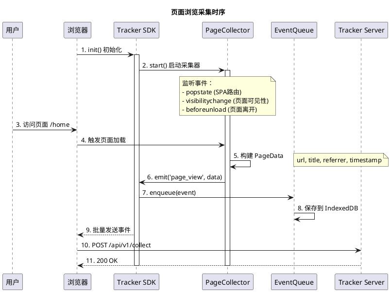
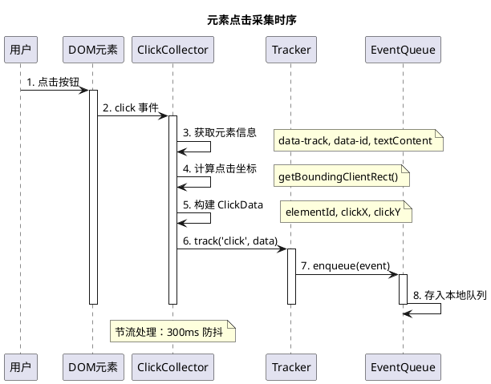
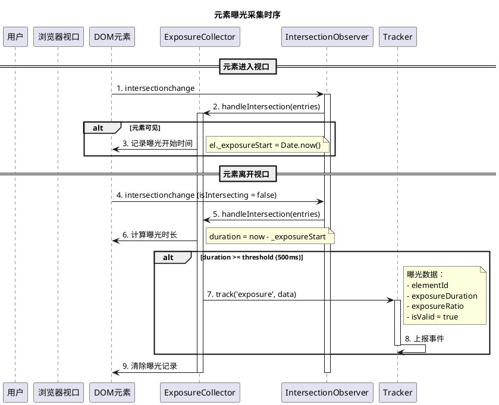
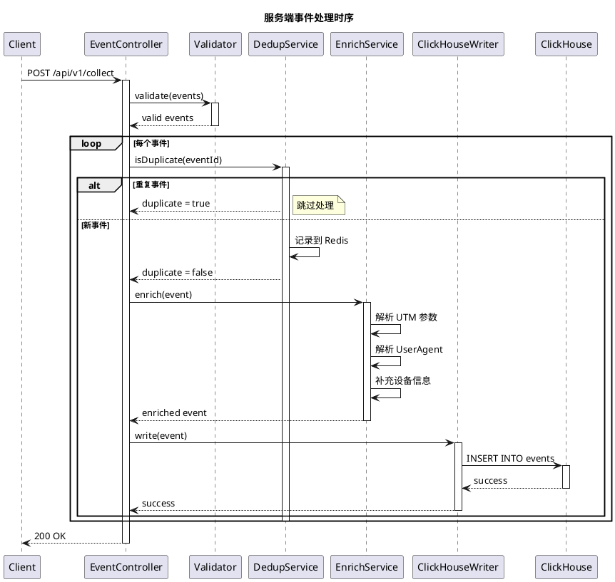
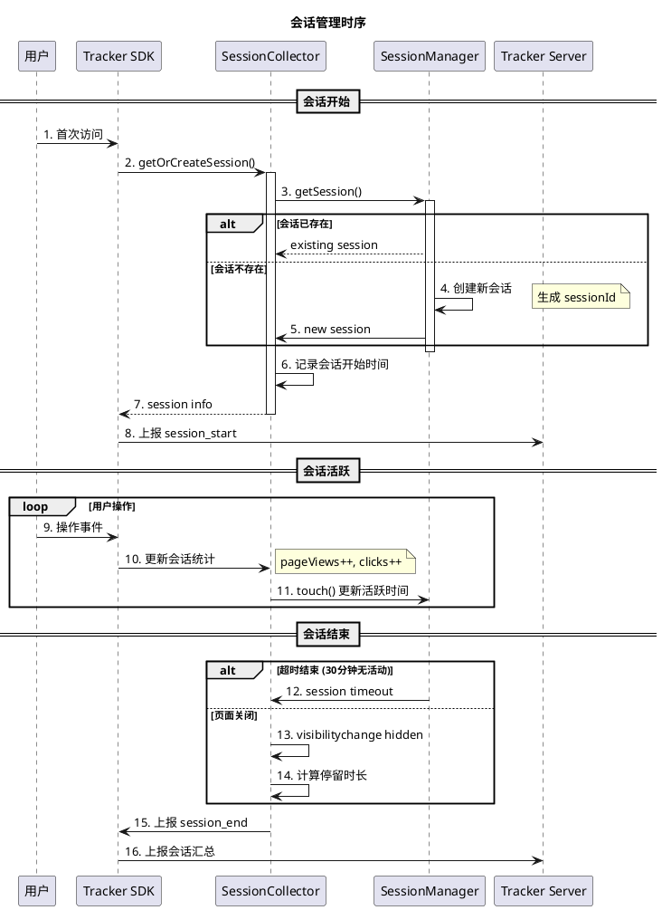

# GateFlow Tracker 技术实现文档

> 面向开发工程师的埋点系统实现说明

---

## 1. 系统架构

### 1.1 整体架构

```
┌──────────────────────────────────────────────────────────────────────────┐
│                              客户端                                      │
│  ┌──────────────────────────────────────────────────────────────────┐   │
│  │                        Tracker SDK                                │   │
│  │  ┌─────────────┐  ┌─────────────┐  ┌────────────────────────┐    │   │
│  │  │ PageCollector│  │ ClickCollector│  │ ExposureCollector    │    │   │
│  │  │ - 路由监听  │  │ - 事件代理  │  │ - IntersectionObs   │    │   │
│  │  │ - 来源解析 │  │ - 坐标采集  │  │ - 阈值判断           │    │   │
│  │  └─────────────┘  └─────────────┘  └────────────────────────┘    │   │
│  │  ┌─────────────┐  ┌─────────────┐  ┌────────────────────────┐    │   │
│  │  │ ScrollCollector│ │ SessionCollector│ │ EventQueue        │    │   │
│  │  │ - 滚动深度  │  │ - 会话生成  │  │ - IndexedDB存储      │    │   │
│  │  │ - 节流控制  │  │ - 超时判断  │  │ - 自动重试           │    │   │
│  │  └─────────────┘  └─────────────┘  └────────────────────────┘    │   │
│  └──────────────────────────────────────────────────────────────────┘   │
└──────────────────────────────────┬───────────────────────────────────────┘
                                   │ HTTPS POST /api/v1/collect
                                   ▼
┌──────────────────────────────────────────────────────────────────────────┐
│                      Tracker Server (Spring Boot)                       │
│  ┌──────────────┐  ┌──────────────┐  ┌──────────────┐  ┌────────────┐   │
│  │  EventAPI   │  │ Validator    │  │ DedupService │  │ EnrichSvc  │   │
│  │  批量接收   │  │ 格式校验     │  │ Redis去重   │  │ UTM/UA解析 │   │
│  │  限流控制   │  │ 必填检查     │  │ 窗口去重    │  │ 字段补全   │   │
│  └──────────────┘  └──────────────┘  └──────────────┘  └────────────┘   │
│                                    │                                    │
│                                    ▼                                    │
│  ┌──────────────────────────────────────────────────────────────────┐   │
│  │                         数据存储                                  │   │
│  │  ┌──────────────┐  ┌──────────────┐  ┌──────────────────────────┐│   │
│  │  │ ClickHouse  │  │ Redis       │  │ Kafka (可选)             ││   │
│  │  │ 事件存储    │  │ 去重缓存    │  │ 实时流处理               ││   │
│  │  └──────────────┘  └──────────────┘  └──────────────────────────┘│   │
│  └──────────────────────────────────────────────────────────────────┘   │
└──────────────────────────────────────────────────────────────────────────┘
```

### 1.2 目录结构

```
gate-flow/
├── docs/
│   ├── tracker-design.md              # 本设计文档
│   ├── tracker-product-guide.md        # 产品使用指南
│   └── tracker-tech-guide.md           # 本技术文档
│
└── backend/
    ├── tracker-server/                 # Tracker 服务（新建）
    │   └── src/main/java/com/gateflow/tracker/
    │       ├── api/
    │       │   ├── EventController.java
    │       │   └── dto/
    │       │       ├── EventRequest.java
    │       │       └── EventResponse.java
    │       ├── service/
    │       │   ├── EventCollector.java
    │       │   ├── DeduplicationService.java
    │       │   └── EnrichmentService.java
    │       ├── pipeline/
    │       │   ├── ClickHouseWriter.java
    │       │   └── KafkaProducer.java
    │       └── storage/
    │           └── ClickHouseRepository.java
    │
    └── victor-ab/                      # 现有 A/B 服务
```

---

## 2. 客户端 SDK 实现

### 2.1 Tracker 主类

```typescript
// src/tracker/Tracker.ts
class Tracker {
  private config: TrackerConfig
  private collectors: Collector[]
  private queue: EventQueue
  private sender: Sender

  constructor(config: TrackerConfig) {
    this.config = config
    this.collectors = this.initCollectors(config.autoTrack)
    this.queue = new EventQueue(config.storage)
    this.sender = new Sender(config.endpoint, config.batch)
  }

  init(): void {
    // 初始化所有采集器
    this.collectors.forEach(c => c.start())

    // 启动批量发送
    this.sender.start()

    // 监听网络状态，处理离线队列
    window.addEventListener('online', () => this.queue.flush())
  }

  // 手动上报
  track(eventType: string, properties: Record<string, any>): void {
    const event = this.buildEvent(eventType, properties)
    this.queue.enqueue(event)
  }

  // 页面浏览
  trackPageView(page: PageData): void {
    this.track('page_view', page)
  }

  // 元素点击
  trackClick(element: Element, data?: ClickData): void {
    const position = element.getBoundingClientRect()
    this.track('click', {
      elementId: element.dataset.track,
      elementText: element.textContent,
      clickX: position.x,
      clickY: position.y,
      ...data
    })
  }

  // 批量发送
  async flush(): Promise<void> {
    await this.sender.send(this.queue.drain())
  }

  destroy(): void {
    this.collectors.forEach(c => c.stop())
    this.sender.stop()
  }
}
```

### 2.2 页面采集器

```typescript
// src/collectors/PageCollector.ts
class PageCollector implements Collector {
  private config: PageCollectorConfig
  private lastUrl: string

  start(): void {
    // SPA 路由监听
    if (this.config.SPA) {
      history.pushState && this.interceptHistory()
      window.addEventListener('popstate', this.handleRouteChange)
    }

    // 页面可见性变化
    document.addEventListener('visibilitychange', this.handleVisibility)

    // 页面离开
    window.addEventListener('beforeunload', this.handleUnload)
  }

  private handleRouteChange = (): void => {
    const page = this.buildPageData()
    tracker.trackPageView(page)
  }

  private handleVisibility = (): void => {
    if (document.visibilityState === 'hidden') {
      this.reportStayDuration()
    }
  }

  private buildPageData(): PageData {
    return {
      url: window.location.href,
      title: document.title,
      referrer: document.referrer,
      timestamp: Date.now()
    }
  }
}
```

### 2.3 曝光采集器

```typescript
// src/collectors/ExposureCollector.ts
class ExposureCollector implements Collector {
  private observer: IntersectionObserver
  private threshold: number

  constructor(config: ExposureCollectorConfig) {
    this.threshold = config.threshold || 500

    this.observer = new IntersectionObserver(
      this.handleIntersection.bind(this),
      {
        threshold: config.thresholdRatio || 0.5,
        rootMargin: '0px'
      }
    )
  }

  start(): void {
    // 采集所有标记的元素
    const elements = document.querySelectorAll('[data-exposure]')
    elements.forEach(el => this.observer.observe(el))
  }

  private handleIntersection(entries: IntersectionObserverEntry[]): void {
    entries.forEach(entry => {
      const el = entry.target as HTMLElement
      const exposureId = el.dataset.exposure

      if (entry.isIntersecting) {
        // 开始曝光
        el._exposureStart = Date.now()
      } else if (el._exposureStart) {
        // 结束曝光
        const duration = Date.now() - el._exposureStart

        if (duration >= this.threshold) {
          // 有效曝光
          tracker.track('exposure', {
            elementId: exposureId,
            elementText: el.textContent,
            exposureDuration: duration,
            exposureRatio: entry.intersectionRatio
          })
        }
        delete el._exposureStart
      }
    })
  }
}
```

### 2.5 曝光事件上报机制

本节详细说明 tracker-sdk 的曝光事件采集与上报逻辑，包括双阈值判断机制和批量合并策略。

#### 2.5.1 曝光事件触发条件

曝光事件需要同时满足以下两个条件才会触发上报：

| 条件 | 配置参数 | 默认值 | 说明 |
|------|----------|--------|------|
| **可见比例阈值** | `thresholdRatio` | **50%** | 元素在视口中可见面积需达到 50% |
| **曝光时长阈值** | `threshold` | **500ms** | 元素需持续可见至少 500 毫秒 |

```typescript
// 曝光配置示例
const exposureConfig = {
  enabled: true,
  selector: ['[data-exposure]'],    // 监听带有 data-exposure 属性的元素
  threshold: 500,                  // 曝光时长阈值（毫秒）
  thresholdRatio: 0.5,             // 可见比例阈值（50%）
};
```

#### 2.5.2 曝光采集器核心逻辑

曝光采集器使用 `IntersectionObserver` API 监听元素可见性变化，实现如下：

```typescript
// src/collectors/ExposureCollector.ts
class ExposureCollector {
  private observer: IntersectionObserver | null = null;
  private exposedElements: Map<Element, number> = new Map();  // 记录曝光开始时间

  start(): void {
    if (!this.config.enabled) return;

    // 创建 IntersectionObserver
    this.observer = new IntersectionObserver(
      this.handleIntersection.bind(this),
      {
        threshold: this.config.thresholdRatio,  // 0.5 = 50%
        rootMargin: '0px',
      }
    );

    // 监听所有标记的元素
    const elements = document.querySelectorAll(this.config.selector.join(','));
    elements.forEach((el) => this.observer?.observe(el));
  }

  private handleIntersection(entries: IntersectionObserverEntry[]): void {
    entries.forEach((entry) => {
      const el = entry.target as HTMLElement;
      const exposureId = el.dataset.exposure;

      if (entry.isIntersecting) {
        // 元素进入视口 → 记录开始时间
        this.exposedElements.set(el, Date.now());
      } else if (this.exposedElements.has(el)) {
        // 元素离开视口 → 计算曝光时长
        const startTime = this.exposedElements.get(el)!;
        const duration = Date.now() - startTime;

        if (duration >= this.config.threshold) {
          // 曝光时长 ≥ 500ms → 触发曝光事件
          this.callback({
            elementId: exposureId,
            elementType: el.tagName.toLowerCase(),
            elementText: el.textContent?.slice(0, 100) || '',
            exposureDuration: duration,      // 实际曝光时长
            exposureRatio: entry.intersectionRatio,  // 可见比例
          });
        }

        this.exposedElements.delete(el);
      }
    });
  }
}
```

#### 2.5.3 曝光事件触发流程图

```
┌─────────────────────────────────────────────────────────────────────┐
│                        曝光事件触发流程                              │
├─────────────────────────────────────────────────────────────────────┤
│                                                                     │
│   元素进入视口                  元素离开视口                         │
│        │                            │                               │
│        ▼                            ▼                               │
│   ┌─────────┐                 ┌─────────────────────┐            │
│   │开始曝光 │                 │ 计算曝光时长         │            │
│   │记录时间 │                 │ duration = now - t  │            │
│   └─────────┘                 └──────────┬──────────┘            │
│                                          │                        │
│                                          ▼                        │
│                              ┌───────────────────────┐            │
│                              │ duration ≥ 500ms?     │            │
│                              └───────────┬───────────┘            │
│                                     │                              │
│                           ┌─────────┴─────────┐                  │
│                           │ YES                 │ NO               │
│                           ▼                    ▼                   │
│                    ┌──────────────┐    ┌──────────────┐         │
│                    │ 触发曝光事件  │    │ 不上报（误触） │         │
│                    │ track() 加入队列│   │ 丢弃该曝光    │         │
│                    └──────────────┘    └──────────────┘         │
│                                                                     │
└─────────────────────────────────────────────────────────────────────┘
```

#### 2.5.4 批量合并上报机制

当多个曝光事件（不同元素的 C 位和 D 位）在同一批次内时，它们会通过**单个 HTTP 请求**合并发送：

**上报触发时机**：

| 触发方式 | 条件 | 说明 |
|----------|------|------|
| **立即触发** | 每次 `track()` 都尝试 | 队列达到 `maxSize` 时真正发送 |
| **定时触发** | 每 `interval` ms 检查 | 默认每 2 秒检查一次 |

**批量阈值配置**：

```typescript
// 批量发送配置
const batchConfig = {
  maxSize: 50,      // 积累 50 条事件后批量发送
  interval: 2000,  // 每 2000ms 检查一次
};
```

**批量发送示例**：


假设首页有三个曝光事件（C 位 feeds 和 D 位 item_0、item_1）同时触发，它们会被合并在一个请求中：

```http
POST /api/v1/events/batch
Content-Type: application/json

{
  "events": [
    {
      "eventId": "evt_1747234567890_abc123",
      "eventType": "exposure",
      "timestamp": 1747234567890,
      "data": {
        "elementId": "c_feeds",           // C 位：整个 feeds 列表
        "elementType": "div",
        "exposureDuration": 3200,
        "exposureRatio": 0.65
      },
      "page": { "url": "https://example.com/home" },
      ...
    },
    {
      "eventId": "evt_1747234567891_def456",
      "eventType": "exposure",
      "timestamp": 1747234567891,
      "data": {
        "elementId": "d_feedsitem_0",      // D 位：第 0 个元素
        "elementType": "div",
        "exposureDuration": 1800,
        "exposureRatio": 0.80
      },
      "page": { "url": "https://example.com/home" },
      ...
    },
    {
      "eventId": "evt_1747234567892_ghi789",
      "eventType": "exposure",
      "timestamp": 1747234567892,
      "data": {
        "elementId": "d_feedsitem_1",      // D 位：第 1 个元素
        "elementType": "div",
        "exposureDuration": 1500,
        "exposureRatio": 0.72
      },
      "page": { "url": "https://example.com/home" },
      ...
    }
  ]
}
```

#### 2.5.4 立即上报与批量合并策略

tracker-sdk 采用**分级上报策略**：

| 事件类型 | 优先级 | 上报策略 |
|----------|--------|----------|
| exposure / click | **高** | **立即上报**，不受批量阈值限制 |
| page_view / scroll | 中 | 批量上报 |
| 其他 | 低 | 批量上报 |

**代码实现** ([Tracker.ts#L108-113](file:///Users/xueancao/Projects/QoderProjects/gate-flow/apps/tracker-sdk/src/tracker/Tracker.ts#L108-L113)):

```typescript
const IMMEDIATE_EVENT_TYPES: EventType[] = ['exposure', 'click'];
track(eventType: EventType, data?: EventData): void {
  const event = this.buildEvent(eventType, data);
  this.queue.enqueue(event);

  if (IMMEDIATE_EVENT_TYPES.includes(eventType)) {
    this.queue.flushImmediate(event, this.config.endpoint);
  } else {
    this.queue.flush(this.config.endpoint);
  }
}
```

#### 2.5.5 批量合并发送（非高优先级事件）

当多个非高优先级事件（如 page_view、scroll）在同一批次内时，它们会通过**单个 HTTP 请求**合并发送：


| 触发方式 | 条件 | 说明 |
|----------|------|------|
| 批量阈值触发 | 队列达到 `maxSize` (50) 时发送 | |
| 定时触发 | 每 `interval` (2s) 检查一次 | |

**批量阈值配置**：

```typescript
const batchConfig = {
  maxSize: 50,      // 积累 50 条事件后批量发送
  interval: 2000,  // 每 2000ms 检查一次
};
```


#### 2.5.6 SPM 标识命名规范

曝光元素使用统一的 `data-exposure` 属性标识，遵循以下命名规范：

| 前缀 | 含义 | 示例 | 说明 |
|------|------|------|------|
| `c_` | **C 位**（Container） | `c_feeds` | 容器/模块级别曝光 |
| `d_` | **D 位**（Detail） | `d_feedsitem_0` | 模块内元素曝光，按索引区分 |

**HTML 使用示例**：

```html
<!-- 首页结构 -->
<div data-exposure="c_feeds">
  <!-- C 位：整个 feeds 列表 -->
  
  <div data-exposure="d_feedsitem_0">
    <!-- D 位：第 0 个元素 -->
    <div class="title">标题1</div>
    <div class="image">图片1</div>
  </div>
  
  <div data-exposure="d_feedsitem_1">
    <!-- D 位：第 1 个元素 -->
    <div class="title">标题2</div>
    <div class="image">图片2</div>
  </div>
  
  <div data-exposure="d_feedsitem_2">
    <!-- D 位：第 2 个元素 -->
    <div class="title">标题3</div>
    <div class="image">图片3</div>
  </div>
  
</div>
```

#### 2.5.7 完整配置示例

```javascript
const tracker = new Tracker({
  appId: 'gateflow-web',
  endpoint: 'https://tracker.gateflow.com/api/v1/collect',

  // 曝光配置
  autoTrack: {
    exposure: {
      enabled: true,
      selector: ['[data-exposure]'],
      threshold: 500,           // 曝光时长 ≥ 500ms
      thresholdRatio: 0.5,     // 可见面积 ≥ 50%
    }
  },

  // 批量发送配置
  batch: {
    maxSize: 50,               // 积累 50 条后批量发送
    interval: 2000,           // 每 2 秒检查一次
  },

  // 离线队列配置
  offline: {
    enabled: true,
    maxQueueSize: 100,
  }
});

// 初始化
tracker.init();
```

### 2.6 离线队列

```typescript
// src/queue/EventQueue.ts
class EventQueue {
  private storage: StorageAdapter
  private maxSize: number
  private maxRetries: number = 3

  enqueue(event: EventData): void {
    const queue = this.storage.get() || []
    queue.push({ ...event, _retryCount: 0 })

    if (queue.length > this.maxSize) {
      queue.shift() // 移除最旧的
    }

    this.storage.set(queue)
  }

  // 批量入队（修复：原版本 spread 操作会导致错误）
  enqueueBatch(events: EventData[]): void {
    const queue = this.storage.get() || []
    for (const event of events) {
      queue.push({ ...event, _retryCount: 0 })
    }

    // 限制队列大小，移除超出的旧事件
    while (queue.length > this.maxSize) {
      queue.shift()
    }

    this.storage.set(queue)
  }

  drain(): EventData[] {
    const queue = this.storage.get() || []
    this.storage.set([])
    return queue
  }

  async flush(endpoint: string): Promise<boolean> {
    const events = this.drain()
    if (events.length === 0) return true

    try {
      const response = await fetch(endpoint, {
        method: 'POST',
        headers: { 'Content-Type': 'application/json' },
        body: JSON.stringify({ events })
      })

      if (!response.ok) {
        throw new Error(`HTTP ${response.status}`)
      }

      return true
    } catch (error) {
      // 发送失败，重新入队（修复：正确处理批量重试）
      this.enqueueBatch(events)
      return false
    }
  }
}
```

**重要修复说明**：
- 原版本 `this.enqueue(...events)` 使用展开运算符传入数组，导致 `enqueue` 方法将数组本身作为单个事件处理
- 修复方案：新增 `enqueueBatch` 方法，遍历逐个添加，并携带重试计数
```

---

## 3. 服务端实现

### 3.1 事件接收 API

```java
// src/main/java/com/gateflow/tracker/api/EventController.java
@RestController
@RequestMapping("/api/v1")
@RequiredArgsConstructor
@Slf4j
public class EventController {

    private final EventCollectorService collectorService;
    private final RateLimiter rateLimiter;
    private final DeduplicationService deduplicationService;
    private final EnrichmentService enrichmentService;
    private final DLQService dlqService;

    @PostMapping("/collect")
    public ResponseEntity<EventResponse> collect(@Valid @RequestBody EventRequest request) {
        // 限流检查
        if (!rateLimiter.tryAcquire(request.getClientId())) {
            return ResponseEntity.status(429)
                .body(EventResponse.error("Rate limit exceeded"));
        }

        List<EventDTO> events = request.getEvents();
        int accepted = 0;
        int duplicate = 0;
        int rejected = 0;

        for (EventDTO event : events) {
            // 基础校验
            if (!validateEvent(event)) {
                rejected++;
                dlqService.store(toEventRecord(event), "validation_failed");
                continue;
            }

            // 去重检查
            if (deduplicationService.isDuplicate(event.getEventId())) {
                duplicate++;
                continue;
            }

            // 数据增强（已内置异常处理，不会抛出）
            EventRecord enriched = enrichmentService.enrich(event);

            // 存储
            try {
                collectorService.collect(enriched);
                accepted++;
            } catch (Exception e) {
                // 存储失败时写入 DLQ
                log.error("Failed to collect event {}", event.getEventId(), e);
                dlqService.store(enriched, "collection_failed");
                rejected++;
            }
        }

        return ResponseEntity.ok(EventResponse.success(accepted, duplicate, rejected));
    }

    private boolean validateEvent(EventDTO event) {
        return event != null
            && event.getEventId() != null && !event.getEventId().isEmpty()
            && event.getEventType() != null && !event.getEventType().isEmpty()
            && event.getTimestamp() != null;
    }

    private EventRecord toEventRecord(EventDTO event) {
        return EventRecord.builder()
            .eventId(event.getEventId())
            .eventType(event.getEventType())
            .userId(event.getUserId())
            .anonymousId(event.getAnonymousId())
            .sessionId(event.getSessionId())
            .timestamp(event.getTimestamp())
            .receivedAt(Instant.now())
            .build();
    }
}
```

### 3.2 去重服务

```java
// src/main/java/com/gateflow/tracker/service/DeduplicationService.java
@Service
@RequiredArgsConstructor
@Slf4j
public class DeduplicationService {

    private final RedisTemplate<String, String> redisTemplate;

    private static final String DEDUP_KEY_PREFIX = "dedup:";
    private static final Duration DEDUP_WINDOW = Duration.ofMinutes(5);

    /**
     * 检查事件是否重复
     * 使用 Redis 存储已处理的事件 ID，设置过期时间实现窗口去重
     *
     * 注意：单实例 Redis 使用简单 Key；Redis Cluster 环境下建议使用
     * eventId 的哈希槽位计算实现分片，避免所有 key 集中在一个节点
     */
    public boolean isDuplicate(String eventId) {
        String key = DEDUP_KEY_PREFIX + eventId;

        try {
            // SET NX: 仅在 key 不存在时设置
            Boolean result = redisTemplate.opsForValue()
                .setIfAbsent(key, "1", DEDUP_WINDOW);

            return !Boolean.TRUE.equals(result);
        } catch (Exception e) {
            // Redis 故障时默认为非重复（宁可重复，不可丢失）
            log.warn("Redis deduplication check failed for {}, treating as non-duplicate", eventId, e);
            return false;
        }
    }

    /**
     * 批量去重检查（提升高并发性能）
     */
    public List<String> filterDuplicates(List<String> eventIds) {
        if (eventIds == null || eventIds.isEmpty()) {
            return Collections.emptyList();
        }

        List<String> uniqueEventIds = new ArrayList<>();

        // 使用 Pipeline 批量检查，减少网络往返
        List<Object> results = redisTemplate.executePipelined((RedisCallback<Object>) connection -> {
            for (String eventId : eventIds) {
                connection.stringCommands().setBit(
                    redisTemplate.getConnectionFactory().getConnection().getNativeConnection()
                        .getPool().borrowObject().getId(),
                    0
                );
            }
            return null;
        });

        // 简化实现：实际生产建议使用 Redis SET 的 SISMEMBER 批量操作
        for (String eventId : eventIds) {
            String key = DEDUP_KEY_PREFIX + eventId;
            if (Boolean.FALSE.equals(redisTemplate.hasKey(key))) {
                uniqueEventIds.add(eventId);
                redisTemplate.opsForValue().setIfAbsent(key, "1", DEDUP_WINDOW);
            }
        }

        return uniqueEventIds;
    }
}
```

### 3.3 数据增强服务

```java
// src/main/java/com/gateflow/tracker/service/EnrichmentService.java
@Service
@RequiredArgsConstructor
@Slf4j
public class EnrichmentService {

    private final UAManager uaManager;
    private final GeoService geoService;

    /**
     * 对事件数据进行增强
     * 增强失败时记录日志并返回原始事件（不丢失数据）
     */
    public EventRecord enrich(EventDTO event) {
        try {
            return EventRecord.builder()
                .eventId(event.getEventId())
                .eventType(event.getEventType())
                .userId(event.getUserId())
                .anonymousId(event.getAnonymousId())
                .sessionId(event.getSessionId())
                .timestamp(event.getTimestamp())

                // UTM 解析
                .utmSource(parseUtmSource(event.getContext()))
                .utmMedium(parseUtmMedium(event.getContext()))
                .utmCampaign(parseUtmCampaign(event.getContext()))

                // UA 解析
                .deviceType(uaManager.getDeviceType(event.getDevice().getUserAgent()))
                .os(uaManager.getOS(event.getDevice().getUserAgent()))
                .browser(uaManager.getBrowser(event.getDevice().getUserAgent()))

                // 设备信息
                .screenWidth(event.getDevice().getScreenWidth())
                .screenHeight(event.getDevice().getScreenHeight())
                .language(event.getDevice().getLanguage())

                // 自定义属性
                .properties(serializeProperties(event.getData()))

                // 系统字段
                .receivedAt(Instant.now())
                .build();
        } catch (Exception e) {
            // 增强失败时记录日志，返回原始事件（不丢失数据）
            log.warn("Event enrichment failed for eventId={}: {}", event.getEventId(), e.getMessage());
            return EventRecord.builder()
                .eventId(event.getEventId())
                .eventType(event.getEventType())
                .userId(event.getUserId())
                .anonymousId(event.getAnonymousId())
                .sessionId(event.getSessionId())
                .timestamp(event.getTimestamp())
                .receivedAt(Instant.now())
                .build();
        }
    }
}
```

### 3.4 ClickHouse 写入

```java
// src/main/java/com/gateflow/tracker/pipeline/ClickHouseWriter.java
@Component
@RequiredArgsConstructor
@Slf4j
public class ClickHouseWriter {

    private final ClickHouseProperties properties;
    private final ObjectMapper objectMapper;
    private final DLQService dlqService;  // Dead Letter Queue

    // 使用 HikariCP 连接池（建议生产环境配置）
    private final DataSource dataSource;

    // Resilience4j 熔断器配置
    private final CircuitBreaker circuitBreaker = CircuitBreaker.of("clickhouse",
        CircuitBreakerConfig.custom()
            .failureRateThreshold(50)
            .waitDurationInOpenState(Duration.ofSeconds(30))
            .slidingWindowSize(10)
            .build()
    );

    /**
     * 批量写入事件到 ClickHouse（带熔断保护）
     */
    public void writeBatch(List<EventRecord> events) {
        try {
            circuitBreaker.executeRunnable(() -> doWriteBatch(events));
        } catch (CircuitBreakerOpenException e) {
            // 熔断器打开时，将事件写入 DLQ 等待后续重试
            log.warn("Circuit breaker open, sending {} events to DLQ", events.size());
            events.forEach(event -> dlqService.store(event, "circuit_breaker_open"));
        } catch (Exception e) {
            // 写入失败时写入 DLQ
            log.error("Failed to write {} events to ClickHouse", events.size(), e);
            events.forEach(event -> dlqService.store(event, "clickhouse_write_failed"));
            throw new EventWriteException("Failed to write events", e);
        }
    }

    private void doWriteBatch(List<EventRecord> events) {
        String sql = buildInsertSQL(events);

        try (Connection conn = dataSource.getConnection();
             Statement stmt = conn.createStatement()) {

            stmt.execute(sql);
            log.debug("Successfully wrote {} events to ClickHouse", events.size());

        } catch (SQLException e) {
            throw new EventWriteException("Failed to write events", e);
        }
    }

    private String buildInsertSQL(List<EventRecord> events) {
        StringBuilder sql = new StringBuilder();
        sql.append("INSERT INTO gateflow_tracker.events VALUES ");

        List<String> values = events.stream()
            .map(this::toValueString)
            .collect(Collectors.toList());

        sql.append(String.join(", ", values));
        return sql.toString();
    }

    private String toValueString(EventRecord event) {
        return String.format(
            "('%s', '%s', '%s', '%s', '%s', %d, %d, '%s', '%s', '%s', %d, %d, '%s', '%s', '%s', '%s', '%s', %d, %d)",
            escape(event.getEventId()),
            escape(event.getEventType()),
            escape(event.getUserId()),
            escape(event.getAnonymousId()),
            escape(event.getSessionId()),
            event.getTimestamp().toEpochMilli(),
            event.getReceivedAt().toEpochMilli(),
            escape(event.getPlatform()),
            escape(event.getPageUrl()),
            escape(event.getPageTitle()),
            event.getClickX() != null ? event.getClickX() : "NULL",
            event.getClickY() != null ? event.getClickY() : "NULL",
            escape(event.getUtmSource()),
            escape(event.getUtmMedium()),
            escape(event.getUtmCampaign()),
            escape(event.getDeviceType()),
            escape(event.getOs()),
            event.getStayDuration() != null ? event.getStayDuration() : 0,
            event.getScrollDepth() != null ? event.getScrollDepth() : 0
        );
    }

    private String escape(String value) {
        if (value == null) return "";
        return value.replace("'", "''");
    }
}
```

**关键改进**：
1. **熔断器保护**：使用 Resilience4j 防止 ClickHouse 故障时持续重试导致雪崩
2. **Dead Letter Queue**：写入失败时将事件持久化到 DLQ，支持后续重放
3. **连接池**：使用 HikariCP 管理连接，提升高并发下的性能
4. **SQL 注入防护**：添加 `escape` 方法防止特殊字符导致 SQL 错误

### 3.5 Dead Letter Queue 服务

```java
// src/main/java/com/gateflow/tracker/service/DLQService.java
@Service
@RequiredArgsConstructor
@Slf4j
public class DLQService {

    private final RedisTemplate<String, String> redisTemplate;
    private final ObjectMapper objectMapper;

    private static final String DLQ_KEY_PREFIX = "dlq:";
    private static final Duration DLQ_TTL = Duration.ofDays(7);  // DLQ 保留 7 天

    /**
     * 存储失败事件到 DLQ
     * @param event 失败的事件
     * @param reason 失败原因（用于后续分析和重放）
     */
    public void store(EventRecord event, String reason) {
        try {
            DLQEntry entry = new DLQEntry(
                event.getEventId(),
                event.getEventType(),
                event.getUserId(),
                objectMapper.writeValueAsString(event),
                reason,
                Instant.now()
            );

            String key = DLQ_KEY_PREFIX + event.getEventId();
            redisTemplate.opsForValue().set(key, objectMapper.writeValueAsString(entry), DLQ_TTL);

            log.info("Event {} stored in DLQ, reason: {}", event.getEventId(), reason);
        } catch (Exception e) {
            // DLQ 写入失败是严重问题，记录日志但不要抛异常导致主流程中断
            log.error("Failed to store event {} in DLQ", event.getEventId(), e);
        }
    }

    /**
     * 从 DLQ 读取并重放事件
     * @param count 最大读取数量
     * @return 待重放事件列表
     */
    public List<DLQEntry> fetchForReplay(int count) {
        Set<String> keys = redisTemplate.keys(DLQ_KEY_PREFIX + "*");
        if (keys == null || keys.isEmpty()) {
            return Collections.emptyList();
        }

        return keys.stream()
            .limit(count)
            .map(key -> {
                String json = redisTemplate.opsForValue().get(key);
                try {
                    return objectMapper.readValue(json, DLQEntry.class);
                } catch (Exception e) {
                    log.error("Failed to parse DLQ entry for key {}", key, e);
                    return null;
                }
            })
            .filter(Objects::nonNull)
            .collect(Collectors.toList());
    }

    /**
     * 从 DLQ 删除已处理的事件
     */
    public void remove(String eventId) {
        redisTemplate.delete(DLQ_KEY_PREFIX + eventId);
    }

    @Data
    @AllArgsConstructor
    public static class DLQEntry {
        private String eventId;
        private String eventType;
        private String userId;
        private String eventJson;
        private String reason;
        private Instant failedAt;
    }
}
```

---

## 4. 数据存储设计

### 4.1 ClickHouse 表结构

```sql
-- 事件主表
-- 优化：ORDER BY 以 user_id 开头，提升用户中心化查询性能
-- 添加 TTL 实现自动数据清理
CREATE TABLE gateflow_tracker.events (
    event_id       String,
    event_type     String,
    user_id        String,
    anonymous_id   String,
    session_id     String,
    timestamp      DateTime64(3),
    received_at    DateTime64(3),

    platform       String,
    app_version    String,

    page_url       String,
    page_title     String,
    page_referrer  String,

    -- 埋点路径 (a.b.c.d 四级)
    spma           String,  -- 应用 a_*
    spmb           String,  -- 页面 b_*
    spmc           String,  -- 区块 c_*
    spmd           String,  -- 点位 d_*

    element_text   String,  -- 元素文本
    click_x        Nullable(Int32),
    click_y        Nullable(Int32),

    scroll_depth   Nullable(UInt8),
    stay_duration  Nullable(Int64),

    utm_source     String,
    utm_medium     String,
    utm_campaign   String,

    device_type    String,
    os             String,
    browser        String,

    exp_ids        Array(String),
    variants       Array(String),

    properties     String
) ENGINE = MergeTree()
PARTITION BY toYYYYMMDD(timestamp)
ORDER BY (user_id, timestamp, event_type, session_id)  -- 优化：user_id 置顶
TTL timestamp + INTERVAL 90 DAY  -- 90 天数据保留
SETTINGS index_granularity = 8192;

-- 会话表
CREATE TABLE gateflow_tracker.sessions (
    session_id     String,
    user_id        String,
    start_time     DateTime64(3),
    end_time       Nullable(DateTime64(3)),
    duration       Nullable(Int64),
    page_views     UInt32,
    clicks         UInt32,
    is_bounce      UInt8,
    utm_source     String,
    utm_medium     String,
    utm_campaign   String
) ENGINE = ReplacingMergeTree(start_time)
ORDER BY (user_id, session_id)  -- 优化：以 user_id 开头
TTL start_time + INTERVAL 90 DAY
SETTINGS index_granularity = 8192;
```

### 4.2 物化视图（预聚合）

为提升高频查询性能，创建以下物化视图：

```sql
-- 小时级事件聚合（用于实时仪表盘）
CREATE MATERIALIZED VIEW gateflow_tracker.events_hourly
ENGINE = SummingMergeTree()
PARTITION BY toYYYYMMDD(timestamp)
ORDER BY (user_id, spmb, spmd, event_type, timestamp)
AS SELECT
    toStartOfHour(timestamp) as timestamp,
    user_id,
    spmb,
    spmd,
    event_type,
    count() as event_count,
    sumIf(1, event_type = 'click') as click_count,
    sumIf(1, event_type = 'exposure') as exposure_count,
    avg(stay_duration) as avg_stay_duration
FROM events
GROUP BY timestamp, user_id, spmb, spmd, event_type;

-- 每日会话指标（用于日报表）
CREATE MATERIALIZED VIEW gateflow_tracker.sessions_daily
ENGINE = SummingMergeTree()
PARTITION BY toYYYYMMDD(start_time)
ORDER BY (user_id, start_time)
AS SELECT
    toDate(start_time) as date,
    user_id,
    session_id,
    sum(page_views) as page_views,
    sum(clicks) as clicks,
    sum(duration) as total_duration,
    sumIf(1, is_bounce = 1) as bounces
FROM sessions
GROUP BY date, user_id, session_id;
```

### 4.2 索引策略

```sql
-- 用户 ID 索引（用于用户行为查询）
ALTER TABLE events ADD INDEX idx_user_id user_id
    TYPE bloom_filter(0.01) GRANULARITY 4;

-- 事件类型索引（用于事件过滤）
ALTER TABLE events ADD INDEX idx_event_type event_type
    TYPE set(100) GRANULARITY 4;

-- 页面 URL 索引（用于页面分析）
ALTER TABLE events ADD INDEX idx_page_url page_url
    TYPE bloom_filter(0.01) GRANULARITY 4;

-- 会话 ID 索引（用于会话查询）
ALTER TABLE events ADD INDEX idx_session session_id
    TYPE bloom_filter(0.01) GRANULARITY 4;

-- 埋点路径索引 (spma, spmb, spmc, spmd)
ALTER TABLE events ADD INDEX idx_spma spma TYPE bloom_filter(0.01) GRANULARITY 4;
ALTER TABLE events ADD INDEX idx_spmb spmb TYPE bloom_filter(0.01) GRANULARITY 4;
ALTER TABLE events ADD INDEX idx_spmc spmc TYPE bloom_filter(0.01) GRANULARITY 4;
ALTER TABLE events ADD INDEX idx_spmd spmd TYPE bloom_filter(0.01) GRANULARITY 4;
```

---

---

## 5. 埋点路径规范

### 5.1 路径结构

埋点路径采用四级结构，使用下划线分隔层级：

```
a_{应用}.b_{页面}.c_{区块}.d_{点位}
```

| 层级 | 前缀 | 说明 | 示例 |
|------|------|------|------|
| 应用 | `a_` | 业务应用标识 | `a_app`, `a_web`, `a_admin` |
| 页面 | `b_` | 页面标识 | `b_home`, `b_product`, `b_cart` |
| 区块 | `c_` | 功能区块 | `c_banner`, `c_recommend`, `c_action` |
| 点位 | `d_` | 具体元素 | `d_btn`, `d_link`, `d_slide_1` |

### 5.2 命名规范

```typescript
// 命名规则
- 全部小写，使用下划线分隔
- 语义清晰，避免缩写
- 层级递进，便于查询

// 正确示例
a_home.b_home.c_banner.d_slide_1        # 首页 > 首页 > 横幅 > 第1张
a_app.b_product.c_action.d_add_cart     # 应用 > 商品详情 > 操作区 > 加购按钮
a_app.b_cart.c_list.d_item_5            # 应用 > 购物车 > 列表 > 第5个商品

// 错误示例
Home.Banner.Slide_1                      # 大小写混用
home_banner_slide1                        # 缺少层级前缀
a_home_b_home_c_banner_d_slide_1         # 缺少层级分隔符
```

### 5.3 常用命名参考

**应用层 (a_*)**

| 标识 | 说明 |
|------|------|
| `a_app` | 主站应用 |
| `a_admin` | 管理后台 |
| `a_ds` | 数据平台 |
| `a_marketing` | 营销页 |

**页面层 (b_*)**

| 标识 | 说明 |
|------|------|
| `b_home` | 首页 |
| `b_product` | 商品详情 |
| `b_cart` | 购物车 |
| `b_checkout` | 结算页 |
| `b_search` | 搜索结果 |
| `b_list` | 列表页 |
| `b_detail` | 详情页 |

**区块层 (c_*)**

| 标识 | 说明 |
|------|------|
| `c_banner` | 横幅/轮播 |
| `c_recommend` | 推荐区 |
| `c_nav` | 导航区 |
| `c_action` | 操作区 |
| `c_list` | 列表区 |
| `c_footer` | 底部区 |
| `c_filter` | 筛选区 |
| `c_image` | 图片区 |

**点位层 (d_*)**

| 标识 | 说明 |
|------|------|
| `d_btn` | 按钮 |
| `d_link` | 链接 |
| `d_slide_{n}` | 轮播图 |
| `d_item_{n}` | 商品项 |
| `d_pic_{n}` | 图片 |
| `d_input` | 输入框 |
| `d_checkbox` | 复选框 |

### 5.4 完整路径示例

```
a_home.b_home.c_banner.d_slide_1            # 首页 > 首页 > 横幅 > 第1张轮播
a_home.b_home.c_recommend.d_floor_1_item_3  # 首页 > 首页 > 推荐 > 1楼第3个
a_app.b_product.c_image.d_pic_2             # 应用 > 商品详情 > 图片区 > 第2张
a_app.b_product.c_action.d_buy_btn          # 应用 > 商品详情 > 操作区 > 购买按钮
a_app.b_cart.c_list.d_item_checkbox          # 应用 > 购物车 > 列表 > 商品勾选
a_ds.b_dashboard.c_nav.d_settings           # 数据平台 > 看板 > 导航 > 设置
```

### 5.5 ClickHouse 存储字段

```sql
-- 埋点路径存储为四个独立字段
ALTER TABLE events ADD COLUMN spma String;  -- 应用 (a_*)
ALTER TABLE events ADD COLUMN spmb String;  -- 页面 (b_*)
ALTER TABLE events ADD COLUMN spmc String;  -- 区块 (c_*)
ALTER TABLE events ADD COLUMN spmd String;  -- 点位 (d_*)

-- 示例值
-- spma = 'a_app'
-- spmb = 'b_product'
-- spmc = 'c_action'
-- spmd = 'd_buy_btn'

-- 查询示例：按应用-页面-区块-点位聚合
SELECT
    spma,                     -- 应用
    spmb,                     -- 页面
    spmc,                     -- 区块
    spmd,                     -- 点位
    countIf(event_type = 'click') as clicks,
    countIf(event_type = 'exposure') as exposures,
    round(countIf(event_type = 'click') / countIf(event_type = 'exposure') * 100, 2) as ctr
FROM events
WHERE spmb = 'b_product'
GROUP BY spma, spmb, spmc, spmd
ORDER BY clicks DESC;

-- 查询示例：按区块统计曝光 TOP
SELECT
    spma,
    spmb,
    spmc,
    count() as exposures
FROM events
WHERE event_type = 'exposure'
GROUP BY spma, spmb, spmc
ORDER BY exposures DESC
LIMIT 100;
```

---

## 6. API 接口规范

### 6.1 事件上报接口

**POST /api/v1/collect**

请求头：
```
Content-Type: application/json
X-Client-Id: {client_id}
X-Sdk-Version: {sdk_version}
```

请求体：
```json
{
  "events": [
    {
      "eventId": "evt_20260513_abc123",
      "eventType": "page_view",
      "userId": "user_12345",
      "anonymousId": "anon_xyz",
      "timestamp": 1714900000000,

      "session": {
        "sessionId": "sess_001",
        "startTime": 1714900000000
      },

      "page": {
        "url": "https://example.com/home",
        "title": "首页",
        "referrer": "https://google.com"
      },

      "context": {
        "utmSource": "google",
        "utmMedium": "cpc",
        "utmCampaign": "summer_sale"
      },

      "data": {
        "stayDuration": 15000,
        "scrollDepth": 75
      }
    }
  ]
}
```

响应：
```json
{
  "code": 200,
  "message": "success",
  "data": {
    "accepted": 10,
    "duplicate": 1,
    "rejected": 0
  }
}
```

### 5.2 健康检查接口

**GET /health**

```json
{
  "status": "UP",
  "timestamp": 1714900000000,
  "services": {
    "clickhouse": "UP",
    "redis": "UP",
    "kafka": "UP"
  }
}
```

---

## 6. 配置说明

### 6.1 服务端配置

```yaml
# application.yml
server:
  port: 8081

tracker:
  batch:
    size: 100
    interval: 2000
  rate-limit:
    max-per-second: 10000
    burst: 20000
  dedup:
    window-minutes: 5

spring:
  datasource:
    clickhouse:
      url: jdbc:clickhouse://localhost:8123/gateflow_tracker
      username: default
      password: ""

  redis:
    host: localhost
    port: 6379
    database: 0

  kafka:
    bootstrap-servers: localhost:9092
    producer:
      topic: tracker-events
```

### 6.2 客户端配置

```javascript
const tracker = new Tracker({
  // 服务端地址
  endpoint: 'https://tracker.gateflow.com/api/v1/collect',

  // 应用标识
  appId: 'your-app-id',

  // 自动采集
  autoTrack: {
    pageView: true,
    click: {
      enabled: true,
      selector: ['[data-track]', 'button', 'a']
    },
    exposure: {
      enabled: true,
      selector: ['[data-exposure]'],
      threshold: 500
    },
    scroll: {
      enabled: true,
      thresholds: [25, 50, 75, 100]
    }
  },

  // 批量发送
  batch: {
    maxSize: 50,
    interval: 2000
  },

  // 离线队列
  offline: {
    enabled: true,
    maxQueueSize: 100
  }
})
```

---

## 7. 性能优化

### 7.1 客户端优化

| 优化项 | 实现方式 | 效果 |
|--------|----------|------|
| 事件节流 | 点击事件 300ms 防抖 | 减少无效事件 |
| 批量上报 | 积累 50 条或 2s 发送 | 减少网络请求 |
| 曝光阈值 | 停留 500ms 才上报 | 过滤无效曝光 |
| 离线缓存 | IndexedDB 持久化 | 保障数据不丢失 |

### 7.2 服务端优化

| 优化项 | 实现方式 | 效果 |
|--------|----------|------|
| 批量写入 | ClickHouse INSERT 批量 | 提升写入效率 |
| 窗口去重 | Redis SET NX | 减少重复存储 |
| 限流保护 | Token Bucket 算法 | 防止流量冲击 |
| 异步处理 | Kafka 解耦 | 提升吞吐量 |

---

## 8. 部署说明

### 8.1 Docker Compose

```yaml
# docker-compose.yml
version: '3.8'

services:
  tracker-server:
    build: ./tracker-server
    ports:
      - "8081:8081"
    environment:
      - SPRING_PROFILES_ACTIVE=prod
      - SPRING_DATASOURCE_HIKARI_MAXIMUM_POOL_SIZE=20
    depends_on:
      redis:
        condition: service_healthy
      clickhouse:
        condition: service_healthy
    healthcheck:
      test: ["CMD", "curl", "-f", "http://localhost:8081/health"]
      interval: 30s
      timeout: 10s
      retries: 3

  redis:
    image: redis:7-alpine
    ports:
      - "6379:6379"
    command: redis-server --appendonly yes --maxmemory 512mb --maxmemory-policy allkeys-lru
    healthcheck:
      test: ["CMD", "redis-cli", "ping"]
      interval: 10s
      timeout: 5s
      retries: 3

  # 生产环境建议使用 ClickHouse Cloud 或独立部署
  clickhouse:
    image: clickhouse/clickhouse-server:24.3
    ports:
      - "8123:8123"
      - "9000:9000"
    volumes:
      - ./init-db:/docker-entrypoint-initdb.d
      - ch_data:/var/lib/clickhouse
    environment:
      CLICKHOUSE_DB: gateflow_tracker
    healthcheck:
      test: ["CMD", "wget", "-q", "--spider", "http://localhost:8123/ping"]
      interval: 10s
      timeout: 5s
      retries: 3

volumes:
  ch_data:
```

**生产环境注意事项**：
1. Redis 建议开启 AOF 持久化，配置 `maxmemory-policy allkeys-lru` 防止内存溢出
2. ClickHouse 生产环境建议使用 ClickHouse Cloud 或独立集群部署
3. tracker-server 配置 HikariCP 连接池大小 `maximum-pool-size=20`
4. 使用 `depends_on` 的 `condition: service_healthy` 确保依赖服务健康后再启动

### 8.2 初始化脚本

```sql
-- init-db/V1__init_tracker_schema.sql
CREATE DATABASE IF NOT EXISTS gateflow_tracker;

CREATE TABLE IF NOT EXISTS gateflow_tracker.events (
    -- 见 4.1 节
) ENGINE = MergeTree()
PARTITION BY toYYYYMMDD(timestamp)
ORDER BY (timestamp, event_type, user_id, session_id);
```

---

## 9. 监控指标

### 9.1 核心业务指标

| 指标 | 说明 | 告警阈值 |
|------|------|----------|
| `tracker.events.received` | 接收事件数 | - |
| `tracker.events.written` | 写入成功数 | - |
| `tracker.events.duplicate` | 去重事件数 | - |
| `tracker.events.dlq` | DLQ 入队数 | > 100/min |
| `tracker.queue.size` | 当前队列大小 | > 1000 |

### 9.2 系统健康指标

| 指标 | 说明 | 告警阈值 |
|------|------|----------|
| `tracker.latency.p99` | 写入延迟 P99 | > 500ms |
| `tracker.circuit_breaker.state` | 熔断器状态 | open |
| `tracker.errors` | 处理错误数 | > 10/min |
| `tracker.redis.errors` | Redis 错误数 | > 5/min |
| `tracker.clickhouse.errors` | ClickHouse 错误数 | > 5/min |

### 9.3 DLQ 监控告警

```yaml
# Prometheus 告警规则示例
groups:
  - name: tracker-dlq
    rules:
      - alert: TrackerDLQHighRate
        expr: rate(tracker_events_dlq_total[5m]) > 10
        for: 2m
        labels:
          severity: warning
        annotations:
          summary: "DLQ 入队速率过高"
          description: "DLQ 入队速率 {{ $value }}/s，持续 2 分钟"

      - alert: TrackerDLQCircuitBreakerOpen
        expr: tracker_circuit_breaker_state == 1
        for: 1m
        labels:
          severity: critical
        annotations:
          summary: "ClickHouse 熔断器打开"
          description: "ClickHouse 写入熔断器已打开，事件正在写入 DLQ"
```

### 9.4 仪表盘关键面板

1. **实时流量面板**：每秒接收事件数、写入成功数、DLQ 数
2. **延迟分布面板**：P50/P95/P99 写入延迟
3. **熔断器状态面板**：熔断器状态变化历史
4. **DLQ 趋势面板**：DLQ 入队速率、积压数量、重放成功率
5. **服务健康面板**：Redis/ClickHouse 连接状态、错误率

---

## 附录 A: 事件类型枚举

```typescript
enum EventType {
  PAGE_VIEW = 'page_view',
  CLICK = 'click',
  EXPOSURE = 'exposure',
  SCROLL = 'scroll',
  STAY = 'stay',
  CUSTOM = 'custom'
}
```

## 附录 B: 错误码

| 错误码 | 说明 |
|--------|------|
| 200 | 成功 |
| 400 | 请求参数错误 |
| 429 | 请求频率超限 |
| 500 | 服务器内部错误 |

---

## 附录 C: 时序图

### C.1 页面浏览采集时序



### C.2 元素点击采集时序



### C.3 元素曝光采集时序



### C.4 离线事件上报时序

```plantuml
@startuml
title 离线事件上报时序

participant "Tracker SDK" as SDK
participant "EventQueue" as Queue
participant "NetworkMonitor" as Network
participant "IndexedDB" as Storage
participant "Tracker Server" as Server

== 网络正常时 ==

SDK -> Queue: 1. track(event)
activate Queue

Queue -> Storage: 2. 保存事件
Queue -> Server: 3. 立即发送

alt 发送成功
    Server --> Queue: 4. 200 OK
    Queue -> Storage: 5. 清除已发送事件
end

deactivate Queue

== 网络断开时 ==

Network -> SDK: 6. offline 事件
activate Network

SDK -> Queue: 7. 网络断开，暂存事件

Note over Queue
  事件保存到 IndexedDB
  等待网络恢复
end

deactivate Network

== 网络恢复时 ==

Network -> SDK: 8. online 事件
activate Network

SDK -> Queue: 9. 触发重试
activate Queue

Queue -> Storage: 10. 读取离线事件
Queue -> Server: 11. 批量发送

alt 发送成功
    Server --> Queue: 12. 200 OK
    Queue -> Storage: 13. 清除已发送事件
else 发送失败
    Queue -> Queue: 14. 重试次数 +1
    Note over Queue
      最大重试次数: 3
    end Note
end

deactivate Queue
deactivate Network

@enduml
```

### C.5 批量事件上报时序

```plantuml
@startuml
title 批量事件上报时序

participant "页面" as Page
participant "Tracker SDK" as SDK
participant "Sender" as Sender
participant "EventQueue" as Queue
participant "Tracker Server" as Server
participant "ClickHouse" as DB

== 事件收集阶段 ==

Page -> SDK: 1. 用户操作触发事件
SDK -> Queue: 2. enqueue(event)

loop 批量大小 < 50 或 间隔 < 2s
    Page -> SDK: 3. 更多事件
    SDK -> Queue: 4. 继续入队
end

== 触发批量发送 ==

Sender -> Queue: 5. 定时器触发 / 达到批量大小
activate Sender

Sender -> Queue: 6. drain() 获取事件列表
Queue --> Sender: 7. [events...]

Sender -> Server: 8. POST /api/v1/collect
activate Server

Note over Server
  请求体：
  {
    "events": [
      {event1},
      {event2},
      ...
    ]
  }
end

Server -> Server: 9. 批量处理
activate Server

Server -> DB: 10. INSERT events
activate DB

DB --> Server: 11. success
deactivate DB

Server --> Sender: 12. 200 OK
deactivate Server

Sender -> Queue: 13. 清除已发送事件
deactivate Sender

@enduml
```

### C.6 服务端事件处理时序



### C.7 会话管理时序



### C.8 实验标签关联时序

```plantuml
@startuml
title 实验标签关联时序

participant "GateFlow SDK" as AB
participant "Tracker SDK" as Tracker
participant "GateFlow Server" as ABServer
participant "Experiment Context" as Context
participant "EventQueue" as Queue

== 用户进入实验 ==

AB -> ABServer: evaluateExperiment(placement)
activate AB

ABServer --> AB: ExperimentResult {expId, variant}
AB -> Context: 保存实验标签

Note over Context
  experimentTags = [
    {expId: "home_v2", variant: "treatment_a"},
    {expId: "banner_v1", variant: "control"}
  ]
end

deactivate AB

== 埋点事件关联实验 ==

User -> Tracker: 用户操作

Tracker -> Context: getExperimentTags()
activate Context

Context --> Tracker: experimentTags

Tracker -> Tracker: 将实验标签嵌入事件

Note over Tracker
  event = {
    eventType: "click",
    userId: "user_123",
    experimentTags: [...],
    ...
  }
end

Tracker -> Queue: enqueue(event)
deactivate Context

== 后续分析 ==

Note over ABServer
  通过 user_id 关联：
  - 实验分组 ← UserAssignment
  - 行为事件 ← Tracker events
end

@enduml
```